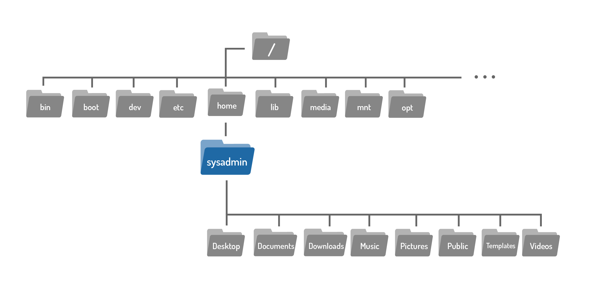
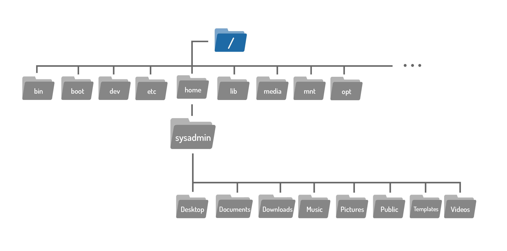
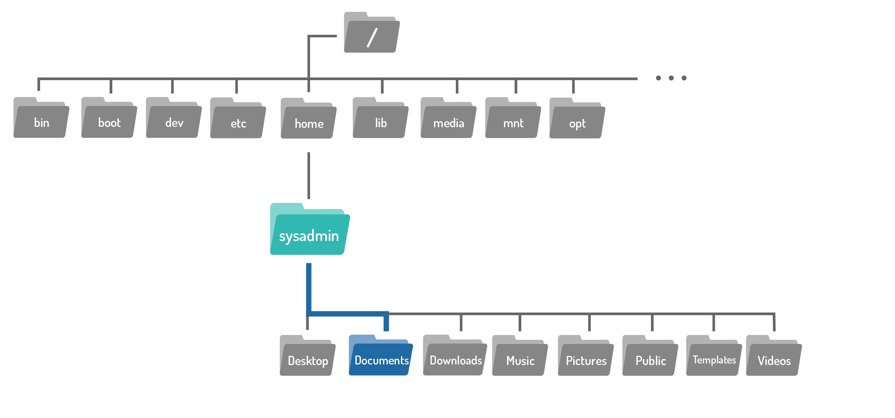
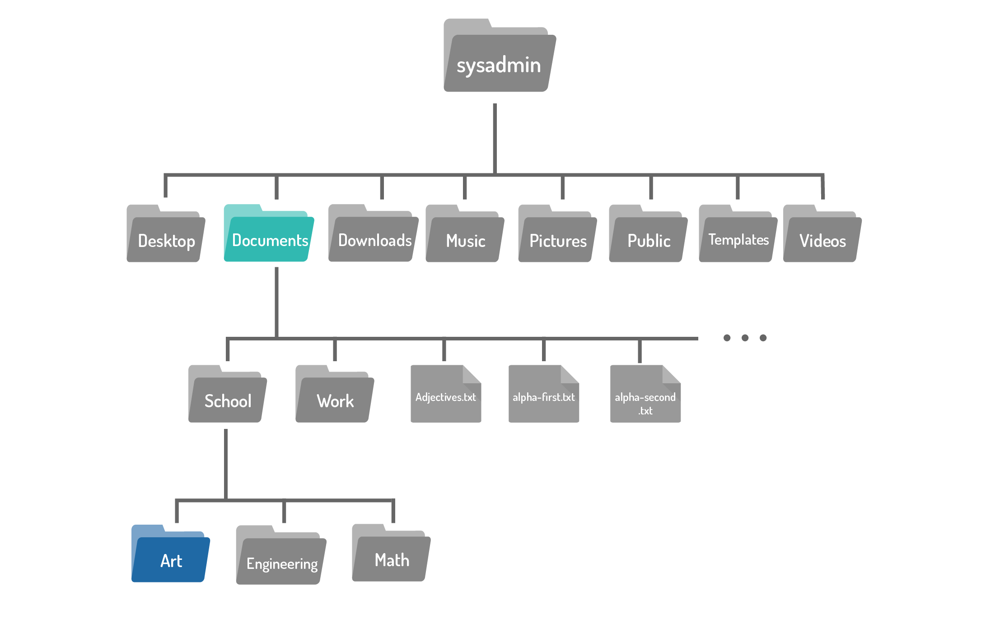
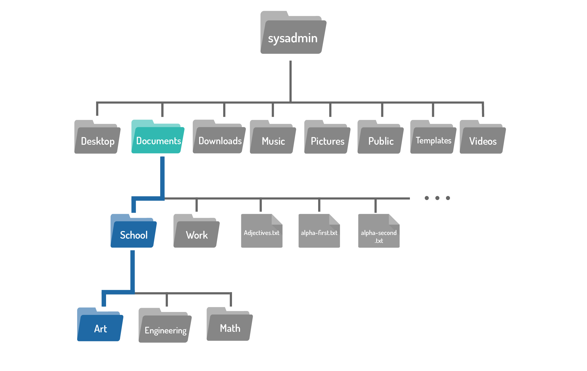
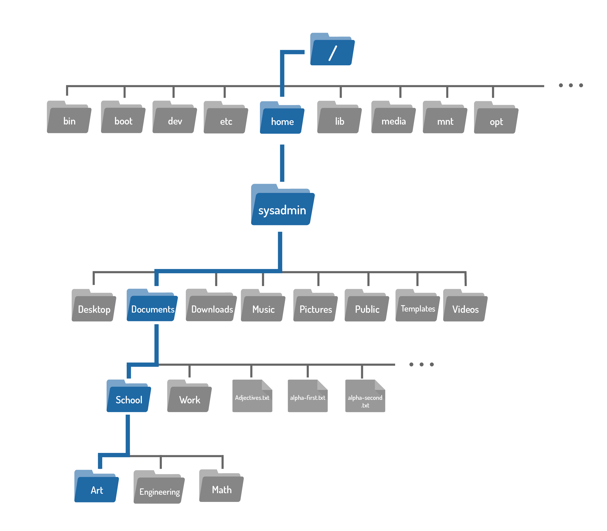

# Curso de Linux Unhatched 

## ¿Por qué aprender Linux?

El campo de la Tecnología de la Información (TI) está lleno de oportunidades. Para las personas que desean seguir una carrera en TI, uno de los mayores desafíos puede ser decidir dónde y cómo comenzar. A menudo, las personas están motivadas para adquirir nuevos conocimientos y aprender nuevas técnicas que les permitan acceder a mejores oportunidades tanto en su vida personal como profesional. Aprender una nueva habilidad requiere tiempo y disciplina, pero con la motivación correcta, esto no tiene por qué ser doloroso. En esta sección vamos a discutir por qué el tiempo y el esfuerzo invertido en aprender Linux le puede ser beneficioso; y recuerde, todos los que trabajan en TI tuvieron que empezar en algún lugar.

Aprender Linux es una gran manera de empezar. ¿Por qué es importante aprender Linux en un mundo impulsado por la tecnología como el actual?

La línea de comandos de Linux es una interfaz basada en texto que acepta comandos que se escriben en ella. Estos comandos hacen que una acción se ejecute en el sistema operativo del equipo. Por supuesto, las ventanas y los iconos son fáciles de usar, sin embargo, la línea de comandos es a menudo el héroe cuando se trata de la administración del sistema y la solución de problemas, ya que proporciona una imagen clara de lo que el sistema está haciendo en cualquier momento dado.

Teniendo en cuenta todo esto, ¿por qué aprender Linux es un buen comienzo para alguien que está considerando una carrera en TI? Como se ha dicho anteriormente, el uso de Linux está muy extendido y continúa creciendo en todas las áreas de la tecnología. ¿Qué tienen en común empresas y organizaciones como NASA, McDonald's, New York Stock Exchange (NYSE), DreamWorks Animation y el Departamento de Defensa de los Estados Unidos? Sí, lo adivinó correctamente, todos usan Linux.

Estas empresas tienen algo más en común porque reconocen que invertir en tecnología es importante en un mundo que está ansioso para adoptar nuevas tecnologías para innovar y resolver problemas. La proliferación de tecnología en casi todos los aspectos de nuestra vida ha resuelto muchos problemas pero también ha creado nuevos retos. Por ejemplo, ahora que casi todo se puede hacer en línea, estamos creando datos digitales a un ritmo muy rápido, lo cual está creando una demanda para esos datos. Por lo tanto, el conocimiento y las capacidades técnicas para analizar, procesar, proteger y transmitir estos datos también está en alta demanda. Aprender Linux puede ayudarle a avanzar en el camino hacia la adquisición de estos conocimientos y capacidades. Los siguientes son ejemplos de algunas profesiones de TI que requieren conocimientos de Linux:

- **Ingeniería de redes**: los ingenieros de redes son responsables de administrar los equipos de red que se utilizan para transmitir datos. El conocimiento de Linux es fundamental para los ingenieros de red, ya que más de la mitad de los servidores del mundo están basados en Linux. La mayoría de los sistemas operativos de red se basan en una variación de Linux.

- **Ciberseguridad**: los profesionales de la ciberseguridad supervisan e investigan las amenazas a la seguridad de los datos de los sistemas. Linux se utiliza en ciberseguridad para llevar a cabo pruebas de penetración del sistema y evaluar la vulnerabilidad de un sistema.

- **Desarrollo/Programación**: los diseñadores y programadores crean aplicaciones informáticas. La línea de comandos de Linux permite a los diseñadores y programadores ejecutar secuencias de comandos; una función que permite al usuario unir comandos para ejecutar acciones complejas en un ordenador. Linux también se utiliza en este campo porque sólo Linux permite a los usuarios acceder a su código fuente (o código source), dándoles la oportunidad de experimentar con el código y aprender mientras lo hacen.

- **Análisis de datos**: los científicos y los analistas de datos clasifican y analizan conjuntos de datos para encontrar patrones con el fin de informar y predecir tendencias y comportamientos. Los analistas de datos utilizan Linux debido a la amplia gama de herramientas y comandos disponibles para el análisis de datos, como MySQL y más.

Los sistemas operativos Linux vienen en muchas formas. Hay una variedad de distribuciones disponibles para adaptarse a las necesidades y demandas de muchos sectores de TI. Por ejemplo, los profesionales de la ciberseguridad pueden usar Linux Kali, los programadores y diseñadores pueden usar Linux Ubuntu, los usuarios habituales pueden usar Linux Mint y los servidores empresariales pueden funcionar con Red Hat Enterprise Linux.

Los ordenadores Linux utilizan una GUI, pero también poseen una herramienta más eficiente para llevar a cabo las mismas acciones que una GUI, la interfaz de línea de comandos (CLI, command line interface).

```bash
ls ~/Documents
```

## Sintaxis de comandos básicos

Este módulo se ocupa exclusivamente de la CLI o interfaz de línea de comandos, en lugar de la GUI o interfaz gráfica de usuario con la que quizás esté más familiarizado. El terminal CLI es una poderosa herramienta y a menudo es el método principal utilizado para administrar dispositivos pequeños de bajo consumo, servidores de computación de gran capacidad en la nube, y mucho más. Una comprensión básica del terminal es esencial para diagnosticar y reparar la mayoría de los sistemas basados en Linux. Puesto que Linux se ha vuelto tan omnipresente, incluso aquellos que planean trabajar con sistemas que no utilizan el núcleo Linux pueden beneficiarse de tener una comprensión básica del terminal.

¿Qué es un comando? Un comando es un programa de software que, cuando se ejecuta en la CLI (interfaz de línea de comandos), realiza una acción en el ordenador. Cuando usted escribe un comando, el sistema operativo ejecuta un proceso para leer su entrada, manipular datos y producir resultados. Un comando ejecuta un proceso en el sistema operativo, que luego hace que el ordenador realice una tarea determinada.

Para ejecutar un comando, el primer paso es escribir el nombre del comando. Haga clic en el terminal de la derecha. Escriba ls (letras minúsculas **L** y **S**) y pulse **Enter**. Obtendrá un resultado parecido al del siguiente ejemplo:
```Bash
ls
```

Generalmente, el nombre del comando se basa en la tarea que hace o en lo que el programador que creó el comando cree que mejor describe la función del comando. Por ejemplo, el comando ls muestra una lista de información sobre archivos. Asociar el nombre del comando con algo mnemotécnico sobre lo que hace puede ayudarle a recordar los comandos más fácilmente.

**A tener en cuenta**

Generalmente, los comandos distinguen entre mayúsculas y minúsculas. Por ejemplo **LS** es incorrecto y generará un mensaje de error, pero **ls** es correcto y se ejecutará normalmente.

```bash
sysadmin@localhost:~$ LS                                                        
-bash: /usr/games/LS: Permission denied 
```

La mayoría de los comandos siguen un patrón de sintaxis simple:

`comando [opciones…] [argumentos…]`

En otras palabras, escriba un comando, seguido de las opciones y/o argumentos antes de presionar la tecla Enter. Generalmente, las opciones (options) alteran el comportamiento del comando y los argumentos (arguments) son elementos o valores sobre los que debe actuar el comando. Aunque hay algunos comandos en Linux que no son completamente consistentes con estas normas de sintaxis, la mayoría de los comandos usan esta sintaxis o alguna similar.

En el ejemplo anterior, el comando `ls` se ejecutó sin opciones ni argumentos. Cuando este es el caso, su comportamiento predeterminado es el de devolver una lista de los archivos contenidos en el directorio actual.

##  Argumentos

`comando [opciones…] [argumentos…]`

Un argumento (argument) se puede usar para especificar algo sobre lo que el comando debe actuar. Si al comando ls se le da el nombre de un directorio como argumento, obtendremos como resultado una lista del contenido de ese directorio. En el siguiente ejemplo, el directorio Documents se utilizará como argumento:

```bash
sysadmin@localhost:~$ ls Documents                                              
School           alpha-second.txt  food.txt     linux.txt     os.csv            
Work             alpha-third.txt   hello.sh     longfile.txt  people.csv        
adjectives.txt   alpha.txt         hidden.txt   newhome.txt   profile.txt       
alpha-first.txt  animals.txt       letters.txt  numbers.txt   red.txt 
```

El resultado es una lista de los archivos incluidos en el directorio Documents.

Debido a que Linux es de código abierto, contiene algunas funciones curiosas que han ido siendo agregadas por sus programadores y usuarios. Por ejemplo, el comando aptitude es una función de gestión de paquetes disponible en algunas versiones de Linux. Este comando acepta moo como argumento:

```bash
sysadmin@localhost:~$ aptitude moo                                              
There are no Easter Eggs in this program.
```

Este comando no solamente es lo que parece. ¡Siga leyendo para saber qué más hay detrás de este truco!

## Opciones

`comando [opciones…] [argumentos…]`

Las opciones (options) se pueden utilizar para modificar el comportamiento de un comando. En la página anterior, el comando `ls` se utilizó para enumerar el contenido de un directorio. En el ejemplo siguiente, la opción `-l` se agrega al comando `ls` para obtener un resultado de “pantalla larga”, y proporcionar más información sobre cada uno de los archivos enumerados:
```bash
sysadmin@localhost:~$ ls -l                                                     
total 4                                                                         
drwx------ 2 sysadmin sysadmin    6 Dec 20  2017 Desktop                        
drwx------ 4 sysadmin sysadmin 4096 Dec 20  2017 Documents                      
drwx------ 2 sysadmin sysadmin    6 Dec 20  2017 Downloads                      
drwx------ 2 sysadmin sysadmin    6 Dec 20  2017 Music                          
drwx------ 2 sysadmin sysadmin    6 Dec 20  2017 Pictures                       
drwx------ 2 sysadmin sysadmin    6 Dec 20  2017 Public                         
drwx------ 2 sysadmin sysadmin    6 Dec 20  2017 Templates                      
drwx------ 2 sysadmin sysadmin    6 Dec 20  2017 Videos  
```
A menudo, el carácter elegido para el comando es mnemotécnico de su propósito en inglés. Por ejemplo, la letra l para indicar largo (*long*) o r para *invertir (reverse en inglés)*. De forma predeterminada, el comando `ls` imprime los resultados en orden alfabético, al agregar la opción `-r se imprimirán los resultados en orden alfabético inverso.
```bash
sysadmin@localhost:~$ ls -r                                                     
Videos  Templates  Public  Pictures  Music  Downloads  Documents  Desktop 
```

Se pueden usar varias opciones a la vez, ya sea como opciones separadas como en `-l -r` o combinadas como `-lr`. El resultado de los siguientes ejemplos sería el mismo:

`ls -l -r`
`ls -rl`
`ls -lr`

Como se ha explicado anteriormente, `-l` proporciona un formato de listado largo y `-r` invierte el listado. El resultado de usar ambas opciones será un listado largo en orden alfabético inverso:

```bash
sysadmin@localhost:~$ ls -l -r
total 32
drwx------ 2 sysadmin sysadmin 4096 Dec 20  2017 Videos                         
drwx------ 2 sysadmin sysadmin 4096 Dec 20  2017 Templates                      
drwx------ 2 sysadmin sysadmin 4096 Dec 20  2017 Public                         
drwx------ 2 sysadmin sysadmin 4096 Dec 20  2017 Pictures                       
drwx------ 2 sysadmin sysadmin 4096 Dec 20  2017 Music                          
drwx------ 2 sysadmin sysadmin 4096 Dec 20  2017 Downloads                      
drwx------ 4 sysadmin sysadmin 4096 Dec 20  2017 Documents                      
drwx------ 2 sysadmin sysadmin 4096 Dec 20  2017 Desktop   
sysadmin@localhost:~$ ls -rl
total 32
drwx------ 2 sysadmin sysadmin 4096 Dec 20  2017 Videos                         
drwx------ 2 sysadmin sysadmin 4096 Dec 20  2017 Templates                      
drwx------ 2 sysadmin sysadmin 4096 Dec 20  2017 Public                         
drwx------ 2 sysadmin sysadmin 4096 Dec 20  2017 Pictures                       
drwx------ 2 sysadmin sysadmin 4096 Dec 20  2017 Music                          
drwx------ 2 sysadmin sysadmin 4096 Dec 20  2017 Downloads                      
drwx------ 4 sysadmin sysadmin 4096 Dec 20  2017 Documents                      
drwx------ 2 sysadmin sysadmin 4096 Dec 20  2017 Desktop
```

Los comandos pueden utilizar muchas combinaciones de opciones y argumentos. Las posibilidades para cada comando serán únicas. ¿Recuerda los huevos de Pascua (*Easter Eggs*) del comando `aptitude`?

```bash
sysadmin@localhost:~$ aptitude moo
There are no Easter Eggs in this program.
```

Es posible modificar el comportamiento de este comando usando opciones. Vea lo que sucede cuando se agrega la opción `-v (verbose):

```bash
sysadmin@localhost:~$ aptitude -v moo
There really are no Easter Eggs in this program.
```

Mediante la combinación de múltiples opciones `-v`, podemos obtener una variedad de respuestas:

```bash
sysadmin@localhost:~$ aptitude -vv moo
Didn't I already tell you that there are no Easter Eggs in this program?
sysadmin@localhost:~$ aptitude -vvv moo
Stop it!
```

Recuerde que las varias opciones se pueden denotar por separado o combinadas:

`aptitude -v -v moo` 
`aptitude -vv moo`

¡Siga añadiendo opciones `-v` para ver cuántas respuestas únicas puede obtener!

## Imprimir el directorio de trabajo

Para descubrir dónde se encuentra actualmente dentro del sistema de archivos, puede utilizar el comando `pwd`. El comando `pwd` imprime el directorio de trabajo (print working directory), su ubicación actual dentro del sistema de archivos:

`pwd [OPCIONES]`

**A tener en cuenta**

¡No encienda su impresora todavía! En los inicios de la computación, el resultado de un comando se enviaba directamente a impresoras físicas. Este método ha sido reemplazado por pantallas de vídeo que muestran información más rápidamente. Aún así, actualmente seguimos utilizando la palabra imprimir (print) aunque el resultado se esté mostrando en una pantalla.

```bash
sysadmin@localhost:~$ pwd
/home/sysadmin
```

El resultado del comando anterior indica que el usuario está actualmente en su carpeta de inicio, tal y como muestra el sistema de archivos siguiente.



**Considere esto**

Observe que nuestras máquinas virtuales emplean un indicador para mostrar el directorio de trabajo actual, resaltado en color azul. En el primer mensaje, el carácter `~` azul es equivalente a `/home/sysadmin`, y representa el directorio de inicio del usuario.

`sysadmin@localhost:~$`

Después de cambiar de directorio (aprenderemos cómo hacerlo en la siguiente sección), la nueva ubicación también se puede confirmar en el nuevo indicador, que nuevamente se muestra en azul.

`sysadmin@localhost:/etc/calendar$`

## Cambio de Directorios

Los archivos se utilizan para almacenar datos como texto, gráficos y programas. Los directorios son un tipo de archivo utilizado para almacenar otros archivos: proporcionan una estructura organizativa jerárquica. La siguiente imagen muestra una versión abreviada de la estructura del sistema de archivos de nuestras máquinas virtuales.


Al iniciar una máquina virtual nueva, ya sea abriendo el curso o después de usar el botón de reinicio, usted inicia una sesión como usuario sysadmin en su directorio principal, resaltado en azul a continuación:


Utilice el comando cd (change directory) para cambiar de directorio y navegar por la estructura del sistema de archivos.

`cd [opciones] [ruta]`

Si examina el gráfico anterior, notará que el directorio Documents se encuentra dentro del directorio de inicio home, donde usted se encuentra actualmente. Para desplazarse al directorio Documents, utilícelo como argumento para el comando cd:

```bash
sysadmin@localhost:~$ cd Documents                                              
sysadmin@localhost:~/Documents$
```

Los directorios son equivalentes a las carpetas en Windows y Mac OS. Al igual que estos sistemas operativos más populares, una estructura de directorios Linux también tiene un nivel superior. No se llama “Mi PC”, sino directorio raíz (root) y está representado por el carácter /. Para desplazarse al directorio root, utilice el carácter / como argumento del comando `cd`.

```bash
sysadmin@localhost:~/Documents$ cd /
sysadmin@localhost:/$
```



El argumento para el comando `cd` es más que el nombre de un directorio, en realidad es una ruta (path). Una ruta es una lista de directorios separados por el carácter /. Por ejemplo, /home/sysadmin es la ruta a su directorio de inicio:


Imagine que el sistema de archivos es un mapa, las rutas son las instrucciones que indican paso a paso la ubicación de cualquier archivo dentro del sistema de archivos. Hay dos tipos de rutas: absolutas y relativas. Las rutas absolutas comienzan en la raíz del sistema de archivos, las rutas relativas comienzan en su ubicación actual.

### Rutas absolutas

Una ruta absoluta le permite especificar la ubicación exacta de un directorio. Siempre comienza en el directorio root, por lo tanto siempre comienza con el carácter /. La ruta al directorio de inicio (home) /home/sysadmin es una ruta absoluta. La ruta comienza en el directorio root /, se mueve al directorio de inicio home y, a continuación, al directorio sysadmin. Esta ruta en una interfaz gráfica de usuario (GUI) como la de su ordenador personal aparecería así:


Utilice esta ruta como argumento para el comando cd para volver al directorio principal del usuario sysadmin.

```bash
sysadmin@localhost:/$ cd /home/sysadmin
sysadmin@localhost:~$
```

Que no aparezca un resultado en la línea de comandos significa que el comando se ha ejecutado correctamente. Continúe y confirme que es así usando el comando pwd:

```bash
sysadmin@localhost:~$ pwd                                                       
/home/sysadmin
```

### Rutas relativas

Una ruta relativa ubica un archivo en relación con la ubicación actual del usuario en el sistema de archivos. Las rutas relativas no comienzan con el carácter /, comienzan con el nombre de un directorio. Eche otro vistazo al primer ejemplo de comando cd. En este caso, el argumento es un ejemplo de la ruta relativa más simple: el nombre de un directorio en su ubicación actual.

```bash
sysadmin@localhost:~$ cd Documents                                              
sysadmin@localhost:~/Documents$
```



La siguiente imagen muestra un mapa de los archivos contenidos en el directorio sysadmin. Actualmente se encuentra en el directorio Documents y desea desplazarse al directorio Art:



Una ruta relativa comienza con el directorio actual, sin embargo, éste no se incluye en la ruta. El primer paso sería pasar al directorio School y, a continuación, pasar al directorio Art. Utilice el carácter / para separar los nombres de directorio. El resultado School/Art es una ruta relativa desde el directorio Documents hasta el directorio Art:



Utilice la ruta relativa como argumento para el comando cd para desplazarse al directorio Art.

```bash
sysadmin@localhost:~/Documents$ cd School/Art
sysadmin@localhost:~/Documents/School/Art$
```

Utilice el comando `pwd` para confirmar que el cambio ha ocurrido:

```bash
sysadmin@localhost:~/Documents/School/Art$ pwd                                      
/home/sysadmin/Documents/School/Art
```

**A tener en cuenta**

El resultado del comando pwd es la ruta absoluta al directorio Art.



**A tener en cuenta**

En el ejemplo anterior, el comando cd siguió la ruta School/Art:

`cd School/Art`

Una ruta también se puede dividir en varios comandos cd. El siguiente conjunto de comandos lograría los mismos resultados:

```bash
cd School
cd Art
```

### Accesos Directos o Atajos

**Dos puntos ..**

Independientemente del directorio en el que se encuentre, el carácter .. siempre representa un directorio superior en relación al directorio actual, a veces denominado directorio padre. Por ejemplo, para pasar del directorio Art al directorio School:

```bash
sysadmin@localhost:~/Documents/School/Art$ cd ..                                
sysadmin@localhost:~/Documents/School$
```

**Un punto .**

Independientemente del directorio en el que se encuentre, el carácter . siempre representa su directorio actual. Para el comando `cd`, este atajo no es muy útil, pero será útil para los comandos que estudiaremos en las secciones siguientes.

**El símbolo ~**

El directorio principal del usuario actual está representado por el carácter ~ . Como se indicó anteriormente, siempre comienza su sesión como usuario sysadmin, cuyo directorio de inicio se encuentra en /home/sysadmin. Para volver a su directorio de inicio en cualquier momento, puede ejecutar el siguiente comando:

```bash
sysadmin@localhost:~/Documents/School$ cd ~
sysadmin@localhost:~$
```

## Listados de archivos

El comando `ls` se utiliza para enumerar el contenido de un directorio. Ha visto cómo se utiliza en varios ejemplos anteriores. Esta página le ayudará a sentirse más cómodo con su uso.

`ls [OPCIONES] [ARCHIVO]`

De forma predeterminada, el comando ls usado sin opciones o argumentos mostrará los archivos contenidos en el directorio actual:

```bash 
sysadmin@localhost:~$ ls
Desktop  Documents  Downloads  Music  Pictures  Public  Templates Videos
```

Para obtener información detallada sobre los archivos, como el tipo de archivo, los permisos, las propiedades o el sello horario, ejecute una lista larga utilizando la opción -l con el comando ls. En el ejemplo siguiente, se utiliza una lista del directorio /var/log, ya que proporciona una variedad de resultados:

```bash
sysadmin@localhost:~$ ls -l /var/log/
total 844                                                                       
-rw-r--r-- 1 root   root  18047 Dec 20  2017 alternatives.log                   
drwxr-x--- 2 root   adm    4096 Dec 20  2017 apache2                            
drwxr-xr-x 1 root   root   4096 Dec 20  2017 apt                                
-rw-r----- 1 syslog adm    1346 Oct  2 22:17 auth.log                           
-rw-r--r-- 1 root   root  47816 Dec  7  2017 bootstrap.log                      
-rw-rw---- 1 root   utmp      0 Dec  7  2017 btmp                               
-rw-r----- 1 syslog adm     547 Oct  2 22:17 cron.log                           
-rw-r----- 1 root   adm   85083 Dec 20  2017 dmesg                              
-rw-r--r-- 1 root   root 325238 Dec 20  2017 dpkg.log                           
-rw-r--r-- 1 root   root  32064 Dec 20  2017 faillog                            
drwxr-xr-x 2 root   root   4096 Dec  7  2017 fsck                               
-rw-r----- 1 syslog adm     106 Oct  2 19:57 kern.log                           
-rw-rw-r-- 1 root   utmp 292584 Oct  2 19:57 lastlog                            
-rw-r----- 1 syslog adm   19573 Oct  2 22:57 syslog                             
drwxr-xr-x 2 root   root   4096 Apr 11  2014 upstart                            
-rw-rw-r-- 1 root   utmp    384 Oct  2 19:57 wtmp 
```

Cada línea corresponde a un archivo contenido en el directorio. La información sobre cada archivo se puede dividir en campos separados por espacios. Los campos son los siguientes:

**Tipo de archivo**

`-rw-r--r-- 1 root   root  18047 Dec 20  2017 alternatives.log`    
                
`drwxr-x--- 2 root   adm    4096 Dec 20  2017 apache2`

El primer campo contiene en realidad diez caracteres. El primer carácter indica el tipo de archivo y los nueve siguientes especifican permisos. Los tipos de archivo son:

Símbolo | Tipo de archivo | Descripción |
|---|---|---|
| d | directorio | Un archivo usado para contener otros archivos. |
| - | archivo ordinario | Incluye archivos leíbles, imágenes, archivos binarios, y archivos comprimidos. |
| l | enlaces simbólicos | Apunta a otro archivo. |
| s | socket | Permite la comunicación entre procesos. |
| p | tubería (pipe) | Permite la comunicación entre procesos. |
| b | archivo bloque | Usado para comunicaciones con el equipo (hardware). |
| c |archivo carácter | Usado para comunicaciones con el equipo (hardware). |

El primer archivo alternatives.log es un archivo normal -, mientras que el segundo archivo apache2 es un directorio d.

**Permisos**

`drwxr-xr-x 2 root   root   4096 Apr 11  2014 upstart`

Los permisos indican cómo determinados usuarios pueden acceder a un archivo. Siga leyendo para obtener más información sobre los permisos.

**Número de enlaces directos**

`-rw-r----- 1 syslog adm    1346 Oct  2 22:17 auth.log`

Este número indica cuántos enlaces directos apuntan a este archivo. Los enlaces directos están fuera del alcance de este módulo, pero están cubiertos en el curso NDG Linux Essentials.

**Propietario del archivo**

`-rw-r----- 1 syslog adm     106 Oct  2 19:57 kern.log`

El usuario syslog posee este archivo. Cada vez que se crea un archivo, la propiedad se asigna automáticamente al usuario que lo creó.

**Grupo propietario del archivo**

`-rw-rw-r-- 1 root   utmp 292584 Oct  2 19:57 lastlog`

Indica qué grupo posee este archivo.

**Tamaño del archivo**

`-rw-r----- 1 syslog adm   19573 Oct  2 22:57 syslog`

Los directorios y archivos más grandes pueden mostrarse en kilobytes ya que mostrar su tamaño en bytes resultaría en un número demasiado grande. Por lo tanto, en el caso de un directorio, este número podría ser un múltiplo del tamaño de bloque utilizado por el sistema de archivos. El tamaño de bloque es el tamaño de una serie de datos almacenados en el sistema de archivos.

**Sello horario o de tiempo**

`drwxr-xr-x 2 root   root   4096 Dec  7  2017 fsck`

Indica la fecha y hora en que el contenido del archivo se modificó por última vez.

**Nombre del archivo**

`-rw-r--r-- 1 root   root  47816 Dec  7  2017 bootstrap.log`

El campo final contiene el nombre del archivo o directorio.

**A tener en cuenta**

En el caso de enlaces simbólicos, un archivo que apunta a otro archivo, el nombre del enlace se mostrará junto a una flecha y el nombre de la ruta del archivo original.

`lrwxrwxrwx. 1 root root 22 Nov 6 2012 /etc/grub.conf -> ../boot/grub/grub.conf`

Los enlaces simbólicos están fuera del alcance de este módulo, pero están cubiertos en el curso [NDG Linux Essentials](https://www.netacad.com/courses/linux-essentials/).

### Ordenar archivos

Por defecto, el resultado del comando ls está ordenado alfabéticamente según el nombre del archivo. Pero también se puede ordenar usando otros método.

**Siga leyendo**

Las opciones en los siguientes ejemplos se combinarán con la opción -l para mostrar los detalles relevantes de cada archivo. Preste atención a los campos correspondientes a la opción de búsqueda.

La opción `-t` ordenará los archivos por su sello de tiempo (timestamp):

```bash
sysadmin@localhost:~$ ls -lt /var/log                                           
total 844                                                                       
-rw-r----- 1 syslog adm   19573 Oct  2 22:57 syslog                             
-rw-r----- 1 syslog adm    1346 Oct  2 22:17 auth.log                           
-rw-r----- 1 syslog adm     547 Oct  2 22:17 cron.log                           
-rw-rw-r-- 1 root   utmp 292584 Oct  2 19:57 lastlog                            
-rw-rw-r-- 1 root   utmp    384 Oct  2 19:57 wtmp                               
-rw-r----- 1 syslog adm     106 Oct  2 19:57 kern.log                           
-rw-r--r-- 1 root   root  18047 Dec 20  2017 alternatives.log                   
-rw-r--r-- 1 root   root  32064 Dec 20  2017 faillog                            
-rw-r----- 1 root   adm   85083 Dec 20  2017 dmesg                              
-rw-r--r-- 1 root   root 325238 Dec 20  2017 dpkg.log                           
drwxr-x--- 2 root   adm    4096 Dec 20  2017 apache2                            
drwxr-xr-x 1 root   root   4096 Dec 20  2017 apt                                
-rw-r--r-- 1 root   root  47816 Dec  7  2017 bootstrap.log                      
drwxr-xr-x 2 root   root   4096 Dec  7  2017 fsck                               
-rw-rw---- 1 root   utmp      0 Dec  7  2017 btmp                               
drwxr-xr-x 2 root   root   4096 Apr 11  2014 upstart  
```            

La opción `-S` (size) ordenará los archivos por tamaño de archivo:

```bash
sysadmin@localhost:~$ ls -l -S /var/log                                         
total 844                                                                       
-rw-r--r-- 1 root   root 325238 Dec 20  2017 dpkg.log                           
-rw-rw-r-- 1 root   utmp 292584 Oct  2 19:57 lastlog                            
-rw-r----- 1 root   adm   85083 Dec 20  2017 dmesg                              
-rw-r--r-- 1 root   root  47816 Dec  7  2017 bootstrap.log                      
-rw-r--r-- 1 root   root  32064 Dec 20  2017 faillog                            
-rw-r----- 1 syslog adm   19573 Oct  2 22:57 syslog                             
-rw-r--r-- 1 root   root  18047 Dec 20  2017 alternatives.log                   
drwxr-x--- 2 root   adm    4096 Dec 20  2017 apache2                            
drwxr-xr-x 1 root   root   4096 Dec 20  2017 apt                                
drwxr-xr-x 2 root   root   4096 Dec  7  2017 fsck                               
drwxr-xr-x 2 root   root   4096 Apr 11  2014 upstart                            
-rw-r----- 1 syslog adm    1346 Oct  2 22:17 auth.log                           
-rw-r----- 1 syslog adm     547 Oct  2 22:17 cron.log                           
-rw-rw-r-- 1 root   utmp    384 Oct  2 19:57 wtmp                               
-rw-r----- 1 syslog adm     106 Oct  2 19:57 kern.log                           
-rw-rw---- 1 root   utmp      0 Dec  7  2017 btmp
```

La opción `-r` (reverse) invertirá el orden de cualquier tipo de ordenación. Observe la diferencia cuando se agrega al ejemplo anterior:

```bash
sysadmin@localhost:~$ ls -lSr /var/log
total 844                                                                       
-rw-rw---- 1 root   utmp      0 Dec  7  2017 btmp                               
-rw-r----- 1 syslog adm     106 Oct  2 19:57 kern.log                           
-rw-rw-r-- 1 root   utmp    384 Oct  2 19:57 wtmp                               
-rw-r----- 1 syslog adm     654 Oct  2 23:17 cron.log                           
-rw-r----- 1 syslog adm    1669 Oct  2 23:17 auth.log                           
drwxr-xr-x 2 root   root   4096 Apr 11  2014 upstart                            
drwxr-xr-x 2 root   root   4096 Dec  7  2017 fsck                               
drwxr-xr-x 1 root   root   4096 Dec 20  2017 apt                                
drwxr-x--- 2 root   adm    4096 Dec 20  2017 apache2                            
-rw-r--r-- 1 root   root  18047 Dec 20  2017 alternatives.log                   
-rw-r----- 1 syslog adm   19680 Oct  2 23:17 syslog                             
-rw-r--r-- 1 root   root  32064 Dec 20  2017 faillog                            
-rw-r--r-- 1 root   root  47816 Dec  7  2017 bootstrap.log                      
-rw-r----- 1 root   adm   85083 Dec 20  2017 dmesg                              
-rw-rw-r-- 1 root   utmp 292584 Oct  2 19:57 lastlog                            
-rw-r--r-- 1 root   root 325238 Dec 20  2017 dpkg.log
```        

Los números en el campo del tamaño de archivo cambian de descendente a ascendente.

Utilizando solo la opción `-r` con la lista de los archivos en orden alfabético inverso:

```bash
sysadmin@localhost:~$ ls -r /var/log                                            
wtmp     lastlog   faillog   cron.log       auth.log  alternatives.log
upstart  kern.log  dpkg.log  btmp           apt
syslog   fsck      dmesg     bootstrap.log  apache2
```

# Acceso administrativo

Hay muchos comandos de Linux que tratan con información confidencial como contraseñas, hardware del sistema, u otros que operan bajo circunstancias excepcionales. Evitar que usuarios ordinarios ejecuten estos comandos ayuda a proteger el sistema. Iniciar una sesión como usuario root proporciona acceso administrativo, y permite la ejecución de algunos de los comandos privilegiados.

### El comando `su`

`su OPCIONES NOMBRE-DE-USUARIO`

El comando `su`le permite actuar temporalmente como un usuario diferente. Lo hace creando un nuevo shell. El shell es simplemente una consola de entrada de texto que le permite escribir comandos. De forma predeterminada, si no se especifica una cuenta de usuario, el comando su abrirá un nuevo shell como usuario root, proporcionando privilegios administrativos.

**Siga leyendo**

Se recomienda utilizar la opción shell para iniciar la sesión, ya que el shell de inicio de sesión configura completamente el nuevo shell con la configuración del nuevo usuario. Esta opción se puede especificar de tres maneras:

```bash
su -
su -l
su --login
```

Después de ejecutar el comando `su`, se requiere una contraseña. En nuestras máquinas virtuales, la contraseña para las cuentas root y sysadmin es netlab123 . Si alguna vez olvida la contraseña, ésta se muestra cada vez que se inicia una nueva máquina virtual. Como medida de seguridad, la contraseña no será visible mientras la escribe.

```bash
sysadmin@localhost:~$ su  -
Password:
root@localhost:~#
```

Tenga en cuenta que el símbolo del sistema ha cambiado para reflejar que ahora ha iniciado sesión como usuario root. Para cerrar la sesión y volver a la cuenta sysadmin, use el comando `exit`. Note como el símbolo vuelve a cambiar

```bash
root@localhost:~# exit
logout
sysadmin@localhost:~$
```
Para evitar ejecutar comandos sensibles o privilegiados, hemos configurado el comando steam locomotive, `sl`, para que requiera acceso administrativo. Si el comando se ejecuta como sysadmin, aparece un mensaje de error:

```bash
sysadmin@localhost:~$ sl
-bash: /usr/bin/sl: Permission denied
```

Utilice el comando su para cambiar a la cuenta root y ejecute el comando sl con acceso administrativo:

```bash
sysadmin@localhost:~$ su  -
Password:
root@localhost:~# sl
```

```bash

                            (@@) (  ) (@)  ( )  @@    ()    @     O   @
                         (   )
                     (@@@@)
                  (    )
                (@@@)
            ====        ________                ___________
        _D _|  |_______/        \__I_I_____===__|_________|
         |(_)---  |   H\________/ |   |        =|___ ___|
_________________
         /     |  |   H  |  |     |   |         ||_| |_||     _|
        |      |  |   H  |__--------------------| [___] |   =|
        | ________|___H__/__|_____/[][]~\_______|       |   -|
        |/ |   |-----------I_____I [][] []  D   |=======|____|__________________
      __/ =| o |=-~~\  /~~\  /~~\  /~~\ ____Y___________|__|____________________
       |/-=|___|=    ||    ||    ||    |_____/~\___/          |_D__D__D_|  |_D__
        \_/      \_O=====O=====O=====O/      \_/               \_/   \_/  \_/ 

```
Vuelva a utilizar el comando exit para volver a la cuenta sysadmin.

```bash
root@localhost:~# exit
logout
sysadmin@localhost:~$
```

## El comando `sudo`

`sudo [OPCIONES] COMANDO`

El comando `sudo` permite a un usuario ejecutar un comando como otro usuario sin tener que crear un nuevo shell. Para ejecutar un comando con privilegios administrativos utilice el comando como argumento para el comando `sudo`. Al igual que pasa con el comando `su`, el comando `sudo` asume por defecto que la cuenta de usuario root debe usarse para ejecutar comandos.

**A tener en cuenta**

El comando `sudo` también puede usarse para cambiar a otras cuentas de usuario. Para especificar una cuenta de usuario diferente, utilice la opción `-u`.

Ejecute el comando `sl` como usuario root poniendo `sudo` delante de él:

**Nota**

Recuerde que la contraseña es netlab123. La solicitud de contraseña no aparecerá de nuevo mientras el usuario continúe ejecutando comandos sudo a intervalos inferiores a cinco minutos.

```bash
sysadmin@localhost:~$  sudo sl
[sudo] password for sysadmin:
```

```bash


                            (@@) (  ) (@)  ( )  @@    ()    @     O   @
                         (   )
                     (@@@@)
                  (    )
                (@@@)
            ====        ________                ___________
        _D _|  |_______/        \__I_I_____===__|_________|
         |(_)---  |   H\________/ |   |        =|___ ___|
_________________
         /     |  |   H  |  |     |   |         ||_| |_||     _|
        |      |  |   H  |__--------------------| [___] |   =|
        | ________|___H__/__|_____/[][]~\_______|       |   -|
        |/ |   |-----------I_____I [][] []  D   |=======|____|__________________
      __/ =| o |=-~~\  /~~\  /~~\  /~~\ ____Y___________|__|____________________
       |/-=|___|=    ||    ||    ||    |_____/~\___/          |_D__D__D_|  |_D__
        \_/      \_O=====O=====O=====O/      \_/               \_/   \_/  \_/ 
```

Una vez completado el comando, observe que el símbolo del sistema no ha cambiado, usted continua bajo la cuenta de inicio sysadmin. El comando `sudo` sólo proporciona acceso administrativo para la ejecución del comando especificado. Esto es una ventaja ya que reduce el riesgo de que un usuario ejecute accidentalmente un comando como usuario root. La intención de ejecutar un comando es clara; el comando se ejecuta como root si se prefija con el comando `sudo`. De lo contrario, el comando se ejecuta como usuario ordinario.