# Linux Essentials 

## 1.1 Introducción

En este capítulo vamos a explorar la evolución del Linux® y los sistemas operativos populares. También vamos a hablar sobre las consideraciones para elegir un sistema operativo.


**Linux es de Código Abierto**. ¿**Qué significa eso?** El código que impulsa a Linux no es propiedad de una empresa. En cambio, lo desarrolla la comunidad que lo usa. **¿Por qué es esto bueno?** Libera a los usuarios de los costos de licencia y permite modificar el código según las necesidades cambiantes.

Linux® es una marca registrada de Linus Torvalds en los Estados Unidos y otros países.

## 1.2 La evolución del Linux y los sistemas operativos populares

La definición de la palabra Linux depende del contexto en el que se utiliza. Linux se refiere al kernel. Es el controlador central de todo lo que pasa en el equipo (veremos más detalles a continuación). Quienes dicen que su equipo "se ejecuta con Linux" generalmente se refiere al kernel y el conjunto de herramientas que vienen con él (llamados distribución). Si tienes "Experiencia con Linux", probablemente te refieres a los propios programas, aunque dependiendo del contexto, podrías hablar sobre tu capacidad de ajustar con precisión el kernel. Cada uno de estos componentes será explorado para que puedas entender exactamente qué papel juega cada uno.

El término que más complica las cosas es UNIX. UNIX era originalmente un sistema operativo desarrollado en los laboratorios de Bell AT&T en la década de 1970. Éste fue modificado y bifurcado (es decir, las personas lo modificaron y estas modificaciones sirvieron de base para otros sistemas). En la actualidad hay muchas variantes de UNIX. Sin embargo, UNIX es ahora una marca registrada y una especificación, propiedad de un consorcio industrial llamado Open Group. Sólo el software que ha sido certificado por el Open Group puede llamarse UNIX. A pesar de la adopción de todos los requisitos de la especificación de UNIX, Linux no ha sido certificado. ¡Eso significa que Linux realmente no es un UNIX! Es sólo... como UNIX.

##1.2.1 Rol del Kernel

El kernel del sistema operativo es como un controlador de tráfico aéreo en un aeropuerto. El kernel determina que programa obtiene que pedazos de memoria, arranca y mata a los programas, y se encarga de mostrar texto en un monitor. Cuando una aplicación necesita escribir en disco, debe pedir al sistema operativo que lo haga. Si dos aplicaciones piden el mismo recurso, el kernel decide cuál de las dos lo recibe y en algunos casos, mata a una de las aplicaciones para salvar el resto del sistema.

El kernel también se encarga de cambiar entre aplicaciones. Un equipo tendrá un pequeño número de procesadores CPU y una cantidad finita de memoria. El kernel se encarga de descargar una tarea y cargar una nueva si hay más tareas que CPUs. Cuando la tarea actual se ha ejecutado una cantidad suficiente de tiempo, la CPU detiene la tarea para que otra pueda ejecutarse. Esto se llama multitarea preferente. Multitarea significa que la computadora realiza varias tareas a la vez, preferente significa que el kernel decide cuándo cambia el enfoque entre las tareas. Con las tareas de conmutación rápida, parece que el equipo está haciendo muchas cosas a la vez. Cada aplicación puede pensar que tiene un bloque grande de memoria en el sistema, pero es el kernel que mantiene esta ilusión, reasignando bloques más pequeños de memoria, intercambiando bloques de memoria con otras aplicaciones, o incluso sacando al disco bloques que aún no se hayan tocado.

Cuando el equipo arranca, carga un pequeño trozo de código llamado gestor de arranque. El gestor de arranque debe cargar el kernel y arrancarlo. Si estás más familiarizado con sistemas operativos como Microsoft Windows y Apple OS X, probablemente nunca ves al gestor de arranque, pero en el ambiente de UNIX es generalmente visible por lo que puedes modificar la manera en la que tu equipo arranque.

El gestor de arranque carga el kernel de Linux y luego transfiere el control. Linux continúa con el funcionamiento de los programas necesarios para hacer que el equipo sea útil, tales como conexión a la red o abrir un servidor web.

## 1.2.2 Las Aplicaciones

Al igual que un controlador de tráfico aéreo, el kernel no es útil sin tener algo que controlar. Si el kernel es la torre, las aplicaciones son los aviones. Las aplicaciones mandan peticiones al kernel, en cambio, éste recibe recursos tales como memoria, CPU y disco. El kernel también abstrae los detalles complicados de la aplicación. La aplicación no sabe si un bloque de disco es una unidad de estado sólido de fabricante A, un disco duro metálico de spinning del fabricante B, o incluso, alguna parte del archivo de red. Las aplicaciones sólo tienen que seguir la Interfaz de Programación de Aplicaciones (*API - Application Programming Interface*) del kernel y a cambio no tienen que preocuparse por los detalles de implementación.

Cuando nosotros, como usuarios, pensamos en aplicaciones, tendemos a pensar en los procesadores de texto, navegadores web y clientes de correo electrónico. Al kernel no le importa si se está ejecutando algo orientado al usuario, es un servicio de red que se comunique con un equipo remoto, o una tarea interna. Por lo tanto, de esto obtenemos una abstracción llamada proceso. Un proceso es solamente una tarea que está cargada y rastreada por el kernel. Una aplicación puede necesitar incluso múltiples procesos para funcionar, por lo que el kernel se encarga de ejecutar los procesos, los arranca y para según lo requerido, y entrega los recursos del sistema.

## 1.2.3 Rol de Código Abierto

Linux comenzó como un proyecto de pasatiempo por Linus Torvalds en 1991. Hizo la fuente disponible libremente y otros se unieron para formar este sistema operativo de vanguardia. Su sistema no fue el primero desarrollado por un grupo. Sin embargo, ya que fue un proyecto creado desde cero, los primeros usuarios podían influir el rumbo del proyecto y asegurarse de que no se repitieran los errores de otros UNIXes.

Los proyectos de software toman la forma de *código fuente*, que es un conjunto de instrucciones de computo legibles para el humano. El código fuente puede escribirse en cualquiera de los cientos de lenguajes diferentes, Linux ha sido escrito solamente en C, que es un lenguaje que comparte historia con el UNIX original.

El código fuente no se entiende directamente por el equipo, por lo que debe ser compilado en instrucciones de máquina por un compilador. El *compilador* reúne todos los archivos fuente y genera algo que se puede ejecutar en el equipo, como el kernel de Linux.

Históricamente, la mayor parte del software se ha publicado bajo una *licencia de código cerrado*, lo que significa que obtienes el derecho a utilizar el código de máquina, pero no puedes ver el código fuente. ¡A menudo la licencia dice específicamente, que no se intente revertir el código máquina al código de fuente para averiguar lo que hace!

El *Código Abierto* toma una vista centrada en la fuente del software. La filosofía de código abierto es que tienes derecho a obtener el software y modificarlo para tu propio uso. Linux adoptó esta filosofía con gran éxito. La gente tomó la fuente, hizo cambios y lo compartió con el resto del grupo.

Junto a ésto, fue el *proyecto* GNU (GNU, no UNIX). Mientras que GNU estaba construyendo su propio sistema operativo, eran mucho más eficaces en la creación de las herramientas que están de acuerdo con el sistema operativo UNIX, como los compiladores y las interfaces de usuario. La fuente era completamente gratuita, así que Linux pudo enfocar sus herramientas y proporcionar un sistema completo. Como tal, la mayoría de las herramientas que forman parte del sistema Linux provienen de estas herramientas GNU.

Hay muchas diversas variantes en código abierto, y los veremos en un capítulo posterior. Todos coinciden en que debes tener acceso al código fuente, pero difieren en cómo puedes, o en algunos casos, cómo debes redistribuir los cambios.

## 1.2.4 Distribuciones de Linux

Toma las herramientas de GNU y Linux, añade algunas aplicaciones para el usuario como un cliente de correo, y obtienes un sistema Linux completo. Se empezó a empaquetar todo este software en una distribución casi tan pronto como Linux llegó a ser utilizable. La distribución se encarga de configurar el almacenamiento de información, instalar el kernel e instalar el resto del software. Las distribuciones recomendadas completas también incluyen herramientas para administrar el sistema y un administrador de paquetes para añadir y eliminar el software después de la instalación.

Como en UNIX, hay muchos sabores diferentes de distribuciones. En estos días, hay distribuciones que se centran en el funcionamiento en servidores, computadoras de escritorio (desktop) o incluso herramientas específicas de la industria como el diseño de la electrónica o la computación estadística. Los principales actores en el mercado se remontan a Red Hat o Debian. La diferencia más visible es el administrador de paquetes, aunque encontrarás otras diferencias en todo, desde ubicaciones de archivos a filosofías de políticas.

**Red Hat** empezó como una simple distribución que introdujo el Administrador de Paquetes Red Hat (RPM- Red Hat Package Manager). El desarrollador eventualmente formó una compañía alrededor de éste, que intentó comercializar una computadora de escritorio Linux para negocios. Con el tiempo, Red Hat comenzó a centrarse más en las aplicaciones de servidor web y servicios de archivos, y lanzó Red Hat Enterprise Linux, que era un servicio de pago en un ciclo de liberación largo. El ciclo de liberación dicta con qué frecuencia se actualiza el software. Una empresa puede valorar la estabilidad y quiere ciclos de liberación largos, un aficionado o un principiante puede querer un software más reciente y optar por un ciclo de liberación más corto. Para cumplir con este último grupo, Red Hat patrocina el **Proyecto Fedora** que hace que el escritorio personal contenga el software más reciente, pero aun construido sobre los mismos principios como la versión para empresas.

Porque todo en Red Hat Enterprise Linux es de código abierto, un proyecto llamado **CentOS** llegó a ser el que volvió a compilar todos los paquetes RHEL y los proporcionó gratis. CentOS y otros proyectos similares (como Scientific Linux) son en gran parte compatibles con RHEL e integran algún software más reciente, pero no ofrecen el soporte pagado que Red Hat si ofrece.

**Scientific Linux** es un ejemplo de una distribución de uso específico basada en Red Hat. El proyecto viene patrocinado por Fermilab siendo una distribución diseñada para habilitar la computación científica. Entre sus muchas aplicaciones, Scientific Linux se utiliza con aceleradores de partículas como el Gran Colisionador de Hadrones en el CERN.

**Open SUSE**, originalmente derivado de Slackware, aun incorpora muchos aspectos de Red Hat. La compañía original fue comprada por Novell en el año 2003, que entonces fue adquirida por el Grupo Attachmate en 2011. El grupo Attachmate luego se fusionó con Micro Focus Internacional. A través de todas las fusiones y adquisiciones SUSE ha logrado continuar y crecer. Mientras que Open SUSE se basa en escritorio y es disponible al público en general, **SUSE Linux Enterprise** contiene código propietario y se vende como un producto de servidor.

**Debian** es más bien un esfuerzo de la comunidad y como tal, también promueve el uso de software de código abierto y la adherencia a estándares. Debian desarrolló su propio sistema de administración de paquetes basado en el formato del archivo .deb. Mientras que Red Hat deja sin soporte las plataformas Intel y AMD para proyectos derivados, Debian es compatible con muchas de estas plataformas directamente.

**Ubuntu** es la distribución derivada de Debian más popular. Es la creación de **Canonical**, una empresa que apoyó el crecimiento de Ubuntu ganando dinero proporcionando soporte.

**Linux Mint** se inició como una bifurcación de **Ubuntu Linux** mientras sigue dependiendo sobre los repositorios de Ubuntu. Existen varias versiones, todas libres de costo, pero algunas incluyen códigos propietarios que no pueden ser distribuidos sin restricciones de la licencia en algunos países. Linux Mint está suplantando rápidamente Ubuntu como solución de Linux escritorio más popular del mundo.

  Hemos tratado el tema de las distribuciones mencionadas específicamente en los objetivos de Linux Essentials. Debes saber que hay cientos, y hasta miles más que están disponibles. Es importante entender que si bien hay muchas diferentes distribuciones de Linux, muchos de los programas y comandos siguen siendo los mismos o muy similares.

## 1.2.4.1 ¿Qué es un Comando?

La respuesta más simple a la pregunta "¿Qué es un comando?" es que un comando es un programa de software que cuando se ejecuta en la línea de comandos, realiza una acción en el equipo.

Cuando tomas en cuenta un comando utilizando esta definición, en realidad estás tomando en cuenta lo que sucede al ejecutar un comando. Cuando se escribe un comando, el sistema operativo ejecuta un proceso que puede leer una entrada, manipular datos y producir la salida. Desde esta perspectiva, un comando ejecuta un proceso en el sistema operativo, y entonces la computadora realiza un t*rabajo*.

Sin embargo, un comando se puede ver desde una perspectiva diferente: desde su origen. La fuente es desde donde el comando "proviene" y hay varios orígenes diferentes de comandos dentro de shell de la CLI:

- **Comandos integrados en el shell**: Un buen ejemplo es el comando `cd`ya que es parte del bash shell. Cuando un usuario escribe el comando `cd`, el bash shell ya se está ejecutando y sabe cómo interpretar ese comando, sin requerir de ningún programa adicional para iniciarse.

- **Comandos que se almacenan en archivos que son buscados por el shell**: Si escribes un comando `ls`, entonces shell busca en los directorios que aparecen en la variable RUTA DE ACCESO (PATH) para tratar de encontrar un archivo llamado ls que puede ejecutar. Estos comandos se pueden ejecutar también escribiendo la ruta de acceso completa del comando.

- **Alias**: Un alias puede reemplazar un comando integrado, la función o un comando que se encuentra en un archivo. Los alias pueden ser útiles para la creación de nuevos comandos de funciones y comandos existentes.

- **Funciones**: Las funciones también pueden ser construidas usando los comandos existentes o crear nuevos comandos, reemplazar los comandos integrados en el shell o comandos almacenados en archivos. Los alias y las funciones normalmente se cargan desde los archivos de inicialización cuando se inicia el shell por primera vez, que veremos más adelante.

**Para considerar**

Aunque los alias serán tratados en detalle en una sección posterior, este ejemplo breve puede ser útil para entender el concepto de comandos.

Un alias es esencialmente un apodo para otro comando o una serie de comandos. Por ejemplo, el comando de `cal 2014` muestra el calendario para el año 2014. Supongamos que acabes ejecutando este comando a menudo. En lugar de ejecutar el comando completo cada vez, puedes crear un alias llamado `mycal` y ejecutar el alias como se muestra en el siguiente gráfico:

```bash
sysadmin@localhost:~$ alias mycal="cal 2014"                             
sysadmin@localhost:~$ mycal                                                                            2014                                         
     Enero               Febrero               Marzo                  
Do Lu Ma Mi Ju Vi Sá Do Lu Ma Mi Ju Vi Sa Do Lu Ma Mi Ju Vi Sá        
          1  2  3  4                     1                     1      
 5  6  7  8  9 10 11   2  3  4  5  6  7  8   2  3  4  5  6  7  8          
12 13 14 15 16 17 18   9 10 11 12 13 14 15   9 10 11 12 13 14 15         
19 20 21 22 23 24 25  16 17 18 19 20 21 22  16 17 18 19 20 21 22         
26 27 28 29 30 31     23 24 25 26 27 28     23 24 25 26 27 28 29         
                                            30 31         
       Abril                  Mayo                   Junio                 
Do Lu Ma Mi Ju Vi Sá Do Lu Ma Mi Ju Vi Sa Do Lu Ma Mi Ju Vi Sá         
       1  2  3  4  5               1  2  3   1  2  3  4  5  6  7         
 6  7  8  9 10 11 12   4  5  6  7  8  9 10   8  9 10 11 12 13 14         
13 14 15 16 17 18 19  11 12 13 14 15 16 17  15 16 17 18 19 20 21     
20 21 22 23 24 25 26  18 19 20 21 22 23 24  22 23 24 25 26 27 28    
27 28 29 30           25 26 27 28 29 30 31  29 30                               
        Julio                 Agosto              Septiembre 
Do Lu Ma Mi Ju Vi Sá Do Lu Ma Mi Ju Vi Sa Do Lu Ma Mi Ju Vi Sá                      1  2  3  4  5                 1  2      1  2  3  4  5  6
```

## 1.2.5 Plataformas de Hardware

Linux comenzó como algo que sólo funcionaría en un equipo como Linus': un 386 con un controlador de disco duro específico. El rango de soporte creció gracias a que se empezó a implementar soporte para otros hardware. Finalmente, Linux comenzó a apoyar a otros chips, incluido el hardware que se hizo para ejecutar sistemas operativos competitivos!

Los tipos de hardware crecieron desde el simple chip de Intel hasta supercomputadores. Más tarde se desarrollaron chips de menor tamaño compatibles con Linux pensados para que quepan en dispositivos de consumo, llamados dispositivos integrados. El soporte para Linux se hizo omnipresente de tal manera que a menudo es más fácil construir hardware para soportar Linux y usar Linux como un trampolín para su software personalizado, que construir el hardware y el software personalizados desde cero.

Finalmente, teléfonos celulares y tabletas empezaron a funcionar con Linux. Una empresa, más tarde comprada por Google, salió con la plataforma Android que es un paquete de Linux y el software necesario para ejecutarse un teléfono o una tableta. Esto significa que el esfuerzo para introducir un teléfono al mercado es significativamente menor, y las empresas pueden pasar su tiempo innovando el software orientado al usuario en lugar de reinventar la rueda cada vez. Android es ahora uno de los líderes del mercado en el espacio.

Además de teléfonos y tabletas, muchos dispositivos de consumo llevan Linux. Los enrutadores inalámbricos normalmente funcionan con Linux porque tiene un gran conjunto de características de red. El TiVo es un grabador de vídeo digital para el consumidor basado en Linux. A pesar de que estos dispositivos tienen Linux en el kernel, los usuarios finales no tiene que saberlo. El software a la medida interactúa con el usuario y Linux proporciona una plataforma estable.

## 1.3 Elegir un Sistema Operativo

Has aprendido que Linux es un sistema operativo de tipo UNIX, lo que significa que no ha pasado por una certificación formal y por lo tanto no puede usar la marca oficial de UNIX. Hay muchas otras alternativas; algunas son tipo UNIX y algunas están certificadas como UNIX. Existen también sistemas operativos no-Unix como Microsoft Windows.

La pregunta más importante para determinar la configuración de una máquina es "¿Qué hará esta máquina?" Si necesitas ejecutar un software especializado que sólo se ejecuta en Oracle Solaris, entonce eso es lo que necesitarás. Si necesitas leer y escribir documentos de Microsoft Office, entonces necesitarás Windows o algo capaz de ejecutar OpenOffice o LibreOffice.

## 1.3.1 Puntos de Decisión

En primer lugar tienes que decidir que rol debe tener tu máquina. ¿Estará sentado en la consola ejecutando aplicaciones de productividad o navegando la web? Si es así, necesitarás un equipo de escritorio (desktop). ¿Vas a utilizar la máquina como un servidor Web o de otra manera a parte de estar sentado en una estantería de servidor en algún lugar? Estás buscando un servidor.

Los servidores generalmente están en un rack y comparten un teclado y un monitor con muchos otros equipos, ya que el acceso de la consola sólo se utiliza para configurar y solucionar problemas en el servidor. El servidor se ejecutará en modo no gráfico, que libera recursos para el propósito real de la computadora. Un equipo de escritorio ejecutará principalmente una GUI.

A continuación, debes determinar las funciones de la máquina. ¿Existe software específico que necesita para funcionar, o funciones específicas que debe hacer? ¿Quieres manejar cientos o miles de estas máquinas al mismo tiempo? ¿Cuál es el conjunto de habilidades del equipo que administra la máquina y del software?

También debes determinar la vida útil y la tolerancia de riesgo del servidor. Los sistemas operativos y actualizaciones de software vienen sobre una base periódica, llamada el ciclo de liberación. Los proveedores de software sólo darán soporte a las versiones anteriores del software durante un tiempo antes de que ya no ofrezcan las actualizaciones, lo que se llama ciclo de mantenimiento (o ciclo de vida). Por ejemplo, las versiones principales de Fedora Linux salen aproximadamente cada 6 meses. El Fin de vida (EOL- End of Life) de las versiones se considera después de 2 versiones principales más un mes, por lo que tienes entre 7 y 13 meses después de instalar Fedora antes que necesites actualizaciones. Compara esto con la variante del servidor comercial, Red Hat Enterprise Linux, y puedes utilizarla hasta 13 años sin la necesidad de actualizar.

Los ciclos de mantenimiento y liberación son importantes porque en un entorno de servidor empresarial las actualizaciones importantes del servidor requieren mucho tiempo y por lo tanto se hacen raramente. En cambio, el propio servidor se reemplaza cuando hay actualizaciones importantes o reemplazos de las aplicaciones que requieren actualización del sistema operativo. Del mismo modo, un ciclo de liberación lento es importante porque las aplicaciones a menudo se enfocan en la versión actual del sistema operativo y querrás evitar la sobrecarga de las constantes actualizaciones para mantenerse al día en los servidores y sistemas operativos. Hay una gran cantidad de trabajo involucrada en la actualización de un servidor, y la función del servidor tiene a menudo muchas personalizaciones que dificultan el portar a un nuevo servidor. Esto requiere mucho más pruebas que si sólo se haya actualizado una aplicación.

Si te dedicas al desarrollo de software o al trabajo tradicional de escritorio, a menudo querrás tener el software más reciente. El software más reciente tiene mejoras en funcionalidad y aspecto que contribuyen a que el uso del equipo sea más agradable. Un escritorio frecuentemente guarda su trabajo en un servidor remoto, por lo que el escritorio se puede limpiar e instalar el sistema operativo más reciente con poca interrupción.

Las versiones de software individuales se pueden caracterizar por ser beta o estables. Una de las ventajas de ser un desarrollador de código abierto es que puedes liberar tu nuevo software y rápidamente obtener retroalimentación de los usuarios. Si una versión de software está en una etapa de muchas funciones nuevas que no han sido rigurosamente probados por lo general se denomina beta. Después de que tales funciones hayan sido probadas en el campo el software se mueve a un punto estable. Si necesitas las últimas funciones, buscarás una distribución que tiene un ciclo de liberación corto y el software beta es de fácil uso. Cuando se trate de un servidor querrás un software estable a menos que las nuevas funciones sean necesarias y no te importe ejecutar código que no haya sido completamente probado.

Otro concepto ligeramente relacionado es la compatibilidad con versiones anteriores. Esto se refiere a la capacidad de un sistema operativo más reciente de ser compatible con el software creado para las versiones anteriores. Esto es generalmente una preocupación si necesitas actualizar tu sistema operativo, pero no estás en condiciones de actualizar el software de la aplicación.

Por supuesto, el costo siempre es un factor. Linux en sí podría ser gratuito, pero tendrías que pagar por soporte dependiendo de las opciones que elijas. Microsoft tiene costo de licencia de servidor y podría aplicar los gastos adicionales de soporte durante la vigencia del servidor. El sistema operativo que hayas elegido puede que sólo se ejecute en un hardware en particular, lo que también afecta el costo.

## 1.3.2 Microsoft Windows

El mundo de Microsoft divide los sistemas operativos de acuerdo al propósito de la máquina: ¿escritorio o servidor? La edición de escritorio de Windows ha experimentado diversos esquemas de nomenclatura con la versión actual (al momento de escribir esto) siendo ahora simplemente **Windows 8**. Nuevas versiones del escritorio salen cada 3-5 años y tienden a recibir soporte por muchos años. La compatibilidad con versiones anteriores es también una prioridad para Microsoft, llegando incluso a agrupar la tecnología de la máquina virtual para que los usuarios puedan ejecutar software antiguo.

En el mundo de los servidores existe Windows Server. Actualmente hay (hasta la fecha de este texto) la versión 2012 para indicar la fecha de lanzamiento. El servidor ejecuta una GUI, pero en gran parte como una respuesta competitiva a Linux. Ha hecho progresos sorprendentes en la línea de comandos con capacidades de scripting a través de PowerShell. También puedes hacer que el servidor parezca una computadora de sobremesa con un paquete de experiencia de escritorio opcional.

## 1.3.3 Apple OS X

Apple produce el sistema operativo OS X que pasó por la certificación de UNIX. OS X está parcialmente basado en software del proyecto FreeBSD.

Por el momento, OS X es principalmente un sistema operativo de escritorio, pero existen paquetes opcionales que ayudan con la gestión de servicios de red que permiten a muchas computadoras de escritorio OS X colaborar, tal como compartir archivos o ejecutar un inicio de sesión de red.

OS X en el escritorio suele ser una decisión personal ya que mucha gente considera este sistema más fácil de usar. La creciente popularidad de OS X ha asegurado un sano soporte de proveedores de software. OS X es también muy popular en las industrias creativas como por ejemplo la producción de vídeo. Es un área donde las aplicaciones manejan la decisión de sistema operativo y por lo tanto la elección de hardware, ya que OS X se ejecuta en el hardware de Apple.

## 1.3.4 BSD

Hay varios proyectos open source BSD (Berkeley Software Distribution) como OpenBSD, FreeBSD y NetBSD. Estas son alternativas a Linux en muchos aspectos ya que utilizan una gran cantidad de software común. BSD por lo general se implementa en la función del servidor, aunque también hay variantes como GNOME y KDE que fueron desarrolladas para las funciones del escritorio.

## 1.3.5 Otros UNIX Comerciales

Algunos de los UNIX comerciales más populares son:

- Oracle Solaris
- IBM AIX
- HP-UX

Cada uno de ellos se ejecuta en el hardware de sus respectivos creadores. El hardware es generalmente grande y potente, que ofrece características tales como CPU y memoria o integración de intercambio con sistemas de legado mainframe también ofrecidos por el proveedor.

A menos que el software requiera un hardware específico o las necesidades de la aplicación requieran de la redundancia en el hardware, muchas personas tienden a elegir estas opciones porque ya son usuarios de productos de la compañía. Por ejemplo, IBM AIX ejecuta en una amplia variedad de hardware de IBM y puede compartir el hardware con mainframes. Por lo tanto, encontrarás AIX en empresas que ya tienen una larga tradición de uso de IBM o que hacen uso de software de IBM software como el WebSphere.

## 1.3.6 Linux

Un aspecto donde Linux es muy diferente a las alternativas, es que después de que un administrador haya elegido Linux todavía tiene que elegir una distribución Linux. Acuérdate del tema 1, la distribución empaca el kernel, utilidades y herramientas administrativas de Linux en un paquete instalable y proporciona una manera de instalar y actualizar paquetes después de la instalación inicial.

Algunos sistemas operativos están disponibles a través de un único proveedor, como OS X y Windows, con el soporte del sistema proporcionado por el proveedor. Con Linux, hay múltiples opciones, desde las ofertas comerciales para el servidor o de escritorio, hasta las distribuciones personalizadas hechas para convertir una computadora antigua en un firewall de red.

A menudo los proveedores de aplicaciones eligen un subconjunto de distribuciones para proporcionar soporte. Diferentes distribuciones tienen diferentes versiones de las librerías (bibliotecas) principales y es difícil para una empresa dar soporte para todas estas versiones diferentes.

Los gobiernos y las grandes empresas también pueden limitar sus opciones a las distribuciones que ofrecen soporte comercial. Esto es común en las grandes empresas donde pagar para otro nivel de soporte es mejor que correr el riesgo de interrupciones extensas. También, las diferentes distribuciones ofrecen ciclos de liberación a veces tan frecuentes como cada seis meses. Mientras que las actualizaciones no son necesarias, cada versión puede obtener soporte sólo para un periodo razonable. Por lo tanto, algunas versiones de Linux tienen un Periodo Largo de Soporte (LTS- Long Term Support) hasta 5 años o más, mientras que otros sólo recibirán soporte por dos años o menos.

Algunas distribuciones se diferencian entre estables, de prueba y versiones inestables. La diferencia es que la distribución inestable intercambia fiabilidad a cambio de funciones. Cuando las funciones se hayan integrado en el sistema por mucho tiempo y muchos de los errores y problemas hayan sido abordados, el software pasa por pruebas para ser una versión estable. La distribución Debian advierte a los usuarios sobre los peligros de usar la liberación "sid" con la siguiente advertencia:

*"sid" está sujeta a cambios masivos y actualizaciones de librerías (biblioteca). Esto puede resultar en un sistema muy "inestable" que contiene paquetes que no se pueden instalar debido a la falta de librerías, dependencias que no se pueden satisfacer, etc. Usar bajo el propio riesgo!*

Otras versiones dependen de las distribuciones Beta. Por ejemplo, la distribución de Fedora libera las versiones Beta o versiones de su software antes de la liberación completa para minimizar errores. Fedora se considera a menudo una comunidad orientada a la versión Beta de RedHat. Se agregan y cambian las funciones en la versión de Fedora antes de encontrar su camino en la distribución de RedHat Enterprise.

## 1.3.7 Android

**Android**, patrocinado por Google, es la distribución Linux más popular del mundo. Es fundamentalmente diferente de sus contrapartes. Linux es un kernel y muchos de los comandos que se tratarán en este curso son en realidad parte del paquete **GNU** (GNU no es Unix). Por esta razón algunas personas insisten en utilizar el término GNU/Linux en lugar de Linux por sí solo.

Android utiliza la máquina virtual **Dalvik** con Linux, proporcionando una sólida plataforma para dispositivos móviles como teléfonos y tabletas. Sin embargo, carece de los paquetes tradicionales que se distribuyen a menudo con Linux (como GNU y Xorg), por lo que Android es generalmente incompatible con distribuciones Linux de escritorio.

Esta incompatibilidad significa que un usuario de RedHat o Ubuntu no puede descargar software de la tienda de Google Play. Además, un terminal emulador en Android carece de muchos de los comandos de sus contrapartes de Linux. Sin embargo, es posible utilizar BusyBox con Android para habilitar el funcionamiento de la mayoría de los comandos.


## 2.1 Introducción

En este capítulo vamos a conocer varias herramientas y aplicaciones de código abierto. También vamos a hablar del software y concesión de licencias de código abierto.


**¿Lo sabía?** ¡Todas estas compañías ejecutan sobre Linux!

## 2.2 Las Principales Aplicaciones de Código Abierto

El kernel de Linux puede ejecutar una gran variedad de software a través de muchas plataformas de hardware. Una computadora puede actuar como un servidor, que significa que principalmente maneja datos en nombre de otro o puede actuar como un *escritorio* lo que significa que un usuario puede interactuar con él directamente. La máquina puede ejecutar el software o puede ser utilizada como *máquina de desarrollo* en el proceso de creación de software. Incluso puede ejecutar múltiples roles ya que no hay distinción en el Linux en cuanto a la función de la máquina; es simplemente una cuestión de configurar cuáles de las aplicaciones se ejecutarán.

Una ventaja de esto es que se pueden simular casi todos los aspectos de un entorno de producción, desde el desarrollo a las pruebas y hasta la verificación en un hardware reducido, lo cual ahorra costos y tiempo. Como estudiante de Linux puedes ejecutar las mismas aplicaciones de servidor en tu escritorio o un servidor virtual no muy costoso que funciona a través de un gran proveedor de servicios de Internet. Por supuesto no vas a poder manejar el mismo volumen que un proveedor de servicios grande, ya que éste posee un hardware mucho más caro. Sin embargo, vas a poder simular casi cualquier configuración sin necesidad de un hardware muy potente o un servidor de licencias para el servidor.

El software de Linux cae generalmente en una de tres categorías:

 - **Software de servidor** – software que no tiene ninguna interacción directa con el monitor y el teclado de la máquina en la que se ejecuta. Su propósito es servir de información a otras computadoras llamados **clientes**. A veces el software de servidor puede no interactuar con otros equipos, sin embrago, va a estar ahí sentado y "procesando" datos.

 - **Software de escritorio** – un navegador web, editor de texto, reproductor de música u otro software con el que tú interactúas. En muchos casos, como un navegador web, el software consultará a un servidor en el otro extremo e interpretará los datos para ti. Aquí, el software de escritorio es el cliente.

 - **Herramientas** – una categoría adicional de software que existe para que sea más fácil gestionar el sistema. Puedes tener una herramienta que te ayude a configurar la pantalla o algo que proporcione un **shell** de Linux o incluso herramientas más sofisticadas que convierten el código fuente en algo que la computadora pueda ejecutar.

Adicionalmente, vamos a ver las *aplicaciones móviles*, principalmente para el beneficio del examen LPI. Una aplicación móvil es muy parecida a una aplicación de escritorio pero se ejecuta en un teléfono o una tableta en lugar de una maquina de escritorio.

Cualquier tarea que quieras hacer en Linux probablemente pueda ser acomodada por cualquier número de aplicaciones. Hay muchos navegadores, muchos servidores web y muchos editores de texto (los beneficios de cada uno son objeto de muchas guerras santas de UNIX). Esto no es diferente que el mundo de código cerrado. Sin embargo, una ventaja del código abierto es que si a alguien no le gusta la manera en la que funciona su servidor web, puede empezar a construir su propio. Una cosa que aprenderás mientras vayas progresando con Linux es cómo evaluar el software. A veces querrás ir con el líder de la manada y otras querrás conocer la última vanguardia de la tecnología.

## 2.2.1 Aplicaciones de Servidor

Linux destaca en la ejecución de aplicaciones de servidor gracias a su confiabilidad y eficiencia. Cuando queremos hablar de un software de servidor la pregunta más importante es "¿Qué tipo de servicio estoy ejecutando?" ¡Si quieres proporcionar un servicio de páginas web necesitas un software de servidor web, no un servidor de correo!

Uno de los primeros usos de Linux era para *servidores web*. Un servidor web aloja contenido para páginas web a las que ve el explorador web mediante el **Protocolo de transferencia de hipertexto (HTTP - Hypertext Transfer Protocol)** o su forma cifrada HTTPS. La propia página web puede ser estática, lo que significa que cuando el navegador solicita una página, el servidor web envía sólo el archivo tal y como aparece en el disco. El servidor también puede proporcionar un *contenido dinámico*, esto es, el servidor web envía la solicitud a una aplicación que genera el contenido. WordPress es un ejemplo popular. Los usuarios pueden desarrollar contenidos a través de su navegador en la aplicación de **WordPress** y el software lo convierte en un sitio web completamente funcional. Cada vez que realizas compras en línea estás viendo un sitio dinámico.

Hoy en día, Apache es el servidor web dominante. Apache fue originalmente un proyecto independiente, pero el grupo ha formado la [Apache Software Foundation](http://apache.org/) y mantiene más de cien proyectos de software de código abierto.

Otro servidor web es [nginx](http://nginx.org/) con su base en Rusia. Se centra en el rendimiento haciendo uso de kernels UNIX más modernos y solo se puede hacer un subconjunto de lo que Apache puede hacer. Más de un 65% de los sitios web funcionan mediante Apache o nginx.

El correo electrónico (e-mail) siempre ha sido un uso popular para servidores Linux. Cuando se habla de servidores de correo electrónico siempre es útil considerar las 3 funciones diferentes para recibir correo electrónico entre personas:

 - **Agente de transferencia de correo (MTA- Mail Transfer Agent)** – decide qué servidor debe recibir el correo electrónico y utiliza el **Protocolo simple de transferencia de correo (SMTP- Simple Mail Transfer Protocol)** para mover el correo electrónico hacia tal servidor. No es inusual que un correo electrónico tome varios "saltos" para llegar a su destino final, ya que una organización puede tener varios MTAs.

 - **Agente de entrega de correo (MDA- Mail Delivery Agent**, también llamado el **Agente de entrega local**) se encarga de almacenar el correo electrónico en el buzón del usuario. Generalmente se invoca desde el MTA al final de la cadena.

 - **Servidor POP/IMAP** – (Post Office Protocol e Internet Message Access Protocol) son dos protocolos de comunicación que permiten a un cliente de correo funcionando en tu computadora actuar con un servidor remoto para recoger el correo electrónico.

A veces un software implementará varios componentes. En el mundo de código cerrado, Microsoft Exchange implementa todos los componentes, por lo que no hay ninguna opción para hacer selecciones individuales. En el mundo del código abierto hay muchas opciones. Algunos servidores POP/IMAP implementan su propio formato de base de datos de correo para el rendimiento, por lo que también incluirá el MDA si se requiere una base de datos personalizada. Las personas que utilizan formatos de archivo estándar (como todos los correos en un archivo) pueden elegir cualquier MDA.

El MTA más conocido es [sendmail](http://www.sendmail.com/sm/open_source/). [Postfix](http://www.postfix.org/) es otro MDA popular y pretende ser más simple y más seguro que sendmail.

Si utilizas formatos de archivo estándar para guardar mensajes de correo electrónico, tu MTA también puede entregar el correo. Como alternativa, puedes usar algo como **procmail** que te permite definir filtros personalizados para procesar el correo y filtrarlo.

[Dovecot](http://dovecot.org/) es un servidor POP/IMAP popular gracias a su facilidad de uso y bajo mantenimiento. [Cyrus IMAP](http://cyrusimap.web.cmu.edu/) es otra opción.

Para compartir archivos, [Samba](http://www.samba.org/) es el ganador sin duda. Samba permite que una máquina Linux se parezca a una máquina Windows para que pueda compartir archivos y participar en un dominio de Windows. Samba implementa los componentes del servidor, tales como archivos disponibles para compartir y ciertas funciones de servidor de Windows, así como el cliente para que una máquina de Linux puede consumir un recurso compartido de archivos de Windows.

Si tiene máquinas Apple en la red, el proyecto [Netatalk](http://netatalk.sourceforge.net/) permite que tu máquina Linux se comporte como un servidor de archivos de Apple.

El protocolo para compartir el archivo nativo para UNIX se llama **Sistema de Archivos de Red (NFS-Network File System)**. NFS es generalmente parte del kernel lo que significa que un sistema de archivos remoto puede montarse como un disco regular, haciendo el acceso al archivo transparente para otras aplicaciones.

Al crecer tu red de computadoras, necesitarás implementar algún tipo de directorio. El directorio más antiguo se llama *Sistema de nombres de dominio* y se utiliza para convertir un nombre como [http://www.linux.com](http://www.linux.com/) a una dirección IP como 192.168.100.100 lo que es un identificador único de ese equipo en Internet. DNS contiene también información global como la dirección de la MTA para un nombre de dominio proporcionado. Una organización puede ejecutar su propio servidor DNS para alojar sus nombres públicos y también para servir como un directorio interno de servicios. El Consorcio de Software de Internet ([Internet Software Consortium](http://www.isc.org/)), mantiene el servidor DNS más popular, llamado simplemente *bind*, esto tras el nombre del proceso que ejecuta el servicio.

El DNS se centra en gran parte en nombres de equipos y direcciones IP y no es fácilmente accesible. Han surgido otros directorios para almacenar información distinta tales como cuentas de usuario y roles de seguridad. El **Protocolo ligero de acceso a directorios (LDAP- Lightweight Directory Access Protocol)** es el directorio más común que alimenta también el Active Directory de Microsoft. En el LDAP, un objeto se almacena en una forma de árbol (ramificada), y la posición de tal objeto en el árbol se puede utilizar para obtener información sobre el objeto, además de lo que se almacena en el objeto en sí. Por ejemplo, un administrador de Linux puede almacenarse en una rama del árbol llamado "Departamento TI", que está debajo de una rama llamada "Operaciones". Así uno puede encontrar personal técnico buscando bajo la rama del Departamento TI. [OpenLDAP](http://www.openldap.org/) es aquí el jugador dominante.

Una última pieza de la infraestructura de red se denomina el **Protocolo de configuración dinámica de Host (DHCP- Dynamic Host Configuration Protocol)**. Cuando un equipo arranca, necesita una dirección IP para la red local por lo que puede identificarse de manera unica. El trabajo de DHCP sirve para identificar las solicitudes y asignar una dirección disponible del grupo DHCP. La entidad Internet Software Consortium también mantiene el servidor **ISC DHCP** que es el jugador más común.

Una base de datos almacena la información y también permite una recuperación y consulta fáciles. Las bases de datos más populares son [MySQL](http://dev.mysql.com/) y [PostgreSQL](http://www.postgresql.org/). En la base de datos podrías ingresar datos de venta totales y luego usar un lenguaje llamado **Lenguaje de consulta estructurado (SQL- Structured Query Language)** para agregar ventas por producto y fecha con el fin de producir un informe.

## 2.2.2 Aplicaciones de Escritorio

El ecosistema de Linux tiene una amplia variedad de aplicaciones de escritorio. Puedes encontrar juegos, aplicaciones de productividad, herramientas creativas y mucho más. Esta sección es un mero estudio de lo que existe centrándose en lo que LPI considera más importante.

Antes de considerar las aplicaciones individuales, es útil conocer el entorno de escritorio. Un escritorio de Linux ejecuta un sistema llamado **X Window**, también conocido como **X11**. Un servidor Linux X11 es un **X.org** que hace que el software opere en un modo gráfico y acepte la entrada de un teclado y un ratón. Otro software controla a las ventanas y a los iconos, y se llama *administrador de ventanas* o *entorno de escritorio*. El administrador de ventanas es una versión más simple del entorno de escritorio, ya que sólo proporciona el código para dibujar menús y gestionar las ventanas de las aplicaciones en la pantalla. Los niveles de funciones en el entorno de escritorio como ventanas de inicio, sesiones, administrador de archivos y otras utilidades. En resumen, una estación de trabajo Linux de sólo texto se convierte en un escritorio gráfico con la adición de X-Windows y un entorno de escritorio o un administrador de ventanas.

Los administradores de ventanas incluyen: **Compiz**, **FVWM** y **Enlightenment**, aunque hay muchos más. Los entornos de escritorio principalmente son **KDE** y **GNOME**, los cuales tienen sus propios administradores de ventanas. KDE y GNOME son proyectos maduros con una cantidad increíble de utilidades construidas, y la elección es a menudo una cuestión de preferencia personal.

Las aplicaciones de productividad básicas, tales como un procesador de textos, hoja de cálculo y paquete de presentación son muy importantes. Conocidos como la suite *ofimática (de oficina)*, en gran parte debido a Microsoft Office el jugador dominante en el mercado.

[OpenOffice](http://www.openoffice.org/) (a veces llamado OpenOffice.org) y [LibreOffice](https://www.libreoffice.org/) ofrecen una suite ofimática (de oficina) completa, incluyendo una herramienta de dibujo que busca la compatibilidad con Microsoft Office, tanto en términos de características como en formatos de archivo. Estos dos proyectos también sirven de gran ejemplo de cómo influir en política de código abierto.

En 1999 Sun Microsystems adquirió una compañía alemana relativamente desconocida que estaba haciendo una suite ofimática (de oficina) para Linux llamada StarOffice. Pronto después de eso, Sun cambio la marca a OpenOffice y la había liberado bajo una licencia de código abierto. Para complicar más las cosas, **StarOffice** seguía siendo un producto propietario que se separó de OpenOffice. En 2010 Sun fue adquirido por Oracle, que más tarde entregó el proyecto a la fundación Apache.

Oracle ha tenido una historia pobre de soporte a los proyectos de código abierto que va adquiriendo, así pues pronto después de la adquisición por parte de Oracle el proyecto se bifurcó para convertirse en LibreOffice. En ese momento se crearon dos grupos de personas desarrollando la misma pieza de software. La mayor parte del impulso fue al proyecto LibreOffice, razón por la cual se incluye por defecto en muchas distribuciones de Linux.

Para navegar por la web, los dos principales contendientes son [Firefox](http://www.mozilla.org/) y [Google Chrome](http://www.google.com/chrome). Ambos son navegadores rápidos de código abierto, ricos en funciones y tienen un soporte excelente para desarrolladores web. Estos dos paquetes son un buen ejemplo de cómo la diversidad es buena para el código abierto – mejoras de uno dan estímulo al otro equipo para tratar de mejorar al otro. Como resultado, Internet tiene dos navegadores excelentes que empujan los límites de lo que se puede hacer en la web y el trabajo a través de una variedad de plataformas.

El proyecto Mozilla ha salido también con **Thunderbird**, un cliente integral de correo electrónico de escritorio. Thunderbird se conecta a un servidor POP o IMAP, muestra el correo electrónico localmente y envía el correo electrónico a través de un servidor SMTP externo.

Otros clientes de correo electrónico notables son [Evolution](https://projects.gnome.org/evolution/) y [KMail](http://userbase.kde.org/KMail) que son clientes de correo electrónico de los proyectos GNOME y KDE. Los formatos de estandarización a través de POP, IMAP y correo electrónico local significa que es fácil cambiar entre clientes de correo electrónico sin perder datos. El correo electrónico basado en web también es otra opción.

Para los tipos creativos existen [Blender](http://www.blender.org/), [GIMP](http://www.gimp.org/) y [Audacity](http://audacity.sourceforge.net/) que controlan la creación de películas 3D, manipulación de imágenes 2D y edición de audio respectivamente. Han tenido diversos grados de éxito en los mercados profesionales. Blender se utiliza para todo, desde películas independientes hasta películas de Hollywood, por ejemplo.

## 2.2.3 Herramientas de Consola

La historia del desarrollo de UNIX muestra una considerable superposición entre las habilidades de administración de sistemas y desarrollo de software. Las herramientas que te permiten administrar el sistema tienen funciones de lenguajes de programación tales como ciclos (loops), y algunos lenguajes de programación se utilizan extensivamente en la automatización de las tareas de administración de sistemas. Por lo tanto, uno debe considerar estas habilidades complementarias.

En el nivel básico, interactúan con un sistema Linux a través de un *shell* sin importar si te conectas al sistema de forma remota o desde un teclado. El trabajo de shell consiste en aceptar los comandos, como manipulación de archivos y aplicaciones de inicio y pasarlos al kernel de Linux para su ejecución. A continuación se muestra una interacción típica con la shell de Linux:

```bash
sysadmin@localhost:~$ ls -l /tmp/*.gz                                       
-rw-r--r-- 1 sean root 246841 Mar 5 2013 /tmp/fdboot.img.gz                 
sysadmin@localhost:~$ rm /tmp/fdboot.img.gz
```

El usuario recibe un mensaje, que normalmente termina en un signo de dólar $ para indicar una cuenta sin privilegios. Cualquier cosa antes del símbolo, en este caso sysadmin@localhost:~, es un indicador configurable que proporciona información extra al usuario. En la imagen anterior, `sysadmin` es el nombre del usuario actual, `localhost` es el nombre del servidor, y `~` es el directorio actual (en UNIX, el símbolo de tilde es una forma corta para el directorio home del usuario). Los comandos de Linux los trataremos con más detalle más adelante, pero para terminar la explicación, el primer comando muestra los archivos con el comando ls, recibe información sobre el archivo y luego elimina ese archivo con el comando rm.

El shell de Linux proporciona un rico lenguaje para iterar sobre los archivos y personalizar el entorno, todo sin salir del shell. Por ejemplo, es posible escribir una sola línea de comando que encuentra archivos con un contenido que corresponda a un cierto patrón, extrae la información del archivo, y luego copia la nueva información en un archivo nuevo.

Linux ofrece una variedad de shells para elegir, en su mayoría difieren en cómo y qué se puede modificar para requisitos particulares y la sintaxis del lenguaje “script” incorporado. Las dos familias principales son **Bourne shell** y **C shell**. Bourne shell recibió su nombre de su creador y C shell porque la sintaxis viene prestada del lenguaje C. Como ambos de estos shells fueron inventados en la década de 1970 existen versiones más modernas, el Bourne Again Shell (Bash) y tcsh (tee-cee-shell). Bash es el shell por defecto en la mayoría de los sistemas, aunque casi puedes estar seguro de que tcsh es disponible si lo prefieres.

Otras personas tomaron sus características favoritas de Bash y tcsh y han creado otros shells, como el **Korn shell** (ksh) y **zsh**. La elección de los shells es sobre todo personal. Si estás cómodo con Bash entonces puedes operar eficazmente en la mayoría de los sistemas Linux. Después de eso puedes buscar otras vías y probar nuevos shells para ver si ayudan a tu productividad.

Aún más dividida que la selección de los shells son las alternativas de los editores de texto. Un editor de texto se utiliza en la consola para editar archivos de configuración. Los dos campos principales son **vi** (o **vim** más moderno) y **emacs**. Ambos son herramientas extraordinariamente poderosas para editar archivos de texto, que se diferencian en el formato de los comandos y manera de escribir plugins para ellos. Los plugins podrían ser cualquier cosa desde el resaltado de sintaxis de proyectos de software hasta los calendarios integrados.

Ambos **vim** y **emacs** son complejos y tienen una curva de aprendizaje extensa. Esto no es útil si lo que necesitas es editar un pequeño archivo de texto simple. Por lo tanto **pico** y **nano** están disponibles en la mayoría de los sistemas (el último es un derivado del anterior) y ofrecen edición de texto muy básica.

Incluso si decides no usar **vi**, debes esforzarte a ganar cierta familiaridad básica porque el **vi** básico está en todos los sistemas Linux. Si vas a restaurar un sistema Linux dañado ejecutando el modo de recuperación de la distribución, seguramente tendrás un **vi** disponible.

Si tienes un sistema Linux necesitarás agregar, quitar y actualizar el software. En cierto momento esto significaba descargar el código fuente, configurarlo, construirlo y copiar los archivos en cada sistema. Afortunadamente, las distribuciones crearon *paquetes*, es decir copias comprimidas de la aplicación. Un **administrador de paquetes** se encarga de hacer el seguimiento de que archivos que pertenecen a que paquete, y aun descargando las actualizaciones desde un servidor remoto llamado *repositorio*. En los sistemas Debian las herramientas incluyen **dpkg, apt-get y apt-cache**. En los sistemas derivados de Red Hat utilizas **rpm** y **yum**. Veremos más de los paquetes más adelante.

## 2.2.4 Herramientas de Desarrollo

No es una sorpresa que siendo un software construido sobre las contribuciones de programadores, Linux tiene un soporte excelente para el desarrollo de software. Los shells se construyen para ser programables y existen editores potentes incluidos en cada sistema. También hay disponibles muchas herramientas de desarrollo y muchos lenguajes modernos tratan a Linux como un ciudadano de primera clase.

Los lenguajes informáticos proporcionan una manera para que un programador ingrese instrucciones en un formato más legible por el ser humano y que tales instrucciones sean eventualmente traducidas en algo que la computadora entiende. Los lenguajes pertenecen a uno de los dos campos: *interpretado* o *compilado*. Un lenguaje interpretado traduce el código escrito en código de computación mientras se ejecuta el programa, y el lenguaje compilado se traduce todo a la vez.

Linux fue escrito en un lenguaje compilado llamado C. El beneficio principal del lenguaje C es que el lenguaje en sí es similar a al código de máquina generado, por lo que un programador experto puede escribir un código que sea pequeño y eficiente. Cuando la memoria del equipo se medía en Kilobytes, esto era muy importante. Hoy, incluso con tamaños de memoria de gran capacidad, el C sigue siendo útil para escribir código que debe ejecutarse rápidamente, como un sistema operativo.

El C se ha ampliado durante los años. Existe el C++ que añade soporte de objetos al C (un estilo diferente de programación) y Objective C que tomó otro rumbo y se usa mucho en productos de Apple.

El lenguaje Java toma un rumbo diferente del enfoque compilado. En lugar de compilar al código máquina, Java primero imagina un hipotético CPU llamado la Máquina Virtual de Java (JVM-Java Virtual Machine) y compila todo el código para ésta. Cada equipo host entonces corre el software JVM para traducir las instrucciones de JVM (llamadas bytecode) en instrucciones nativas.

La traducción adicional con Java podría hacer pensar que sería lento. Sin embargo, la JVM es bastante simple, por lo que se puede implementar de manera rápida y confiable en cualquier cosa, desde un equipo potente hasta un dispositivo de baja potencia que se conecta a un televisor. ¡Un archivo compilado de Java también se puede ejecutar en cualquier equipo implementando la JVM!

Otra ventaja de la compilación frente a un objetivo intermedio, es que la JVM puede proporcionar servicios a la aplicación que normalmente no estarían disponibles en una CPU. Asignar memoria a un programa es un problema complejo, pero esto está construido dentro de la JVM. Esto también significa que los fabricantes de la JVM pueden enfocar sus mejoras en la JVM como un todo, así cualquier mejora está inmediatamente disponible para las aplicaciones.

Por otra parte, los lenguajes interpretados se traducen a código máquina como se van ejecutando. La potencia extra del equipo consumida para esta tarea a menudo puede ser recuperada por el aumento de la productividad del programador, quien gana por no tener que dejar de trabajar para compilar. Los lenguajes interpretados también suelen ofrecer más funciones que los lenguajes compilados, lo que significa que a menudo se necesita menos código. ¡El intérprete del lenguaje generalmente está escrito en otro lenguaje tal como C y a veces incluso en Java! Esto significa que un lenguaje interpretado se ejecuta en la JVM, que se traduce durante el tiempo de ejecución al código máquina.

Perl es un lenguaje interpretado. Perl fue desarrollado originalmente para realizar la manipulación de texto. Con los años, se ganó su lugar entre los administradores de sistemas y todavía sigue siendo mejorado y utilizado en todo, desde la automatización hasta la construcción de aplicaciones web.

PHP es un lenguaje que fue construido originalmente para crear páginas web dinámicas. Un archivo PHP es leído por un servidor web como Apache. Etiquetas especiales en el archivo indican que partes del código deben ser interpretadas como instrucciones. El servidor web reúne las diferentes partes del archivo y lo envía al navegador web. Las ventajas principales del PHP son que es fácil de aprender y está disponible en casi cualquier sistema. Debido a esto, muchos proyectos populares se construyen en PHP. Los ejemplos notables incluyen WordPress (blogging), cacti (para monitoreo) e incluso partes de Facebook.

Ruby es otro lenguaje que fue influenciado por Perl y Shell junto con muchos otros lenguajes. Convierte tareas de programación complejas relativamente fáciles y con la inclusión del marco de referencia (framework) Ruby on Rails, es una opción popular para crear aplicaciones web complejas. Ruby es también el lenguaje que potencia muchas de las principales herramientas de automatización como Chef y Puppet, que hacen que la gestión de un gran número de sistemas Linux sea mucho más fácil.

Python es otro lenguaje de desarrollo de uso común. Al igual que Ruby facilita las tareas complejas y tiene un marco de referencia llamado Django que facilita la construcción de las aplicaciones web. Python tiene capacidades de procesamiento estadístico excelente y es una de las herramientas favoritas en el mundo académico.

Un lenguaje es una herramienta que te ayuda a decirle al equipo lo que quieres hacer. Una librería empaqueta las tareas comunes en un paquete distinto que puede ser utilizado por el desarrollador. ImageMagick es una librería o biblioteca que permite a los programadores manipular las imágenes en código. ImageMagick también incluye algunas herramientas de línea de comandos que le permiten procesar las imágenes desde un shell y aprovechan las capacidades de scripting.

OpenSSL es una librería criptográfica que se utiliza en todo, desde servidores web hasta la línea de comandos. Proporciona un interfaz estándar para que puedas agregar criptografía en tu programa de Perl, por ejemplo.

En un nivel mucho más bajo está la librería de C. Esto proporciona un conjunto básico de funciones para leer y escribir a los archivos y pantallas que son utilizadas por las aplicaciones y otros lenguajes por igual.

## 2.3 Entendiendo el Software de Código Abierto y el Licenciamiento

Cuando nos referimos a la compra de un software hay tres componentes distintos:

 - Propiedad – ¿Quien es el dueño de la propiedad intelectual detrás del software?

 - Transferencia de dinero – ¿Cómo pasa el dinero por diferentes manos, si es que pasa?

 - Concesión de licencias - ¿Que obtienes? ¿Qué puedes hacer con el software? ¿Puedes utilizarlo sólo en un equipo? ¿Puedes dárselo a otra persona?

En la mayoría de los casos la propiedad intelectual del software permanece con la persona o empresa que lo creó. Los usuarios sólo obtienen una concesión de licencia para utilizar el software. Se trata de una cuestión de derecho de autor. La transferencia de dinero depende del modelo de negocio del creador. Es la concesión de licencias lo que realmente distingue un *software de código* abierto de un software de *código cerrado*.

Dos ejemplos contrastantes nos ayudarán a empezar.

Microsoft Corporation posee la propiedad intelectual de Microsoft Windows. La licencia, el **CLUF-Contrato de Licencia de Usuario Final (EULA-End User License Agreement)** es un documento legal personalizado que debes leer e indicando su aceptación con un clic para que puedas instalar el software. Microsoft posee el código fuente y distribuye sólo copias de binarios a través de canales autorizados. La mayoría de los productos de consumo se les autoriza una instalación de software en una computadora y no se permite hacer otras copias del disco que no sea una copia de seguridad. No puedes revertir el software a código fuente utilizando ingeniería inversa. Pagas por una copia del software con la que obtienes actualizaciones menores, pero no las actualizaciones mayores.

Linux pertenece a Linus Torvalds. Él ha colocado el código bajo una licencia **GNU Public License versión 2 (GPLv2)**. Esta licencia, entre otras cosas, dice que el código fuente debe hacerse disponible a quien lo pida y que puedes hacer cualquier cambio que desees. Una salvedad a esto es que si haces cambios y los distribuyes, debes poner tus cambios bajo la misma licencia para que otros puedan beneficiarse. GPLv2 dice también que no puedes cobrar por distribuir el código fuente a menos que sean tus costos reales de hacerlo (por ejemplo, copiar a medios extraíbles).

En general, si creas algo también consigues el derecho a decidir cómo se utiliza y distribuye. Software libre y de código abierto (FOSS- Free and Open Source Software) se refiere a un tipo de software donde este derecho ha sido liberado y tienes el permiso de ver el código fuente y redistribuirlo. Linus Torvalds ha hecho eso con Linux, aunque creó Linux, no te puede decir que no lo puedes utilizar en tu equipo porque liberó tal derecho a través de la licencia GPLv2.

La concesión de licencias de software es una cuestión política y no debería sorprendernos que haya muchas opiniones diferentes. Las organizaciones han salido con su propia licencia que incorpora su particular punto de vista por lo que es más fácil escoger una licencia existente que idear la tuya propia. Por ejemplo, las universidades como el Instituto Tecnológico de Massachusetts (MIT) y la Universidad de California han sacado sus licencias, ya que tienen proyectos como la Apache Foundation. Además, grupos como la Free Software Foundation han creado sus propias licencias para promover su agenda.

## 2.3.1 La Free Software Foundation y el Open Source Initiative

Existen dos grupos que son considerados con la mayor fuerza de influencia en el mundo del código abierto: **La Free Software Foundation (FSF) y el Open Source Initiative (OSI)**.

La Free Software Foundation fue fundada en 1985 por Richard Stallman (RMS). El objetivo de la FSF es promover el Software Libre. El software libre no se refiere al precio, sino a la libertad de compartir, estudiar y modificar el código fuente subyacente. La visión de la FSF es que el software propietario (software distribuido bajo una licencia de código cerrado) es malo. FSF también defiende que las licencias de software deben cumplir la apertura de las modificaciones. Es su punto de vista, si modificas el software libre debes compartir tus cambios. Esta filosofía específica se llama *copyleft*.

La FSF también lucha contra las patentes de software y actúa como un perro guardián para las organizaciones de normativa, expresando cuando una norma propuesta pudiera violar los principios del software libre mediante la inclusión de elementos como la Administración de derechos digitales (DRM- Digital Rights Management) que pudieran restringir lo que podrías hacer con el servicio.

La FSF ha desarrollado su propio sistema de licencias, como la GPLv2 y GPLv3 y las versiones de licencias Lesser2 y 3 GPL (LGPLv2 y LGPLv3). Las licencias menores (lesser) son muy similares a las licencias regulares excepto que tienen disposiciones para enlazarlos contra un software no libre. Por ejemplo, bajo la licencia GPLv2 no puedes redistribuir el software que utiliza una librería de código cerrado (como un controlador de hardware) pero la variante menor permite tal acción.

Los cambios entre las versiones 2 y 3 se centran en gran parte en el uso de software libre en un dispositivo con hardware cerrado que ha sido acuñado como **Tivoización**. TiVo es una empresa que construye un grabador de vídeo digital de televisión en su propio hardware y utiliza Linux como base para su software. Mientras que TiVo había liberado el código fuente para su versión de Linux como se requiere bajo GPLv2, el hardware no ejecutaría cualquier binario modificado. A los ojos de la FSF esto fue contra el espíritu de la GPLv2, pues añadió una cláusula específica a la versión 3 de la licencia. Linus Torvalds está de acuerdo con TiVo en este asunto y ha elegido quedarse con GPLv2.

La Open Source Initiative fue fundada en 1998 por **Bruce Perens y Eric Raymond (ESR)**. Creen que el software libre también fue políticamente acusado y que eran necesarias licencias menos extremas, particularmente alrededor de los aspectos de copyleft de las licencias de la FSF. OSI cree que no sólo la fuente debe ser disponible libremente, pero también cero restricciones se deben aplicar sobre el uso del software sin importar el uso previsto. A diferencia de la FSF, OSI no tiene su propio conjunto de licencias. En cambio, la OSI tiene un conjunto de principios y agrega otras licencias a esa lista si cumplen con tales principios, llamados *licencias de código abierto*. El software que se ajusta bajo una licencia de Código Abierto es por lo tanto un *Software de Código Abierto*.

Algunas de las licencias de código abierto pertenecen a la familia BSD de licencias, que son mucho más simples que la GPL. Ellos simplemente dicen que puedes redistribuir la fuente y los binarios mientras respetes los derechos de autor y no impliques al creador original a que apruebe tu versión. En otras palabras "haz lo que quieras con este software, pero no digas que lo escribiste tú." La licencia MIT tiene mucho del mismo espíritu, con diferente redacción.

Las licencias de la FSF, como la GPLv2, también son licencias de código abierto. Sin embargo, muchas licencias de software libre como BSD y la MIT no contienen las disposiciones de copyleft y por lo tanto no son aceptables para la FSF. Estas licencias se llaman *licencias de software libre permisiva* porque son permisivas en cómo puedes redistribuir el software. Puedes tomar un software bajo la licencia BSD e incluirla en un producto de software cerrado siempre que le des atribución adecuada.


## 2.3.2 Más Términos para lo Mismo

En lugar de afligirse por puntos más sensibles del código abierto frente al Software Libre, la comunidad ha comenzado a referirse a este concepto como Software Libre y de Código Abierto (FOSS). La palabra "libre" puede significar "gratuito como un almuerzo" (sin costo) o "libre como un discurso" (sin restricciones). Esta ambigüedad ha llevado a la inclusión de la palabra **libre** para referirse a la definición de este último concepto. De esta manera tenemos los términos de **software gratuito/libre/de código abierto (FLOSS- Free/Libre/Open Source Software )**.

Tales términos son convenientes, pero esconden las diferencias entre las dos escuelas de pensamiento. Por lo menos, si utilizas software FOSS sabes que no tienes que pagar por él y puedes redistribuirlo como quieres.

## 2.3.3 Otros Esquemas de Concesión de Licencias

Las licencias FOSS están relacionadas sobre todo con el software. Se han hecho trabajos como dibujos y planos bajo las licencias FOSS pero esa no era la intención.

Cuando se coloca un software en el **dominio público**, el autor abandona todos los derechos, incluyendo los derechos de autor para la obra. En algunos países, esto es un valor predeterminado si el trabajo lo ha realizado una agencia gubernamental. En algunos países, el trabajo con derechos de autor se convierte en dominio público después de que el autor haya muerto y haya transcurrido un largo periodo de espera.

La organización de **Creative Commons (CC)** ha creado las **Licencias de Creative Commons** que tratan de satisfacer las intenciones detrás de las licencias de software libre para entidades no de software. Las licencias CC también pueden utilizarse para restringir el uso comercial si tal es el deseo del titular de los derechos de autor. Las licencias CC son:

 - **Attribution (CC BY)** – al igual que la licencia BSD, puedes utilizar el contenido de la CC para cualquier uso, pero debes acreditar al titular los derechos de autor

 - **Attribution ShareAlike (CC BY-SA)** – una versión copyleft de la licencia de atribución. Los trabajos derivadas deben compartirse bajo la misma licencia, mucho como en los ideales del Software Libre

 - **Attribution No-Derivs (CC BY-ND)** – puedes redistribuir el contenido bajo las mismas condiciones como CC-BY, pero no lo puedes cambiar

 - **Attribution-NonCommercial (CC BY-NC)** – al igual que CC BY, pero no lo puedes utilizar para los fines comerciales

 - **Attribution-NonCommercial-ShareAlike (CC-BY-NC-SA) **– se basa en la licencia CC BY-NC, pero requiere que los cambios se compartan bajo la misma licencia.

 - **Attribution-NonCommercial-No-Derivs (CC-BY-NC-ND)** – compartes el contenido para que se utilice con fines no comerciales, pero la gente no puede cambiar el contenido.

 - **No Rights Reservados (CC0)** – esta es la versión de Creative Commons en el dominio público.

Las licencias anteriores se pueden resumir como ShareAlike o sin restricciones, o si se permite o no el uso comercial o las derivaciones.

## 2.3.4 Los Modelos del Negocio de Código Abierto

Si estás regalando tu software gratuitamente, ¿cómo puedes ganar dinero?

La forma más sencilla de ganar dinero es vender soporte o garantía para el software. Puedes ganar dinero de la instalación del software para las personas, ayudando a la gente cuando tienen problemas o corregir errores cobrando dinero. En realidad, eres un consultor.

También puedes cobrar por un servicio o suscripción que mejora el software. El proyecto de grabadora de vídeo digital MythTV de fuente abierta es un excelente ejemplo. El software es gratuito, pero puedes pagar por conectarlo a un servicio de TV para saber la hora concreta de algún programa de televisión.

Puedes empaquetar hardware o agregar un software de código cerrado extra para su venta junto con el software libre. Los aparatos y sistemas integrados que utilizan Linux pueden ser desarrollados y vendidos. Muchos firewalls para los consumidores y los dispositivos de entretenimiento siguen este modelo.

También puedes desarrollar un software de código abierto como parte de tu trabajo. Si creas una herramienta para hacer tu vida más fácil en tu trabajo regular, puedes convencer a tu empleador a que te deje abrir la fuente. Puede haber una situación en la que trabajas en un software cobrando, pero las licencias de código abierto permitirían a que tu trabajo ayude, o incluso permita a otras personas contribuir a resolver el mismo problema.

En la década de 1990, Gerald Combs estaba trabajando en un proveedor de servicios de Internet y comenzó a escribir su propia herramienta de análisis de red porque las herramientas similares eran muy caras en aquel entonces. Hasta hoy, más de 600 personas han contribuido al proyecto llamado Wireshark. Ahora a menudo se considera mejor que la oferta comercial y gracias a ello Gerald formó una empresa para dar soporte a Wireshark y vender productos y apoyo que facilitan su uso. Más adelante la empresa la compró un importante proveedor de red que apoya su desarrollo.

Otras compañías obtienen valor tan inmenso del software de código abierto que se consideran eficaz contratar a personas para trabajar en el software a tiempo completo. El motor de búsqueda de Google contrató al creador del lenguaje Python, e incluso Linus Torvalds fue contratado por la Linux Foundation para trabajar en Linux. La compañía de teléfonos estadounidense AT&T obtiene tal valor de los proyectos de Ruby y Rails para sus Páginas Amarillas, que tienen un empleado que no hace nada sino trabajar en estos proyectos.

La última manera en la que la gente hace dinero indirectamente a través de código abierto, es que es una forma abierta para calificar las habilidades propias. Una cosa es decir que realizas ciertas tareas en tu trabajo, pero mostrar tu capacidad de creación y compartirlo con el mundo permite a los empleadores potenciales ver la calidad de tu trabajo. Del mismo modo, las empresas se han dado cuenta que proporcionar concesiones de las partes no críticas de su código abierto de software interno, atrae el interés de la gente de mayor calibre.

## 3.1 Introducción

Antes de que te puedas convertir en un administrador eficaz de los sistemas Linux, debes saber utilizar Linux como tu escritorio y tener aptitudes con las habilidades básicas de la Tecnología de Información y Comunicación (TIC). No sólo eso te ayudará al tratar con usuarios, sino sumergiéndote en el Linux te ayudará a mejorar tus habilidades más rápidamente. Además, la vida de un administrador de sistemas es más que un trabajo en el servidor - ¡hay también correo electrónico y documentación para hacer!


*¿Cuál es la mejor posición de empleo de Linux que los Gerentes de Reclutamiento de TI están buscando?*

*Administradores de Sistemas*

- *Reporte Laboral de Linux 2013, Linux Foundation & Dice*

## 3.2 Modo Gráfico vs. No Gráfico

Linux puede usarse de dos maneras: en modo gráfico y modo no gráfico. En modo gráfico las aplicaciones corren en las ventanas que puedes cambiar el tamaño y mover. Tienes menús y herramientas que te ayudan a encontrar lo que buscas. Aquí es donde vas a usar un navegador web, tus herramientas de edición de gráficos y tu correo electrónico. Aquí vemos un ejemplo del escritorio gráfico, con una barra de menús de aplicaciones populares en la izquierda y un documento de LibreOffice editado con un navegador web en el fondo.

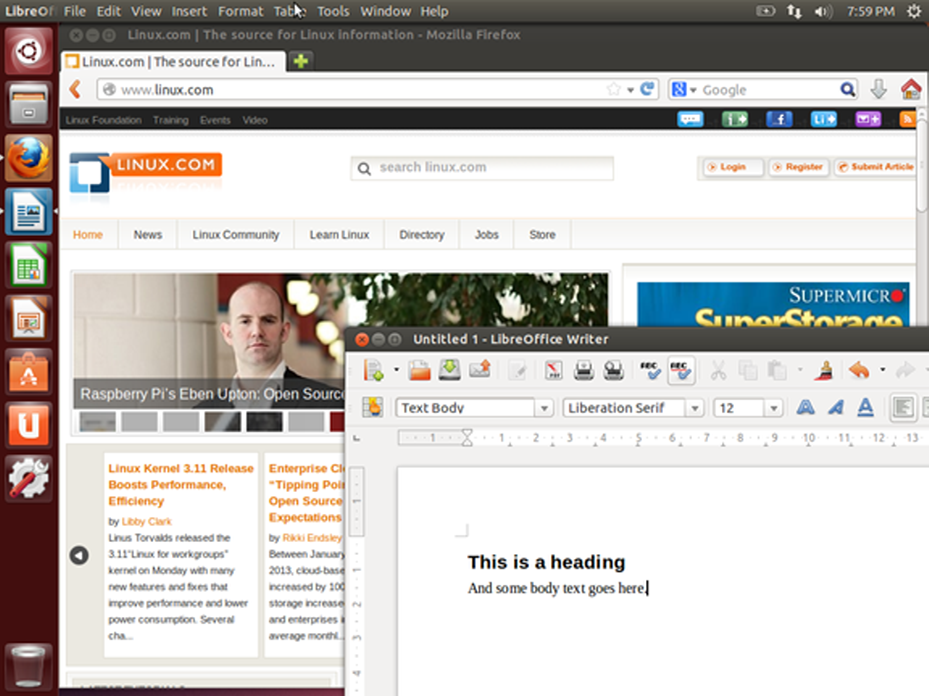

En modo gráfico puedes tener varios shells abiertos, que resulta muy útil cuando se están realizando tareas en múltiples equipos remotos. Incluso puedes iniciar la sesión con tu usuario y contraseña a través de una interfaz gráfica. En la siguiente figura se muestra un ejemplo de un inicio de sesión gráfico.

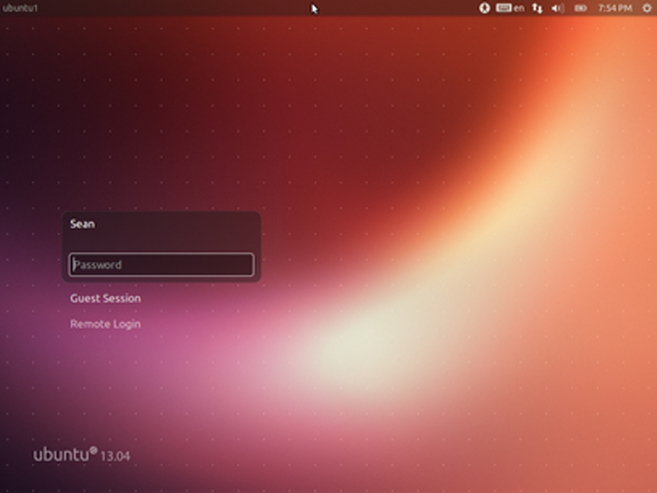

Después de iniciar la sesión pasarás al escritorio donde puedes cargar las aplicaciones. El modo no gráfico comienza con una sesión basada en texto que se muestra a continuación. Simplemente se te pedirá tu nombre de usuario y luego tu contraseña. Si el inicio de sesión tiene éxito pasarás directamente al shell.

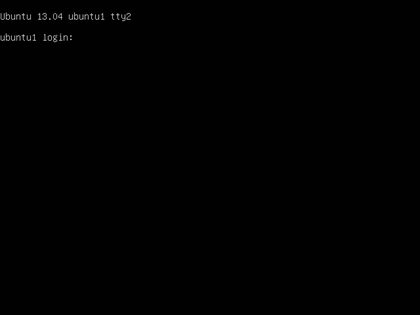

En el modo no gráfico no hay ventanas para navegar. A pesar de esto tienes editores de texto, navegadores web y clientes de correo electrónico, pero son sólo de texto. De este modo UNIX empezó antes que los entornos gráficos fueran la norma. La mayoría de los servidores también se ejecutarán en este modo, ya que la gente no entra en ellos directamente, lo que hace que una interfaz gráfica sea un desperdicio de recursos. Aquí hay un ejemplo de la pantalla que se puede ver después de iniciar la sesión.

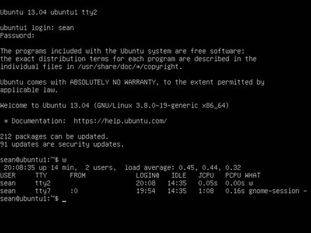

Puedes ver el mensaje original para entrar en la parte superior con el texto más reciente añadido a continuación. Durante el inicio de sesión podrías ver algunos mensajes, llamados el mensaje del día (MOTD), que es una oportunidad para que el administrador de sistemas para pasar información a los usuarios. El MOTD es el símbolo del sistema. En el ejemplo anterior, el usuario introdujo el comando w que muestra quién está conectado. De manera que son introducidos y procesados los comandos nuevos, la ventana se desplaza hacia arriba y el texto más antiguo se pierde en la parte superior. La terminal es responsable de mantener cualquier historia, tal como para permitir al usuario desplazarse hacia arriba y ver los comandos introducidos. En cuanto a Linux, lo que está en la pantalla es todo lo que hay. No hay nada para navegar.

## 3.3 Línea de Comandos

La línea de comandos es una entrada de texto simple, que te permite ingresar cualquier cosa, desde un comando de una sola palabra hasta scripts complicados. Si inicias la sesión a través de modo de texto te encuentras inmediatamente en la consola. Si inicias la sesión de forma gráfica, entonces necesitarás iniciar un shell gráfico, que es solo una consola de texto con una ventana a su alrededor para que puedas cambiar su tamaño y posición.

Cada escritorio de Linux es diferente, por lo que tienes que buscar en tu menú una opción llamada **terminal** o **x-term**. Las dos son shells gráficos, diferenciadas sobre todo en aspectos más que funcionalidad. Si tienes una herramienta de búsqueda como Ubuntu Dash, puedes buscar un **terminal** como se muestra aquí.

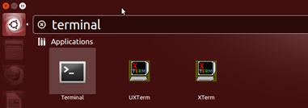

Estas herramientas te permiten buscar rápidamente en tu sistema exactamente lo que quieres ejecutar en lugar de perderte en los menús.

## 3.4 Virtualización y Cloud Computing

Linux es un *sistema operativo multiusuario*, lo que significa que muchos usuarios diferentes pueden trabajar en el mismo sistema al mismo tiempo y en su mayor parte no pueden hacer cosas para dañar a otros usuarios. Sin embargo, esto tiene limitaciones: los usuarios pueden acaparar el espacio en disco o tomar demasiada memoria o recursos de la CPU y causar que el sistema sea lento para todos. Compartir el sistema en modo multiusuario también requiere que cada uno ejecute en modo de usuarios sin privilegios, por lo que permitir que cada usuario ejecuta su propio servidor web es muy difícil.

La virtualización es un proceso donde un equipo físico, llamado host, ejecuta múltiples copias de un sistema operativo, cada una llamada *invitado*. El host ejecuta un software llamado *hipervisor* que cambia el control entre los diferentes invitados, tal como el kernel de Linux funciona para los procesos individuales.

La virtualización funciona porque los servidores pasan la mayor parte de su tiempo inactivo y no necesitan recursos físicos tales como un monitor y un teclado. Ahora puedes tomar una potente CPU y difundirla alrededor de varias máquinas virtuales y mantener una distribución más equitativa entre los invitados de lo que es posible en un sistema de Linux de puro. La principal limitación es por lo general la memoria, con los avances en la tecnología de hipervisor y la CPU es posible poner más máquinas virtuales en un host que nunca.

En un entorno virtualizado un host puede ejecutar docenas de sistemas operativos invitados, y con el apoyo de la CPU, los invitados no saben que se están ejecutando en una máquina virtual. Cada invitado obtiene su propia CPU, RAM y disco virtual y se comunica con la red. Ni siquiera es necesario ejecutar el mismo sistema operativo en todos los invitados, lo que reduce aún más el número de servidores físicos necesarios.

La virtualización ofrece una manera para que una empresa reduzca su consumo de energía y espacio de centro de datos frente a una flota equivalente de servidores físicos. Los invitados ahora sólo son configuraciones de software, así que es fácil proporcionar una nueva máquina para una prueba y destruirla cuando haya pasado su utilidad.

Si es posible ejecutar varias instancias de un sistema operativo en una máquina física y conectarse en la red, entonces la ubicación de la máquina no importa. El Cloud Computing (*Cómputo o Informática en la Nube*) toma este enfoque y te permite tener una máquina virtual en un centro de datos remoto que no posees y sólo pagas por los recursos que utilizas. Los proveedores de Cloud Computing pueden tomar ventaja de las economías de escala para ofrecer recursos de computación a mejores precios de lo que costaría adquirir tu propio hardware, espacio y enfriamiento.

Los servidores virtuales sólo son una faceta de Cloud Computing. También puedes obtener almacenamiento de archivos, bases de datos o incluso software. La clave en la mayoría de estos productos es que pagas por lo que usas, por ejemplo una cierta cantidad por giga bytes de datos por mes, en lugar de comprar el hardware y el software para darle hospedaje tu mismo. Algunas situaciones son más adecuadas para la nube que otros. Preocupaciones de seguridad y el rendimiento son generalmente los primeros elementos que surgen seguidos por el costo y la funcionalidad.

Linux juega un papel fundamental en el Cloud Computing. La mayoría de los servidores virtuales se basa en algún tipo de kernel de Linux, y Linux se suele utilizar para alojar las aplicaciones detrás de los servicios del Cloud Computing.

## 3.5 Utilizar Linux para el Trabajo

Las herramientas básicas utilizadas en la mayoría de las oficinas son:
 - Procesador de textos
 - Hoja de cálculo
 - Paquete de presentación
 - Navegador web

**OpenOffice**, o el más activo, **LibreOffice**, se encarga de las tres primeras funciones. El procesador de texto se utiliza para editar documentos, tales como informes y memos. Las Hojas de cálculo son útiles para trabajar con números, por ejemplo para resumir datos de ventas y hacer predicciones futuras. El paquete de presentación se utiliza para crear diapositivas con las características tales como texto, gráficos y vídeo insertado. Las diapositivas pueden ser impresas o mostradas en una pantalla o un proyector para compartir con una audiencia.

A continuación abajo puedes ver la hoja de cálculo y editor de documentos de LibreOffice. Nota cómo la hoja de cálculo, LibreOffice Calc, no se limita a filas y columnas de números. Los números pueden ser la fuente de un gráfico, y puedes escribir fórmulas para calcular valores basados en la información, por ejemplo reunir las tasas de interés y cantidades para ayudar a comparar las diferentes opciones de préstamo.

Utilizando el Writer de LibreOffice, un documento puede contener texto, gráficos, tablas de datos y mucho más. Puedes vincular documentos y hojas de cálculo, por ejemplo, para que puedas resumir los datos en forma escrita y saber que cualquier cambio en la hoja de cálculo se reflejará en el documento.

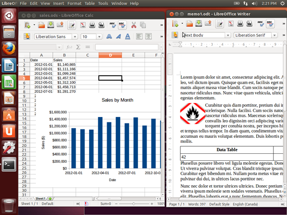

LibreOffice también puede trabajar con otros formatos de archivo, como Microsoft Office o **Adobe Portable Document Format (PDF)**. Además, mediante el uso de extensiones, se puede integrar LibreOffice con el software Wiki para ofrecerle una poderosa solución de intranet.

Linux es un ciudadano de primera clase para los navegadores Firefox y Google Chrome. Como tal, puede esperar tener el software más reciente disponible para su plataforma y el acceso oportuno a correcciones de errores y nuevas características. Algunos complementos, como Adobe Flash, no siempre funcionan correctamente ya que dependen de otra compañía con prioridades diferentes.

## 3.6 Proteger tu Equipo Linux

A Linux no le importa si estás en el teclado de un equipo o conectado a través de Internet, por lo que querrás tomar algunas precauciones básicas para asegurarte de que tus datos están a salvo.

Lo más fácil es utilizar una buena y única contraseña donde quiera que vayas, sobre todo en tu máquina local. Una buena contraseña tiene al menos 10 caracteres y contiene una mezcla de números y letras (tanto mayúsculas y minúsculas) y símbolos especiales. Utiliza un paquete como [KeePassX](http://www.keepassx.org/) para generar contraseñas, ya que luego sólo necesitas tener una contraseña de inicio de sesión a tu equipo y una contraseña para abrir el archivo de KeePassX.

Después de eso, crea periódicamente un punto de comprobación de actualizaciones. A continuación, te mostraremos la configuración de actualización de software Ubuntu, que está disponible en el menú de **Configuración**.

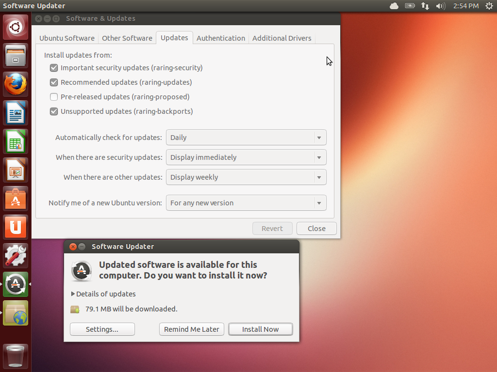

En la parte superior, se puede ver que el sistema está configurado para buscar actualizaciones de forma diaria. Si hay actualizaciones relacionadas con la seguridad, entonces se te pedirá que las instales inmediatamente. De lo contrario, recibirás las actualizaciones en lotes cada semana. En la parte inferior de la pantalla puedes ver el cuadro de diálogo que aparece cuando hay actualizaciones disponibles. Todo lo que tienes que hacer es hacer clic en **Instalar ahora** y tu equipo se actualizará!

Por último, tienes que proteger tu equipo de aceptar conexiones entrantes. *Firewall* es un dispositivo que filtra el tráfico de red y Linux tiene uno integrado. Si usas Ubuntu, **gufw** es una interfaz gráfica para "Uncomplicated firewall" de Ubuntu.

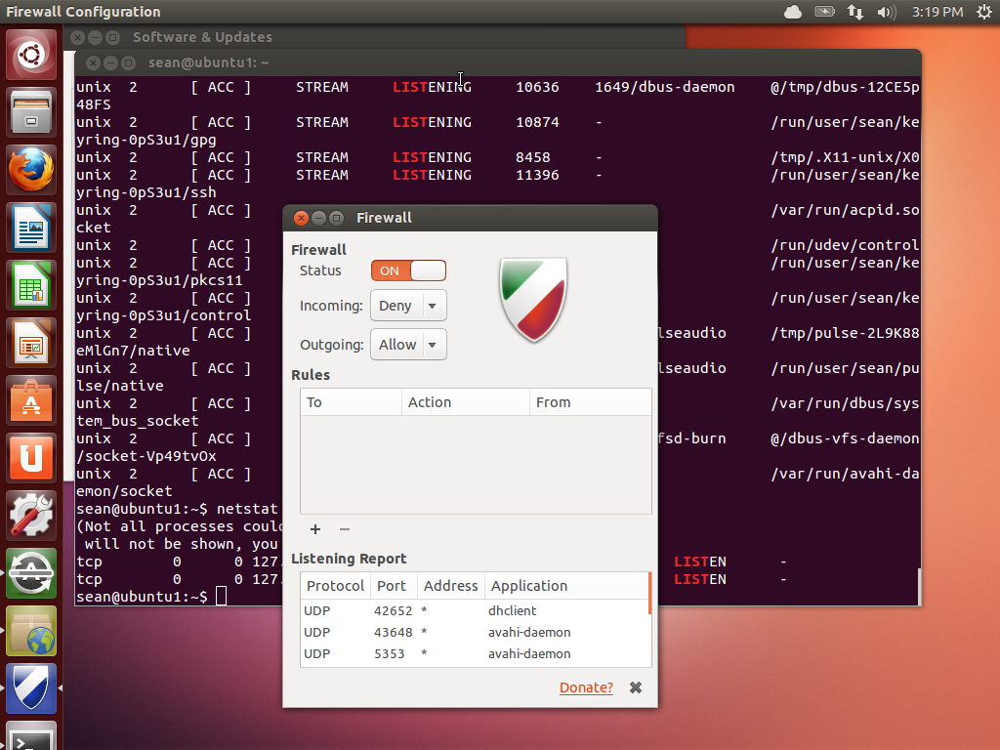

Simplemente cambiando el estado a "on" se bloquea todo el tráfico que llega a tu equipo, a menos que lo hayas iniciado tú mismo. De manera selectiva puedes permitir que entren algunas cosas haciendo clic en el signo más.

Bajo el capó estás usando *iptables* que es el sistema firewall integrado. En lugar de introducir comandos iptables complicados, usas un GUI. Mientras que este GUI te permite construir una política efectiva de un escritorio, éste apenas araña la superficie de lo que se puede hacer con iptables.

## 3.7 Protegerte a tí Mismo

Cuando navegas por Internet, dejas una huella digital. Mucha de esta información viene ignorada, pero alguna viene reunida para recopilar estadísticas de publicidad y otra puede ser utilizada para propósitos maliciosos.

Como regla general, no deberías confiar en los sitios con los que interactúas. Usa contraseñas diferentes en cada sitio de Internet para que si tal sitio web estuviera hackeado, la contraseña no podría utilizarse para obtener acceso a otros sitios. Usando anteriormente mencionado KeePassX es la forma más fácil de hacerlo. De la misma forma, limita la información que proporcionas a los sitios, sólo lo imprescindible. Mientras que dar el nombre de tu madre y fecha de nacimiento podría ayudarte a desbloquear tus credenciales para la red social en caso de que pierdas tu contraseña, la misma información puede utilizarse para suplantar la identidad de tu banco.

Las *cookies* son el mecanismo principal que los sitios web utilizan para darte seguimiento. A veces este seguimiento es bueno, por ejemplo para dar seguimiento de lo que está en tu cesta de compras o para mantenerte conectado cuando regreses al sitio.

Cuando navegas por la web, un servidor web puede devolver la cookie que es un pequeño trozo de texto junto con la página web. Tu navegador lo almacena y envía con cada solicitud al mismo sitio. No envías cookies para ejemplo.com a sitios en ejemplo.org.

Sin embargo, muchos sitios han incrustado scripts que provienen de terceros, como un mensaje emergente de anuncio o un píxel de analítica. Si ejemplo.com y ejemplo.org tienen un píxel de analítica, por ejemplo de un anunciante, entonces esa misma cookie se enviará al navegar por ambos sitios. El anunciante se entera entonces que has visitado ejemplo.com y ejemplo.org.

Con un alcance suficientemente amplio, como los "Likes" y botones parecidos, un sitio web puede obtener un entendimiento de cuáles sitios web visitas y averiguar tus intereses y datos demográficos.

Existen diversas estrategias para tratar este asunto. Uno es ignorarlo. La otra es limitar los píxeles de seguimiento que aceptas, ya sea por bloqueo completo o vaciarlos periódicamente. A continuación abajo se muestra la configuración de cookies para Firefox. En la parte superior, verás que el usuario ha optado que Firefox no de permiso al sitio para el seguimiento. Esta es una etiqueta voluntaria enviada en la petición que algunos sitios distinguirán. A continuación, el navegador recibe una instrucción de no recordar nunca las cookies de terceros y eliminar cookies regulares (por ejemplo, desde el sitio navegando) después de haber cerrado el Firefox.

Afinando la configuración de privacidad puede hacerte más anónimo en Internet, pero también puede causar problemas con algunos sitios que dependen de cookies de terceros. Si esto sucede, probablemente tengas que permitir explícitamente que se guarden algunas cookies.

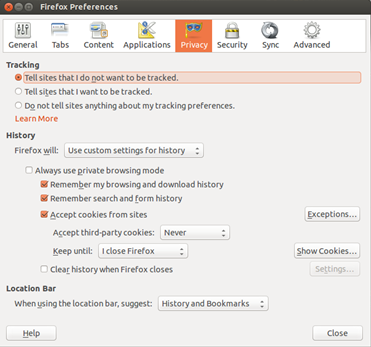

Aquí también tendrás la posibilidad de olvidar el historial de búsqueda o no seguirlo. Con el historial de búsqueda eliminado no habrá ningún registro en el equipo local de los sitios que hayas visitado.

Si te preocupa mucho ser anónimo en Internet, puedes descargar y utilizar el [Navegador Tor](https://www.torproject.org/projects/torbrowser.html.en). Tor es el nombre corto para "The Onion Router" que es una red de servidores públicamente ejecutados que rebotan tu tráfico para ocultar el origen. El navegador que viene con el paquete es una versión básica que no ejecuta ni siquiera las secuencias de comandos, por lo que algunos sitios probablemente no funcionarán correctamente. Sin embargo, es la mejor manera de ocultar tu identidad si es lo que deseas hacer.

## 4.1 Introducción

Si eres como la mayoría de las personas, probablemente estés familiarizado con el uso de la *Interfaz Gráfica de Usuario (o GUI «Graphical User Interface»)* para controlar tu computadora. Fue introducida a las masas por Apple en la computadora Macintosh y popularizado por Microsoft. La GUI proporciona una forma fácil de descubrir y administrar tu sistema. Sin una GUI, algunas herramientas para gráficos y video no serían prácticas.

Antes de la popularidad de la GUI, la Interfaz de Línea de Comandos (o *CLI «Command Line Interface*») era la forma preferida para controlar una computadora. La CLI se basa únicamente en la entrada por teclado. Todo lo que quieres que tu computadora haga, se retransmite escribiendo comandos en lugar de ir haciendo clics en los iconos.

Si nunca has usado una CLI, al principio puede resultar difícil porque requiere de memorizar comandos y sus *opciones*. Sin embargo, la CLI proporciona un control más preciso, una mayor velocidad y capacidad para automatizar fácilmente las tareas a través del scripting (ver barra lateral). Aunque Linux tiene muchos entornos GUI, podrás controlar Linux mucho más eficazmente mediante la Interfaz de Línea de Comandos.


¿**Por qué conocer la línea de comando es importante? ¡Flexibilidad y Movilidad!** *Mediante la comprensión de los fundamentos de Linux , tienes la capacidad de trabajar en CUALQUIER distribución de Linux. Esto podría significar una compañía con ambiente mixto o una nueva empresa con una distribución Linux diferente*.

## 4.2 Interfaz de Línea de Comandos (CLI)

*La Interfaz de Línea de Comandos (CLI)*, es una interfaz basada en texto para la computadora, donde el usuario introduce un comando y la computadora lo ejecuta. El entorno de la CLI es proporcionado por una aplicación en la computadora conocida como un terminal.

El terminal acepta lo que el usuario escribe y lo pasa a un *shell*. El shell interpreta lo que el usuario ha introducido en las instrucciones que se pueden ejecutar con el sistema operativo. Si el comando produce una salida, entonces se muestra este texto en el terminal. Si surgen problemas con el comando, se muestra un mensaje de error.

## 4.3 Acceso a la Terminal

Hay muchas maneras de acceder a la ventana de la terminal. Algunos sistemas arrancarán directamente a la terminal. Este suele ser el caso de los servidores, ya que una interfaz gráfica de usuario (GUI) puede requerir muchos recursos que no son necesarios para realizar operaciones basadas en servidores.

Un buen ejemplo de un servidor que no requiere una GUI es un servidor web. Los servidores web deben correr tan rápido como sea posible y una GUI sólo haría lento el sistema.

En los sistemas que arrancan con una GUI, hay comúnmente dos formas de acceder a una terminal, una terminal basado en GUI y un terminal virtual:

 - Una terminal de GUI es un programa dentro del entorno de una GUI que emula la ventana de la terminal. Las terminales de la GUI pueden accederse a través del sistema de menú. Por ejemplo, en una máquina CentOS, puedes hacer clic en **Applications** (o «Aplicaciones» en español) en la barra de menús, luego en **System Tools >** (o «Herramientas de Sistema») y, finalmente, en **Terminal**:

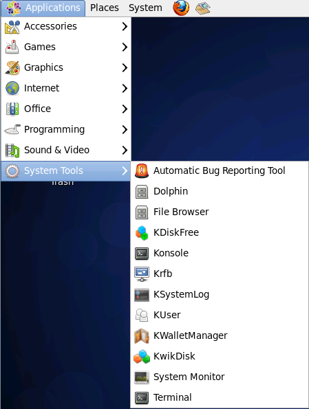

 - Una terminal virtual puede ejecutarse al mismo tiempo que una GUI, pero requiere que el usuario se conecte o inicie sesión a través de la terminal virtual antes de que pueda ejecutar los comandos (como lo haría antes de acceder a la interfaz GUI). La mayoría de los sistemas tienen múltiples terminales virtuales que se pueden acceder pulsando una combinación de teclas, por ejemplo: **Ctrl-Alt-F1**

**Nota**: En las máquinas virtuales puede que las terminales virtuales no estén disponibles.

## 4.3.1 Prompt

Una ventana del terminal muestra un prompt (o «símbolo o aviso» en español); el prompt aparece cuando no se ejecutan ningún comando y cuando la salida completa del comando se ha desplegado en la pantalla. El prompt está diseñado para decirle al usuario que introduzca un comando.

La estructura del prompt puede variar entre las distribuciones, pero por lo general contiene información sobre el usuario y el sistema. A continuación te mostramos una estructura común de un prompt:

`sysadmin@localhost:~$`

El prompt anterior proporciona el nombre del usuario registrado en (`sysadmin`), el nombre del sistema (`localhost`) y el directorio actual (`~`). El símbolo `~` se utiliza como abreviación para el directorio principal del usuario (el directorio principal del usuario viene bajo el directorio `/home` (o «inicio» en español) y con el nombre de la cuenta de usuario, por ejemplo: `/home/sysadmin`).

## 4.3.2 El Shell

Un shell es el intérprete que traduce los comandos introducidos por un usuario en acciones a realizar por el sistema operativo. El entorno Linux proporciona muchos tipos diferentes de shells, algunos de los cuales han existido por muchos años.

El shell más comúnmente utilizado para las distribuciones de Linux se llama el BASH shell. Es un shell que ofrece muchas funciones avanzadas, tales como el historial de comandos, que te permite fácilmente volver a ejecutar comandos previamente ejecutados.

El BASH shell tiene también otras funciones populares:

 - **Scripting**: La capacidad de colocar los comandos en un archivo y ejecutar el archivo, resultando en todos los comandos siendo ejecutados. Esta función también tiene algunas características de programación, tales como las instrucciones condicionales y la habilidad de crear funciones (AKA, subrutinas).
 - **Los Alias**: La habilidad de crear "nicknames" (o «sobrenombres» en español) cortos para más comandos más largos.
 - **Las Variables**: Las Variables se utilizan para almacenar información para el BASH shell. Estas variables pueden utilizarse para modificar cómo las funciones y los comandos trabajan y proporcionan información vital sobre el sistema.

**Nota:** La lista anterior es sólo un breve resumen de algunas de las muchas funciones proporcionadas por el BASH shell.

## 4.3.3 Los Comandos de Formato

Muchos comandos se pueden utilizar por sí mismos sin más entradas. Algunos comandos requieren entradas adicionales para funcionar correctamente. Esta entrada adicional viene en dos formas: `opciones y argumentos`.

El formato típico de un comando es el siguiente:

`comando [opciones] [argumentos]`

Las opciones se utilizan para modificar el comportamiento básico de un comando y los argumentos se utilizan para proporcionar información adicional (tal como un nombre de archivo o un nombre de usuario). Cada opción y argumento vienen normalmente separados por un espacio, aunque las opciones pueden a menudo ser combinadas.
Recuerda que Linux es sensible a mayúsculas y minúsculas. Comandos, opciones, argumentos, variables y nombres de archivos deben introducirse exactamente como se muestra.

El comando `ls` proporciona ejemplos útiles. Por sí mismo, el comando `ls` listará los archivos y directorios contenidos en el directorio de trabajo actual:

```shell
sysadmin@localhost:~$ ls                                           
Desktop  Documents  Downloads  Music  Pictures  Public  Templates   Videos    
sysadmin@localhost:~$
```

Sobre el comando `ls` hablaremos en detalle en un capítulo posterior. El propósito de introducir este comando ahora, es demostrar cómo los argumentos y las opciones funcionan. En este punto no te debes preocupar de lo que es la salida del comando, más bien centrarte en comprender en qué es un argumento y una opción.

Un argumento lo puedes pasar también al comando `ls` para especificar contenido de qué directorio hay que listar. Por ejemplo, el comando `ls /etc/ppp` listará el contenido del directorio /etc/ppp en lugar del directorio actual:

```shell
sysadmin@localhost:~$ ls /etc/ppp                                 
ip-down.d  ip-up.d                                                
sysadmin@localhost:~$
```

Puesto que el comando `ls` acepta múltiples argumentos, puede listar el contenido de varios directorios a la vez, introduciendo el comando `ls /etc/ppp /etc/ssh`:

```shell
sysadmin@localhost:~$ ls /etc/ppp /etc/ssh         
/etc/ppp:                       
ip-down.d  ip-up.d                                  
/etc/ssh:                                                         
moduli               ssh_host_dsa_key.pub     ssh_host_rsa_key      sshd_configssh_config
ssh_host_ecdsa_key   ssh_host_rsa_key.pub         
ssh_host_dsa_key     ssh_host_ecdsa_key.pub   ssh_import_id            
sysadmin@localhost:~$
```

## 4.3.4 Trabajando con las Opciones

Las opciones pueden utilizarse con comandos para ampliar o modificar el comportamiento de un comando. Las opciones son a menudo de una letra; sin embargo, a veces serán "palabras". Por lo general, los comandos viejos utilizan una letra, mientras los comandos nuevos utilizan palabras completas para las opciones. Opciones de una letra son precedidas por un único guión `-`. Opciones de palabra completa son precedidas por dos guiones `--`.

Por ejemplo, puedes utilizar la opción `-l` con el comando `ls` para ver más información sobre los archivos que se listan. El comando `ls -l` lista los archivos contenidos dentro del directorio actual y proporciona información adicional, tal como los permisos, el tamaño del archivo y otra información:

```shell
sysadmin@localhost:~$ ls -l                                       
total 0                                                           
drwxr-xr-x 1 sysadmin sysadmin 0 Jan 29  2015 Desktop             
drwxr-xr-x 1 sysadmin sysadmin 0 Jan 29  2015 Documents           
drwxr-xr-x 1 sysadmin sysadmin 0 Jan 29  2015 Downloads           
drwxr-xr-x 1 sysadmin sysadmin 0 Jan 29  2015 Music               
drwxr-xr-x 1 sysadmin sysadmin 0 Jan 29  2015 Pictures            
drwxr-xr-x 1 sysadmin sysadmin 0 Jan 29  2015 Public               
drwxr-xr-x 1 sysadmin sysadmin 0 Jan 29  2015 Templates           
drwxr-xr-x 1 sysadmin sysadmin 0 Jan 29  2015 Videos              
sysadmin@localhost:~$
```

En la mayoría de los casos, las opciones pueden utilizarse conjuntamente con otras opciones. Por ejemplo, los comandos `ls -l -h` o `ls -lh` listarán los archivos con sus detalles, pero se mostrará el tamaño de los archivos en formato de legibilidad humana en lugar del valor predeterminado (bytes):

```shell
sysadmin@localhost:~$ ls -l /usr/bin/perl                         
-rwxr-xr-x 2 root root 10376 Feb  4  2014 /usr/bin/perl         
sysadmin@localhost:~$ ls -lh /usr/bin/perl                        
-rwxr-xr-x 2 root root 11K Feb  4  2014 /usr/bin/perl            
sysadmin@localhost:~$
```

Nota que el ejemplo anterior también demostró cómo se pueden combinar opciones de una letra: `-lh` . El orden de las opciones combinadas no es importante.

La opción `-h` también tiene la forma de una palabra completa: `--human-readable` (*--legibilidad-humana*).

Las opciones a menudo pueden utilizarse con un argumento. De hecho, algunas de las opciones requieren sus propios argumentos. Puedes utilizar los argumentos y las opciones con el comando `ls` para listar el contenido de otro directorio al ejecutar el comando `ls -l/etc/ppp`:

```bash
sysadmin@localhost:~$ ls -l /etc/ppp   
total 0                                                            
drwxr-xr-x 1 root root 10 Jan 29  2015 ip-down.d                  
drwxr-xr-x 1 root root 10 Jan 29  2015 ip-up.d          
sysadmin@localhost:~$
```

## 4.4 Historial de los Comandos

Al ejecutar un comando en una terminal, el comando se almacena en "history list" (o «lista de historial» en español). Esto está diseñado para que más adelante puedas ejecutar el mismo comando más fácilmente puesto que no necesitarás volver a introducir el comando entero.

Para ver la lista de historial de una terminal, utiliza el comando `history` (o «historial» en español):

```bash
sysadmin@localhost:~$ date                                       
Sun Nov  1 00:40:28 UTC 2015                                      
sysadmin@localhost:~$ ls                                           
Desktop  Documents  Downloads  Music  Pictures  Public  Templates  
Videos       
sysadmin@localhost:~$ cal 5 2015                                  
    May 2015                                                      
Su Mo Tu We Th Fr Sa                                              
                1  2                                               
 3  4  5  6  7  8  9                                           
10 11 12 13 14 15 16                                              
17 18 19 20 21 22 23                                              
24 25 26 27 28 29 30                                               
31                                                                
sysadmin@localhost:~$ history                                   
    1  date                                                       
    2  ls                                                      
    3  cal 5 2015                                             
    4  history                                                 
sysadmin@localhost:~$
```

Pulsando la tecla de **Flecha Hacia Arriba ↑** se mostrará el comando anterior en tu línea de prompt. Puedes presionar arriba repetidas veces para moverte a través del historial de comandos que hayas ejecutado. Presionando la tecla **Entrar** se ejecutará de nuevo el comando visualizado.

Cuando encuentres el comando que quieres ejecutar, puedes utilizar las teclas de **Flecha Hacia Izquierda ←** y **Flecha Hacia Derecha →** para colocar el cursor para edición. Otras teclas útiles para edición incluyen **Inicio**, **Fin**, **Retroceso** y **Suprimir**.

Si ves un comando que quieres ejecutar en la lista que haya generado el comando `history`, puedes ejecutar este comando introduciendo el signo de exclamación y luego el número al lado del comando, por ejemplo:

`!3`

```bash
sysadmin@localhost:~$ history                                     
    1  date                                                      
    2  ls                                                         
    3  cal 5 2015                                                 
    4  history                                                    
sysadmin@localhost:~$ !3                                        
cal 5 2015                                                        
     May 2015                                                     
Su Mo Tu We Th Fr Sa                                              
                1  2                                              
 3  4  5  6  7  8  9                                             
10 11 12 13 14 15 16                                              
17 18 19 20 21 22 23                                            
24 25 26 27 28 29 30                                               
                  31                                              
sysadmin@localhost:~$
```

Algunos ejemplos adicionales del `history`:

| Ejemplo | Significado |
|---|---|
| `history 5` | Muestra los últimos cinco comandos de la lista del historial |
| `!!` | Ejecuta el último comando otra vez
| `!-5 ` | Ejecuta el quinto comando desde la parte inferior de la lista de historial |
| `!ls ` | Ejecuta el comando `ls` más reciente |

## 4.5 Introduciendo las variables del BASH shell

Una variable del shell BASH es una función que te permite a ti o al shell almacenar los datos. Esta información puede utilizarse para proporcionar información crítica del sistema o para cambiar el comportamiento del funcionamiento del shell BASH (u otros comandos).

Las variables reciben nombres y se almacenan temporalmente en la memoria. Al cerrar una ventana de la terminal o shell, todas las variables se pierden. Sin embargo, el sistema automáticamente recrea muchas de estas variables cuando se abre un nuevo shell.

Para mostrar el valor de una variable, puedes utilizar el comando `echo` (o «eco» en español). El comando `echo` se utiliza para mostrar la salida en la terminal; en el ejemplo siguiente, el comando mostrará el valor de la variable HISTSIZE:

```bash
sysadmin@localhost:~$ echo $HISTSIZE                     
1000                                                             
sysadmin@localhost:~$
```

La variable HISTSIZE define cuántos comandos anteriores se pueden almacenar en la lista del historial. Para mostrar el valor de la variable debes utilizar un carácter del signo de dólar $ antes del nombre de la variable. Para modificar el valor de la variable, no se utiliza el carácter $:

```bash
sysadmin@localhost:~$ HISTSIZE=500                                            
sysadmin@localhost:~$ echo $HISTSIZE                              
500                                                             
sysadmin@localhost:~$
```

Hay muchas variables del shell que están disponibles para el shell BASH, así como las variables que afectarán a los diferentes comandos de Linux. No todas las variables del shell están cubiertas por este capítulo, sin embargo, conforme vaya avanzando este curso hablaremos de más variables del shell.

## 4.6 La Variable PATH

Una de las variables del shell BASH más importante que hay que entender es la variable PATH.

El término *path* (o «ruta» en español) se refiere a una lista que define en qué directorios el shell buscará los comandos. Si introduces un comando y recibes el error "command not found" (o «comando no encontrado» en español), es porque el shell BASH no pudo localizar un comando por ese nombre en cualquiera de los directorios en la ruta. El comando siguiente muestra la ruta del shell actual:

```bash
sysadmin@localhost:~$ echo $PATH                                        
/home/sysadmin/bin:/usr/local/sbin:/usr/local/bin:/usr/sbin:/usr/bin:/sbin:/bin:
/usr/games                                                              
sysadmin@localhost:~$
```

Basado en la anterior salida, cuando intentas ejecutar un comando, el shell primero busca el comando en el directorio */home/sysadmin/bin*. Si el comando se encuentra en ese directorio, entonces se ejecuta. Si no es encontrado, el shell buscará en el directorio */usr/local/sbin*.

Si el comando no se encuentra en ningún directorio listado en la variable PATH, entonces recibirás un error, command not found:

```bash
sysadmin@localhost:~$ zed                                              
-bash: zed: command not found                                           
sysadmin@localhost:~$
```

Si en tu sistema tienes instalado un software personalizado, puede que necesites modificar la ruta PATH para que sea más fácil ejecutar estos comandos. Por ejemplo, el siguiente comando agregará el directorio /usr/bin/custom a la variable PATH:

```bash
sysadmin@localhost:~$ PATH=/usr/bin/custom:$PATH                        
sysadmin@localhost:~$ echo $PATH                                       
/usr/bin/custom:/home/sysadmin/bin:/usr/local/sbin:/usr/local/bin:/usr/sbin:/usr/bin:/sbin:/bin:/usr/games                                              
sysadmin@localhost:~$
```

## 4.7 Comando export

Hay dos tipos de variables utilizadas en el shell BASH, la local y la de entorno. Las variables de entorno, como PATH y HOME, las utiliza el BASH al interpretar los comandos y realizar las tareas. Las variables locales son a menudo asociadas con las tareas del usuario y son minúsculas por convención. Para crear una variable local, simplemente introduce:

`sysadmin@localhost:~$ variable1='Something'`

Para ver el contenido de la variable, te puedes referir a ella iniciando con el signo de $:

```bash
sysadmin@localhost:~$ echo $variable1                                   
Something
```

Para ver las variables de entorno, utiliza el comando `env` (la búsqueda a través de la salida usando `grep`, tal como se muestra aquí, se tratará en los capítulos posteriores). En este caso, la búsqueda para variable1 en las variables de entorno resultará en una salida nula:

```bash
sysadmin@localhost:~$ env | grep variable1                              
sysadmin@localhost:~$
```

Después de exportar variable1 llegará a ser una variable de entorno. Observa que esta vez, se encuentra en la búsqueda a través de las variables de entorno:

```bash
sysadmin@localhost:~$ export variable1                                  
sysadmin@localhost:~$ env | grep variable1                             
variable1=Something
```

El comando `export` también puede utilizarse para hacer una variable de entorno en el momento de su creación:

```bash
sysadmin@localhost:~$ export variable2='Else'                           
sysadmin@localhost:~$ env | grep variable2                             
variable2=Else
```

Para cambiar el valor de una variable de entorno, simplemente omite el $ al hacer referencia a tal valor:

```bash
sysadmin@localhost:~$ variable1=$variable1' '$variable2                
sysadmin@localhost:~$ echo $variable1                                   
Something Else
```

Las variables exportadas pueden eliminarse con el comando `unset`:

`sysadmin@localhost:~$ unset variable2
`

## 4.8 Comando which

Puede haber situaciones donde diferentes versiones del mismo comando se instalan en un sistema o donde los comandos son accesibles para algunos usuarios y a otros no. Si un comando no se comporta como se esperaba o si un comando no está accesible pero debería estarlo, puede ser beneficioso saber donde el shell encuentra tal comando o que versión está utilizando.

Sería tedioso tener que buscar manualmente en cada directorio que se muestra en la variable PATH. En su lugar, puedes utilizar el comando `which` (o «cuál» en español) para mostrar la ruta completa del comando en cuestión:

```bash
sysadmin@localhost:~$ which date                                       
/bin/date                                                               
sysadmin@localhost:~$ which cal                                        
/usr/bin/cal                                                            
sysadmin@localhost:~$
```

El comando `which` busca la ubicación de un comando buscando en la variable PATH.

## 4.9 Comando type

El comando `type` puede utilizarse para determinar la información acerca de varios comandos. Algunos comandos se originan de un archivo específico:

```bash
sysadmin@localhost:~$ type which                                       
which is hashed (/usr/bin/which)
```

Esta salida sería similar a la salida del comando `which` (tal como se explica en el apartado anterior, que muestra la ruta completa del comando):

```bash
sysadmin@localhost:~$ which which                         
/usr/bin/which
```

El comando `type` también puede identificar comandos integrados en el bash (u otro) shell:

```bash
sysadmin@localhost:~$ type echo                                     
echo is a shell builtin
```

En este caso, la salida es significativamente diferente de la salida del comando `which`:

```bash
sysadmin@localhost:~$ which echo                                        
/bin/echo
```

Usando la opción `-a`, el comando `type` también puede revelar la ruta de otro comando:

```bash
sysadmin@localhost:~$ type -a echo                                      
echo is a shell builtin                                                
echo is /bin/echo
```

El comando `type` también puede identificar a los aliases para otros comandos:

```bash
sysadmin@localhost:~$ type ll                                          
ll is aliased to `ls -alF'                                              
sysadmin@localhost:~$ type ls                                          
ls is aliased to `ls --color=auto'
```

La salida de estos comandos indican que `ll` es un alias para `ls - alF`, incluso `ls` es un alias para `ls --color=auto`. Una vez más, la salida es significativamente diferente del comando `which`:

```bash
sysadmin@localhost:~$ which ll                                          
sysadmin@localhost:~$ which ls                                         
/bin/ls
```

El comando `type` soporta otras opciones y puede buscar varios comandos al mismo tiempo. Para mostrar sólo una sola palabra que describe al `echo`, `ll`, y a los comandos `which`, utiliza la opción `-t`:

```bash
sysadmin@localhost:~$ type -t echo ll which                  
builtin                                                                
alias                                                             
file
```

## 4.10 Los Alias

Un *alias* puede utilizarse para asignar comandos más largos a secuencias más cortas. Cuando el shell ve un alias ejecutado, sustituye la secuencia más larga antes de proceder a interpretar los comandos.

Por ejemplo, el comando `ls -l` comúnmente tiene un alias `l` o `ll`. Ya que estos comandos más pequeñas son más fáciles de introducir, también es más rápido ejecutar la línea de comandos `ls -l`.

Puedes determinar qué alias se definen en el shell con el comando `alias`:

```bash
sysadmin@localhost:~$ alias   
alias alert='notify-send —urgency=low -i "$([ $? = 0 ] && echo terminal || echo error)" "$(history|tail -n1|sed -e '\''s/^\s*[0-9]\+\s*//;s/[;&|]\s*alert$//'\'')"'                                          
alias egrep='egrep --color=auto'                                       
alias fgrep='fgrep --color=auto'                                        
alias grep='grep --color=auto'                                          
alias l='ls -CF'                                                       
alias la='ls -A'                                                       
alias ll='ls -alF'                                                     
alias ls='ls --color=auto'
```

Los alias que ves en los ejemplos anteriores fueron creados por los archivos de inicialización. Estos archivos están diseñados para hacer automático el proceso de creación de los alias. Hablaremos sobre ellos con más detalle en un capítulo posterior.

Los nuevos alias se pueden crear introduciendo `alias name=command` (o «alias nombre=comando» en español), donde nombre es el nombre que quieres dar a el alias y comando es el comando que quieres que se ejecute cuando se ejecuta el alias.

Por ejemplo, puedes crear un alias de tal manera que `lh` muestre una lista larga de archivos, ordenados por tamaño con un tamaño "human friendly" (o «amigable para el usuario» en español) con el comando `alias lh='ls -Shl'`. Introduciendo `lh` debe ahora dar lugar a la misma salida que introduciendo el comando `ls -Shl`:

```bash
sysadmin@localhost:~$ alias lh='ls -Shl'                                      
sysadmin@localhost:~$ lh /etc/ppp                                          
total 0                                                                 
drwxr-xr-x 1 root root 10 Jan 29  2015 ip-down.d            
drwxr-xr-x 1 root root 10 Jan 29  2015 ip-up.d 
```

Los alias creados de esta manera sólo persistirán mientras el shell esté abierto. Una vez que el shell es cerrado, los nuevos alias que hayas creado, se perderán. Además, cada shell posee sus propios alias, así que si creas un alias en un shell y luego lo abres en otro shell, no verás el alias en el nuevo shell.

## 4.11 Globbing

Los caracteres de globbing se denominan a menudo como "comodines". Estos son símbolos que tienen un significado especial para el shell.

A diferencia de los comandos que ejecutará el shell, u opciones y argumentos que el shell pasará a los comandos, los comodines son interpretados por el mismo shell antes de que intente ejecutar cualquier comando. Esto significa que los comodines pueden utilizarse con cualquier comando.

Los comodines son poderosos porque permiten especificar patrones que coinciden con los nombres de archivo en un directorio, así que en lugar de manipular un solo archivo a la vez, puedes fácilmente ejecutar comandos que afectarán a muchos archivos. Por ejemplo, utilizando comodines es posible manipular todos los archivos con una cierta extensión o con una longitud de nombre de archivo determinado.

Ten en cuenta que estos comodines pueden utilizarse con cualquier comando, ya que es el shell, no el comando que se expande con los comodines a la coincidencia de nombres de archivo. Los ejemplos proporcionados en este capítulo utilizan el comando `echo` para demostración.

## 4.11.1 Asterisco (*)

El asterisco se utiliza para representar cero o más de cualquier carácter en un nombre de archivo. Por ejemplo, supongamos que quieres visualizar todos los archivos en el directorio `/etc` que empiecen con la letra `t`:

```bash
sysadmin@localhost:~$ echo /etc/t*                              
/etc/terminfo /etc/timezone                                      
sysadmin@localhost:~$
```

El patrón `t*` significa "cualquier archivo que comienza con el carácter `t` y tiene cero o más de cualquier carácter después de la letra `t`".

Puedes usar el asterisco en cualquier lugar dentro del patrón del nombre de archivo. El siguiente ejemplo coincidirá con cualquier nombre de archivo en el directorio `/etc` que termina con `.d`:

```bash
sysadmin@localhost:~$ echo /etc/*.d                                 
/etc/apparmor.d /etc/bash_completion.d  /etc/cron.d /etc/depmod.d   /etc/fstab.d /etc/init.d /etc/insserv.conf.d /etc/ld.so.conf.d /etc/logrotate.d /etc/modprobe.d /etc/pam.d /etc/profile.d /etc/rc0.d /etc/rc1.d /etc/rc2.d /etc/rc3.d /etc/rc4.d /etc/rc5.d /etc/rc6.d /etc/rcS.d /etc/rsyslog.d /etc/sudoers.d /etc/sysctl.d  /etc/update-motd.d
```
En el ejemplo siguiente se mostrarán todos los archivos en el directorio `/etc` que comienzan con la letra `r` y terminan con `.conf`:

```bash
sysadmin@localhost:~$ echo /etc/r*.conf                             
/etc/resolv.conf /etc/rsyslog.conf
```


## 4.11.2 Signo de Interrogación (?)

El signo de interrogación representa cualquier carácter único. Cada carácter de signo de interrogación coincide con exactamente un carácter, nada más y nada menos.

Supongamos que quieres visualizar todos los archivos en el directorio `/etc` que comienzan con la letra `t` y que tienen exactamente 7 caracteres después del carácter de `t`:

```bash
sysadmin@localhost:~$ echo /etc/t???????      
/etc/terminfo /etc/timezone                                  
sysadmin@localhost:~$
```

Los comodines pueden utilizarse juntos para encontrar patrones más complejos. El comando `echo /etc/*????????????????????` imprimirá sólo los archivos del directorio /etc con veinte o más caracteres en el nombre del archivo:

```bash
sysadmin@localhost:~$ echo /etc/*????????????????????            
/etc/bindresvport.blacklist /etc/ca-certificates.conf            
sysadmin@localhost:~$
```

El asterisco y el signo de interrogación también podrían usarse juntos para buscar archivos con extensiones de tres letras ejecutando el comando `echo /etc/*.???`:

```bash
sysadmin@localhost:~$ echo /etc/*.???                
/etc/blkid.tab /etc/issue.net                                
sysadmin@localhost:~$
```

## 4.11.3 Corchetes [ ]

Los corchetes se utilizan para coincidir con un carácter único representando un intervalo de caracteres que pueden coincidir con los caracteres. Por ejemplo, `echo /etc/[gu]*` imprimirá cualquier archivo que comienza con el carácter `g` o `u y contiene cero o más caracteres adicionales:

```bash
sysadmin@localhost:~$ echo /etc/[gu]*                              
/etc/gai.conf /etc/groff /etc/group /etc/group- /etc/gshadow /etc/gshadow- /etc/ucf.conf /etc/udev /etc/ufw /etc/update-motd.d /etc/updatedb.conf            
sysadmin@localhost:~$
```

Los corchetes también pueden ser utilizados para representar un intervalo de caracteres. Por ejemplo, el comando `echo /etc/[a-d]* mostrará todos los archivos que comiencen con cualquier letra entre e incluyendo `a` y `d:

```bash
sysadmin@localhost:~$ echo /etc/[a-d]*                             
/etc/adduser.conf /etc/adjtime /etc/alternatives /etc/apparmor.d 
/etc/apt /etc/bash.bashrc /etc/bash_completion.d /etc/bind /etc/bindresvport.blacklist /etc/blkid.conf /etc/blkid.tab /etc/ca-certificates /etc/ca-certificates.conf /etc/calendar /etc/cron.d /etc/cron.daily /etc/cron.hourly /etc/cron.monthly /etc/cron.weekly /etc/crontab /etc/dbus-1 /etc/debconf.conf /etc/debian_version /etc/default 
/etc/deluser.conf /etc/depmod.d /etc/dpkg                          
sysadmin@localhost:~$
```

El comando echo `/etc/*[0-9]* mostrará todos los archivos que contienen al menos un número:

```bash
sysadmin@localhost:~$ echo /etc/*[0-9]*                            
/etc/dbus-1 /etc/iproute2 /etc/mke2fs.conf /etc/python2.7 /etc/rc0.d
/etc/rc1.d /etc/rc2.d /etc/rc3.d /etc/rc4.d /etc/rc5.d /etc/rc6.d   
sysadmin@localhost:~$
```

El intervalo se basa en el cuadro de texto de ASCII. Esta tabla define una lista de caracteres disponiéndolos en un orden estándar específico. Si proporcionas un orden inválido, no se registrará ninguna coincidencia:

```bash
sysadmin@localhost:~$ echo /etc/*[9-0]*                           
/etc/*[9-0]*                                                       
sysadmin@localhost:~$
```

## 4.11.4 Signo de Exclamación (!)

El signo de exclamación se utiliza en conjunto con los corchetes para negar un intervalo. Por ejemplo, el comando `echo [!DP]* mostrará cualquier archivo que no comienza con `D` o `P`.

## 4.12 Las Comillas

Hay tres tipos de comillas que tienen significado especial para el shell Bash: comillas dobles ", comillas simples ' y comilla invertida `. Cada conjunto de comillas indica al shell que debe tratar el texto dentro de las comillas de una manera distinta a la normal.

## 4.12.1 Comillas Dobles

Las comillas dobles detendrán al shell de la *interpretación* de algunos metacaracteres, incluyendo los comodines. Dentro de las comillas dobles, el asterisco es sólo un asterisco, un signo de interrogación es sólo un signo de interrogación y así sucesivamente. Esto significa que cuando se utiliza el segundo comando `echo` más abajo, el shell BASH no convierte el patrón de globbing en nombres de archivos que coinciden con el patrón:

```bash
sysadmin@localhost:~$ echo /etc/[DP]*                                         
/etc/DIR_COLORS /etc/DIR_COLORS.256color /etc/DIR_COLORS.lightbgcolor /etc/PackageKit                                                                  
sysadmin@localhost:~$ echo "/etc/[DP]*"                                       
/etc/[DP]*                                                                    
sysadmin@localhost:~$
```

Esto es útil cuando quieres mostrar algo en la pantalla, lo que suele ser un carácter especial para el shell:

```bash
sysadmin@localhost:~$ echo "The glob characters are *, ? and [ ]"      
The glob characters are *, ? and [ ]                                   
sysadmin@localhost:~$
```

Las comillas dobles todavía permiten la sustitución de comando (se tratará más adelante en este capítulo), sustitución de variable y permiten algunos metacaracteres de shell sobre los que aún no hemos hablado. Por ejemplo, en la siguiente demostración, notarás que el valor de la variable `PATH es desplegada:

```bash
sysadmin@localhost:~$ echo "The path is $PATH"                          
The path is /usr/bin/custom:/home/sysadmin/bin:/usr/local/sbin:/usr/local/bin:/usr/sbin:/usr/bin:/sbin:/bin:/usr/games                          
sysadmin@localhost:~$
```

## 4.12.2 Comillas Simples

Las comillas simples evitan que el shell interprete algunos caracteres especiales. Esto incluye comodines, variables, sustitución de comando y otro metacarácter que aún no hemos visto.

Por ejemplo, si quieres que el carácter `$` simplemente signifique un `$`, en lugar de actuar como un indicador del shell para buscar el valor de una variable, puedes ejecutar el segundo comando que se muestra a continuación:

```bash
sysadmin@localhost:~$ echo The car costs $100                           
The car costs 00                                                        
sysadmin@localhost:~$ echo 'The car costs $100'                        
The car costs $100                                                      
sysadmin@localhost:~$
```

## 4.12.3 Barra Diagonal Inversa (\)

Puedes utilizar una técnica alternativa para citar un carácter con comillas simples. Por ejemplo, supón que quieres imprimir lo siguiente: `“The services costs $100 and the path is $PATH"`. Si pones esto entre las comillas dobles, `$1` y `$PATH` se consideran variables. Si pones esto entre las comillas simples, $1 y $PATH no son variables. Pero ¿qué pasa si quieres tener `$PATH` tratado como una variable y no a `$1`?

Si colocas una barra diagonal invertida `\` antes del otro carácter, tratará al otro carácter como un carácter de "comillas simples". El tercer comando más abajo muestra cómo utilizar el carácter `\`, mientras que los otros dos muestran cómo las variables serían tratadas si las pones entre las comillas dobles y simples:

```bash
sysadmin@localhost:~$ echo "The service costs $100 and the path is $PATH"
The service costs 00 and the path is /usr/bin/custom:/home/sysadmin/bin:/usr/local/sbin:/usr/local/bin:/usr/sbin:/usr/bin:/sbin:/bin:/usr/games 
sysadmin@localhost:~$ echo 'The service costs $100 and the path is $PATH' 
The service costs $100 and the path is $PATH                         
sysadmin@localhost:~$ echo The service costs \$100 and the path is $PATH
The service costs $100 and the path is /usr/bin/custom:/home/sysadmin/bin:/usr/local/sbin:/usr/local/bin:/usr/sbin:/usr/bin:/sbin:/bin:/usr/games 
sysadmin@localhost:~$
```

## 4.12.4 Comilla Invertida

Las comillas invertidas se utilizan para especificar un comando dentro de un comando, un proceso de sustitución del comando. Esto permite un uso muy potente y sofisticado de los comandos.

Aunque puede sonar confuso, un ejemplo debe hacer las cosas más claras. Para empezar, fíjate en la salida del comando `date`:

```bash
sysadmin@localhost:~$ date                                           
Mon Nov  2 03:35:50 UTC 2015
```

Ahora fíjate en la salida de la línea de comandos `echo Today is date` (o «eco La fecha de hoy es» en español):

```bash
sysadmin@localhost:~$ echo Today is date                               
Today is date                                                           
sysadmin@localhost:~$
```

En el comando anterior la palabra `date` (o «fecha» en español) es tratada como texto normal y el shell simplemente pasa `date` al comando `echo`. Pero, probablemente quieras ejecutar el comando `date` y tener la salida de ese comando enviado al comando `echo`. Para lograr esto, deberás ejecutar la línea de comandos **echo Today is `date`**:

```bash
sysadmin@localhost:~$ echo Today is `date`                         
Today is Mon Nov 2 03:40:04 UTC 2015                         
sysadmin@localhost:~$
```

## 4.13 Instrucciones de Control

Las instrucciones de control te permiten utilizar varios comandos a la vez o ejecutar comandos adicionales, dependiendo del éxito de un comando anterior. Normalmente estas instrucciones de control se utilizan en scripts o secuencias de comandos, pero también pueden ser utilizadas en la línea de comandos.

## 4.13.1 Punto y Coma

El punto y coma puede utilizarse para ejecutar varios comandos, uno tras otro. Cada comando se ejecuta de forma independiente y consecutiva; no importa el resultado del primer comando, el segundo comando se ejecutará una vez que el primero haya terminado, luego el tercero y así sucesivamente.

Por ejemplo, si quieres imprimir los meses de enero, febrero y marzo de 2015, puedes ejecutar `cal 1 2015; cal 2 2015; cal 3 2015` en la línea de comandos:

```bash
sysadmin@localhost:~$ cal 1 2015; cal 2 2015; cal 3 2015               
    January 2015                                                        
Su Mo Tu We Th Fr Sa                                 
             1  2  3                                            
 4  5  6  7  8  9 10                                            
11 12 13 14 15 16 17                                                 
18 19 20 21 22 23 24                                                    
25 26 27 28 29 30 31                                                            
                                                               
    February 2015                                                     
Su Mo Tu We Th Fr Sa                                                   
 1  2  3  4  5  6  7                                                   
 8  9 10 11 12 13 14                                                   
15 16 17 18 19 20 21                                                   
22 23 24 25 26 27 28                                                           

     March 2015                                                        
Su Mo Tu We Th Fr Sa                                                   
 1  2  3  4  5  6  7                                                   
 8  9 10 11 12 13 14                                                  
15 16 17 18 19 20 21                                                   
22 23 24 25 26 27 28                                                   
29 30 31    
```

## 4.13.2 Ampersand Doble (&&)

El símbolo de ampersand doble `&&` actúa como un operador "y" lógico. Si el primer comando tiene éxito, entonces el segundo comando (a la derecha de la `&&`) también se ejecutará. Si el primer comando falla, entonces el segundo comando no se ejecutará.

Para entender mejor como funciona esto, consideremos primero el concepto de fracaso y éxito para los comandos. Los comandos tienen éxito cuando algo funciona bien y fallan cuando algo sale mal. Por ejemplo, considera la línea de comandos `ls /etc/xml`. El comando tendrá éxito si el directorio `/etc/xml` es accesible y fallará cuando no es accesible.

Por ejemplo, el primer comando tendrá éxito porque el directorio `/etc/xml` existe y es accesible mientras que el segundo comando fallará porque no hay un directorio `/junk`:

```bash
sysadmin@localhost:~$ ls /etc/xml                  
catalog  catalog.old  xml-core.xml  xml-core.xml.old           
sysadmin@localhost:~$ ls /etc/junk                             
ls: cannot access /etc/junk: No such file or directory
sysadmin@localhost:~$
```
La manera en que usarías el éxito o fracaso del comando `ls` junto con `&&` sería ejecutando una línea de comandos como la siguiente:

```bash
sysadmin@localhost:~$ ls /etc/xml && echo success          
catalog  catalog.old  xml-core.xml  xml-core.xml.old        
success                                              
sysadmin@localhost:~$ ls /etc/junk && echo success          
ls: cannot access /etc/junk: No such file or directory           
sysadmin@localhost:~$
```

En el primer ejemplo arriba, el comando `echo` fue ejecutado, porque tuvo éxito el comando `ls`. En el segundo ejemplo, el comando `echo` no fue ejecutado debido a que el comando `ls` falló.

## 4.13.3 Línea Vertical Doble

La línea vertical doble `||` es un operador lógico "o". Funciona de manera similar a `&&`; dependiendo del resultado del primer comando, el segundo comando se ejecutará o será omitido.

Con la línea vertical doble, si el primer comando se ejecuta con éxito, el segundo comando es omitido. Si el primer comando falla, entonces se ejecutará el segundo comando. En otras palabras, esencialmente estás diciendo al shell, "O bien ejecuta este primer comando o bien el segundo".

En el ejemplo siguiente, el comando `echo` se ejecutará sólo si falla el comando `ls`:

```bash
sysadmin@localhost:~$ ls /etc/xml || echo failed                 
catalog  catalog.old  xml-core.xml  xml-core.xml.old               
sysadmin@localhost:~$ ls /etc/junk || echo failed                  
ls: cannot access /etc/junk: No such file or directory             
failed                                                            
sysadmin@localhost:~$
```

# Laboratorio

## 4.1 Introducción

Este es Lab 4: Los fundamentos de la Línea de Comandos. Mediante la realización de esta práctica de laboratorio, los estudiantes aprenderán cómo utilizar las funciones básicas del shell.

En este capítulo harás las siguientes tareas:

 - Explorar características Bash
 - Usar variables shell
 - Entender como usar globbing
 - Ser capaz de usar comillas

## 4.2 Los Archivos y los Directorios

En esta tarea vamos a acceder a la interfaz de línea de comandos (CLI) para Linux para explorar cómo ejecutar los comandos básicos y ver como afecta la forma en que se pueden ejecutar.

La mayoría de los usuarios probablemente están más familiarizados con cómo se ejecutan los comandos utilizando una interfaz gráfica de usuario (GUI). Por lo tanto, probablemente esta tarea presente algunos conceptos nuevos para ti, si no habías trabajado previamente con una CLI. Para utilizar una CLI, tendrás que introducir el comando que quieras ejecutar.

La ventana donde escribirás el comando se conoce como un emulador de la terminal. Dentro de la ventana de la terminal, el sistema está mostrando un prompt (símbolo), que actualmente contiene un prompt seguido por un cursor parpadeante:

`sysadmin@localhost:~$`

**Recuerda:** Es posible que tengas que presionar **Entrar** en la ventana para visualizar la línea.

El promt te dice que eres un usuario `sysadmin`; el host o la computadora que estás utilizando: `localhost`; y el directorio en el que te encuentras: `~, lo cuál representa el directorio inicial.

Cuando introduces un comando, éste aparecerá en el cursor de texto. Puedes utilizar las teclas como **inicio**, **fin**, **retroceso**, y **teclas de flecha** para la editar el comando que estás introduciendo.

Una vez que hayas introducido el comando correctamente, presiona **Entrar** para ejecutarlo.

## 4.2.1 Paso 1
El siguiente comando mostrará la misma información que ves en la primera parte del prompt. Asegúrate de que hayas seleccionado (hecho clic) la primera ventana de la Terminal  e introducido el siguiente comando seguido por la tecla Entrar:

`whoami`

El resultado debe ser similar al siguiente:

```bash
sysadmin@localhost:~$ whoami
sysadmin
sysadmin@localhost:~$
```

La salida del comando `whoami` visualiza el nombre del usuario actual. Aunque en este caso el nombre de usuario se muestra en el prompt, este comando se podría utilizar para obtener esta información en una situación en la que el prompt no contuviera tal información.

## 4.2.2 Paso 2

El siguiente comando muestra información sobre el sistema actual. Para poder ver el nombre del kernel que estás utilizando, introduce el siguiente comando en la terminal:

`uname`

El resultado debe ser similar al siguiente:

```bash
sysadmin@localhost:~$ uname
Linux
```

Muchos de los comandos que se ejecutan producen salida de texto como ésta. Puedes cambiar la salida producida con un comando mediante el uso de las opciones  después del nombre del comando.

Las opciones para un comando se pueden especificar de varias formas. Tradicionalmente, en UNIX, las opciones se expresaban por un guión seguido por otro carácter, por ejemplo: `-n`.

En Linux, las opciones pueden a veces también ser dadas por dos caracteres de guión seguidos por una palabra o palabra con guión, por ejemplo: `--nodename`.

Ejecuta el comando `uname` de nuevo dos veces en la terminal, una vez con la opción `-n` y de nuevo con la opción `--nodename. Esto mostrará el nombre del host del nodo de la red, también visualizado en el prompt.

```bash
uname -n
uname --nodename
```

El resultado debe ser similar al siguiente:

```bash
sysadmin@localhost:~$ uname -n
localhost
sysadmin@localhost:~$ uname --nodename
localhost
```

## 4.2.3 Paso 3

El comando `pwd` se utiliza para mostrar tu «ubicación» actual o el directorio de «trabajo» actual. Introduce el siguiente comando para visualizar el directorio de trabajo:

pwd
El resultado debe ser similar al siguiente:

```bash
sysadmin@localhost:~$ pwd
/home/sysadmin
sysadmin@localhost:~$
```

El directorio actual en el ejemplo anterior es `/home/sysadmin`. Esto también se conoce como tu directorio *home*, una ubicación especial en la que controlas los archivos y al que los otros usuarios normalmente no tienen acceso. De forma predeterminada, este directorio tiene el mismo nombre que tu nombre de usuario y se encuentra bajo el directorio `/home.

Como puedes ver en la salida del comando, `/home/sysadmin`, Linux utiliza la barra diagonal `/ para separar los directorios para crear lo que se denomina *ruta*. La barra diagonal inicial representa el directorio de nivel superior, conocido como el directorio root . Más información sobre los archivos, directorios y caminos se presentará en los laboratorios posteriores.

El tilde `~`  que ves en el prompt también está indicando cuál es el directorio actual. Este carácter es una forma de «acceso directo» para representar tu home.

**Considera Esto**

El comando `pwd` significa «imprimir el directorio de trabajo». A pesar de que las versiones modernas en realidad no «imprimen», las máquinas UNIX más antiguas no tenían monitores y la salida de los comandos iban a una impresora, de ahí el nombre divertido de `pwd`.

## 4.3 Variables del Shell

Las variables del Shell se utilizan para almacenar los datos en Linux. Estos datos los utiliza el propio shell, los programas y los usuarios.

El enfoque de esta sección es aprender cómo mostrar los valores de las variables del Shell.

## 4.3.1 Paso 1

El comando `echo` se puede utilizar para imprimir el texto, el valor de una variable y mostrar cómo el entorno del shell expande los metacaracteres (más detailles sobre los metacaracteres más adelante en este laboratorio). Introduce el siguiente comando para que de salida a texto literal:

`echo Hello Student`

El resultado debe ser similar al siguiente:

```bash
sysadmin@localhost:~$ echo Hello Student
Hello Student
sysadmin@localhost:~$
```

## 4.3.2 Paso 2

Introduce el siguiente comando para mostrar el valor de la variable PATH:

`echo $PATH`

El resultado debe ser similar al siguiente:

```bash
sysadmin@localhost:~$ echo $PATH
/home/sysadmin/bin:/usr/local/sbin:/usr/local/bin:/usr/sbin:/usr/bin:/sbin:/bin:/usr/games
sysadmin@localhost:~$
```

La variable PATH se visualiza mediante la colocación del carácter `$` delante del nombre de la variable.

Esta variable se utiliza para encontrar la ubicación de los comandos. Cada uno de los directorios mencionados anteriormente se buscan cuando ejecutas un comando. Por ejemplo, si intentas a ejecutar el comando `date`, el shell buscará el comando primero en el directorio `/home/sysadmin/bin`, luego en el directorio `/usr/local/sbin`  y así sucesivamente. Una vez el shell encuentra el comando `date`, «lo ejecuta».

## 4.3.3 Paso 3

Utiliza el comando `which` para determinar si existe un archivo ejecutable llamado `date` ubicado en un directorio que aparece en el valor PATH:

`which date`

El resultado debe ser similar al siguiente:

```BASH
sysadmin@localhost:~$ which date
/bin/date
sysadmin@localhost:~$
```

La salida del comando `which` te dice que cuando ejecutas el comando `date`, el sistema ejecutará el comando `/bin/date`. El comando `which` hace uso de la variable PATH para determinar la ubicación del comando `date`

## 4.4 Globbing

El uso de los caracteres *glob* en Linux es similar a lo que muchos sistemas operativos se refieren como caracteres «wildcard». Utilizando los caracteres glob haces coincidir los nombres de archivos usando patrones.

Los caracteres glob son una característica del shell, no es algo propio de algún comando específico. Como resultado de ello, puedes utilizar los caracteres glob con cualquier comando de Linux.

Cuando se utilizan los caracteres glob, el shell «expande» todo el patrón para coincidir con todos los archivos en el directorio especificado que coincide con el patrón.

A efectos de demostración, vamos a utilizar el comando `echo` para visualizar este proceso de expansión.

## 4.4.1 Paso 1

Utiliza el siguiente comando `echo` para mostrar todos los nombres de archivo en el directorio actual que coincide con el patrón global *:

`echo *`

El resultado debe ser similar al siguiente:

```bash
sysadmin@localhost:~$ echo *
Desktop Documents Downloads Music Pictures Public Templates Videos   
sysadmin@localhost:~$
```

El asterisco `*` busca «cero o más» coincidencias de caracteres en un nombre de archivo. En el ejemplo anterior, esto se traduce en la adecuación de todos los nombres del archivo en el directorio actual.

El comando `echo`, a su vez, muestra los nombres del archivo que fueron agrupados.

## 4.4.2 Paso 2

Los siguientes comandos mostrarán todos los archivos en el directorio actual que comienzan con la letra D y la letra P:

```bash
echo D*
echo P*
```

El resultado debe ser similar al siguiente:

```bash
sysadmin@localhost:~$ echo D*
Desktop Documents Downloads
sysadmin@localhost:~$ echo P*
Pictures Public
sysadmin@localhost:~$
```

Piensa en el primer ejemplo, D*, como «coincidencia con todos los nombres de archivo en el directorio actual que comienzan con la letra d en mayúscula y tienen cero o más de cualquier otro carácter después de la letra D».

## 4.4.3 Paso 3

El asterisco `*` se puede utilizar en cualquier lugar de la cadena. El siguiente comando mostrará todos los archivos en tu directorio actual que terminan en la letra s:

`echo *s`

El resultado debe ser similar al siguiente:

```bash
sysadmin@localhost:~$ echo *s
Documents Downloads Pictures Templates Videos
sysadmin@localhost:~$
```

## 4.4.4 Paso 4

Observa que el asterisco también puede aparecer varias veces o en medio de varios caracteres:

`echo D*n*s`

El resultado debe ser similar al siguiente:

```bash
sysadmin@localhost:~$ echo D*n*s
Documents Downloads
sysadmin@localhost:~$
```

El siguiente metacarácter glob que vamos a examinar es el signo de interrogación `?`. El signo de interrogación coincide exactamente con un carácter. Este único carácter puede ser cualquier carácter posible.

Al igual que el asterisco, se puede utilizar en cualquier lugar de una cadena y puede aparecer varias veces.

## 4.4.5 Paso 5

Dado que cada signo de interrogación coincide con un carácter desconocido, introduciendo seis de ellos coincidirán con los nombres de archivo de seis caracteres. Introduce lo siguiente para mostrar los nombres de los archivos que tienen exactamente seis caracteres:

`echo ??????`

El resultado debe ser similar al siguiente:

```bash
sysadmin@localhost:~$ echo ??????
Public Videos
sysadmin@localhost:~$
```

**Importante**: Cada carácter ?  debe coincidir exactamente con un carácter en un nombre de archivo, ni más ni menos de un carácter.

## 4.4.6 Paso 6

Utilizando el signo de interrogación con otros caracteres se limitarán las coincidencias. Escribe lo siguiente para mostrar los nombres de los archivos que comienzan con la letra D y tienen exactamente nueve caracteres:

`echo D????????`

El resultado debe ser similar al siguiente:

```bash
sysadmin@localhost:~$ echo D????????
Documents Downloads
sysadmin@localhost:~$
```

## 4.4.7 Paso 7

Los comodines o caracteres glob pueden combinarse entre sí. El siguiente comando mostrará los nombres de archivo que tienen al menos seis caracteres y terminan en la letra s.

`echo ?????*s`

El resultado debe ser similar al siguiente:

```bash
sysadmin@localhost:~$ echo ?????*s
Documents Downloads Pictures Templates Videos
sysadmin@localhost:~$
```

Piensa en el patrón ?????*s en el sentido de «coincide con los nombres de archivo que comienzan con cualquier cinco caracteres, y luego tenga cero o más caracteres y luego termine con el carácter s».

## 4.4.8 Paso 8

El siguiente glob es similar al glob signo de interrogación para especificar un carácter. Este glob utiliza un par de corchetes `[ ]` para especificar qué se le permitirá a un carácter. Los caracteres permitidos se pueden especificar como una serie, una lista, o por lo que se conoce como una clase de caracteres.

Los caracteres permitidos también pueden ser anulados con un signo de exclamación `!`.

En el primer ejemplo, el primer carácter del nombre de archivo puede ser o bien una D o una P. En el segundo ejemplo, el primer carácter puede ser cualquier carácter excepto una D o P:

```bash
echo [DP]*
echo [!DP]*
```

El resultado debe ser similar al siguiente:

```bash
sysadmin@localhost:~$ echo [DP]*
Desktop Documents Downloads Pictures Public
sysadmin@localhost:~$ echo [!DP]*
Music Templates Videos
sysadmin@localhost:~$
```

## 4.4.9 Paso 9

En estos siguientes ejemplos se especifica una serie de caracteres. En el primer ejemplo, el primer carácter del nombre de archivo puede ser cualquier carácter que comienze cualquier carácter entre la  D y la P. En el segundo ejemplo, este rango de caracteres es negado, lo que significa cualquier carácter individual coincidirá, excepto si está entre la letra D y la P:

```bash
echo [D-P]*
echo [!D-P]*
```

El resultado debe ser similar al siguiente:

```bash
sysadmin@localhost:~$ echo [D-P]*
Desktop Documents Downloads Music Pictures Public
sysadmin@localhost:~$ echo [!D-P]*
Templates Videos
sysadmin@localhost:~$
```

Te podrías preguntar «¿quién decide qué letras haya entre la D y la P? ». En este caso la respuesta es bastante obvia (E, F, G, H, I, J, K, L, M, N y O), pero ¿qué tal que el rango fuese [1-A]?

Para determinar el rango de caracteres se utiliza la tabla de texto ASCII. Puedes consultar esta tabla mediante su búsqueda en Internet o introduciendo el comando siguiente, el comando `ascii`.

Por lo tanto, ¿con qué caracteres coincidirá el glob [1-A] ? De acuerdo con la tabla de texto ASCII: 1, 2, 3, 4, 5, 6, 7, 8, 9, :, ;, <, =, >, ?, @ y A.

## 4.5 Las Comillas

Hay tres tipos de comillas utilizadas por Shell Bash: comillas simples ('), comillas dobles (") comilla invertida (`). Estas comillas tienen características especiales dentro de shell bash tal como se describe a continuación.

Para entender las comillas simples y dobles, considera que a veces no quieres que el shell trate algunos caracteres como «especiales». Por ejemplo, como viste anteriormente en este laboratorio, el carácter * se utiliza como comodín. ¿Y que pasa si quieres que el carácter * signifique solamente un asterisco?

Las comillas simples evitan que el shell «interprete» o expanda todos los caracteres especiales. A menudo, las comillas simples se utilizan para proteger una cadena de ser cambiada por el shell, por lo que la cadena puede ser interpretada por un comando como parámetro para afectar la forma en la cuál se ejecuta el comando.

Las comillas dobles detienen la expansión de los caracteres glob como el asterisco (*), signo de interrogación (?) y corchetes ( [ ] ). Las comillas dobles no permiten que la expansión de las variables y la sustitución de los comandos (ver comilla invertida) se lleve a cabo.

Las comillas invertidas causan «sustitución del comando», que permite que un comando ejecute dentro de la línea de otro comando.

Al utilizar las comillas, se deben introducir en pares o de lo contrario el shell no considerará el comando como completo.

Mientras que las comillas simples son útiles para que el shell no interprete uno o más caracteres, el shell también proporciona una manera de bloquear la interpretación de un solo carácter llamado «escaping». Para «evadir» el significado especial de un metacarácter del shell, se utiliza la barra invertida \ como un prefijo para ese único carácter.

## 4.5.1 Paso 1

Ejecuta el siguiente comando para usar las comillas invertidas ` para ejecutar el comando `date` dentro de la línea del comando echo:

echo Today is `date`

El resultado debe ser similar al siguiente:

```bash
sysadmin@localhost:~$ echo Today is `date`
Today is Tue Jan 19 15:48:57 UTC 2016
sysadmin@localhost:~$
```

## 4.5.2 Paso 2

También puedes colocar un *$ ( antes del y )* después del comando para llevar a cabo la sustitución de comandos:

`echo Today is $(date)`

El resultado debe ser similar al siguiente:

```bash
sysadmin@localhost:~$ echo Today is $(date)
Today is Tue Jan 19 15:51:09 UTC 2016
sysadmin@localhost:~$
```
¿Por qué dos métodos diferentes pueden lograr lo mismo? Las comillas invertidas se parecen mucho a las comillas simples, por lo que es más difícil «ver» lo que un comando debería hacer. Originalmente los shell utilizaban las comillas invertidas; el formato $(*comando*)  se añadió en una versión posterior del shell bash para que la instrucción fuera visualmente más clara.

## 4.5.3 Paso 3

Si no quieres que se usen las comillas invertidas para ejecutar un comando, coloca alrededor de ellas las comillas simples. Ejecuta lo siguiente:

echo This is the command '`date`'

El resultado debe ser similar al siguiente:

```bash
sysadmin@localhost:~$ echo This is the command '`date`'
This is the command `date`
sysadmin@localhost:~$
```

## 4.5.4 Paso 4

Ten en cuenta que también puedes colocar una barra invertida delante de cada comilla invertida. Ejecuta lo siguiente:

echo This is the command \`date\`

El resultado debe ser similar al siguiente:

```bash
sysadmin@localhost:~$ echo This is the command \`date\`
This is the command `date`
sysadmin@localhost:~$
```

## 4.5.5 Paso 5

Las comillas dobles no tienen ningún efecto sobre las comillas invertidas. El shell las seguirá utilizando como una sustitución del comando. Ejecuta lo siguiente para ver una demostración:

echo This is the command "`date`"

El resultado debe ser similar al siguiente:

```bash
sysadmin@localhost:~$ echo This is the command "`date`"
This is the command Tue Jan 19 16:05:41 UTC 2016
sysadmin@localhost:~$
```

## 4.5.6 Paso 6

Las comillas dobles tendrán efecto sobre los caracteres comodín de tal manera que deshabilitan su significado especial. Ejecuta lo siguiente:

```bash
echo D*
echo "D*"
```

El resultado debe ser similar al siguiente:

```bash
sysadmin@localhost:~$ echo D*
Desktop Documents Downloads
sysadmin@localhost:~$ echo "D*"
D*
sysadmin@localhost:~$
```

**Importante:**

Las comillas pueden parecer triviales y raras en este momento, pero a medida que adquieras más experiencia de trabajo en el shell de comandos, descubrirás que entender bien cómo las diferentes comillas funcionan es fundamental para el uso del shell.

## 4.6 Las Instrucciones de Control

Por lo general, introduces un solo comando y lo ejecutas presionando **Entrar**. El shell Bash ofrece tres estados diferentes que se pueden utilizar para separar varios comandos escritos juntos.

El separador más simple es el punto y coma (`;`). El uso de punto y coma entre múltiples comandos les permite ejecutarse el uno tras el otro de forma secuencial de la izquierda a la derecha.

Los caraceters `&&` crean una lógica e instrucción. Los comandos separados por `&&` se ejecutan de manera condicional. Si el comando a la izquierda de `&&` tiene éxito, entonces el comando a la derecha de `&&` también será ejecutado. Si el comando a la izquierda de `&&` falla, entonces el comando a la derecha de la `&&` no se ejecuta.

Los caracteres `||` crean una lógica o una instrucción que también causa una ejecución condicional. Cuando los comandos están separados por `||`, entonces sólo si el comando a la izquierda falla, el comando a la derecha de `||` se ejecuta. Si el comando a la izquierda de `||` tiene éxito, entonces el comando a la derecha de la `||` no se ejecuta.

Para ver cómo funcionan instrucciones de control, podrás utilizar dos ejecutables especiales: `true` y `false`. El ejecutable true siempre tiene éxito cuando se ejecuta, mientras que, el ejecutable `false` siempre falla. Si bien esto no te puede proporcionar ejemplos realistas acerca de cómo `&&` y `||` funcionan, proporciona un medio para demostrar cómo funcionan sin tener que introducir nuevos comandos.

## 4.6.1 Paso 1

Ejecuta los tres siguientes comandos juntos separadas por punto y coma:

`echo Hello; echo Linux; echo Student`

Como puedes ver en la salida, los tres comandos se ejecutan de forma secuencial:

```bash
sysadmin@localhost:~$ echo Hello; echo Linux; echo Student
Hello
Linux
Student
sysadmin@localhost:~$
```

## 4.6.2 Paso 2

Ahora, pon juntos los tres comandos separados por punto y coma, donde el primer comando se ejecuta con un resultado de fallo:

`false; echo Not; echo Conditional`

El resultado debe ser similar al siguiente:

```bash
sysadmin@localhost:~$ false; echo Not; echo Conditional          
Not
Conditional
sysadmin@localhost:~$
```

Ten en cuenta que en el ejemplo anterior, los tres comandos se ejecutan a pesar de que el primero falle. Aunque no lo puedes ver en la salida del comando `false`, éste se ejecutó. Sin embargo, cuando los comandos están separadas por el carácter ;, son completamente independientes entre sí.

## 4.6.3 Paso 3

A continuación, utiliza «logical and» («y» lógico) y para separar los comandos:

`echo Start && echo Going && echo Gone`

El resultado debe ser similar al siguiente:

```bash
sysadmin@localhost:~$ echo Start && echo Going && echo Gone          
Start
Going
Gone
sysadmin@localhost:~$
```

Debido a que cada instrucción `echo` se ejecuta correctamente, se proporciona un valor de retorno de éxito, permitiendo que la siguiente instrucción también se ejecute.

## 4.6.4 Paso 4

Usa «y lógico» con un comando que falla como se muestra a continuación:

`echo Success && false && echo Bye`

El resultado debe ser similar al siguiente:

```bash
sysadmin@localhost:~$ echo Success && false && echo Bye
Success
sysadmin@localhost:~$
```

El primer comando `echo` se ejecuta correctamente y vemos su salida. El comando false se ejecuta con un resultado de fallo, por lo que el último comando `echo` no se ejecuta.

## 4.6.5 Paso 5

Los carácteres or que separan los siguientes comandos muestra cómo el fracaso antes de la instrucción or provoca que el siguiente comando sea ejecutado; sin embargo, la primera instrucción exitosa hace que el comando no se ejecute:

```bash
false || echo Fail Or
true || echo Nothing to see here
```

El resultado debe ser similar al siguiente:

```bash
sysadmin@localhost:~$ false || echo Fail Or
Fail Or
sysadmin@localhost:~$ true || echo Nothing to see here
sysadmin@localhost:~$
```

## 4.7 Historia del Shell

El shell bash mantiene un historial de los comandos que introduces. Los comandos anteriores son fácilmente accesibles en esta historia de varias maneras.

La primera y más fácil manera de llamar o recordar un comando anterior es el uso de la **tecla de flecha arriba**. Cada presión de la **tecla de flecha arriba** va hacia atrás un comando a través del historial. Si accidentalmente vas atrás demasiado, entonces la tecla de flecha abajo irá hacia delante a través del historial de los comandos.

Cuando encuentres el comando que quieres ejecutar, puedes utilizar las **teclas de flecha hacia izquierda** y **flecha hacia derecha** para colocar el cursor para edición. Otras teclas útiles para edición incluyen  **Inicio**, **Fin**, **Retroceso** y **Suprimir**.

Otra forma de utilizar el historial de comandos es ejecutar el comando `history` para poder ver una lista  numerada  del historial. El número que aparece a la izquierda del comando se puede utilizar para ejecutar el comando de nuevo. El comando `history` también tiene una serie de opciones y argumentos que pueden manipular cuáles de los comando se almacenarán o se mostrarán.

## 4.7.1 Paso 1

Ejecuta algunos comandos y luego ejecuta el comando `history`:

```bash
date
clear
echo Hi
history
```

**Recuerda:** El comando `date` imprimirá la fecha y la hora en el sistema. El comando `clear` borra la pantalla.

El resultado debe ser similar al siguiente:

```bash
sysadmin@localhost:~$ echo Hi
Hi
sysadmin@localhost:~$ history
    1 date
    2 clear
    3 echo Hi 
    4 history
sysadmin@localhost:~$
```

Tus números de comando probablemente serán diferentes de los proporcionados anteriormente. Esto se debe a que es probable que hayas ejecutado un número diferente de comandos.

## 4.7.2 Paso 2

Para ver un número limitado de comandos, el comando `history` puede tomar un número como un parámetro para mostrar exactamente ese número de entradas recientes. Introduce el siguiente comando para mostrar los últimos cinco comandos de tu historial:

`history 5`

El resultado debe ser similar al siguiente:

```bash
sysadmin@localhost:~$ history 5
185  false || Fail Or
186  false || echo Fail Or
187  true || echo Nothing to see here
188  history
189  history 5
sysadmin@localhost:~$
```

## 4.7.3 Paso 3

Para ejecutar un comando, introduce el signo de exclamación y el número de la lista del historial. Por ejemplo, para ejecutar el comando número 94 en la lista del historial, tienes que ejecutar lo siguiente:

`!94`

## 4.7.4 Paso 4

A continuación, experimenta con el acceso a tu historial utilizando las **teclas de flecha hacia arriba** y **teclas de flecha hacia abajo**. Mantén presionada la tecla de flecha arriba hasta encontrar un comando que quieras ejecutar. Si fuera necesario, utiliza otras teclas para editar el comando y, a continuación, presiona **Entrar** para ejecutar el comando.


## 5.1 Introducción

Si le preguntas a los usuarios qué característica del Sistema Operativo Linux disfrutan más, muchos responderán «el poder proporcionado por el entorno de la línea de comandos». Esto es porque hay literalmente miles de comandos disponibles con muchas opciones, resultando en herramientas poderosas.

Sin embargo, con este poder viene la complejidad. La complejidad, a su vez, puede crear confusión. Como resultado, saber encontrar ayuda cuando trabajas en Linux es una habilidad esencial para cualquier usuario. Referirte a la ayuda te permite recordar cómo funciona un comando, además de ser un recurso de información al aprender nuevos comandos.


*93% de los directores de recursos humano planea contratar a un profesional de Linux en los próximos seis meses. Y casi 90% mencionó que es difícil encontrar profesionales experimentados en Linux. Esto significa muchas oportunidades de trabajo para aquellos con habilidades de Linux.*

## 5.2 Las Páginas man

Como se mencionó anteriormente, UNIX era el sistema operativo desde el cual se construyó la base de Linux. Los desarrolladores de UNIX crearon los documentos de ayuda llamados *páginas man* (man significa manual).

Las páginas man se utilizan para describir las características de los comandos. Te proporcionarán una descripción básica de la finalidad del comando, así como los detalles de las opciones del comando.

## 5.2.1 Visualizando las Páginas de Comando Man

Para ver una página man de un comando, ejecuta el *man comando* en la ventana del terminal. Por ejemplo, el comando `man cal` mostrará la página man para el comando `cal`:

```bash
CAL(1)                    BSD General Commands Manual             CAL(1) 

NAME                                                                
cal, ncal -- displays a calendar and the date of Easter               

SYNOPSIS                                                               
cal [-3hjy] [-A number] [-B number] [[month] year]                     
cal [-3hj] [-A number] [-B number] -m month [year]                     
ncal [-3bhjJpwySM] [-A number] [-B number] [-s country_code] [[month]  
year]                                                              
 ncal [-3bhJeoSM] [-A number] [-B number] [year]                      
 ncal [-CN] [-H yyyy-mm-dd] [-d yyyy-mm]                                    

DESCRIPTION                                                            
    The cal utility displays a simple calendar in traditional format and    ncal offers an alternative layout, more options and the date of         Easter. The new format is a little cramped but it makes a year fit      on a 25x80 terminal.  If arguments are not specified, the current       month is displayed.      
                                                                
         The options are as follows:                                               
 -h      Turns off highlighting of today.                                   
                                                 
 Manual page cal(1) line 1 (press h for help or q to quit)
 ```

## 5.2.2 Controlar la Visualización de la Página man

El comando `man` utiliza un «localizador» para mostrar documentos. Este localizador es normalmente el comando `less`, pero en algunas distribuciones puede ser el comando `more`. Ambos son muy similares en cómo se ejecutan y los trataremos en más detalle en un capítulo posterior.

Si quieres ver los diferentes comandos de movimiento que están disponibles, puedes introducir la letra **h** mientras visualizas una página man. Esto mostrará una página de ayuda:

**Nota**: Si estás trabajando en una distribución Linux que utiliza el comando `more` como un localizador, su salida será diferente que el ejemplo que se muestra aquí.

```bash
 SUMMARY OF LESS COMMANDS                                     
                                               
    Commands marked with * may be preceded by a number, N.     
    Notes in parentheses indicate the behavior if N is given.        
    A key preceded by a caret indicates the Ctrl key; thus ^K is ctrl-K.      
                                                                  
  h  H                 Display this help.                             
  q  :q  Q  :Q  ZZ     Exit.                                          
 -----------------------------------------------------------------------
                                                                    
                         MOVING                                         

e  ^E  j  ^N  CR  *  Forward  one line   (or N lines).             
y  ^Y  k  ^K  ^P  *  Backward one line   (or N lines).              
f  ^F  ^V  SPACE  *  Forward  one window (or N lines).             
b  ^B  ESC-v      *  Backward one window (or N lines).
z                 *  Forward  one window (and set window to N).  
w                 *  Backward one window (and set window to N).      
ESC-SPACE         *  Forward  one window, but don't stop at end-of-file.
d  ^D             *  Forward  one half-window (and set half-window to N)
u  ^U             *  Backward one half-window (and set half-window to N)
ESC-)  RightArrow *  Left  one half screen width (or N positions).     
HELP -- Press RETURN for more, or q when done
```

Si tu distribución usa el comando `less`, podría estar un poco abrumado por la gran cantidad de «comandos» que están disponibles. La tabla siguiente proporciona un resumen de los comandos más útiles:

| Comando | Función |
|---|---|
| Return (o Intro) | Bajar una línea |
| Space (o Espacio) | Bajar una página |
| /term(o /término | Buscar un término |
| n | Buscar el siguiente elemento de la búsqueda |
| 1G | Ir a Inicio |
| G | Ir a la final |
| h | Mostrar ayuda |
| q | Cerrar página man |

## 5.2.3 Las Secciones de la Página man

Las páginas man se dividen en secciones. Cada sección está diseñada para proporcionar información específica acerca de un comando. Si bien hay secciones comunes que verás en la mayoría de las páginas man, algunos desarrolladores también crean secciones que sólo verás en una página man específica.

La siguiente tabla describe algunas de las secciones más comunes que encontrarás en las páginas del comando `man`:

| Nombre de la Sección | Propósito |
|---|---|
| NAME (Nombre) | Proporciona el nombre del comando y una breve descripción.<br>`NAME`<br>`ls - list directory contents` |
| SYNOPSIS (Sinopsis) | Proporciona ejemplos de cómo se ejecuta el comando. Información detallada a continuación.<br>`SYNOPSIS`<br> `ls [OPTION]... [FILE]...` |
| DESCRIPTION (Descripción)	| Proporciona una descripción más detallada del comando.<br> `DESCRIPTION `<br> `List  information  about  the FILEs (the current directory by default).`<br> `Sort entries alphabetically if none of -cftuvSUX nor --sort  is  speci-fied. ` |
| OPTIONS (Opciones) | Muestra las opciones para el comando, así como una descripción de cómo se utilizan. A menudo esta información se encontrará en la sección DESCRIPTION (o «DESCRIPCIÓN» en español) y no en una sección separada de OPTIONS (o «OPCIONES» en español). <br>`-a, --all`<br>`do not ignore entries starting with.`<br>`-A, --almost-all`<br>`do not list implied . and ..`<br>`--author`<br>`with -l, print the author of each file`<br>`-b, --escape<br>print C-style escapes for nongraphic characters`<br>`--block-size=SIZE`<br>scale sizes by SIZE before printing them; e.g., --block-size=M`<br>`prints sizes in units of 1,048,576 bytes; see SIZE format below` |
| FILES (Archivos) | Muestra las opciones para el comando, así como una descripción de cómo se utilizan. Estos archivos pueden utilizarse para configurar las características más avanzadas del comando. A menudo esta información se encontrará en la sección de DESCRIPTION y no en una sección separada de OPTIONS. |
| AUTHOR (Autor) | El nombre de la persona que creó la página man y (a veces) la manera de contactar a la persona.<br>AUTHOR<br>Written by Richard M. Stallman and David MacKenzie. |
| REPORTING BUGS (Reportando Errores) | Proporciona información sobre cómo reportar problemas con el comando.<br>`REPORTING`<br>`BUGS`<br>`GNU coreutils online help: <http://www.gnu.org/software/coreutils/>`<br>`Report ls translation bugs to <http://translationproject.org/team/>`<br> |
| COPYRIGHT (Derechos de Autor) | Proporciona información básica de los derechos de autor.<br>`COPYRIGHT`<br>`Copyright (C) 2017 Free Software Foundation, Inc.  License GPLv3+:  GNU`<br>`GPL version 3 or later <http://gnu.org/licenses/gpl.html>.`<br>`This  is  free  software:  you  are free to change and redistribute it.` <br>`There is NO WARRANTY, to the extent permitted by law.` |
| SEE ALSO (Ver También) | Proporciona una idea de dónde puedes encontrar información adicional. También suele incluir otros comandos que están relacionados con este comando. <br>`SEE ALSO`<br>`Full documentation at: <http://www.gnu.org/software/coreutils/ls>`<br>`or available locally via: info '(coreutils) ls invocation'` | 

## 5.2.4 La sección SYNOPSIS de la Página man

La sección de SYNOPSIS (o «SINOPSIS» en español) de una página man puede ser difícil de entender, pero es muy importante porque proporciona un ejemplo conciso de cómo utilizar el comando. Por ejemplo, considera la SYNOPSIS de la página man para el comando `cal`:

```bash
SYNOPSIS
    cal [-3hjy] [-A number] [-B number] [[[day] month] year]
```
Los corchetes [ ] se utilizan para indicar que esta característica no es necesaria para ejecutar el comando. Por ejemplo, [-3hjy] significa que puedes usar las opciones -h, -j, -y, 1 o 3, pero ninguna de estas opciones son necesarias para el correcto funcionamiento del comando `cal`.

El segundo conjunto de corchetes en la SYNOPSIS del comando `cal ([[[day] month] year])` muestra otra característica. Esto significa que puedes especificar un año por sí mismo, pero si se especifica un mes también se debe especificar un año. Además, si especificas un día entonces también necesitarás especificar un mes y un año.

Otro componente de SYNOPSIS que puede causar cierta confusión puede verse en SYNOPSIS del comando date:

```bash
SYNOPSIS
    date [OPTION][+FORMAT]
    date [-u|--utc|--universal] [MMDDhhmm[[CC]YY][.ss]]
```
En estaSYNOPSIS hay dos sintaxis para el comando `date`. El primero de ellos se utiliza para mostrar la fecha en el sistema mientras que el segundo se utiliza para fijar la fecha.

Las elipses siguientes a [OPTION], ..., indican que uno o más ítems antes de la opción pueden usarse.

Además, la notación [-u|--utc|--universal] significa que puedes utilizar la opción -u , la opción --utc o la opción --universal . Normalmente esto significa que las tres opciones hacen lo mismo, pero a veces este formato (uso del carácter |) sirve para indicar que no se utilicen las opciones combinadas, tal como un operador lógico «o».

## 5.2.5 Buscando dentro de la Página man

Para buscar un término en la página man, pulsa `/` e introduce el término seguido por la tecla `Entrar`. El programa buscará desde la ubicación actual hacia el final de la página para tratar de localizar y resaltar el término.

Si el término no se encuentra, o has llegado al final de las coincidencias, el programa reportará Pattern not found (press Return) (o «Patrón no encontrado (presiona Regresar)» en español). Si se encuentra una coincidencia y quieres pasar al siguiente término, pulsa **n**. Para volver al término anterior pulsa **N**.

1[Un gif que representa a un usuario que busca una palabra clave en una página de manual.](images/LEv2_6_1.gif)

## 5.2.6 Las Páginas man Categorizadas por Secciones

Hasta ahora, hemos estado visualizando las páginas man de comandos. Sin embargo, a veces los archivos de configuración también tienen sus páginas man. Los archivos de configuración (a veces llamados archivos de sistema) contienen datos que se utilizan para almacenar información sobre el Sistema Operativo o servicios.

Adicionalmente, existen varios tipos de comandos (comandos de usuario, comandos del sistema y comandos de administración), así como otras funciones que requieren documentación, como las librerías y los componentes del Kernel.

Como resultado, hay miles de páginas man en una distribución típica de Linux. Para organizar todas estas páginas, las páginas se clasifican por secciones, al igual que cada página man se divide en secciones.

**Para considerar**:

Por defecto, hay nueve secciones de las páginas man:

 1. Programas ejecutables o comandos del shell
 2. Llamadas del sistema (funciones proporcionados por el kernel)
 3. Llamadas de la librería (funciones dentro de las librerías de los programas)
 4. Archivos especiales (generalmente se encuentran en /dev)
 5. Formatos de archivo y convenciones, por ejemplo /etc/passwd
 6. Juegos
 7. Otros (incluyendo paquetes macro y convenciones), por ejemplo, man(7), groff(7)
 8. Comandos de administración de sistema (generalmente sólo para el root)
 9. Rutinas del kernel [No estándar]

Cuando utilizas el comando `man`, éste busca cada una de estas secciones por orden hasta que encuentra al primer "match" (o «coincidencia» en español). Por ejemplo, si ejecutas el comando `man cal`, en la primera sección (programas ejecutables o comandos del shell) se buscará la página man llamada cal. Si no lo encuentra, entonces se busca en la segunda sección. Si no se encuentra ninguna página man tras buscar en todas las secciones, recibirás un mensaje de error:

```bash
sysadmin@localhost:~$ man zed
No manual entry for zed
sysadmin@localhost:~$
```

## 5.2.6.1 Determinar la Sección

Para determinar a qué sección pertenece una página man específica tienes que ver el valor numérico de la primera línea de la salida de la página man. Por ejemplo, si ejecutas el comando `man cal`, verás que el comando `cal` pertenece a la primera sección de las páginas man:

`CAL(1)      BSD General Commands Manual     CAL(1)`

## 5.2.6.2 Especificar una Sección

En algunos casos, necesitarás especificar la sección para visualizar la página man correcta. Esto es necesario porque a veces habrá páginas man con el mismo nombre en diferentes secciones.

Por ejemplo, hay un comando llamado `passwd` que permite cambiar tu contraseña. También hay un archivo llamado passwd que almacena la información de la cuenta. Ambos, el comando y el archivo tienen una página man.

El comando `passwd` es un comando de "user" (o «usuario» en español), por lo que el comando `man passwd` mostrará la página man para el comando `passwd` por defecto:

`PASSWD(1)           User Commands          PASSWD(1)`

Para especificar una sección diferente, proporciona el número de la sección como el primer argumento del comando `man`. Por ejemplo, el comando `man 5 passwd` buscará la página man de passwd` sólo en la sección 5:

`PASSWD(5)           File Formats and Conversions           PASSWD(5)`

## 5.2.6.3 Buscar las Secciones

A veces no es claro en qué sección se almacena una página man. En estos casos, puedes buscar una página man por nombre.

La opción `-f` para el comando man mostrará páginas que coinciden, o parcialmente coinciden, con un nombre específico y provee una breve descripción de cada página man:

```bash
sysadmin@localhost:~$ man -f passwd
passwd (5)           - the password file
passwd (1)           - change user password
passwd (1ssl)        - compute password hashes
sysadmin@localhost:~$
```

Ten en cuenta que en la mayoría de las distribuciones de Linux, el comando `whatis` hace lo mismo que el comando `man -f`. En esas distribuciones, ambos comandos producen la misma salida.

## 5.2.7 Buscar Páginas man por una Palabra Clave

Desafortunadamente, no siempre te acordarás del nombre exacto de la página man que quieres ver. En estos casos puedes buscar páginas man que coincidan con una palabra clave mediante el uso de la opción `-k` del comando `man`.

Por ejemplo, ¿qué pasa si quieres ver una página que muestra cómo cambiar la contraseña, pero no recuerdas el nombre exacto? Puedes ejecutar el comando `man -k password`:

```bash
sysadmin@localhost:~$ man -k passwd                                    
chgpasswd (8)        - update group passwords in batch mode            
chpasswd (8)         - update passwords in batch mode                 
fgetpwent_r (3)      - get passwd file entry reentrantly               
getpwent_r (3)       - get passwd file entry reentrantly               
gpasswd (1)          - administer /etc/group and /etc/gshadow         
pam_localuser (8)    - require users to be listed in /etc/passwd      
passwd (1)           - change user password                           
passwd (1ssl)        - compute password hashes                        
passwd (5)           - the password file                               
passwd2des (3)       - RFS password encryption                         
update-passwd (8)    - safely update /etc/passwd, /etc/shadow and /etc/group    
sysadmin@localhost:~$
```

Al utilizar esta opción puedes recibir una gran cantidad de salidas. El comando anterior, por ejemplo, dió salida a 60 resultados.
Recuerda que hay miles de páginas man, así que cuando buscas por una palabra clave, sé tan específico como sea posible. Usando una palabra genérica, como "the" (o «el/la» en español), podría resultar en cientos o incluso miles de resultados.

Ten en cuenta que en la mayoría de las distribuciones de Linux, el comando `apropos` hace lo mismo que el comando `man -k`. En esas distribuciones, ambas producen la misma salida.

## 5.3 Comando info

Las páginas man son unas fuentes extensas de información, pero suelen tener algunas desventajas. Un ejemplo de una desventaja es que cada página man es un documento independiente y no está relacionado con ninguna otra página man. Aunque algunas páginas man tienen una sección SEE ALSO (o «Ver También» en español) que puede hacer referencia a otras páginas man, en realidad tienden a ser relacionadas con las fuentes de documentación.

El comando `info` también proporciona documentación sobre funciones y comandos del sistema operativo. El objetivo de este comando es ligeramente diferente de las páginas man: proporcionar un recurso de documentación que proporciona una estructura lógica, facilitando la lectura de la documentación.

En los documentos info la información se desglosa en categorías que funcionan de una manera parecida que una tabla de contenido en un libro. Se proporcionan hipervínculos hacia páginas con la información sobre los temas individuales para un comando específico o función. De hecho, toda la documentación se combina en un solo "book" (o «libro» en español) en el que puedes ir a un nivel superior de la documentación y ver la tabla de contenido que representa toda la documentación disponible.

Otra ventaja del comando info sobre las páginas man es que el estilo de escritura de los documentos info es típicamente más propicio para aprender un tema. Considera que las páginas man son un recurso de referencias y los documentos info sirven más como una guía de aprendizaje.

## 5.3.1 Visualizar la Documentación Info para un Comando

Para visualizar la documentación info de un comando, ejecuta el comando *info command* (reemplaza *command* con el nombre del comando sobre cuál buscas la información). Por ejemplo, la siguiente pantalla muestra la salida del comando `info ls`:

```bash
File: coreutils.info,  Node: ls invocation,  Next: dir invocation,  Up: Directo\ry listing                                                                      
                                                                       
10.1 `ls': List directory contents                                     
==================================                                              
                                                                      
    The `ls' program lists information about files (of any type, including directories).  Options and file arguments can be intermixed arbitrarily, as usual.                                                          
                                                                       
    For non-option command-line arguments that are directories, by    
default `ls' lists the contents of directories, not recursively, and   
omitting files with names beginning with `.'.  For other non-option    
arguments, by default `ls' lists just the file name.  If no non-option 
argument is specified, `ls' operates on the current directory, acting  
as if it had been invoked with a single argument of `.'.                        
                                                                       
    By default, the output is sorted alphabetically, according to the  
locale settings in effect.(1) If standard output is a terminal, the    
output is in columns (sorted vertically) and control characters are    
output as question marks; otherwise, the output is listed one per line 
and control characters are output as-is.                              
--zz-Info: (coreutils.info.gz)ls invocation, 58 lines --Top-------------
Welcome to Info version 5.2. Type h for help, m for menu item.
```
Observa que la primera línea proporciona información que te indica dónde dentro de la documentación info estás ubicado. Esta documentación se divide en *nodes* (o «nodos» en español) y en el ejemplo anterior estás actualmente en el nodo *ls invocation*. Si pasaras al siguiente nodo (tal como ir al siguiente capítulo en un libro), estarías en el nodo *dir invocation*. Si te pasaras un nivel hacia arriba estarías en el nodo *Directory listing*.

## 5.3.2 Cambiando de Posición mientras se Visualiza un Documento info

Igual que el comando `man`, puedes obtener un listado de comandos de movimiento escribiendo la letra h al leer la documentación info:

```bash
Basic Info command keys                                                        
l           Close this help window.                                   
q           Quit Info altogether.                                     
H           Invoke the Info tutorial.                                           
Up          Move up one line.                                          
Down        Move down one line.                                        
DEL         Scroll backward one screenful.                             
SPC         Scroll forward one screenful.                              
Home        Go to the beginning of this node.                          
End         Go to the end of this node.                                         
TAB         Skip to the next hypertext link.                           
RET         Follow the hypertext link under the cursor.               
l           Go back to the last node seen in this window.                       
[           Go to the previous node in the document.                   
]           Go to the next node in the document.                       
p           Go to the previous node on this level.                    
n           Go to the next node on this level.                         
u           Go up one level.                                           
-----Info: *Info Help*, 466 lines --Top---------------------------------
```

Ten en cuenta que si quieres cerrar la pantalla de ayuda, debes introducir la letra l. Esto te regresa a tu documento y te permite a continuar leyendo. Para salir completamente, introduce la letra **q**.

La tabla siguiente proporciona un resumen de los comandos útiles:

| Comando | Función |
|---|---|
| **Flecha abajo ↓** | Bajar una línea |
| **Espacio** | Bajar una página |
| **s** | Buscar un término |
| **[** | Ir al nodo anterior |
| **]** | Vaya al siguiente nodo |
| **u** | Subir un nivel | 
| **TABULADOR** | Saltar al siguiente hipervínculo |
| **INICIO** | Ir a inicio |
| **FIN** | Ir al final |
| **h** | Mostrar ayuda |
| **L** | Cerrar la página de ayuda |
| **q** | Cerrar el comando info |

Si te desplazas en el documento, verás el menú para el comando `ls`:

```bash 
* Menu:
                           
* Which files are listed::                     
* What information is listed::                 
* Sorting the output::                          
* Details about version sort::                   
* General output formatting::                    
* Formatting file timestamps::                    
* Formatting the file names::                                                   
                                         
   ---------- Footnotes ----------
          
 (1) If you use a non-POSIX locale (e.g., by setting `LC_ALL' to 
`en_US'), then `ls' may produce output that is sorted differently than
you're accustomed to.  In that case, set the `LC_ALL' environment     
variable to `C'.                                                                
--zz-Info: (coreutils.info.gz)ls invocation, 58 lines --Top-------------
```

Los elementos bajo el menú son hipervínculos que pueden llevarte a los nodos que describen más del comando `ls`. Por ejemplo, si colocas tu cursor en la línea «** Sorting the output::*» (o «clasificando la salida» en español) y presionas la tecla **Entrar**, pasarás al nodo que describe la clasificación de la salida del comando `ls`:

```bash
File: coreutils.info,  Node: Sorting the output,  Next: Details about version s\ort,  Prev: What information is listed,  Up: ls invocation                      
10.1.3 Sorting the output                                             
-------------------------                                                      
These options change the order in which `ls' sorts the information it  
outputs.  By default, sorting is done by character code (e.g., ASCII   
order).                                                                         
                                                                      
`-c'                                                                  
`--time=ctime'                                                        
`--time=status'                                                        
     If the long listing format (e.g., `-l', `-o') is being used, print 
     the status change time (the `ctime' in the inode) instead of the  
     modification time.  When explicitly sorting by time (`--sort=time'
     or `-t') or when not using a long listing format, sort according  
     to the status change time.                                                 
                                                                    
`-f'                                                                  
     Primarily, like `-U'--do not sort; list the files in whatever     
     order they are stored in the directory.  But also enable `-a' (lis
--zz-Info: (coreutils.info.gz)Sorting the output, 68 lines --Top--------
```
Ten en cuenta que entrando al nodo de clasificación, prácticamente entras a un subnodo del nodo del que originalmente partiste. Para regresar a tu nodo anterior, puedes utilizar la tecla **u**. Mientras que **u** te llevará un nivel arriba hasta el inicio del nodo, también puedes utilizar la tecla l para volver exactamente a la ubicación anterior en la que te encontrabas antes de entrar al nodo de clasificación.

## 5.3.3 Explorar la Documentación info

En lugar de utilizar la documentación info para buscar la información sobre un comando específico o función, puedes considerar la posibilidad de explorar las capacidades de Linux mediante la lectura a través de la documentación info. Si ejecutas el comando `info` sin ningún argumento, pasarás a un nivel superior de la documentación. Desde allí puedes explorar muchas características:

```bash
File: dir,      Node: Top       This is the top of the INFO tree                
  This (the Directory node) gives a menu of major topics.              
  Typing "q" exits, "?" lists all Info commands, "d" returns here,    
  "h" gives a primer for first-timers,                                
  "mEmacslt<Return>" visits the Emacs manual, etc.                               
  In Emacs, you can click mouse button 2 on a menu item or cross referen  ce to select it.                                                                 
* Menu:                                                                        

Basics                                                                 
* Common options: (coreutils)Common options.                           
* Coreutils: (coreutils).       Core GNU (file, text, shell) utilities.
* Date input formats: (coreutils)Date input formats.                   
* File permissions: (coreutils)File permissions.                      
                           Access modes.                          
* Finding files: (find).   Operating on files matching certain criteria.   
                                                                       
C++ libraries                                                        
* autosprintf: (autosprintf).  Support for printf format strings in C+
-----Info: (dir)Top, 211 lines --Top------------------------------------
Welcome to Info version 5.2. Type h for help, m for menu item.
```

## 5.4 Otras Fuentes de Ayuda

En muchos casos verás que las páginas man o documentación info te proporcionarán las respuestas que necesitas. Sin embargo, en algunos casos, puede que necesites buscar en otras ubicaciones.

## 5.4.1 Utilizar la opción --help

Muchos comandos te proporcionan información básica, muy similar a la sección *SYNOPSIS* que aparece en las páginas man, al aplicar la opción `--help` (o «ayuda» en español) al comando. Esto es útil para aprender el uso básico de un comando:

```bash
sysadmin@localhost:~$  ps --help
********* simple selection *********  ********* selection by list *********   
-A all processes                      -C by command name                      
-N negate selection                   -G by real group ID (supports names)    
-a all w/ tty except session leaders  -U by real user ID (supports names)     
-d all except session leaders         -g by session OR by effective group name
-e all processes                      -p by process ID                        
T  all processes on this terminal     -s processes in the sessions given     
a  all w/ tty, including other users  -t by tty                               
g  OBSOLETE -- DO NOT USE             -u by effective user ID (supports names)
r  only running processes             U  processes for specified users        
x  processes w/o controlling ttys     t  by tty                               
*********** output format **********  *********** long options ***********    
-o,o user-defined  -f full            --Group --User --pid --cols --ppid      
-j,j job control   s  signal          --group --user --sid --rows --info      
-O,O preloaded -o  v  virtual memory  --cumulative --format --deselect        
-l,l long          u  user-oriented   --sort --tty --forest --version         
-F   extra full    X  registers       --heading --no-headi
                    ********* misc options *********                          
-V,V  show version      L  list format codes  f  ASCII art forest             
-m,m,-L,-T,H  threads   S  children in sum    -y change -l format             
-M,Z  security data     c  true command name  -c scheduling class             
-w,w  wide output       n  numeric WCHAN,UID  -H process hierarchy            
sysadmin@localhost:~$ 
```

## 5.4.2 Documentación Adicional del Sistema

En la mayoría de los sistemas, existe un directorio donde se encuentra la documentación adicional. A menudo se trata de una ubicación donde los proveedores que crean software adicional (de terceros) almacenan sus archivos de documentación.

Por lo general, se trata de una ubicación donde los administradores del sistema irán a aprender cómo configurar servicios de software más complejos. Sin embargo, los usuarios regulares a veces también encuentran esta documentación útil.

Estos archivos de documentación se suelen llamar archivos "readme" (o «leeme» en español), ya que los archivos tienen nombres como *README* o *readme.txt*. La ubicación de estos archivos puede variar según la distribución que estés utilizando. Ubicaciones típicas incluyen */usr/share/doc* y */usr/doc*.

## 5.5 Búsqueda de los Comandos y la Documentación

Recuerda que el comando `whatis` (o `man -f`) te dirá en qué sección se almacena la página man. Si utilizas este comando con suficiente frecuencia, probablemente te topes con una salida inusual, como la siguiente:

```bash
sysadmin@localhost:~$ whatis ls                                              
ls (1)               - list directory contents 
ls (lp)              - list directory contents                                 
sysadmin@localhost:~$
```

Según esta salida, hay dos comandos que listan el contenido del directorio. La respuesta simple a la pregunta por qué hay dos comandos `ls` es que UNIX tuvo dos variantes principales, lo que dio lugar a que algunos comandos fueran desarrollados «en paralelo». Por lo tanto, algunos comandos se comportan diferentemente en diversas variantes de UNIX. Muchas distribuciones modernas de Linux incluyen comandos de ambas variantes de UNIX.

Esto, sin embargo, conlleva un pequeño problema: Cuando corres el comando `ls`, ¿Cuál de los comandos se ejecuta? Las próximas secciones se centrarán en responder esta pregunta, así como proporcionarte las herramientas para encontrar donde residen estos archivos en el sistema.

## 5.5.1 ¿Dónde están ubicados estos comandos?

Para buscar la ubicación de un comando o de las páginas man para un comando, utiliza el comando `whereis` (o «dónde está» en español). Este comando busca los comandos, archivos de código fuente y las páginas man en las ubicaciones específicas donde estos archivos se almacenan normalmente:

```bash
sysadmin@localhost:~$ whereis ls                                              
ls: /bin/ls /usr/share/man/man1/ls.1.gz                                       
sysadmin@localhost:~$
```

Las páginas man se suelen distinguir fácilmente entre los comandos ya que normalmente están comprimidos con un comando llamado `gzip`, dando por resultado un nombre de archivo que termina en *.gz*.

Lo interesante es que verás que hay dos paginas man, pero sólo un comando (*/bin/ls*). Esto es porque el comando `ls` puede utilizarse con las opciones/funciones que se describen por *cualquiera* de las páginas man. Así que, cuando estás aprendiendo lo que puedes hacer con el comando `ls`, puedes explorar ambas páginas man. Afortunadamente, esto más bien es una excepción ya que la mayoría de los comandos sólo tienen una página man.

## 5.5.2 Encontrar Cualquier Archivo o Directorio

El comando `whereis` está diseñado para encontrar de manera específica las páginas man y los comandos. Si bien esto es útil, hay veces en las que quieras encontrar un archivo o directorio, no sólo archivos de comandos o páginas mas.

Para encontrar cualquier archivo o directorio, puede utilizar el comando locate (o «localizar» en español). Este comando buscará en una base de datos de todos los archivos y directorios que estaban en el sistema cuando se creó la base de datos. Por lo general, el comando que genera tal base de datos se ejecuta por la noche.

```bash
sysadmin@localhost:~$ locate gshadow 
/etc/gshadow
/etc/gshadow- 
/usr/include/gshadow.h 
/usr/share/man/cs/man5/gshadow.5.gz
/usr/share/man/da/man5/gshadow.5.gz
/usr/share/man/de/man5/gshadow.5.gz
/usr/share/man/fr/man5/gshadow.5.gz
/usr/share/man/it/man5/gshadow.5.gz
/usr/share/man/man5/gshadow.5.gz 
/usr/share/man/ru/man5/gshadow.5.gz 
/usr/share/man/sv/man5/gshadow.5.gz
/usr/share/man/zh_CN/man5/gshadow.5.gz
sysadmin@localhost:~$
```

Los archivos que creaste hoy normalmente no los vas a poder buscar con el comando `locate`. Si tienes acceso al sistema como usuario *root* (con la cuenta del administrador de sistema), puede actualizar manualmente la base de datos `locate` ejecutando el comando `updatedb`. Los usuarios regulares no pueden actualizar el archivo de base de datos.

También ten en cuenta que cuando utilizas el comando `locate` como un usuario normal, tu salida puede ser limitada debido a los permisos. En general, si no tienes acceso a un archivo o directorio en el sistema de ficheros debido a los permisos, el comando `locate` no devolverá esos nombres. Esta es una característica de seguridad diseñada para evitar que los usuarios «exploren» el sistema de ficheros utilizando el comando `locate`. El usuario *root* puede buscar cualquier archivo en la base de datos con el comando `locate`.

## 5.5.3 Contar el Número de Archivos

La salida del comando `locate` puede ser bastante grande. Cuando buscas un nombre de archivo, como `passwd`, el comando *locate* producirá cada archivo que contiene la cadena *passwd*, no sólo los archivos `passwd`.

En muchos casos, puede que quieras empezar listando cuántos archivos coincidirán. Lo puedes hacer mediante la opción `-c` del comando `locate`:

```bash
sysadmin@localhost:~$ locate -c passwd                                 
97                                                                     
sysadmin@localhost:~$
```

## 5.5.4 Limitando la Salida

Puedes limitar la salida producida por el comando `locate` mediante la opción `-b`. Esta opción sólo incluye los listados que contienen el término de búsqueda en *basename* del archivo. El basename es la parte del nombre de archivo que no incluye los nombres de directorio.

```bash
sysadmin@localhost:~$ locate -c -b passwd                              
83 
sysadmin@localhost:~$
```
Como puedes ver en la salida anterior, todavía habrá muchos resultados cuando utilices la opción `-b`. Para limitar la salida aún más, coloca un carácter *\* delante del término de búsqueda. Este carácter limita la salida a los nombres de archivo que coincidan exactamente con el término:

```bash
sysadmin@localhost:~$ locate -b "\passwd"
/etc/passwd 
/etc/cron.daily/passwd
/etc/pam.d/passwd    
/usr/bin/passwd
/usr/share/doc/passwd
/usr/share/lintian/overrides/passwd
sysadmin@localhost:~$
```

# Laboratorio

## 5.1 Introducción

Este es Lab 5: Obteniendo ayuda. Mediante la realización de esta práctica de laboratorio, los estudiantes aprenderán cómo obtener ayuda acerca de los comandos y encontrar archivos.

En este laboratorio llevarás a cabo las siguientes tareas:

 1. Utilizar varios sistemas de ayuda para obtener ayuda para los comandos.
 2. Aprender a localizar los comandos.

## 5.2 Obtención de ayuda

En esta tarea explorarás cómo obtener ayuda. Saber qué hay que hacer cuando te encuentres atascado o cuando no puedas recordar como funciona un comando te va resultar muy útil.

Además de las búsquedas en Internet, el sistema operativo Linux proporciona una variedad de técnicas para aprender más acerca de un comando o una función determinada. Conocer estas diferentes técnicas te permitirá encontrar más fácilmente y rápidamente la respuesta que necesitas.

## 5.2.1 Paso 1

Ejecuta comandos en el shell bash escribiendo el comando y luego presionando la tecla Entrar. Por ejemplo, introduce el siguiente comando para mostrar la fecha de hoy:

`date`

El resultado debería ser similar a la siguiente:

```bash
sysadmin@localhost:~$ date
Tue Jan 19 17:27:20 UTC 2016
sysadmin@localhost:~$
```

## 5.2.2 Paso 2

Para obtener más información acerca de los comandos, accede a la página manual para el comando con el comando `man`. Por ejemplo, ejecuta el siguiente comando para obtener más información sobre el comando `date`:

`man date`

`sysadmin@localhost:~$ man date`

El resultado debe ser similar al siguiente:

```bash
DATE(1)                          User Commands                              DATE(1)  

NAME
date - print or set the system date and time

SINOPSIS
date [OPTION]... [+FORMAT]
date [-u|--utc|--universal] [MMDDhhmm[[CC]YY][.ss]]
                                                                              
DESCRIPTION
       Display the current time in the given FORMAT, or set the system date.  

-d, --date=STRING
display time described by STRING, not `now'
-f, --file=DATEFILE
like --date once for each line of DATEFILE

-r, --reference=FILE
display the last modification time of FILE

-R, --rfc-2822
output  date  and time in RFC 2822 format.  Example: Mon, 07 Aug
 Manual page date(1) line 1 (press h for help or q to quit)
 ```

**Nota**: Los documentos que se muestran con el comando `man` se denominan "Páginas Man".

Si el comando man puede encontrar la página del manual para el argumento proporcionado, luego se mostrará la página del manual mediante un comando de llamado `less`. La siguiente tabla describe las teclas útiles que se pueden utilizar con el comando `less` para controlar la salida de la pantalla:

| Tecla | Propósito |
|---|---|
| **H** o **h** | Mostrar la ayuda |
| **Q** o **q** | Salir de la ayuda o la página del manual |
| **Barra espaciadora** o **F** o **Página abajo** | Mover una pantalla hacia delante |
| **b** o **Página arriba** | Mover una pantalla hacia atrás |
| **Entrar** o **flecha hacia abajo** | Bajar una línea |
| Flecha hacia arriba | Mover una línea hacia arriba |
| **/** seguido por el texto buscado | Empieza a buscar hacia adelante |
| **?** seguido por el texto buscado | Empieza a buscar hacia atrás |
| **n** | Ir al siguiente texto que coincida con la búsqueda |
| **N** | Mover al texto coincidente anterior |

## 5.2.3 Paso 3

Escriba la letra h para ver una lista de los comandos de movimiento. Después de leer los comandos de movimiento, escribe la letra q para volver al documento.

```bash
SUMMARY OF LESS COMMANDS
                                               
    Commands marked with * may be preceded by a number, N.     
Notes in parentheses indicate the behavior if N is given.
    A key preceded by a caret indicates the Ctrl key; thus ^K is ctrl-K.
h  H                 Display this help.
q  :q  Q  :Q  ZZ     Exit.
 -----------------------------------------------------------------------
                                                                    
MOVING

e  ^E  j  ^N  CR  *  Forward  one line   (or N lines).
y  ^Y  k  ^K  ^P  *  Backward one line   (or N lines).
f  ^F  ^V  SPACE  *  Forward  one window (or N lines).
b  ^B  ESC-v      *  Backward one window (or N lines).
z                 *  Forward  one window (and set window to N).  
w                 *  Backward one window (and set window to N).      
ESC-SPACE         *  Forward  one window, but don't stop at end-of-file.
d  ^D             *  Forward  one half-window (and set half-window to N)
u  ^U             *  Backward one half-window (and set half-window to N)
ESC-)  RightArrow *  Left  one half screen width (or N positions).     
HELP -- Press RETURN for more, or q when done
```
Ten en cuenta que las páginas del manual podrían ser un poco misteriosas para ti ahora, pero a medida que vayas aprendiendo más sobre Linux, verás que son un recurso muy valioso.

## 5.2.4 Paso 4

Las búsquedas no distinguen entre mayúsculas y minúsculas y no se "envuelven" alrededor de la parte inferior a la superior, o viceversa. Inicia una búsqueda hacia adelante de la palabra "file" escribiendo:

`/file`

Ten en cuenta que lo que estás escribiendo aparecerá en la parte inferior izquierda de la pantalla.

```bash
       -r, --reference=FILE
              display the last modification time of FILE

       -R, --rfc-2822
                output  date  and time in RFC 2822 format.  Example: Mon, 07 Aug
/file
```

## 5.2.5 Paso 5

Observa que el texto que coincida con el de la búsqueda será resaltado. Puedes avanzar a la siguiente coincidencia presionando n. Intenta también moverte hacia atrás a través de los las coincidencias presionando N:

```bash
-f, --file=DATEFILE
like --date once for each line of DATEFILE

-r, --reference=FILE
display the last modification time of FILE

-R, --rfc-2822
output  date  and time in RFC 2822 format.  Example: Mon, 07 Aug
2006 12:34:56 -0600

--rfc-3339=TIMESPEC
output date and time in RFC 3339 format.  TIMESPEC=`date', `sec-
onds',  or  `ns'  for  date and time to the indicated precision.
Date and time  components  are  separated  by  a  single  space:
2006-08-07 12:34:56-06:00

-s, --set=STRING
set time described by STRING

-u, --utc, --universal
print or set Coordinated Universal Time

--help display this help and exit
Manual page date(1) line 18/204 24% (press h for help or q to quit)
```

## 5.2.6 Paso 6

Utiliza el los comandos de movimiento descritos anteriormente (como el uso de la **barra espaciadora** para avanzar una pantalla) para leer la página del manual para el comando `date`. Cuando hayas terminado la lectura, introduce **q** para salir de la página del manual.

## 5.2.7 Paso 7

En algunos casos es posible que no recuerdes el nombre exacto del comando. En estos casos puedes utilizar la opción `-k` del comando `man` y proporcionar un argumento de palabra clave. Por ejemplo, ejecuta el siguiente comando para mostrar un resumen de todas las páginas del manual que tienen la palabra clave "password" ("contraseña" en español) en la descripción:

`man -k password`
```bash
sysadmin@localhost:~$ man -k password
chage (1)            - change user password expiry information
chgpasswd (8)        - update group passwords in batch mode
chpasswd (8)         - update passwords in batch mode
cpgr (8)             - copy with locking the given file to the password or gr...
cppw (8)             - copy with locking the given file to the password or gr...
expiry (1)           - check and enforce password expiration policy
login.defs (5)       - shadow password suite configuration
pam_pwhistory (8)    - PAM module to remember last passwords
pam_unix (8)         - Module for traditional password authentication         
passwd (1)           - change user password
passwd (1ssl)        - compute password hashes
passwd (5)           - the password file
pwck (8)             - verify integrity of password files
pwconv (8)           - convert to and from shadow passwords and groups        
shadow (5)           - shadowed password file
shadowconfig (8)     - toggle shadow passwords on and off
unix_chkpwd (8)      - Helper binary that verifies the password of the curren...
unix_update (8)      - Helper binary that updates the password of a given user
vipw (8)             - edit the password, group, shadow-password or shadow-gr...
sysadmin@localhost:~$
```

La opción `-k` del comando `man` producirá a menudo una gran cantidad de salida. Aprenderás una técnica en un laboratorio más tarde para limitar bien esta salida o permitir que te puedas desplazar fácilmente a través de los datos. Por ahora, sólo tienes utiliza la barra de desplazamiento en el lado derecho de la ventana de la terminal para moverte en la pantalla hacia arriba y hacia abajo según sea necesario.

## 5.2.8 Paso 8

Ten en cuenta que el comando `apropos` es otra manera de ver los resúmenes de las páginas del manual con una palabra clave. Escribe el siguiente comando:

`apropos password`
```bash
sysadmin@localhost:~$ apropos password
chage (1)            - change user password expiry information
chgpasswd (8)        - update group passwords in batch mode
chpasswd (8)         - update passwords in batch mode
cpgr (8)             - copy with locking the given file to the password or gr...
cppw (8)             - copy with locking the given file to the password or gr...
expiry (1)           - check and enforce password expiration policy
login.defs (5)       - shadow password suite configuration
pam_pwhistory (8)    - PAM module to remember last passwords
pam_unix (8)         - Module for traditional password authentication         
passwd (1)           - change user password
passwd (1ssl)        - compute password hashes
passwd (5)           - the password file
pwck (8)             - verify integrity of password files
pwconv (8)           - convert to and from shadow passwords and groups        
shadow (5)           - shadowed password file
shadowconfig (8)     - toggle shadow passwords on and off
unix_chkpwd (8)      - Helper binary that verifies the password of the curren...
unix_update (8)      - Helper binary that updates the password of a given user
vipw (8)             - edit the password, group, shadow-password or shadow-gr...
sysadmin@localhost:~$
```
**Nota**: No hay diferencia entre el comando `man-k` y el comando `apropos`.

## 5.2.9 Paso 9

A menudo hay múltiples páginas de manual con el mismo nombre. Por ejemplo, el comando anterior mostró tres páginas para *passwd*. Ejecuta el siguiente comando para acceder a las páginas del manual para la palabra *passwd*:

`man -f passwd`
```bash
sysadmin@localhost:~$ man -f passwd
passwd (5)           - the password file
passwd (1)           - change user password
passwd (1ssl)        - compute password hashes
sysadmin@localhost:~$
```

El hecho de que haya diferentes páginas del manual para el mismo "nombre" es confuso para muchos usuarios novatos de Linux. Las páginas manual no son sólo para los comandos de Linux, sino también para los archivos del sistema y otras "características" del sistema operativo. Además, en algunos casos habrá dos comandos con el mismo nombre, como en el ejemplo proporcionado anteriormente.

Las diferentes páginas man se distinguen por "secciones". Por defecto, hay nueve secciones de las páginas man:

  1. Programas ejecutables o comandos del shell
  2. Llamadas del sistema (funciones proporcionados por el kernel)
  3. Llamadas de la librería (funciones dentro de las librerías de los programas)
  4. Archivos especiales (generalmente se encuentran en */dev*)
  5. Formatos de archivo y convenciones, por ejemplo */etc/passwd*
  6. Juegos
  7. Otros (incluyendo paquetes macro y convenciones), por ejemplo, *man(7)*>, *groff(7)*
  8. Comandos de administración de sistema (generalmente sólo para el root)
  9. Rutinas del kernel [No estándar]
      
Al escribir un comando como `man passwd`, se busca la primera sección y, si se encuentra una coincidencia, se muestra la página de man. El comando `man -f passwd` que ejecutaste anteriormente muestra que hay una página man sección 1 para passwd: *passwd (1)*. Como resultado, es la que se muestra de forma predeterminada.

## 5.2.10 Paso 10

Para visualizar una sección diferente de la página man, proporciona el número de la sección como el primer argumento del comando `man`. Por ejemplo, ejecuta el siguiente comando:

`man 5 passwd`

```bash
PASSWD(5)                File Formats and Conversions                PASSWD(5)  

NAME
       passwd - the password file

DESCRIPTION
       /etc/passwd contains one line for each user account, with seven fields 
delimited by colons (":"). These fields are:

o   login name

o   optional encrypted password

o   numerical user ID

o   numerical group ID

o   user name or comment field

o   user home directory

o   optional user command interpreter

Manual page passwd(5) line 1 (press h for help or q to quit)
```

## 5.2.11 Paso 11

En lugar de usar `man -f` para mostrar todas las secciones de la página manual para el nombre, también puedes utilizar el comando `whatis`:

`whatis passwd`
```bash
sysadmin@localhost:~$ whatis passwd
passwd (5)           - the password file
passwd (1)           - change user password
passwd (1ssl)        - compute password hashes
sysadmin@localhost:~$
```
**Nota**: No hay diferencia entre el comando `man -f` y el comando **whatis**.

## 5.2.12 Paso 12

Casi todas las funciones del sistema (comandos, archivos de sistema, etc.) tienen páginas man. Algunas de estas características también tienen una característica más avanzada llamada páginas info. Por ejemplo, ejecuta el siguiente comando:

`info date`
```bash
File: coreutils.info,  Node: date invocation,  Next: arch invocation,  Up: Syst\
em context
                                                                              
21.1 `date': Print or set system date and time
==============================================

Synopses:

     date [OPTION]... [+FORMAT]
     date [-u|--utc|--universal] [ MMDDhhmm[[CC]YY][.ss] ]

   Invoking `date' with no FORMAT argument is equivalent to invoking it       
with a default format that depends on the `LC_TIME' locale category.
In the default C locale, this format is `'+%a %b %e %H:%M:%S %Z %Y'',         
so the output looks like `Thu Mar  3 13:47:51 PST 2005'.

   Normally, `date' uses the time zone rules indicated by the `TZ'
environment variable, or the system default rules if `TZ' is not set.
*Note Specifying the Time Zone with `TZ': (libc)TZ Variable.

   If given an argument that starts with a `+', `date' prints the
current date and time (or the date and time specified by the `--date'
--zz-Info: (coreutils.info.gz)date invocation, 41 lines --Top-------------------
Welcome to Info version 4.13. Type h for help, m for menu item.
```

Para muchos usuarios novatos de Linux las páginas `info son más fáciles de leer. A menudo se escriben más bien como "lecciones" mientras que las páginas `man` se escriben simplemente como documentación.

## 5.2.13 Paso 13

Mientras vas observando la página `info` del paso anterior, escribe la letra **h** para ver una lista de los comandos de movimiento. Ten en cuenta que son diferentes de los comandos de movimiento utilizados en las páginas man. Después de leer los comandos de movimiento, escribe la letra **l** (L minúscula) para volver a la visualización del documento.

## 5.2.14 Paso 14

Utiliza los comandos de movimiento para leer la página de información para el comando `date`. Cuando hayas terminado, coloca tu cursor en cualquier lugar de la línea *Examples of date:: y presiona la tecla **Entrar**. Verás un nuevo documento que muestra los ejemplos de `date`.

## 5.2.15 Paso 15

Introduce la tecla **l** para volver a la pantalla anterior. Cuando haya terminado la lectura, introduce **q** para salir de la página de información.

## 5.2.16 Paso 16

Otra forma de obtener ayuda es mediante el uso de la opción `--help` de un comando. La mayoría de los comandos te permiten pasar un argumento de `--help` para visualizar el uso del comando básico:

`date --help`

```bash
sysadmin@localhost:~$ date --help
Usage: date [OPTION]... [+FORMAT]
or:  date [-u|--utc|--universal] [MMDDhhmm[[CC]YY][.ss]]
Display the current time in the given FORMAT, or set the system date.         

  -d, --date=STRING         display time described by STRING, not `now'       
  -f, --file=DATEFILE       like --date once for each line of DATEFILE        
  -r, --reference=FILE      display the last modification time of FILE        
-R, --rfc-2822            output date and time in RFC 2822 format.
Example: Mon, 07 Aug 2006 12:34:56 -0600
--rfc-3339=TIMESPEC   output date and time in RFC 3339 format.
TIMESPEC=`date', `seconds', or `ns' for
date and time to the indicated precision.
Date and time components are separated by
a single space: 2006-08-07 12:34:56-06:00
-s, --set=STRING          set time described by STRING
-u, --utc, --universal    print or set Coordinated Universal Time
--help     display this help and exit
      --version  output version information and exit
```

## 5.2.17 Paso 17

Algunas características del sistema también tienen documentos de ayuda más detallados ubicados en la estructura del directorio */usr/share/doc*. Ejecuta el siguiente comando para ver el contenido de este documento:

```bash
ls /usr/share/doc
sysadmin@localhost:~$ ls /usr/share/doc
adduser              libdrm2               libx11-data
apt                  libedit2              libxau6
ascii                libelf1               libxcb1
base-files           libffi6               libxdmcp6
base-passwd          libgcc1               libxext6
bash                 libgcrypt11           libxml2
bind9                libgdbm3              libxmuu1
bind9-host           libgeoip1             locales
bind9utils           libgettextpo0         login
bsdmainutils         libglib2.0-0          logrotate
bsdutils             libgnutls26           lsb-base
busybox-initramfs    libgomp1              makedev
bzip2                libgpg-error0         man-db
ca-certificates      libgpm2               mawk
coreutils            libgssapi-krb5-2      mc
cpio                 libgssapi3-heimdal    mc-data
cron                 libhcrypto4-heimdal   mime-support
curl                 libheimbase1-heimdal  mlocate
dash                 libheimntlm0-heimdal  module-init-tools
```

Cabe destacar que en casi todos los casos, las páginas man y páginas de información te proporcionarán la información que necesites. Sin embargo, si necesitas una información más en profundidad (algo que los administradores de sistemas a veces necesitan), entonces puedes encontrar esta información en los archivos que se encuentran en el directorio */usr/share/doc*.

## 5.3 Búsqueda de archivos

En esta tarea, vamos a explorar cómo buscar un archivo en el sistema. Esto resulta útil en situaciones en las que no se puede encontrar un archivo en el sistema, ya sea uno que hayas creado o uno que estuviera creado por otra persona.

## 5.3.1 Paso 1

Una manera fácil de buscar un archivo es utilizar el comando `locate`. Por ejemplo, se puede encontrar la ubicación del archivo *crontab* ejecutando el siguiente comando:

`locate crontab`

```bash
sysadmin@localhost:~$ locate crontab
/etc/crontab
/usr/bin/crontab
/usr/share/doc/cron/examples/crontab2english.pl
/usr/share/man/man1/crontab.1.gz
/usr/share/man/man5/crontab.5.gz
sysadmin@localhost:~$
```

## 5.3.2 Paso 2

Ten en cuenta que la salida del ejemplo anterior incluye los archivos que tienen *crontab* como parte de su nombre. Para buscar los archivos que simplemente se nombran *crontab*, utiliza el siguiente comando:

`locate -b "\crontab"`

```bash
sysadmin@localhost:~$ locate -b "\crontab"
/etc/crontab
/usr/bin/crontab
sysadmin@localhost:~$
```

Nota: El comando locate` hace uso de una base de datos que tradicionalmente se actualiza una vez por día (normalmente a medianoche). Esta base de datos contiene una lista de todos los archivos que estaban en el sistema cuando la base de datos fue actualizada por última vez.

Como resultado, los archivos que creaste hoy normalmente no los vas a poder buscar con el comando `locate`. Si tienes acceso al sistema como usuario root (con la cuenta del administrador de sistema), puedes actualizar manualmente este archivo ejecutando el comando `updatedb`. Los usuarios regulares no pueden actualizar el archivo de base de datos.

Otra posible solución a la búsqueda de archivos "nuevos" es hacer uso del comando `find`. Este comando busca en el sistema de archivos en vivo en lugar de una base de datos estática. El comando `find` no es parte de los objetivos de Linux Essentials para esta práctica de laboratorio, por lo que sólo se menciona aquí. Ejecuta `man find` si quieres explorar este comando por tu cuenta o espera hasta que llegues al laboratorio que explora el comando `find`.

## 5.3.3 Paso 3

Es posible que sólo quieras encontrar donde se encuentra un comando (o sus páginas man). Esto se puede lograr con el comando `whereis`:

`whereis passwd`

```bash
sysadmin@localhost:~$ whereis passwd
passwd: /usr/bin/passwd /etc/passwd /usr/share/man/man1/passwd.1.gz /usr/share/man/man1/passwd.1ssl.gz /usr/share/man/man5/passwd.5.gz
sysadmin@localhost:~$
```

El comando `whereis sólo busca los comandos y las páginas man, no solamente cualquier archivo.

Recuerda que hay más de una página man `passwd` en el sistema. Es por esto ves varios nombres del archivo y varias páginas man (los archivos que terminan en *.gz* son páginas man) cuando ejecutas el comando anterior.

## 6.1 Introducción

Cuando trabajes en un sistema operativo Linux, necesitarás saber cómo manipular los archivos y los directorios. Algunas distribuciones de Linux tienen aplicaciones basadas en GUI que permiten gestionar los archivos, pero es importante saber cómo realizar estas operaciones a través de la línea de comandos.

La línea de comandos dispone de una amplia colección de comandos que permiten administrar los archivos. En este capítulo aprenderás cómo listar los archivos en un directorio, así como, cómo copiar, mover y eliminar los archivos.

Los conceptos básicos enseñados en este capítulo se ampliarán en los capítulos posteriores al ir cubriendo más comandos de manipulación de archivos, tales como los comandos para ver archivos, comprimir archivos y establecer permisos de archivo.


**«¿Quién más usa Linux en sus productos y servicios?»
**

## 6.2 Comprender los Archivos y los Directorios

Los archivos se utilizan para almacenar datos tales como texto, gráficos y programas. Los directorios (También conocidos como «carpetas») se utilizan para proporcionar una estructura de organización jerárquica. Esta estructura es algo diferente a la que puedes estar acostumbrado si previamente trabajaste en los sistemas de Microsoft Windows.

En un sistema Windows, el *nivel superior* de la estructura de directorios se llama *Este Equipo*. Cada dispositivo físico (disco duro, unidad de DVD, unidad USB, unidad de red, etc.) aparece en Este Equipo, cada uno asignado a una letra de unidad como C: o D:. Una representación visual de esta estructura:

Las estructuras de directorio que se muestran a continuación sirven solamente como ejemplos. Estos directorios pueden no estar presentes dentro del entorno de la máquina virtual de este curso.

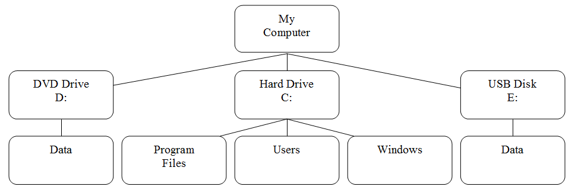

Igual que Windows, la estructura de directorios de Linux tiene un nivel superior, sin embargo no se llama Este Equipo, sino directorio raíz y su símbolo es el carácter */*. También, en Linux no hay unidades; cada dispositivo físico es accesible bajo un directorio, no una letra de unidad. Una representación visual de una estructura de directorios típica de Linux:

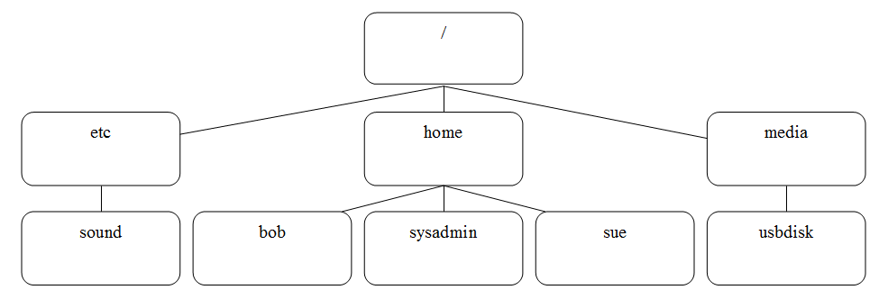

La mayoría de los usuarios de Linux denominan esta estructura de directorios el sistema de archivos.

Para ver el sistema de archivos raíz, introduce `ls /`:

```bash
sysadmin@localhost:~$ ls /
bin   dev  home  lib    media  opt   root  sbin     selinux  sys  usr
boot  etc  init  lib64  mnt    proc  run   sbin???  srv   tmp  var
```

Observa que hay muchos directorios descriptivos incluyendo */boot*, que contiene los archivos para arrancar la computadora.

## 6.2.1 El Directorio Path

Usando el gráfico en la sección anterior como un punto de referencia, verás que hay un directorio llamado *sound* bajo el directorio llamado etc, que se encuentra bajo el directorio */*. Una manera más fácil de decir esto es refiriéndose a *la ruta*.

**Para considerar:**

El directorio */etc* originalmente significaba "etcetera" en la documentación temprana de Bell Labs y solía contener archivos que no pertenecían a ninguna ubicación. En las distribuciones modernas de Linux, el directorio */etc* por lo general contiene los archivos de configuración estática como lo define por el Estándar de Jerarquía de Archivos (o «FHS», del inglés «Files Hierarchy Standard»).

Una ruta de acceso te permite especificar la ubicación exacta de un directorio. Para el directorio *sound* la ruta de acceso sería */etc/sound*. El primer carácter */* representa el directorio *root* (o «raíz» en español), mientras que cada siguiente carácter */* se utiliza para separar los nombres de directorio.

Este tipo de ruta se llama la *ruta absoluta* (o «aboslute path» en inglés). Con una ruta absoluta, siempre proporcionas direcciones a un directorio (o un archivo) a partir de la parte superior de la estructura de directorios, el directorio *root*. Más adelante en este capítulo cubriremos un tipo diferente de la ruta llamada la ***ruta relativa*** (o «relative path» en inglés).

**Nota**: Las estructuras de directorio que se muestran a continuación sirven solamente como ejemplos. Estos directorios pueden no estar presentes dentro del entorno de la máquina virtual de este curso.
La siguiente gráfica muestra tres rutas absolutas adicionales:

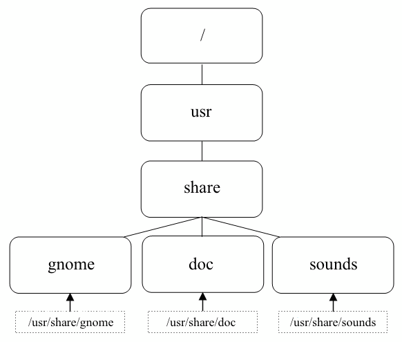

## 6.2.2 El Directorio Home

El término ***home directory*** (o «directorio de inicio» en español) a menudo causa confusión a los usuarios principiantes de Linux. Para empezar, en la mayoría de las distribuciones de Linux hay un directorio llamado home bajo el directorio *root: /home*.

Bajo de este directorio */home* hay un directorio para cada usuario del sistema. El nombre del directorio será el mismo que el nombre del usuario, por lo que un usuario llamado «bob» tendría un directorio home llamado */home/bob*.

Tu directorio home es un directorio muy importante. Para empezar, cuando abres un shell automáticamente te ubicarás en tu directorio home, en donde harás la mayor parte de tu trabajo.

Además, el directorio home es uno de los pocos directorios donde tienes el control total para crear y eliminar los archivos adicionales. La mayor parte de otros directorios en un sistema de archivos de Linux están protegidos con file permissions (o «permisos de archivos» en español), un tema que se tratará a detalle en un capítulo posterior.

En la mayoría de las distribuciones de Linux, los únicos usuarios que pueden acceder a los archivos en tu directorio home eres tú y el administrador del sistema (el usuario root). Esto se puede cambiar utilizando los permisos de archivo.

Tu directorio tiene incluso un símbolo especial que puedes usar para representarlo: *~*. Si tu directorio home es /home/sysadmin, puedes simplemente introducir *~* en la línea de comandos en lugar de */home/sysadmin*. También puedes referirte al directorio home de otro usuario usando la notación *~usuario*, donde *usuario* es el nombre de la cuenta de usuario cuyo directorio home quieres consultar. Por ejemplo, *~bob* sería igual a */home/bob*. Aquí, vamos a cambiar al directorio home del usuario:

```bash
sysadmin@localhost:~$ cd ~
sysadmin@localhost:~$ ls
Desktop  Documents  Downloads  Music  Pictures  Public  Templates
Videos
sysadmin@localhost:~$
```

Ten en cuenta que una lista revela los subdirectorios contenidos en el directorio home. Cambiar directorios requiere atención al detalle:

```bash
sysadmin@localhost:~$ cd downloads
-bash: cd: downloads: No such file or directory
sysadmin@localhost:~$
```

¿Por qué el anterior comando resultó en un error? Eso es porque los entornos de Linux son sensibles a mayúsculas y minúsculas. Cambiarnos al directorio Downloads requiere que la ortografía sea correcta *-* incluyendo la letra *D* mayúscula:

```bash
sysadmin@localhost:~$ cd Downloads
sysadmin@localhost:~/Downloads$
```

## 6.2.3 Directorio Actual

Tu *directorio actual* es el directorio donde estás trabajando actualmente en una terminal. Cuando primero abres una terminal, el directorio actual debe ser tu directorio home, pero esto puede cambiar mientras vas explorando el sistema de archivos y cambias a otros directorios.

Mientras estás en un entorno de línea de comandos, puedes determinar el directorio actual mediante el comando `pwd`:

```bash
sysadmin@localhost:~$ pwd 
/home/sysadmin                      
sysadmin@localhost:~$
```

Adicionalmente, la mayoría de los sistemas tiene el prompt que visualiza el directorio actual del usuario por defecto:

`[sysadmin@localhost ~]$`

En el gráfico anterior, el carácter *~* indica el directorio actual. Como se mencionó anteriormente, el carácter *~* representa el directorio home.

Normalmente el sistema sólo muestra el nombre del directorio actual, no la ruta completa del directorio raíz hacia abajo. En otras palabras, si estuvieras en el directorio */usr/share/doc*, tu prompt probablemente te proporcionará solamente el nombre doc el directorio actual. Si quieres la ruta completa, utiliza el comando pwd.

## 6.2.4 Cambio de Directorios

Si te quieres cambiar a un directorio diferente, utiliza el comando `cd` (cambiar directorio). Por ejemplo, el siguiente comando cambiará el directorio actual a un directorio llamado */etc/sound/events*:

```bash
sysadmin@localhost:~$ cd /etc/sound/events
sysadmin@localhost:/etc/sound/events$
```

Ten en cuenta que no vas a obtener salida si el comando `cd` tiene éxito. Este caso es uno de los de "ninguna noticia es buena noticia". Si tratas de cambiar a un directorio que no existe, recibirás un mensaje de error:

```bash
sysadmin@localhost:/etc/sound/events$ cd /etc/junk
-bash: cd: /etc/junk: No such file or directory
sysadmin@localhost:/etc/sound/events$
```

Si quieres volver a tu directorio home, puedes introducir el comando cd sin argumentos o usar el comando `cd` con el carácter ~ como argumento:

```bash
sysadmin@localhost:/etc/sound/events$ cd
sysadmin@localhost:~$ pwd             
/home/sysadmin
sysadmin@localhost:~$ cd /etc        
sysadmin@localhost:/etc$ cd ~       
sysadmin@localhost:~$ pwd           
/home/sysadmin
sysadmin@localhost:~$
```

## 6.2.5 Nombres de Ruta Absoluta versus Relativa

Hay que recordar que una ruta de acceso es esencialmente una descripción de la ubicación de un archivo o un directorio en el sistema de archivos. Una ruta de acceso también se puede entender como las direcciones que indican al sistema donde se encuentra un archivo o un directorio. Por ejemplo, el comando `cd /etc/perl/Net` significa "cambiar al directorio *Net*, que encontrarás bajo el directorio *perl*, que encontrarás bajo el directorio *etc*, que encontrarás bajo el directorio */*".

Cuando des un nombre de ruta que comienza en el directorio raíz, se llamará ruta absoluta. En muchos casos, proporcionar una ruta de acceso absoluta tiene sentido. Por ejemplo, si estás en tu directorio home y quieres ir al directorio */etc/perl/Net*, entonces proporcionar una ruta de acceso absoluta al comando `cd` tiene sentido:

```bash
sysadmin@localhost:~$ cd /etc/perl/Net
sysadmin@localhost:/etc/perl/Net$
```

Sin embargo, ¿Qué pasa si estás en el directorio */etc/perl* y quieres ir al directorio */etc/perl/Net*? Sería tedioso introducir la ruta completa para llegar a un directorio que es sólo un nivel más abajo de tu ubicación actual. En una situación como ésta, vas a utilizar una **ruta relativa**:

```bash
sysadmin@localhost:/etc/perl$ cd Net
sysadmin@localhost:/etc/perl/Net$
```

Una ruta de acceso relativa proporciona direcciones usando tu **ubicación actual** como un punto de referencia. Recuerda que esto es diferente de las rutas absolutas, que siempre requieren que utilices el **directorio raíz** como punto de referencia.

Existe una técnica útil de ruta de acceso relativa que se puede utilizar para subir un nivel en la estructura de directorios: el directorio .. . Sin importar en qué directorio estás, el comando .. siempre representa un directorio arriba que el directorio actual (con la excepción de cuando estás en el directorio /):

```bash
sysadmin@localhost:/etc/perl/Net$ pwd
/etc/perl/Net               
sysadmin@localhost:/etc/perl/Net$ cd ..
sysadmin@localhost:/etc/perl$ pwd
/etc/perl                      
sysadmin@localhost:/etc/perl$
```
A veces usar las rutas de acceso relativas es una mejor opción que rutas de acceso absolutas, sin embargo esto no siempre es el caso. ¿Qué pasa si estás en el directorio */etc/perl/Net* y quieres ir al directorio */usr/share/doc*? Utilizando una ruta absoluta, se ejecutaría el comando `cd /usr/share/doc`. Utilizando una ruta relativa, se ejecutaría el comando `cd ../../../usr/share/doc`:

```bash
sysadmin@localhost:/etc/perl/Net$ cd
sysadmin@localhost:~$ cd /etc/perl/Net
sysadmin@localhost:/etc/perl/Net$ cd ../../../usr/share/doc
sysadmin@localhost:/usr/share/doc$ pwd 
/usr/share/doc                
sysadmin@localhost:/usr/share/doc$
```

Nota: Las rutas relativas y absolutas no sólo sirven para el comando `cd`. Siempre cuando especificas un archivo o un directorio, puedes utilizar las rutas de acceso relativas o absolutas.

Mientras que el doble punto (..) se utiliza para referirse al directorio arriba del directorio actual, el punto solo (.) se usa para referirse al directorio actual. No tendría sentido para un administrador moverse al directorio actual introduciendo `cd .` (aunque en realidad funciona). Es más útil referirse a un elemento en el directorio actual usando la notación `./`. Por ejemplo:

```bash
sysadmin@localhost:~$ pwd
/home/sysadmin
sysadmin@localhost:~$ cd ./Downloads/
sysadmin@localhost:~/Downloads$ pwd
/home/sysadmin/Downloads
sysadmin@localhost:~/Downloads$ cd ..
sysadmin@localhost:~$ pwd
/home/sysadmin
sysadmin@localhost:~$
```
Nota: Este uso del punto solo (.), como punto de referencia, no se debe confundir con su uso al principio de un nombre de archivo. Leer más sobre los archivos ocultos en la sección 6.4.2.

## 6.3 Listado de los Archivos en un Directorio

Ahora que te puedes mover de un directorio a otro, querrás visualizar el contenido de estos directorios. El comando `ls` (`ls` es la abreviatura para listar) puede utilizarse para mostrar el contenido de un directorio, así como toda la información sobre los archivos que están dentro de un directorio.

Por sí mismo, el comando `ls` listará los archivos en el directorio actual:

```bash
sysadmin@localhost:~$ ls     
Desktop  Documents  Downloads  Music  Pictures  Public  Templates  
Videos      
sysadmin@localhost:~$
```

## 6.3.1 Lista de Colores

Hay muchos tipos de archivos en Linux. Según vayas aprendiendo más sobre Linux, descubrirás muchos de estos tipos. A continuación tenemos un breve resumen de algunos de los tipos de archivo más comunes:

| Tipo | Descripción |
|---|---|
| plain file (o «archivo simple» en español) | Un archivo que no es un tipo de archivo especial; también se llama un archivo normal |
| directory (o «directorio» en español) | Un directorio de archivos (contiene otros archivos) |
| executable (o «ejecutable» en español) | Un archivo que se puede ejecutar como un programa |
| symbolic link | Un archivo que apunta a otro archivo (o «enlace simbólico» en español) |

En muchas distribuciones de Linux, las cuentas de usuario regulares son modificadas de tal manera que el comando `ls` muestre los nombres de archivo, codificados por colores según el tipo de archivo. Por ejemplo, los directorios pueden aparecer en azul, archivos ejecutables pueden verse en verde, y enlaces simbólicos pueden ser visualizados en cian (azul claro).

Esto no es un comportamiento normal para el comando `ls`, sino algo que sucede cuando se utiliza la opción `--color` para el comando `ls`. La razón por la que el comando `ls` parece realizar automáticamente estos colores, es que hay un alias para el comando ls para que se ejecute con la opción `--color`:

```bash
sysadmin@localhost:~$ alias     
alias egrep='egrep --color=auto'             
alias fgrep='fgrep --color=auto'         
alias grep='grep --color=auto'        
alias l='ls -CF'                                                    
alias la='ls -A'              
alias ll='ls -alF'
alias ls='ls --color=auto'
sysadmin@localhost:~$
```

Como puedes ver en la salida anterior, cuando se ejecuta el comando `ls`, en realidad se ejecuta el comando `ls --color=auto`.

En algunos casos, puede que no quieras ver todos los colores (a veces te pueden distraer un poco). Para evitar el uso de los alias, coloca un carácter de barra invertida *\* antes de tu comando:

```bash
sysadmin@localhost:~$ ls
Desktop  Documents  Downloads  Music  Pictures  Public  Templates  
Videos       
sysadmin@localhost:~$ \ls
Desktop  Documents  Downloads  Music  Pictures  Public  Templates  
Videos       
sysadmin@localhost:~$
```

## 6.3.2 Lista de los Archivos Ocultos

Cuando utilizas el comando `ls` para mostrar el contenido de un directorio, no todos los archivos se muestran automáticamente. El comando `ls` no muestra los *archivos ocultos* de manera predeterminada. Un archivo oculto es cualquier archivo (o directorio) que comienza con un punto `.`.

Para mostrar todos los archivos, incluyendo los archivos ocultos, utiliza la opción `-a` para el comando `ls`:

```bash
sysadmin@localhost:~$ ls -a                                            
.             .bashrc   .selected_editor  Downloads  Public           
..            .cache    Desktop           Music      Templates         
.bash_logout  .profile  Documents         Pictures   Videos
```

¿Por qué los archivos están ocultos en primer lugar? La mayoría de los archivos ocultos son ***archivos de personalización***, diseñados para personalizar la forma en la que Linux, el shell o los programas funcionan. Por ejemplo, el archivo `.bashrc` en tu directorio home personaliza las características del shell, tales como la creación o modificación de las variables y los alias.

Estos archivos de personalización no son con los que regularmente trabajas. Hay muchos de ellos, como puedes ver, y visualizarlos hará más difícil encontrar los archivos con los que regularmente trabajas. Así que, el hecho de que están ocultos es para tu beneficio.

## 6.3.3 Listado con Visualización Larga

Existe información sobre cada archivo, llamada metadata (o «metadatos» en español), y visualizarla a veces resulta útil. Esto puede incluir datos de quién es el dueño de un archivo, el tamaño de un archivo y la última vez que se modificó el contenido de un archivo. Puedes visualizar esta información mediante el uso de la opción `-l` para el comando `ls`:

```bash
sysadmin@localhost:~$ ls -l
total 0                
drwxr-xr-x 1 sysadmin sysadmin 0 Jan 29  2015 Desktop
drwxr-xr-x 1 sysadmin sysadmin 0 Jan 29  2015 Documents
drwxr-xr-x 1 sysadmin sysadmin 0 Jan 29  2015 Downloads
drwxr-xr-x 1 sysadmin sysadmin 0 Jan 29  2015 Music
drwxr-xr-x 1 sysadmin sysadmin 0 Jan 29  2015 Pictures
drwxr-xr-x 1 sysadmin sysadmin 0 Jan 29  2015 Public
drwxr-xr-x 1 sysadmin sysadmin 0 Jan 29  2015 Templates
drwxr-xr-x 1 sysadmin sysadmin 0 Jan 29  2015 Videos
sysadmin@localhost:~$
```

En la salida anterior, cada línea describe metadatos sobre un solo archivo. A continuación se describe cada uno de los campos de datos que verás en la salida del comando `ls -l`:

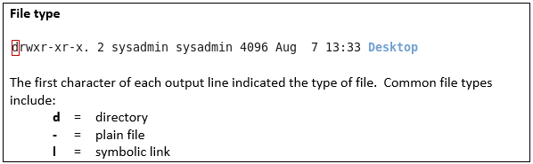

«**Tipo de archivo**. El primer carácter de cada línea de salida indica el tipo de archivo. Tipos de archivo comunes incluyen: d= directorio, -= archivo simple, l= enlace simbólico»

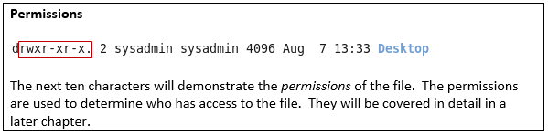

«**Permisos**. Los próximos diez caracteres demostrarán los permisos del archivo. Los permisos se utilizan para determinar quién tiene acceso al archivo. Esto será cubierto a detalle en un capítulo posterior.»

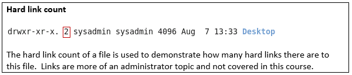

«**Conteo de enlaces físicos**. El conteo de enlaces físicos de un archivo se usa para demostrar cuantos enlaces físicos hacia este archivo existen. Los enlaces son más que nada un tema de administrador por lo que no son cubiertos en este curso.»


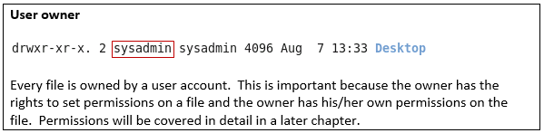

«**Usuario propietario**. Cada archivo es propiedad de una cuenta de usuario. Esto es importante porque el propietario tiene los derechos para establecer permisos en un archivo y el propietario tiene sus propios permisos en el archivo. Los permisos se cubrirán a detalle en un capítulo posterior.»

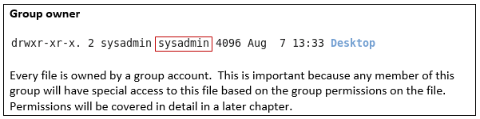

«**Grupo propietario**. Cada archivo es propiedad de un grupo. Esto es importante porque cualquier miembro de este grupo tendrá acceso especial al archivo basado en los permisos de grupo del archivo. Los permisos se cubrirán a detalle en un capítulo posterior.»

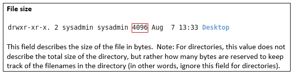

«**Tamaño de archivo**. Este campo describe el tamaño de un archivo en bytes. Nota: En el caso de los directorios, este valor no describe el tamaño total del directorio, más bien, cuántos bytes están reservados para mantenerse al corriente con los nombres de archivo en el directorio (en otras palabras, ignora este campo en los directorios).»

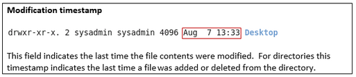

«**Hora de modificación**. Este campo indica la última hora en la que el contenido del archivo fue modificado. En el caso de los directorios, indica la última vez que se agregó o eliminó un archivo dentro del directorio.»

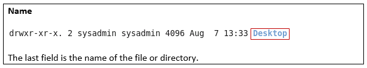

«**Nombre**. El último campo es el nombre del archivo o directorio.»

## 6.3.3.1 Tamaños Legibles

Cuando visualizas los tamaños de los archivos con la opción `-l` del comando `ls` obtienes los tamaños de los archivo en bytes. Para archivos de texto, un byte es 1 carácter.

Para archivos más pequeños, los tamaños en byte están bien. Sin embargo, para los archivos más grandes es difícil comprender qué tan grande es el archivo. Por ejemplo, considera la salida del siguiente comando:

```bash
sysadmin@localhost:~$ ls -l /usr/bin/omshell                                 
-rwxr-xr-c 1 root root 1561400 Oct 9 2012 /usr/bin/omshell              
sysadmin@localhost:~$
```

Como puedes ver, es difícil de determinar el tamaño del archivo en bytes. ¿Un archivo 1561400 es grande o pequeño? Parece bastante grande, pero es difícil de determinar su tamaño utilizando los bytes.

Piénsalo de esta manera: si alguien diera la distancia entre Boston y Nueva York utilizando centímetros, ese valor esencialmente no tendría sentido porque una distancia como ésta la piensas en términos de kilómetros.

Sería mejor si el tamaño del archivo fuese presentado en un tamaño más fácilmente legible, tal como megabytes o gigabytes. Para lograr esto, añade la opción `-h` al comando `ls`:

```bash
sysadmin@localhost:~$ ls -lh /usr/bin/omshell                                 
-rwxr-xr-c 1 root root 1.5M Oct 9 2012 /usr/bin/omshell              
sysadmin@localhost:~$
```

Importante: Debes utilizar la opción `-h` junto con la opción `-l`.

## 6.3.4 Lista de Directorios

Cuando se utiliza el comando `ls -d`, se refiere al directorio actual y no al contenido dentro de él. Sin otras opciones, es algo sin sentido, aunque es importante tener en cuenta que al directorio actual siempre se refiere con un solo punto (.):

```bash
sysadmin@localhost:~$ ls -d    
.
```

Para utilizar el comando `ls -d` de una manera significativa tienes que añadir la opción `-l`. En este caso, ten en cuenta que el primer comando muestra los detalles de los contenidos en el directorio */home/sysadmi*n, mientras que el segundo lista el directorio */home/sysadmin*.

```bash
sysadmin@localhost:~$ ls -l
total 0          
drwxr-xr-x 1 sysadmin sysadmin   0 Apr 15  2015 Desktop
drwxr-xr-x 1 sysadmin sysadmin   0 Apr 15  2015 Documents
drwxr-xr-x 1 sysadmin sysadmin   0 Apr 15  2015 Downloads
drwxr-xr-x 1 sysadmin sysadmin   0 Apr 15  2015 Music
drwxr-xr-x 1 sysadmin sysadmin   0 Apr 15  2015 Pictures
drwxr-xr-x 1 sysadmin sysadmin   0 Apr 15  2015 Public
drwxr-xr-x 1 sysadmin sysadmin   0 Apr 15  2015 Templates
drwxr-xr-x 1 sysadmin sysadmin   0 Apr 15  2015 Videos
drwxr-xr-x 1 sysadmin sysadmin 420 Apr 15  2015 test
sysadmin@localhost:~$ ls -ld
drwxr-xr-x 1 sysadmin sysadmin 224 Nov  7 17:07 .
sysadmin@localhost:~$
```
Observa el punto solo al final de la segunda lista larga. Esto indica que el directorio actual está en la lista y no el contenido.

## 6.3.5 Listado Recursivo

Habrá momentos cuando quieras visualizar todos los archivos en un directorio, así como todos los archivos en todos los subdirectorios bajo un directorio. Esto se llama *listado recursivo*.

Para realizar un listado recursivo, utiliza la opción `-R` para el comando `ls`:

**Nota**: La salida que se muestra a continuación variará de los resultados que verás si ejecutas el comando en el entorno de la máquina virtual de este curso.

```bash
sysadmin@localhost:~$ ls -R /etc/ppp
/etc/ppp:                      
chap-secrets   ip-down.ipv6to4    ip-up.ipv6to4    ipv6-up    pap-secrets
ip-down        ip-up              ipv6-down        options    peers

/etc/ppp/peers:
sysadmin@localhost:~$
```
Ten en cuenta que en el ejemplo anterior, los archivos en el directorio */etc/ppp* se listaron primero. Después de eso, se listan los archivos en el directorio */etc/ppp/peers* (no hubo ningún archivo en este caso, pero si hubiera encontrado cualquier archivo en este directorio, se habría visualizado).

Ten cuidado con esta opción; por ejemplo, ejecutando el comando `ls -R /` se listarían todos los archivos del sistema de archivos, incluyendo todos los archivos de cualquier dispositivo USB y DVD en el sistema. Limita el uso de la opción `-R` para estructuras de directorio más pequeñas.

## 6.3.6 Ordenar un Listado

De forma predeterminada, el comando `ls` ordena los archivos alfabéticamente por nombre de archivo. A veces, puede ser útil ordenar los archivos utilizando diferentes criterios.

Para ordenar los archivos por tamaño, podemos utilizar la opción `-S`. Observa la diferencia en la salida de los dos siguientes comandos:

```bash
sysadmin@localhost:~$ ls /etc/ssh                               
moduli           ssh_host_dsa_key.pub    ssh_host_rsa_key     sshd_confi
ssh_config        ssh_host_ecdsa_key      ssh_host_rsa_key.pub
ssh_host_dsa_key  ssh_host_ecdsa_key.pub  ssh_import_id
sysadmin@localhost:~$ ls -S /etc/ssh
moduli            ssh_host_dsa_key      ssh_host_ecdsa_key
sshd_config       ssh_host_dsa_key.pub  ssh_host_ecdsa_key.pub
ssh_host_rsa_key  ssh_host_rsa_key.pub
ssh_config        ssh_import_id               
sysadmin@localhost:~$
```
Aparecen los mismos archivos y directorios, pero en un orden diferente. Mientras que la opción `-S` trabaja por sí misma, realmente no puedes decir que la salida está ordenada por tamaño, por lo que es más útil cuando se utiliza con la opción `-l`. El siguiente comando listará los archivos del mayor al menor y mostrará el tamaño real del archivo.

```bash
sysadmin@localhost:~$ ls -lS /etc/ssh
total 160                    
-rw-r--r-- 1 root root 125749 Apr 29  2014 moduli
-rw-r--r-- 1 root root   2489 Jan 29  2015 sshd_config
-rw------- 1 root root   1675 Jan 29  2015 ssh_host_rsa_key
-rw-r--r-- 1 root root   1669 Apr 29  2014 ssh_config
-rw------- 1 root root    668 Jan 29  2015 ssh_host_dsa_key
-rw-r--r-- 1 root root    607 Jan 29  2015 ssh_host_dsa_key.pub
-rw-r--r-- 1 root root    399 Jan 29  2015 ssh_host_rsa_key.pub
-rw-r--r-- 1 root root    302 Jan 10  2011 ssh_import_id
-rw------- 1 root root    227 Jan 29  2015 ssh_host_ecdsa_key
-rw-r--r-- 1 root root    179 Jan 29  2015 ssh_host_ecdsa_key.pub
sysadmin@localhost:~$
```

También puede ser útil usar la opción `-h` para mostrar los tamaños de los archivos de una manera legible:

```bash
sysadmin@localhost:~$ ls -lSh /etc/ssh
total 160K            
-rw-r--r-- 1 root root 123K Apr 29  2014 moduli
-rw-r--r-- 1 root root 2.5K Jan 29  2015 sshd_config
-rw------- 1 root root 1.7K Jan 29  2015 ssh_host_rsa_key
-rw-r--r-- 1 root root 1.7K Apr 29  2014 ssh_config
-rw------- 1 root root  668 Jan 29  2015 ssh_host_dsa_key
-rw-r--r-- 1 root root  607 Jan 29  2015 ssh_host_dsa_key.pub
-rw-r--r-- 1 root root  399 Jan 29  2015 ssh_host_rsa_key.pub
-rw-r--r-- 1 root root  302 Jan 10  2011 ssh_import_id           
-rw------- 1 root root  227 Jan 29  2015 ssh_host_ecdsa_key
-rw-r--r-- 1 root root  179 Jan 29  2015 ssh_host_ecdsa_key.pub
sysadmin@localhost:~$
```
También es posible ordenar los archivos según el momento en que se modificaron. Puedes hacer esto mediante la opción `-t`.

La opción -t listará los archivos modificados más recientemente en primer lugar. Esta opción puede utilizarse sola, pero otra vez, es generalmente más útil cuando se combina con la opción `-l`:

```bash
sysadmin@localhost:~$ ls -tl /etc/ssh
total 160                 
-rw------- 1 root root    668 Jan 29  2015 ssh_host_dsa_key
-rw-r--r-- 1 root root    607 Jan 29  2015 ssh_host_dsa_key.pub
-rw------- 1 root root    227 Jan 29  2015 ssh_host_ecdsa_key
-rw-r--r-- 1 root root    179 Jan 29  2015 ssh_host_ecdsa_key.pub
-rw------- 1 root root   1675 Jan 29  2015 ssh_host_rsa_key
-rw-r--r-- 1 root root    399 Jan 29  2015 ssh_host_rsa_key.pub
-rw-r--r-- 1 root root   2489 Jan 29  2015 sshd_config
-rw-r--r-- 1 root root 125749 Apr 29  2014 moduli
-rw-r--r-- 1 root root   1669 Apr 29  2014 ssh_config
-rw-r--r-- 1 root root    302 Jan 10  2011 ssh_import_id
sysadmin@localhost:~$
```

Es importante recordar que la fecha de modificación de los directorios representa la última vez que un archivo se agrega o se elimina del directorio.

Si los archivos en un directorio se modificaron hace muchos días o meses, puede ser más difícil de decir exactamente cuándo fueron modificados, ya que para los archivos más antiguos sólamente se proporciona la fecha. Para una información más detallada de la hora de modificación puedes utilizar la opción `--full time` que visualiza la fecha y la hora completas (incluyendo horas, segundos, minutos...):

```bash
sysadmin@localhost:~$ ls -t --full-time /etc/ssh
total 160              
-rw------- 1 root root    668 2015-01-29 03:17:33.000000000 +0000 ssh_host_dsa_key
-rw-r--r-- 1 root root    607 2015-01-29 03:17:33.000000000 +0000 ssh_host_dsa_key.pub                           
-rw------- 1 root root    227 2015-01-29 03:17:33.000000000 +0000 ssh_host_ecdsa_key
-rw-r--r-- 1 root root    179 2015-01-29 03:17:33.000000000 +0000 ssh_host_ecdsa_key.pub        
-rw------- 1 root root   1675 2015-01-29 03:17:33.000000000 +0000 ssh_host_rsa_key
-rw-r--r-- 1 root root    399 2015-01-29 03:17:33.000000000 +0000 ssh_host_rsa_key.pub              
-rw-r--r-- 1 root root   2489 2015-01-29 03:17:33.000000000 +0000 sshd_config
-rw-r--r-- 1 root root 125749 2014-04-29 23:58:51.000000000 +0000 moduli-rw-r--r-- 1 root root   1669 2014-04-29 23:58:51.000000000 +0000 ssh_config
-rw-r--r-- 1 root root    302 2011-01-10 18:48:29.000000000 +0000 ssh_import_id
sysadmin@localhost:~$
```

La opción `--full-time` asumirá automáticamente la opción `-l`.

Es posible realizar una ordenación inversa con las opciones `-S` o `-t` mediante la opción -r. El siguiente comando ordena los archivos por tamaño, de menor a mayor:

```bash
sysadmin@localhost:~$ ls -lrS /etc/ssh
total 160                        
-rw-r--r-- 1 root root    179 Jan 29  2015 ssh_host_ecdsa_key.pub
-rw------- 1 root root    227 Jan 29  2015 ssh_host_ecdsa_key
-rw-r--r-- 1 root root    302 Jan 10  2011 ssh_import_id
-rw-r--r-- 1 root root    399 Jan 29  2015 ssh_host_rsa_key.pub
-rw-r--r-- 1 root root    607 Jan 29  2015 ssh_host_dsa_key.pub
-rw------- 1 root root    668 Jan 29  2015 ssh_host_dsa_key
-rw-r--r-- 1 root root   1669 Apr 29  2014 ssh_config
-rw------- 1 root root   1675 Jan 29  2015 ssh_host_rsa_key
-rw-r--r-- 1 root root   2489 Jan 29  2015 sshd_config
-rw-r--r-- 1 root root 125749 Apr 29  2014 moduli
sysadmin@localhost:~$
```

El siguiente comando listará los archivos por fecha de modificación, de la más antigua a la más reciente:

```bash
sysadmin@localhost:~$ ls -lrt /etc/ssh
total 160                       
-rw-r--r-- 1 root root    302 Jan 10  2011 ssh_import_id
-rw-r--r-- 1 root root   1669 Apr 29  2014 ssh_config
-rw-r--r-- 1 root root 125749 Apr 29  2014 moduli
-rw-r--r-- 1 root root   2489 Jan 29  2015 sshd_config
-rw-r--r-- 1 root root    399 Jan 29  2015 ssh_host_rsa_key.pub
-rw------- 1 root root   1675 Jan 29  2015 ssh_host_rsa_key
-rw-r--r-- 1 root root    179 Jan 29  2015 ssh_host_ecdsa_key.pub 
-rw------- 1 root root    227 Jan 29  2015 ssh_host_ecdsa_key
-rw-r--r-- 1 root root    607 Jan 29  2015 ssh_host_dsa_key.pub
-rw------- 1 root root    668 Jan 29  2015 ssh_host_dsa_key
sysadmin@localhost:~$
```

## 6.3.7 Listado con Globs

En un capítulo anterior, vimos el uso de los globs para los archivos para buscar coincidencias de los nombres de archivo utilizando los caracteres comodín. Por ejemplo, hemos visto que puedes listar todos los archivos en el directorio */etc* que comienzan con la letra *e* utilizando el siguiente comando:

```bash
sysadmin@localhost:~$ echo /etc/e*  
/etc/encript.cfg /etc/environment /etc/ethers /etc/event.d /etc/exports
sysadmin@localhost:~$
```
Ahora que sabes que el comando `ls` se utiliza normalmente para listar los archivos en un directorio, el uso del comando `echo` puede parecer una elección extraña. Sin embargo, hay algo sobre el comando `ls` que pudo haber causado confusión mientras hablamos sobre los globs. Esta «función» también puede causar problemas cuando intentas listar los archivos utilizando los patrones glob.

Ten en cuenta que es el shell, no los comandos `echo` o `ls`, el que expande el patrón glob a los nombres de archivo correspondientes. En otras palabras, cuando introduces el comando `echo /etc/e*`, lo que el shell hizo **antes** de ejecutar el comando `echo` fue reemplazar el *e** por todos los archivos y directorios dentro del directorio */etc* que coinciden con el patrón.

Por lo tanto, si ejecutaras el comando `ls /etc/e*`, lo que el shell realmente haría, sería lo siguiente:

`ls /etc/encript.cfg /etc/environment /etc/ethers /etc/event.d /etc/exports`

Cuando el comando `ls` ve varios argumentos, realiza una operación de listado en cada elemento por separado. En otras palabras, el comando `ls /etc/encript.cfg /etc/environment` es esencialmente igual a `ls /etc/encript.cfg; ls /etc/environment`.

Ahora considera lo que sucede cuando se ejecuta el comando `ls` en un archivo, tal como *encript.cfg*:

```bash
sysadmin@localhost:~$ ls /etc/enscript.cfg
/etc/enscript.cfg
sysadmin@localhost:~$
```

Como puedes ver, ejecutando el comando `ls` en un solo archivo se imprime el nombre del archivo. Generalmente esto es útil si quieres ver los detalles acerca de un archivo mediante la opción `-l` del comando `ls`:

```bash
sysadmin@localhost:~$ ls -l /etc/enscript.cfg
-r--r--r--. 1 root root 4843 Nov 11 2010 /etc/enscript.cfg
sysadmin@localhost:~$
```

Sin embargo, ¿Qué ocurre si el comando `ls` recibe un nombre de directorio como un argumento? En este caso, la salida del comando es diferente a que si el argumento es un nombre de archivo:

```bash
sysadmin@localhost:~$ ls /etc/event.d
ck-log-system-restart  ck-log-system-start  ck-log-system-stop
sysadmin@localhost:~$
```

Si proporcionas un nombre de directorio como argumento del comando `ls`, el comando mostrará el contenido del directorio (los nombres de los archivos en el directorio), y no sólo proporcionará el nombre del directorio. Los nombres de los archivos, que se ven en el ejemplo anterior, son los nombres de los archivos en el directorio */etc/event.d*.

¿Por qué ésto es un problema al utilizar los globs? Considera el siguiente resultado:

```bash
sysadmin@localhost:~$ ls /etc/e*
/etc/encript.cfg /etc/environment /etc/ethers /etc/event.d /etc/exports
/etc/event.d:
ck-log-system-restart  ck-log-system-start  ck-log-system-stop
sysadmin@localhost:~$
```

Como puedes ver, cuando el comando `ls` ve un nombre de archivo como argumento, sólo muestra el nombre del archivo. Sin embargo, para cualquier directorio, mostrará el contenido del directorio, y no sólo el nombre del directorio.

Esto se vuelve aún más confuso en una situación como la siguiente:

```bash
sysadmin@localhost:~$ ls /etc/ev*
ck-log-system-restart  ck-log-system-start  ck-log-system-stop
sysadmin@localhost:~$
```

En el ejemplo anterior, parece que el comando `ls` es simplemente incorrecto. Pero lo que realmente sucedió es que lo único que coincide con el glob *etc/ev ** es el directorio */etc/event.d*. Por lo tanto, el comando `ls` muestra sólo los archivos en ese directorio.

Hay una solución simple a este problema: al utilizar los argumentos glob con el comando `ls`, utiliza siempre la opción `-d`. Cuando utilizas la opción `-d`, el comando `ls` no muestra el contenido de un directorio, sino más bien el nombre del directorio:

```bash
sysadmin@localhost:~$ ls -d /etc/e*
/etc/encript.cfg /etc/environment /etc/ethers /etc/event.d /etc/exports
sysadmin@localhost:~$
```

## 6.3.7 Listado con Globs

En un capítulo anterior, vimos el uso de los globs para los archivos para buscar coincidencias de los nombres de archivo utilizando los caracteres comodín. Por ejemplo, hemos visto que puedes listar todos los archivos en el directorio /etc que comienzan con la letra e utilizando el siguiente comando:

```bash
sysadmin@localhost:~$ echo /etc/e*
/etc/encript.cfg /etc/environment /etc/ethers /etc/event.d /etc/exports
sysadmin@localhost:~$
```

Ahora que sabes que el comando `ls` se utiliza normalmente para listar los archivos en un directorio, el uso del comando `echo` puede parecer una elección extraña. Sin embargo, hay algo sobre el comando `ls` que pudo haber causado confusión mientras hablamos sobre los globs. Esta «función» también puede causar problemas cuando intentas listar los archivos utilizando los patrones glob.

Ten en cuenta que es el shell, no los comandos `echo` o `ls`, el que expande el patrón glob a los nombres de archivo correspondientes. En otras palabras, cuando introduces el comando `echo /etc/e*`, lo que el shell hizo antes de ejecutar el comando `echo` fue reemplazar el *e** por todos los archivos y directorios dentro del directorio */etc* que coinciden con el patrón.

Por lo tanto, si ejecutaras el comando `ls /etc/e*`, lo que el shell realmente haría, sería lo siguiente:

`ls /etc/encript.cfg /etc/environment /etc/ethers /etc/event.d /etc/exports`

Cuando el comando `ls` ve varios argumentos, realiza una operación de listado en cada elemento por separado. En otras palabras, el comando `ls /etc/encript.cfg /etc/environment` es esencialmente igual a `ls /etc/encript.cfg; ls /etc/environment`.

Ahora considera lo que sucede cuando se ejecuta el comando `ls` en un archivo, tal como *encript.cfg*:

```bash
sysadmin@localhost:~$ ls /etc/enscript.cfg
/etc/enscript.cfg        
sysadmin@localhost:~$
```

Como puedes ver, ejecutando el comando `ls` en un solo archivo se imprime el nombre del archivo. Generalmente esto es útil si quieres ver los detalles acerca de un archivo mediante la opción `-l` del comando `ls`:

```bash
sysadmin@localhost:~$ ls -l /etc/enscript.cfg
-r--r--r--. 1 root root 4843 Nov 11 2010 /etc/enscript.cfg      
sysadmin@localhost:~$
```

Sin embargo, ¿Qué ocurre si el comando `ls` recibe un nombre de directorio como un argumento? En este caso, la salida del comando es diferente a que si el argumento es un nombre de archivo:

```bash
sysadmin@localhost:~$ ls /etc/event.d
ck-log-system-restart  ck-log-system-start  ck-log-system-stop
sysadmin@localhost:~$
```

Si proporcionas un nombre de directorio como argumento del comando `ls`, el comando mostrará el contenido del directorio (los nombres de los archivos en el directorio), y no sólo proporcionará el nombre del directorio. Los nombres de los archivos, que se ven en el ejemplo anterior, son los nombres de los archivos en el directorio */etc/event.d*.

¿Por qué ésto es un problema al utilizar los globs? Considera el siguiente resultado:

```bash
sysadmin@localhost:~$ ls /etc/e*
/etc/encript.cfg /etc/environment /etc/ethers /etc/event.d /etc/exports
/etc/event.d:
ck-log-system-restart  ck-log-system-start  ck-log-system-stop
sysadmin@localhost:~$
```

Como puedes ver, cuando el comando `ls` ve un nombre de archivo como argumento, sólo muestra el nombre del archivo. Sin embargo, para cualquier directorio, mostrará el contenido del directorio, y no sólo el nombre del directorio.

Esto se vuelve aún más confuso en una situación como la siguiente:

```bash
sysadmin@localhost:~$ ls /etc/ev*
ck-log-system-restart  ck-log-system-start  ck-log-system-stop
sysadmin@localhost:~$
```

En el ejemplo anterior, parece que el comando `ls` es simplemente incorrecto. Pero lo que realmente sucedió es que lo único que coincide con el glob *etc/ev ** es el directorio */etc/event.d*. Por lo tanto, el comando `ls` muestra sólo los archivos en ese directorio.

Hay una solución simple a este problema: al utilizar los argumentos glob con el comando `ls`, utiliza siempre la opción `-d`. Cuando utilizas la opción `-d`, el comando ls no muestra el contenido de un directorio, sino más bien el nombre del directorio:

```bash
sysadmin@localhost:~$ ls -d /etc/e*
/etc/encript.cfg /etc/environment /etc/ethers /etc/event.d /etc/exports
sysadmin@localhost:~$
```

## 6.4 Copiar los Archivos

El comando `cp` se utiliza para copiar los archivos. Requiere especificar un origen y un destino. La estructura del comando es la siguiente:

`cp [fuente] [destino]`

La *fuente* («source» en inglés) es el archivo que quieres copiar. El *destino* («destination» en inglés) es la ubicación en donde quieres poner la copia. Cuando el comando es exitoso, el comando `cp` no tendrá ninguna salida (ninguna noticia es buena noticia). El siguiente comando copiará el archivo */etc/hosts* a tu directorio home:

```bash
sysadmin@localhost:~$ cp /etc/hosts ~
sysadmin@localhost:~$ ls
Desktop    Downloads  Pictures  Templates  hosts
Documents  Music      Public    Videos
sysadmin@localhost:~$
```

**Recuerda**: El carácter `~` representa el directorio home.

## 6.4.1 El Modo Verbose

La opción `-v` hará que el comando `cp` produzca la salida en caso de ser exitoso. La opción `-v` se refiere al comando verbose:

```bash
sysadmin@localhost:~$ cp -v /etc/hosts ~
`/etc/hosts' -> `/home/sysadmin/hosts'
sysadmin@localhost:~$
```
Cuando el destino es un directorio, el nuevo archivo resultante tendrá el mismo nombre que el archivo original. Si quieres que el nuevo archivo tenga un nombre diferente, debes proporcionar el nuevo nombre como parte del destino:

```bash
sysadmin@localhost:~$ cp /etc/hosts ~/hosts.copy
sysadmin@localhost:~$ ls
Desktop    Downloads  Pictures  Templates  hosts
Documents  Music      Public    Videos     hosts.copy
sysadmin@localhost:~$
```

## 6.4.2 Evitar Sobrescribir los Datos

El comando `cp` puede ser destructivo para los datos si el archivo de destino ya existe. En el caso donde el archivo de destino existe, el comando `cp` sobreescribe el contenido del archivo existente con el contenido del archivo fuente. Para ilustrar este problema, primero se crea un nuevo archivo en el directorio home *sysadmin* copiando un archivo existente:

```bash
sysadmin@localhost:~$ cp /etc/skel/.bash_logout ~/example.txt 
sysadmin@localhost:~$
```

Visualiza la salida del comando `ls` para ver el archivo y visualiza el contenido del archivo utilizando el comando more:

```bash
sysadmin@localhost:~$ cp /etc/skel/.bash_logout ~/example.txt
sysadmin@localhost:~$ ls -l example.txt
-rw-rw-r--. 1 sysadmin sysadmin 18 Sep 21 15:56 example.txt
sysadmin@localhost:~$ more example.txt
# ~/.bash_logout: executed by bash(1) when login shell exits.

sysadmin@localhost:~$ cp -i /etc/hosts ~/example.txt
cp: overwrite `/home/sysadmin/example.txt'? n
sysadmin@localhost:~$ ls -l example.txt
-rw-rw-r--. 1 sysadmin sysadmin 18 Sep 21 15:56 example.txt
sysadmin@localhost:~$ more example.txt
# ~/.bash_logout: executed by bash(1) when login shell exits.

sysadmin@localhost:~$
```

En el siguiente ejemplo verás que el comando `cp` destruye el contenido original del archivo *ejemplo.txt*. Observa que una vez finalizado el comando `cp`, el tamaño del archivo es diferente (158 bytes en lugar de 18) del original y los contenido también son diferentes:

```bash
sysadmin@localhost:~$ cp /etc/hosts ~/example.txt
sysadmin@localhost:~$ ls -l example.txt
-rw-rw-r--. 1 sysadmin sysadmin 158 Sep 21 14:11 example.txt
sysadmin@localhost:~$ cat example.txt
127.0.0.1  localhost localhost.localdomain localhost4 localhost4.localdomain4
::1        localhost localhost.localdomain localhost6 localhost6.localdomain6
sysadmin@localhost:~$
```

Hay dos opciones que pueden utilizarse para asegurarnos contra sobreescrituras accidentales de los archivos. Con la opción `-i` (interactivo), el comando `cp` emitirá un prompt antes de sobrescribir un archivo. En el siguiente ejemplo demostrará esta opción, primero restaurando el contenido del archivo original:

```bash
sysadmin@localhost:~$ cp /etc/skel/.bash_logout ~/example.txt
sysadmin@localhost:~$ ls -l example.txt
-rw-r--r-- 1 sysadmin sysadmin 18 Sep 21 15:56 example.txt
sysadmin@localhost:~$ more example.txt
# ~/.bash_logout: executed by bash(1) when login shell exits.

sysadmin@localhost:~$ cp -i /etc/hosts ~/example.txt
cp: overwrite `/home/sysadmin/example.txt'? n
sysadmin@localhost:~$ ls -l example.txt
-rw-r--r-- 1 sysadmin sysadmin 18 Sep  21 15:56 example.txt
sysadmin@localhost:~$ more example.txt
# ~/.bash_logout: executed by bash(1) when login shell exits.

sysadmin@localhost:~$
```

Observa que puesto que el valor de *n* (no) se dió al emitir un prompt de sobrescritura del archivo, no se hicieron cambios en el archivo. Si se da un valor de *y* (sí), entonces resultará en un proceso de copiado.

La opción `-i` requiere respuesta *y* o *n* para cada copia que podría sobrescribir el contenido de un archivo existente. Esto puede ser tedioso cuando se sobrescribe un grupo, como se muestra en el siguiente ejemplo:

```bash
sysadmin@localhost:~$ cp -i /etc/skel/.* ~
cp: omitting directory `/etc/skel/.'
cp: omitting directory `/etc/skel/..'
cp: overwrite `/home/sysadmin/.bash_logout'? n
cp: overwrite `/home/sysadmin/.bashrc'? n
cp: overwrite `/home/sysadmin/.profile'? n
cp: overwrite `/home/sysadmin/.selected_editor'? n
sysadmin@localhost:~$
```
Como puedes ver en el ejemplo anterior, el comando `cp` intentó sobrescribir los cuatro archivos existentes, obligando al usuario a responder a tres prompts. Si esta situación ocurriera para 100 archivos, puede resultar muy molesto rápidamente.

Si quieres contestar automáticamente *n* para cada prompt, utiliza la opción `-n`. En esencia, significa «sin sobreescribir».

## 6.4.3 Copiar los Directorios

En un ejemplo anterior se dieron mensajes de error cuando el comando `cp` intentó copiar los directorios:

```bash
sysadmin@localhost:~$ cp -i /etc/skel/.* ~
cp: omitting directory `/etc/skel/.'
cp: omitting directory `/etc/skel/..'
cp: overwrite `/home/sysadmin/.bash_logout'? n
cp: overwrite `/home/sysadmin/.bashrc'? n
cp: overwrite `/home/sysadmin/.profile'? n
cp: overwrite `/home/sysadmin/.selected_editor'? n
sysadmin@localhost:~$
```
Donde la salida dice *...omitting directory...* (o «omitiendo directorio» en español), el comando `cp` está diciendo que no puede copiar este artículo porque el comando no copia los directorios por defecto. Sin embargo, la opción `-r` del comando `cp` copiará ambos, los archivos y los directorios.

Ten cuidado con esta opción: se copiará la estructura completa del directorio. ¡Esto podría resultar en copiar muchos archivos y directorios!

## 6.5 Mover los Archivos

Para mover un archivo, utiliza el comando `mv`. La sintaxis del comando `mv` es muy parecida al comando `cp`:

`mv [fuente] [destino]`

En el ejemplo siguiente, el archivo *hosts* que se generó anteriormente se mueve desde el directorio actual al directorio *Videos*:

```bash
sysadmin@localhost:~$ ls
Desktop    Downloads  Pictures  Templates  example.txt  hosts.copy
Documents  Music      Public    Videos     hosts
sysadmin@localhost:~$ mv hosts Videos
sysadmin@localhost:~$ ls
Desktop    Downloads  Pictures  Templates  example.txt
Documents  Music      Public    Videos     hosts.copy
sysadmin@localhost:~$ ls Videos  
hosts
sysadmin@localhost:~$
```
Cuando se mueve un archivo, el archivo se elimina de la ubicación original y se coloca en una ubicación nueva. Esto puede ser algo complicado en Linux porque los usuarios necesitan permisos específicos para quitar archivos de un directorio. Si no tienes los permisos correctos, recibirás un mensaje de error «*Permission denied*» (o «Permiso denegado» en español):

```bash
sysadmin@localhost:~$ mv /etc/hosts .
mv: cannot move `/etc/hosts' to `./hosts': Permission denied
sysadmin@localhost:~$
```

En un capítulo posterior se ofrece una descripción detallada de los permisos.

## 6.6 Mover los Archivos Mientras se Cambia el Nombre

Si el destino del comando `mv` es un directorio, el archivo se moverá al directorio especificado. El nombre del archivo cambiará sólo si también se especifica un nombre de archivo destino.

Si no se especifica un directorio destino, el archivo será renombrado con el nombre de archivo destino y permanece en el directorio origen.

```bash
sysadmin@localhost:~$ ls
Desktop    Downloads  Pictures  Templates  example.txt
Documents  Music      Public    Videos
sysadmin@localhost:~$ mv example.txt Videos/newexample.txt
sysadmin@localhost:~$ ls
Desktop    Downloads  Pictures  Templates
Documents  Music      Public    Videos
sysadmin@localhost:~$ ls Videos
hosts  newexample.txt
sysadmin@localhost:~$
```

## 6.6.1 Renombrar los Archivos

El comando `mv` no sólo se utiliza para mover un archivo, sino también cambiar el nombre de un archivo. Por ejemplo, los siguientes comandos cambiarán el nombre del archivo *newexample.txt* a *myexample.txt*:

```bash
sysadmin@localhost:~$ cd Videos
sysadmin@localhost:~/Videos$ ls
hosts  newexample.txt
sysadmin@localhost:~/Videos$ mv newexample.txt myexample.txt
sysadmin@localhost:~/Videos$ ls
hosts  myexample.txt
sysadmin@localhost:~/Videos$
```

Piensa en el ejemplo anterior del `mv` que significa «mover el archivo *newexample.txt* desde el directorio actual de regreso al directorio actual y denominar el nuevo archivo como *myexample.txt*».

## 6.6.2 Opciones Adicionales del mv

Igual al comando `cp`, el comando mv proporciona las siguientes opciones:

| Opción | Significado |
|---|---|
| -i | Movimiento interactivo: pregunta si un archivo debe sobrescribirse. |
| -n | No sobrescribir el contenido de los archivos de destino |
| -v | Verbose: muestra el movimiento resultante |

**Importante**: Aquí no hay ninguna opción `-r`, ya que el comando `mv` moverá los directorios de forma predeterminada.

6.7 Crear Archivos
Hay varias maneras de crear un nuevo archivo, incluyendo el uso de un programa diseñado para editar un archivo (un editor de texto). En un capítulo posterior, se cubrirán los editores de texto.

También existe una manera de simplemente crear un archivo que puede rellenarse con datos en un momento posterior. Esto es útil puesto que por algunas características del sistema operativo, la existencia de un archivo podría alterar la forma de funcionamiento de un comando o de un servicio. También es útil crear un archivo como un «indicador» («placeholder» en inglés) para recordarte que debes crear el contenido del archivo en un momento posterior.

Para crear un archivo vacío, utiliza el comando *touch* (o «tocar» en español) como se muestra a continuación:

```bash
sysadmin@localhost:~$ ls
Desktop  Documents  Downloads  Music  Pictures  Public  Templates  
Videos
sysadmin@localhost:~$ touch sample
sysadmin@localhost:~$ ls -l sample
-rw-rw-r-- 1 sysadmin sysadmin 0 Nov  9 16:48 sample
sysadmin@localhost:~$
```

Fíjate que el tamaño del archivo nuevo es 0 bytes. Como ya se mencionó anteriormente, el comando `touch` no añade ningún dato en al archivo nuevo.

## 6.8 Eliminar los Archivos

Para borrar un archivo, utiliza el comando de `rm`:

```bash
sysadmin@localhost:~$ ls
Desktop    Downloads  Pictures  Templates  sample
Documents  Music      Public    Videos
sysadmin@localhost:~$ rm sample
sysadmin@localhost:~$ ls
Desktop  Documents  Downloads  Music  Pictures  Public  Templates  
Videos
sysadmin@localhost:~$
```
Ten en cuenta que el archivo fue borrado sin hacer preguntas. Esto podría causar problemas al borrar varios archivos usando los caracteres glob, por ejemplo: `rm *.txt`. Ya que estos archivos son borrados sin proporcionar una pregunta, un usuario podría llegar a borrar archivos que no quería eliminar.

Además, los archivos se eliminan permanentemente. No hay ningún comando para recuperar un archivo y no hay «papelera de reciclaje» («trash can» en inglés) desde la que puedas recuperar los archivos eliminados. Como precaución, los usuarios deben utilizar la opción `-i` al eliminar varios archivos:

```bash
sysadmin@localhost:~$ touch sample.txt example.txt test.txt
sysadmin@localhost:~$ ls
Desktop    Downloads  Pictures  Templates  example.txt  test.txt
Documents  Music      Public    Videos     sample.txt
sysadmin@localhost:~$ rm -i *.txt
rm: remove regular empty file `example.txt'? y
rm: remove regular empty file `sample.txt'? n
rm: remove regular empty file `test.txt'? y
sysadmin@localhost:~$ ls
Desktop    Downloads  Pictures  Templates  sample.txt
Documents  Music      Public    Videos
sysadmin@localhost:~$
```

## 6.9 Eliminar los Directorios

Puedes borrar los directorios con el comando `rm`. Sin embargo, si utilizas el comando `rm` por defecto (sin opciones), éste no eliminará un directorio:

```bash
sysadmin@localhost:~$ rm Videos
rm: cannot remove `Videos': Is a directory
sysadmin@localhost:~$
```

Si quieres eliminar un directorio, utiliza la opción `-r` con el comando `rm`:

```bash
sysadmin@localhost:~$ ls
Desktop    Downloads  Pictures  Templates  sample.txt
Documents  Music      Public    Videos
sysadmin@localhost:~$ rm -r Videos
sysadmin@localhost:~$ ls
Desktop  Documents  Downloads  Music  Pictures  Public  Templates 
sample.txt 
sysadmin@localhost:~$
```

**Importante**: Cuando un usuario elimina un directorio, todos los archivos y subdirectorios se eliminan sin proporcionar pregunta interactiva. Lo mejor es utilizar la opción `-i` con el comando `rm`.

También puedes borrar un directorio con el comando `rmdir`, pero sólo si el directorio está vacío.

## 6.10 Crear Directorios

Para crear un directorio, utiliza el comando `mkdir`:

```bash
sysadmin@localhost:~$ ls
Desktop  Documents  Downloads  Music  Pictures  Public  Templates  
sample.txt
sysadmin@localhost:~$ mkdir test
sysadmin@localhost:~$ ls
Desktop    Downloads  Pictures  Templates   test
Documents  Music      Public    sample.txt
sysadmin@localhost:~$
```

# Práctica 06

## 6.1 Introducción

Este es Lab 6: El listado de los Archivos y Directorios. Mediante la realización de esta práctica de laboratorio, los estudiantes aprenderán a navegar en y gestionar los archivos y los directorios.

En este laboratorio llevarás a cabo las siguientes tareas:

    1. Listar los Archivos y los Directorios
    2. Copiar, mover y eliminar los archivos y los directorios

## 6.2 Los Archivos y los Directorios

En esta tarea explorarás los conceptos de los archivos y directorios.

En un sistema operativo Linux, los datos se almacenan en los *archivos* y los archivos se almacenan en los d*irectorios*. Puede que estés acostumbrado al *término carpetas* para referirte a los directorios.

En realidad, los directorios son archivos también; los datos que contienen son los nombres de los archivos que han sido introducidos en ellos, junto con el número de inode (un número identificador único asignado a cada archivo) para saber dónde existen los datos de ese archivo en el disco.

Como un usuario de Linux, tendrás que saber cómo manipular estos archivos y directorios, incluyendo cómo listar los archivos en un directorio, copiar, borrar y mover los archivos.

 **Advertencia**: Los nombres de los archivos y directorios en Linux distinguen entre mayúsculas y minúsculas. Esto significa que un archivo nombrado *ABC* no es lo mismo que un archivo llamado *abc*.

## 6.2.1 Paso 1

Escribe el siguiente comando para imprimir el directorio *de trabajo*:

`pwd`

```bash
sysadmin@localhost:~$ pwd
/home/sysadmin
sysadmin@localhost:~$
```
El *directorio de trabajo* es el directorio "en" el que la ventana de la terminal se encuentra actualmente. Esto también se llama el directorio actual. Esto será importante para cuando estés ejecutando los comandos futuros, ya que se comportan de manera diferente dependiendo en cuál directorio te encuentras.

La salida del comando `pwd` (*/home/sysadmin* en el ejemplo anterior) se llama path(«ruta» en español). La primera barra representa el directorio raíz, el nivel superior de la estructura de directorios.

En la salida anterior, *home* es un directorio bajo el directorio raíz y *sysadmin* es un directorio bajo el directorio *home*.

Cuando abres una ventana de la terminal por primera vez, estas ubicado en tu directorio home. A este directorio tienes acceso completo y otros usuarios normalmente no tienen ese acceso por defecto. Para ver la ruta de acceso al directorio home, puedes ejecutar el siguiente comando para ver el valor de la variable *HOME*:

`echo $HOME`

```bash
sysadmin@localhost:~$ echo $HOME
/home/sysadmin
sysadmin@localhost:~$
```

## 6.2.2 Paso 2

Puedes utilizar el comando `cd` con el *path* a un directorio para cambiar el directorio actual. Escribe el siguiente comando para que el directorio raíz sea tu directorio de trabajo actual y verificarlo con el comando `pwd`:

```bash
cd /
pwd
```
```bash
sysadmin@localhost:~$ cd /
sysadmin@localhost:/$ pwd
/
sysadmin@localhost:/$
```

## 6.2.3 Paso 3

Para regresar a tu directorio home, el comando cd se puede ejecutar sin una ruta. Regresa a tu directorio home y verifica escribiendo los siguientes comandos:

```bash
cd
pwd
```

```bash
sysadmin@localhost:/$ cd
sysadmin@localhost:~$ pwd
/home/sysadmin
sysadmin@localhost:~$
```

Observa el cambio en el *prompt*. El tilde `~` representa el directorio home. Esta parte del prompt te dirá en qué directorio te encuentras actualmente.

## 6.2.4 Paso 4

El comando `cd` puede ser introducido con una ruta de acceso a un directorio especificado como un *argumento*. Ejecuta el comando `cd` con el directorio */home* como argumento escribiendo lo siguiente:

```bash
cd /home
pwd
```
```bash
sysadmin@localhost:~$ cd /home
sysadmin@localhost:/home$ pwd
/home
sysadmin@localhost:/home$
```
Cuando la ruta que se proporciona como un argumento al comando `cd` inicia con la barra diagonal `/`, se conoce como una «ruta absoluta». Las rutas absolutas son siempre las rutas completas desde el directorio raíz hasta un sub-directorio o archivo.

## 6.2.6 Paso 6

Utiliza el siguiente comando `echo` para visualizar algunos otros ejemplos del uso del tilde como parte de la ruta:
`echo  ~ ~sysadmin ~root ~mail ~nobody`

```bash
sysadmin@localhost:~$ echo ~ ~sysadmin ~root ~mail ~nobody
/home/sysadmin /home/sysadmin /root /var/mail /nonexistent
sysadmin@localhost:~$
```

## 6.2.7 Paso 7

Intenta cambiar al directorio home del usuario root escribiendo el siguiente comando:

`cd ~root`

```bash
sysadmin@localhost:~$ cd ~root
-bash: cd: /root: Permission denied
sysadmin@localhost:~$
```

Observa el mensaje de error; éste indica que el shell ha intentado ejecutar `cd` con */root* como un argumento y fracasó debido al permiso denegado. Aprenderás más acerca de los archivos y permisos de directorio en otro laboratorio más adelante.

## 6.2.8 Paso 8

Usando una ruta absoluta, pasa al directorio /usr/bin y visualiza el directorio de trabajo mediante el uso de los siguientes comandos:

```bash
cd /usr/bin
pwd
```
```bash
sysadmin@localhost:~$ cd /usr/bin
sysadmin@localhost:/usr/bin$ pwd
/usr/bin
sysadmin@localhost:/usr/bin$
```

## 6.2.9 Paso 9

Utiliza una ruta absoluta para cambiar al directorio */usr* y visualiza el directorio de trabajo utilizando de los siguientes comandos:

```bash
cd /usr
pwd
```
```bash
sysadmin@localhost:/usr/bin$ cd /usr
sysadmin@localhost:/usr$ pwd
/usr
sysadmin@localhost:/usr$
```

## 6.2.10 Paso 10

Utiliza una ruta absoluta para cambiar al directorio */usr/share/doc* y visualiza el directorio de trabajo utilizando de los siguientes comandos:

```bash
cd /usr/share/doc
pwd
```
```bash
sysadmin@localhost:/usr$ cd /usr/share/doc
sysadmin@localhost:/usr/share/doc$ pwd
/usr/share/doc
sysadmin@localhost:/usr/share/doc$
```

**Nombres de Ruta Absoluta versus Rutas Relativas**

Supón que estás en el directorio */usr/share/doc*  y quieres ir al directorio */usr/share/doc/bash*. Escribir el comando `cd /usr/share/doc/bash` es una tarea bastante laboriosa. En estos casos puedes utilizar los nombres de rutas relativas.

Con las rutas relativas proporcionas las «direcciones» hacia las cuáles te quieres ir desde tu directorio actual. Los siguientes ejemplos ilustrarán el uso de las rutas relativas.

## 6.2.11 Paso 11

Utiliza una ruta relativa para cambiar al directorio */usr/share/doc/bash* y visualiza el directorio de trabajo utilizando de los siguientes comandos:

```bash
cd bash
pwd
```
```bash
sysadmin@localhost:/usr/share/doc$ cd bash
sysadmin@localhost:/usr/share/doc/bash$ pwd
/usr/share/doc/bash
sysadmin@localhost:/usr/share/doc/bash$
```
**Nota**: Si no hubiera un directorio bash en el directorio actual, el comando anterior fallaría.

## 6.2.12 Paso 12

Utiliza una ruta relativa para cambiar al directorio por encima del directorio actual:

```bash
cd ..
pwd
```
```bash
sysadmin@localhost:/usr/share/doc/bash$ cd ..
sysadmin@localhost:/usr/share/doc$ pwd
/usr/share/doc
sysadmin@localhost:/usr/share/doc$
```
Los .. representan un nivel por encima de la ubicación de tu directorio actual.

## 6.2.13 Paso 13

Utiliza una ruta relativa para cambiar a un nivel hacia arriba desde el directorio actual y luego hacia abajo al directorio *dict*:

```bash
cd ../dict
pwd
```
```bash
sysadmin@localhost:/usr/share/doc$ cd ../dict
sysadmin@localhost:/usr/share/dict$ pwd
/usr/share/dict
sysadmin@localhost:/usr/share/dict$
```

## 6.3 El listado de los Archivos y Directorios

En esta tarea explorarás cómo listar los archivos y directorios.

## 6.3.1 Paso 1

Para listar los contenidos del directorio actual, utiliza el comando `ls`:

```bash
cd
ls
```

El resultado debe ser similar al siguiente:

```bash
sysadmin@localhost:/usr/share/dict$ cd
sysadmin@localhost:~$ ls
Desktop  Documents  Downloads  Music  Pictures  Public  Templates  Videos     
sysadmin@localhost:~$
```

En la salida del comando `ls` anterior, los nombres de los archivo se colocaron en un color azul claro. Esta es una característica que muchas distribuciones de Linux proporcionan de forma automática a través de una característica llamada  *alias* (más sobre esta característica en un laboratorio posterior).

El color indica el tipo de elemento. En la siguiente tabla se describen algunos de los colores más comunes:

| Color | Tipo de Archivo |
|---|---|
| Negro o blanco | Archivo regular |
| Azul | Archivo de directorio |
| Cian | Archivo de enlace simbólico (un archivo que apunta a otro archivo) |
| Verde | Archivo ejecutable (un programa) |

## 6.3.2 Paso 2

No todos los archivos se muestran por defecto. Hay archivos, llamados archivos ocultos, que no se muestran de forma predeterminada. Para mostrar todos los archivos, incluyendo los archivos ocultos, utiliza la opción `-a` para el comando `ls`:

`ls -a`

```bash
sysadmin@localhost:~$ ls -a
.             .bashrc   .selected_editor  Downloads  Public
..            .cache    Desktop           Music      Templates
.bash_logout  .profile  Documents         Pictures   Videos
sysadmin@localhost:~$
```

Los archivos ocultos comienzan con un punto (un carácter de punto). Normalmente, estos archivos y directorios a menudo están ocultos porque no son archivos que normalmente quieres ver.

Por ejemplo, el archivo *.bashrc*  que se muestra en el ejemplo anterior contiene la información de configuración para el `bash` shell. Es un archivo que normalmente no necesitas ver.

En todos los directorios existen dos «dot files» ( «archivos de punto» en español) importantes: . (representa el directorio actual) y .. (representa el directorio por encima del directorio actual).

## 6.3.3 Paso 3

Por sí mismo, el comando `ls` solamente proporcionó los nombres de los archivos y directorios dentro del directorio especificado (o actual). Ejecuta el siguiente comando para ver cómo la opción `-l` proporciona más información acerca de un archivo:

`ls -l /etc/hosts`

El resultado debe ser similar al siguiente:

```bash
sysadmin@localhost:~$ ls -l /etc/hosts
-rw-r--r-- 1 root root 150 Jan 22 15:18 /etc/hosts
sysadmin@localhost:~$
```

Por lo tanto, ¿qué significa todo esto acerca de la salida adicional? La siguiente tabla ofrece un desglose breve de lo que cada parte de la salida de `ls -l` significa:
|||
|--|--|
| - | El primer carácter, un - en el ejemplo anterior, indica el tipo de "archivo". El carácter - se usa para un archivo simple, mientras que una d se utiliza para un directorio. |
| rw-r--r-- | Representa los permisos del archivo. Los permisos se analizan en un laboratorio posterior. |
| 1 | Representa lo que se denomina un recuento de vínculo físico (explicado más adelante). |
| root | El usuario propietario del archivo. |
| root | El grupo propietario del archivo. |
| 150 | El tamaño del archivo en bytes. |
| Jan 22 15:18 | La fecha/hora en que la el archivo fue modificado por última vez. |

## 6.3.4 Paso 4

A veces no sólo quiere ver el contenido de un directorio, sino también el contenido de los subdirectorios. Para este fin puedes utilizar la opción `-R`:

`ls -R /etc/udev`

```bash
sysadmin@localhost:~$ ls -R /etc/udev
/etc/udev:
rules.d  udev.conf

/etc/udev/rules.d:
70-persistent-cd.rules  README
sysadmin@localhost:~$
```

La opción `-R` significa «recursivo». Se mostrarán todos los archivos del directorio */etc/udev*, así como todos los archivos en cada subdirectorio, en este caso el subdirectorio *rules.d*.

Ten cuidado con la opción `-R`. ¡Algunos directorios son muy, muy grandes!

## 6.3.5 Paso 5

Puedes utilizar globbing en archivos (comodines) para limitar los archivos o directorios que veas. Por ejemplo, el carácter *  puede igualar "cero o más caracteres" en un nombre de archivo. Ejecuta el siguiente comando para mostrar sólo los archivos que comienzan con la letra *s* en el directorio */etc*:

`ls -d /etc/s*`

El resultado debe ser similar al siguiente:

```bash
sysadmin@localhost:~$ ls -d /etc/s*
/etc/securetty  /etc/sgml     /etc/shells  /etc/ssl        /etc/sysctl.conf
/etc/security   /etc/shadow   /etc/skel    /etc/sudoers    /etc/sysctl.d
/etc/services   /etc/shadow-  /etc/ssh     /etc/sudoers.d  /etc/systemd
sysadmin@localhost:~$
```
Ten en cuenta que la opción `-d` evita que los archivos de los subdirectorios se muestren. Siempre se debe utilizar con el comando `ls` cuando utilizas el globbing en archivos.

## 6.3.6 Paso 6

El carácter *?* se puede utilizar para coincidir exactamente con 1 carácter en un nombre de archivo. Ejecuta el siguiente comando para mostrar todos los archivos del directorio */etc* que tienen exactamente cuatro caracteres:

`ls -d /etc/????`

El resultado debe ser similar al siguiente:

```bash
sysadmin@localhost:~$ ls -d /etc/????
/etc/bind  /etc/init  /etc/motd  /etc/perl  /etc/skel
/etc/dpkg  /etc/ldap  /etc/mtab  /etc/sgml  /etc/udev
sysadmin@localhost:~$
```

## 6.3.7 Paso 7

Utilizando los corchetes *[ ]* puedes especificar un solo carácter para coincidir a partir de un conjunto de caracteres. Ejecuta el siguiente comando para mostrar todos los archivos en el directorio */etc*  que comienzan con las letras *a, b, c o d*:

`ls –d /etc/[abcd]*`

Tu resultado debe ser similar al siguiente:

```bash
sysadmin@localhost:~$ ls -d /etc/[abcd]*
/etc/adduser.conf            /etc/blkid.conf            /etc/cron.weekly
/etc/adjtime                 /etc/blkid.tab             /etc/crontab
/etc/alternatives            /etc/ca-certificates       /etc/dbus-1
/etc/apparmor.d              /etc/ca-certificates.conf  /etc/debconf.conf
/etc/apt                     /etc/calendar              /etc/debian_version
/etc/bash.bashrc             /etc/cron.d                /etc/default
/etc/bash_completion.d       /etc/cron.daily            /etc/deluser.conf
/etc/bind                    /etc/cron.hourly           /etc/depmod.d
/etc/bindresvport.blacklist  /etc/cron.monthly          /etc/dpkg
sysadmin@localhost:~$
```

## 6.4 Copiar, Mover y Renombrar los Archivos y Directorios

En esta tarea, vas a copiar, mover y eliminar los archivos y directorios.

## 6.4.1 Paso 1

Haz una copia del archivo /etc/hosts  y colócalo en el directorio actual. Ahora lista los contenidos del directorio actual antes y después de realizar la copia:

```bash
ls
cp /etc/hosts hosts
ls
```

Tu resultado debe ser similar al siguiente:

```bash
sysadmin@localhost:~$ ls
Desktop  Documents  Downloads  Music  Pictures  Public  Templates  Videos
sysadmin@localhost:~$ cp /etc/hosts hosts
sysadmin@localhost:~$ ls
Desktop    Downloads  Pictures  Templates  hosts
Documents  Music      Public    Videos
sysadmin@localhost:~$
```

Observa cómo el segundo comando `ls` visualiza una copia del archivo *hosts*.

## 6.4.2 Paso 2

A continuación vas a eliminar el archivo, y luego copiarlo de nuevo, pero haz que el sistema te diga lo que se está haciendo. Lo puedes lograr usando la opción `-v` o `--verbose` . Introduce los siguientes comandos:

```bash
rm hosts
ls
cp –v /etc/hosts hosts
ls
```

Ten en cuenta que el comando `rm` se utiliza para borrar un archivo. Más información sobre este comando se proporciona más adelante en este laboratorio.

Tu resultado debe ser similar al siguiente:

```bash
sysadmin@localhost:~$ rm hosts 
sysadmin@localhost:~$ ls
Desktop  Documents  Downloads  Music  Pictures  Public  Templates  Videos
sysadmin@localhost:~$ cp -v /etc/hosts hosts
`/etc/hosts' -> `hosts'
sysadmin@localhost:~$ ls
Desktop    Downloads  Pictures  Templates  hosts
Documents  Music      Public    Videos
sysadmin@localhost:~$
```

Ten en cuenta el modificador `-v` muestra el origen y el destino al ejecutar el comando `cp`.

## 6.4.3 Paso 3

Introduce los siguientes comandos para copiar el archivo /etc/hosts utilizando el punto .  para indicar el directorio actual como destino:

```bash
rm hosts
ls
cp –v /etc/hosts .
ls
```

Tu resultado debe ser similar al siguiente:

```bash
sysadmin@localhost:~$ rm hosts 
sysadmin@localhost:~$ ls
Desktop  Documents  Downloads  Music  Pictures  Public  Templates  Videos   
sysadmin@localhost:~$ cp -v /etc/hosts .
`/etc/hosts' -> `hosts'
sysadmin@localhost:~$ ls
Desktop    Downloads  Pictures  Templates  hosts
Documents  Music      Public    Videos
sysadmin@localhost:~$
```

El punto .  es un carácter útil para decir "el directorio actual". Se puede utilizar con todos los comandos de Linux, no sólo el comando `cp`.

## 6.4.4 Paso 4

Introduce los siguientes comandos para copiar desde el directorio de origen y preservar los atributos del archivo utilizando la opción `-p`:

```bash
rm hosts
ls
cd /etc
ls -l hosts
cp –p hosts /home/sysadmin
cd
ls –l hosts
```

Tu resultado debe ser similar al siguiente:

```bash
sysadmin@localhost:~$ rm hosts
sysadmin@localhost:~$ ls
Desktop  Documents  Downloads  Music  Pictures  Public  Templates  Videos
sysadmin@localhost:~$ cd /etc
sysadmin@localhost:/etc$ ls -l hosts
-rw-r--r-- 1 root root 150 Jan 22 15:18 hosts
sysadmin@localhost:/etc$ cp -p hosts /home/sysadmin
sysadmin@localhost:/etc$ cd
sysadmin@localhost:~$ ls -l hosts
-rw-r--r-- 1 sysadmin sysadmin 150 Jan 22 15:18 hosts
sysadmin@localhost:~$
```

Observa que los modos de fecha y permisos quedaron preservados. Ten en cuenta que la fecha y hora en la salida anterior son las mismas tanto para el archivo original y como la copia (*Jan 22 15:18*) en el ejemplo proporcionado anteriormente. Tu resultado puede ser distinto.

## 6.4.5 Paso 5

Introduce los siguientes comandos para copiar utilizando un nombre de destino diferente:

```bash
rm  hosts				
cp -p /etc/hosts ~			
cp hosts newname			
ls –l hosts newname
rm hosts newname
```
```bash
sysadmin@localhost:~$ rm hosts 
sysadmin@localhost:~$ ls
Desktop  Documents  Downloads  Music  Pictures  Public  Templates  Videos
sysadmin@localhost:~$ cp -p /etc/hosts ~
sysadmin@localhost:~$ cp hosts newname
sysadmin@localhost:~$ ls -l hosts newname
-rw-r--r-- 1 sysadmin sysadmin 150 Jan 22 15:18 hosts
-rw-r--r-- 1 sysadmin sysadmin 150 Jan 22 16:29 newname
sysadmin@localhost:~$ rm hosts newname
sysadmin@localhost:~$
```
La primera copia con la opción `-p` conserva la fecha y la hora originales. Recuerda que el tilde ~ representa el directorio home (*/home/sysadmin*).


La segunda copia especifica un nombre de archivo diferente (*newname*) como destino. Debido a que esta copia fue emitida sin la opción `-p`, el sistema utiliza la fecha y hora actuales para el destino, por lo tanto, no se conservó la hora y fecha original del archivo de origen */etc/hosts*.

Por último, ten en cuenta que puedes eliminar más de un archivo a la vez, como se muestra en el último comando `rm`.

## 6.4.6 Paso 6

Para copiar todos los archivos en un directorio utiliza la opción `-R`. Para esta tarea, copiarás el directorio */etc/udev*  y mostrarás el contenido del directorio copiado:

```bash
mkdir Myetc
cp –R /etc/udev Myetc
ls –l Myetc
ls –lR Myetc
```
```bash
sysadmin@localhost:~$ mkdir Myetc
sysadmin@localhost:~$ cp -R /etc/udev Myetc
sysadmin@localhost:~$ ls -l Myetc
total 0
drwxr-xr-x 1 sysadmin sysadmin 32 Jan 22 16:35 udev
sysadmin@localhost:~$ ls -lR Myetc
Myetc:
total 0
drwxr-xr-x 1 sysadmin sysadmin 32 Jan 22 16:35 udev

Myetc/udev:
total 4
drwxr-xr-x 1 sysadmin sysadmin  56 Jan 22 16:35 rules.d
-rw-r--r-- 1 sysadmin sysadmin 218 Jan 22 16:35 udev.conf

Myetc/udev/rules.d:
total 8
-rw-r--r-- 1 sysadmin sysadmin  306 Jan 22 16:35 70-persistent-cd.rules
-rw-r--r-- 1 sysadmin sysadmin 1157 Jan 22 16:35 README
sysadmin@localhost:~$
```

## 6.4.7 Paso 7

Para eliminar un directorio utiliza la opción -r con el comando rm:

```bash
ls
rm -r Myetc
ls
```

Tu resultado debe ser similar al siguiente:

```bash
sysadmin@localhost:~$ ls
Desktop    Downloads  Myetc     Public     Videos
Documents  Music      Pictures  Templates
sysadmin@localhost:~$ rm -r Myetc
sysadmin@localhost:~$ ls
Desktop  Documents  Downloads  Music  Pictures  Public  Templates  Videos
sysadmin@localhost:~$
```
Ten en cuenta que el comando `rmdir` también se puede utilizar para eliminar los directorios, pero sólo si el directorio está vacío (si no contiene archivos).

También ten en cuenta la opción `-r`. Esta opción elimina los directorios y sus contenidos de forma recursiva.

## 6.4.8 Paso 8

Mover un archivo es análogo a un «cortar y pegar». El archivo se «corta» (retira) de la ubicación original y «pega» al destino especificado. Mueve un archivo en el directorio local mediante la ejecución de los siguientes comandos:

```bash
touch premove
ls
mv premove postmove
ls
rm postmove
```
| Comando Linux | Descripción |
|---|---|
| `touch premove` | Crea un archivo vacío llamado premove |
| `mv premove postmove` | Este comando "corta" el archivo premove y lo "pega" a un archivo llamado postmove |
| `rm postmove` | Elimina el archivo postmove |

Tu resultado debe ser similar al siguiente:

```bash
sysadmin@localhost:~$ touch premove
sysadmin@localhost:~$ ls
Desktop    Downloads  Pictures  Templates  premove
Documents  Music      Public    Videos
sysadmin@localhost:~$ mv premove postmove
sysadmin@localhost:~$ ls
Desktop    Downloads  Pictures  Templates  postmove
Documents  Music      Public    Videos
sysadmin@localhost:~$
```

## 7.1 Introducción

En este capítulo vamos a hablar de cómo gestionar los archivos en la línea de comandos.

El **Empaquetamiento de Archivos** se utiliza cuando uno o más archivos se tienen que transmitir o almacenar lo más eficientemente posible. Hay dos aspectos:

- **El Empaquetamiento** - Combina varios archivos en uno solo, lo que elimina la sobrecarga en archivos individuales y los hace más fácil de transmitir
- **Compresión** – hace los archivos más pequeños mediante la eliminación de información redundante
Puedes realizar empaquetamiento de varios archivos en un solo archivo y luego comprimirlo, o puedes comprimir un archivo individual. La primera opción se conoce todavía como empaquetamiento de archivos, mientras la última se llama solo compresión. Cuando tomas un archivo empaquetado, lo descomprimes y extraes uno o más archivos, lo estás* desempaquetando*.

A pesar de que el espacio en disco es relativamente barato, el empaquetamiento y la compresión aún tienen su valor:

- Si quieres que un gran número de archivos sea disponible, tales como el código fuente a una aplicación o un conjunto de documentos, es más fácil para las personas descargar un archivo empaquetado que descargar los archivos individuales.

- Los archivos de registro tienen la costumbre de llenar los discos por lo que es útil dividirlos por fecha y comprimir las las versiones más antiguas.

- Cuando haces copias de seguridad de los directorios, es más fácil mantenerlos todos en un archivo empaquetado que crear una versión de cada archivo.

- Algunos dispositivos de transmisión, como cintas, se desempeñan mejor enviando una transmisión en secuencia de datos en lugar de los archivos individuales.

- A menudo puede ser más rápido comprimir un archivo antes de enviarlo a una unidad de cinta o a una red más lenta y descomprimir en el otro extremo en vez de enviarlo descomprimido.

Como administrador de Linux, debes familiarizarte con las herramientas para el empaquetamiento y compresión de archivos.

## 7.2 Comprimir los Archivos

*Comprimiendo* los archivos los hace más pequeños eliminando la duplicación en un archivo y guardándolo de tal manera que el archivo se pueda restaurar. Un archivo de texto legible podría reemplazar palabras usadas con frecuencia por algo más pequeño, o una imagen con un fondo sólido podría representar manchas de ese color por un código. Generalmente no usas la versión comprimida del archivo, más bien lo descomprimes antes de usar. El *algoritmo de compresión* es un procedimiento con el que la computadora codifica el archivo original y como resultado lo hace más pequeño. Los científicos informáticos investigan estos algoritmos y elaboran mejores, que pueden trabajar más rápido o hacer más pequeño el archivo de entrada.

Cuando se habla de compresión, existen dos tipos:

- **Lossless** (o «sin pérdida» en español): No se elimina ninguna información del archivo. Comprimir un archivo y descomprimirlo deja algo idéntico al original.
- **Lossy** (o «con pérdida» en español): Información podría ser retirada del archivo cuando se comprime para que al descomprimir el archivo de lugar a un archivo que es un poco diferente que el original. Por ejemplo, una imagen con dos tonos de verde sutilmente diferentes podría hacerse más pequeña por tratar esos dos tonos como uno. De todos modos, el ojo no puede reconocer la diferencia.
Generalmente los ojos y oídos humanos no notan imperfecciones leves en las imágenes y el audio, especialmente cuando se muestran en un monitor o suenan a través de los altavoces. La compresión con pérdida a menudo beneficia a los medios digitales ya que los tamaños de los archivos son más pequeños y las personas no pueden indicar la diferencia entre el original y la versión con los datos cambiados. Cosas que deben permanecer intactas, como los documentos, los registros y el software necesitan una compresión sin pérdida.

La mayoría de los formatos de imágenes, como GIF, PNG y JPEG, implementan algún tipo de compresión con pérdida. Generalmente puedes decidir cuánta calidad quieres conservar. Una calidad inferior resultará en un archivo más pequeño, pero después de la descompresión puedes notar resultados no deseados tales como los bordes ásperos o decoloraciones. Una calidad alta se parecerá mucho a la imagen original, pero el tamaño del archivo será más cercano al original.

Comprimir un archivo ya comprimido no lo hará más pequeño. Esto a menudo se olvida cuando se trata de imágenes, puesto que ya se almacenan en un formato comprimido. Con la compresión sin pérdida esta compresión múltiple no es un problema, pero si se comprime y descomprime un archivo varias veces mediante un algoritmo con pérdida obtendrás algo que es irreconocible.

Linux proporciona varias herramientas para comprimir los archivos, la más común es `gzip`. A continuación te mostraremos un archivo de registro antes y después de la compresión.

```bash
bob:tmp $ ls -l access_log*
-rw-r--r-- 1 sean sean 372063 Oct 11 21:24 access_log
bob:tmp $ gzip access_log
bob:tmp $ ls -l access_log*
-rw-r--r-- 1 sean sean 26080 Oct 11 21:24 access_log.gz
```

En el ejemplo anterior hay un archivo llamado *access_log* que tiene 372,063 bytes. El archivo se comprime invocando el comando `gzip` con el nombre del archivo como el único argumento. Al finalizar el comando su tarea, el archivo original desaparece y una versión comprimida con una extensión de archivo *.gz* se queda en su lugar. El tamaño del archivo es ahora 26,080 bytes, dando una relación de compresión de 14:1, que es común en el caso de los archivos de registro.

El comando `gzip` te dará esta información si se lo pides utilizando el parámetro `–l` tal como se muestra aquí:

```bash
bob:tmp $ gzip -l access_log.gz
      compressed     uncompressed  ratio uncompressed_name
           26080           372063  93.0% access_log
```
Aquí puedes ver que se da el porcentaje de compresión de 93%, lo inverso de la relación 14:1, es decir, 13/14. Además, cuando el archivo se descomprime, se llamará *access_log*.

```bash
bob:tmp $ gunzip access_log.gz
bob:tmp $ ls -l access_log*
-rw-r--r-- 1 sean sean 372063 Oct 11 21:24 access_log
```
Lo contrario del comando `gzip` es el comando `gunzip`. Por otra parte, `gzip –d` hace la misma cosa (`gunzip` es sólo un script que invoca el comando `gzip` con los parámetros correctos). Cuando el comando `gunzip` termine su tarea, podrás ver que el archivo *access_log* vuelve a su tamaño original.

`Gzip` puede también actuar como un filtro que no lee ni escribe nada en el disco sino recibe datos a través de un canal de entrada y los escribe a un canal de salida. Aprenderás más sobre cómo funciona en el siguiente capítulo, por lo que el ejemplo siguiente sólo te da una idea de lo que puedes hacer al comprimir una secuencia.

```bash
bob:tmp $ mysqldump -A | gzip > database_backup.gz
bob:tmp $ gzip -l database_backup.gz
         compressed        uncompressed  ratio uncompressed_name
              76866             1028003  92.5% database_backup
```

El comando `mysqldump – A` da salidas a los contenidos de las bases de datos de MySQL locales a la consola. El carácter | (barra vertical) dice "redirigir la salida del comando anterior en la entrada del siguiente". El programa para recibir la salida es `gzip`, que reconoce que no se dieron nombres de archivo por lo que debe funcionar en modo de barra vertical. Por último, `> database_backup.gz` significa "redirigir la salida del comando anterior en un archivo llamado *database_backup.gz*. La inspección de este archivo con `gzip –l` muestra que la versión comprimida es un 7.5% del tamaño original, con la ventaja agregada de que el archivo más grande jamás tuvo que ser escrito a disco.

Hay otro par de comandos que operan prácticamente idénticamente al gzip y gunzip. Éstos son el `bzip2` y `bunzip2`. Las utilidades del `bzip` utilizan un algoritmo de compresión diferente (llamado bloque de clasificación de Burrows-Wheeler frente a la codificación Lempel-Ziv que utiliza `gzip`) que puede comprimir los archivos más pequeños que un `gzip` a costa de más tiempo de CPU. Puedes reconocer estos archivos porque tienen una extensión *.bz* o *.bz2* en vez de *.gz*.

## 7.3 Empaquetando Archivos

Si quieres enviar varios archivos a alguien, podrías comprimir cada uno individualmente. Tendrías una cantidad más pequeña de datos en total que si enviaras los archivos sin comprimir, pero todavía tendrás que lidiar con muchos archivos al mismo tiempo.

El *empacamiento de archivos* es la solución a este problema. La utilidad tradicional de UNIX para archivar los ficheros es la llamada `tar`, que es una abreviación de TApe aRchive (o «archivo de cinta» en español). Tar era utilizado para transmitir muchos archivos a una cinta para copias de seguridad o transferencias de archivos. Tar toma varios archivos y crea un único archivo de salida que se puede dividir otra vez en los archivos originales en el otro extremo de la transmisión.

Tar tiene 3 modos que deberás conocer:

- **Crear**: hacer un archivo nuevo de una serie de archivos
- **Extraer**: sacar uno o más archivos de un archivo
- **Listar**: mostrar el contenido del archivo sin extraer
Recordar los modos es clave para averiguar las opciones de la línea de comandos necesarias para hacer lo que quieres. Además del modo, querrás asegurarte de que recuerdas dónde especificar el nombre del archivo, ya que podrías estar introduciendo varios nombres de archivo en una línea de comandos.

Aquí, mostramos un *archivo tar*, también llamado un tarball, siendo creado a partir de múltiples registros de acceso.

```bash
bob:tmp $ tar -cf access_logs.tar access_log*
bob:tmp $ ls -l access_logs.tar
-rw-rw-r-- 1 sean sean 542720 Oct 12 21:42 access_logs.tar
```

La creación de un archivo requiere dos opciones de nombre. La primera, `c`, especifica el modo. La segunda, `f`, le dice a `tar` que espere un nombre de archivo como el siguiente argumento. El primer argumento en el ejemplo anterior crea un archivo llamado *access_logs.tar*. El resto de los argumentos se toman para ser nombres de los archivo de entrada, ya sea un comodín, una lista de archivos o ambos. En este ejemplo, utilizamos la opción comodín para incluir todos los archivos que comienzan con *access_log*.

El ejemplo anterior hace un listado largo de directorio del archivo creado. El tamaño final es 542,720 bytes que es ligeramente más grande que los archivos de entrada. Los tarballs pueden ser comprimidos para transporte más fácil, ya sea comprimiendo un archivo con `gzip` o diciéndole a `tar` que lo haga con la a opción `z` tal como se muestra a continuación:

```bash
bob:tmp $ tar -czf access_logs.tar.gz  access_log*
bob:tmp $ ls -l access_logs.tar.gz
-rw-rw-r-- 1 sean sean 46229 Oct 12 21:50 access_logs.tar.gz
bob:tmp $ gzip -l access_logs.tar.gz
         compressed        uncompressed  ratio uncompressed_name
              46229              542720  91.5% access_logs.tar
```
El ejemplo anterior muestra el mismo comando como en el ejemplo anterior, pero con la adición del parámetro `z`. La salida es mucho menor que el tarball en sí mismo, y el archivo resultante es compatible con `gzip`. Se puede ver en el último comando que el archivo descomprimido es del mismo tamaño, como si hubieras utilizado el `tar` en un paso separado.

Mientras que UNIX no trata las extensiones de archivo especialmente, la convención es usar *.tar* para los archivos tar y .*tar.gz* o *.tgz* para los archivos `tar` comprimidos. Puedes utilizar `bzip2` en vez de `gzip` sustituyendo la letra `z` con `j` y usando `.tar.bz2`,`.tbz`, o *.tbz2* para una extensión de archivo (por ejemplo `tar –cjf file.tbz access_log*`).

En el archivo `tar`, comprimido o no, puedes ver lo que hay dentro utilizando el comando `t`:

```bash
bob:tmp $ tar -tjf access_logs.tbz
logs/
logs/access_log.3
logs/access_log.1
logs/access_log.4
logs/access_log
logs/access_log.2
```
Este ejemplo utiliza 3 opciones:

- `t`: listar documentos en el archivo en el archivo empaquetado
- `j`: descomprimir con `bzip2` antes de la lectura
- `f`: operar en el nombre de archivo *access_logs.tbz*

El contenido del archivo comprimido entonces es desplegado. Puedes ver que un directorio fue prefijado a los archivos. Tar se efectuará de manera recursiva hacia los subdirectorios automáticamente cuando comprime y almacenará la información de la ruta de acceso dentro del archivo.

Sólo para mostrar que este archivo aún no es nada especial, vamos a listar el contenido del archivo en dos pasos mediante una barra vertical.

```bash
bob:tmp $ bunzip2 -c access_logs.tbz | tar -t
logs/
logs/access_log.3
logs/access_log.1
logs/access_log.4
logs/access_log
logs/access_log.2
```
A la izquierda de la barra vertical está `bunzip –c access_logs.tbz`, que descomprime el archivo, pero el `c` envía la salida a la pantalla. La salida es redirigida a `tar -t`. Si no especificas que un archivo con `–f`, entonces el `tar` leerá la entrada estándar, que en este caso es el archivo sin comprimir.

Finalmente, puedes extraer el archivo con la marca `–x`:

```bash
bob:tmp $ tar -xjf access_logs.tbz
bob:tmp $ ls -l
total 36
-rw-rw-r-- 1 sean sean 30043 Oct 14 13:27 access_logs.tbz
drwxrwxr-x 2 sean sean  4096 Oct 14 13:26 logs
bob:tmp $ ls -l logs
total 536
-rw-r--r-- 1 sean sean 372063 Oct 11 21:24 access_log
-rw-r--r-- 1 sean sean    362 Oct 12 21:41 access_log.1
-rw-r--r-- 1 sean sean 153813 Oct 12 21:41 access_log.2
-rw-r--r-- 1 sean sean   1136 Oct 12 21:41 access_log.3
-rw-r--r-- 1 sean sean    784 Oct 12 21:41 access_log.4
```

El ejemplo anterior utiliza un patrón similar como antes, especificando la operación (eXtract), compresión ( (la opción `j`, que significa `bzip2`) y un nombre de archivo `-f` *access_logs.tbz*). El archivo original está intacto y se crea el nuevo directorio *logs*. Los archivos están dentro del directorio.

Añade la opción `–v` y obtendrás una salida detallada de los archivos procesados. Esto es útil para que puedas ver lo que está sucediendo:

```bash
bob:tmp $ tar -xjvf access_logs.tbz
logs/
logs/access_log.3
logs/access_log.1
logs/access_log.4
logs/access_log
logs/access_log.2
```

Es importante mantener la opción `–f` al final, ya que el `tar` asume que lo que sigue es un nombre de archivo. En el siguiente ejemplo, las opciones `f` y `v` fueron transpuestas, llevando al `tar` a interpretar el comando como una operación en un archivo llamado "*v*" (el mensaje relevante viene en itálica).

```Bash
bob:tmp $ tar -xjfv access_logs.tbz
tar (child): v: Cannot open: No such file or directory
tar (child): Error is not recoverable: exiting now
tar: Child returned status 2
tar: Error is not recoverable: exiting now
```

Si sólo quieres algunos documentos del archivo empaquetado puedes agregar sus nombres al final del comando, pero por defecto deben coincidir exactamente con el nombre del archivo o puedes utilizar un patrón:

```bash
bob:tmp $ tar -xjvf access_logs.tbz logs/access_log
logs/access_log
```
El ejemplo anterior muestra el mismo archivo que antes, pero extrayendo solamente el archivo *logs/access_log*. La salida del comando (ya se solicitó el modo detallado con la bandera `v`) muestra que sólo un archivo se ha extraído.

El `tar` tiene muchas más funciones, como la capacidad de utilizar los patrones al extraer los archivos, excluir ciertos archivos o mostrar los archivos extraídos en la pantalla en lugar de un disco. La documentación para el `tar` contiene información a profundidad.

## 7.4 Archivos ZIP

De hecho, la utilidad del empaquetamiento de archivos en el mundo de Microsoft es el archivo ZIP. No es tan frecuente en Linux pero también es compatible con los comandos `zip` y `unzip`. Con el `tar` y `gzip`/`gunzip` se pueden utilizar los mismos comandos y las mismas opciones para hacer la creación y extracción, pero éste no es el caso del `zip`. La misma opción tiene diferentes significados para los estos dos diferentes comandos.

El modo predeterminado del `zip` es añadir documentos a un archivo y comprimir.

```bash
bob:tmp $ zip logs.zip logs/*
  adding: logs/access_log (deflated 93%)
  adding: logs/access_log.1 (deflated 62%)
  adding: logs/access_log.2 (deflated 88%)
  adding: logs/access_log.3 (deflated 73%)
  adding: logs/access_log.4 (deflated 72%)
```

El primer argumento en el ejemplo anterior es el nombre del archivo sobre el cual se trabajará, en este caso es el *logs.zip*. Después de eso, hay que añadir una lista de archivos a ser agregados. La salida muestra los archivos y la relación de compresión. Debes notar que el `tar` requiere la opción `–f` para indicar que se está pasando un nombre de archivo, mientras que el `zip` y `unzip` requiere un nombre de archivo, por lo tanto no tienes que decir explícitamente que se está pasando un nombre de archivo.

`Zip` no se efectuará de manera recursiva hacia los subdirectorios por defecto, lo que es un comportamiento diferente del `tar`. Es decir, simplemente añadiendo logs en vez de logs/* sólo añadirá un directorio vacío y no los archivos dentro de él. Si quieres que `zip` se comporte de manera parecida, debes utilizar el comando `–r` para indicar que se debe usar la recursividad:

```bash
bob:tmp $ zip -r logs.zip logs
  adding: logs/ (stored 0%)
  adding: logs/access_log.3 (deflated 73%)
  adding: logs/access_log.1 (deflated 62%)
  adding: logs/access_log.4 (deflated 72%)
  adding: logs/access_log (deflated 93%)
  adding: logs/access_log.2 (deflated 88%)
```

En el ejemplo anterior, se añaden todos los archivos bajo el directorio *logs* ya que utiliza la opción `–r`. La primera línea de la salida indica que un directorio se agregó al archivo, pero de lo contrario la salida es similar al ejemplo anterior.

El listado de los archivos en el `zip` se realiza por el comando `unzip` y la opción `–l` (listar):

```bash
bob:tmp $ unzip -l logs.zip
Archive:  logs.zip
  Length      Date    Time    Name
---------  ---------- -----   ----
        0  10-14-2013 14:07   logs/
     1136  10-14-2013 14:07   logs/access_log.3
      362  10-14-2013 14:07   logs/access_log.1
      784  10-14-2013 14:07   logs/access_log.4
    90703  10-14-2013 14:07   logs/access_log
   153813  10-14-2013 14:07   logs/access_log.2
---------                     -------
   246798                     6 files
```

Extraer los archivos es como crear el archivo, ya que la operación predeterminada es extraer:

```bash
bob:tmp $ unzip logs.zip
Archive:  logs.zip
   creating: logs/
  inflating: logs/access_log.3
  inflating: logs/access_log.1
  inflating: logs/access_log.4
  inflating: logs/access_log
  inflating: logs/access_log.2
```

Aquí, extraemos todos los documentos del archivo empaquetado al directorio actual. Al igual que el `tar`, puedes pasar los nombres de archivos a la línea de comandos:

```bash
bob:tmp $ unzip logs.zip access_log
Archive:  logs.zip
caution: filename not matched:  access_log
bob:tmp $ unzip logs.zip logs/access_log
Archive:  logs.zip
  inflating: logs/access_log
bob:tmp $ unzip logs.zip logs/access_log.*
Archive:  logs.zip
  inflating: logs/access_log.3
  inflating: logs/access_log.1
  inflating: logs/access_log.4
  inflating: logs/access_log.2
```

El ejemplo anterior muestra tres diferentes intentos para extraer un archivo. En primer lugar, se pasa sólo el nombre del archivo sin el componente del directorio. Al igual que con el `tar`, el archivo no coincide.

El segundo intento pasa el componente del directorio junto con el nombre del archivo, que extrae solo ese archivo.

La tercera versión utiliza un comodín, que extrae los 4 archivos que coinciden con el patrón, al igual que el `tar`.

Las páginas man del `zip` y `unzip` describen las otras cosas que puedes hacer con estas herramientas, tales como reemplazar los archivos dentro del archivo empaquetado, utilizar los diferentes niveles de compresión o incluso el cifrado.

# Práctica 7

## 7.1 Introducción

Este es Lab 7: Empaquetamiento y desempaquetamiento de los archivos. Mediante la realización de esta práctica de laboratorio, los estudiantes aprenderán cómo trabajar con los archivos empaquetados.

En este laboratorio llevarás a cabo las siguientes tareas:

1. Crear los archivos empaquetados usando tar con y sin compresión
2. Comprimir y descomprimir los archivos en un archivo empaquetado comprimido con gzip
3. Comprimir y descomprimir los archivos en un archivo empaquetado en bzip2
3. Utilizar zip y unzip para comprimir y descomprimir los archivos empaquetados

## 7.2 Comandos de empaquetamiento

En esta tarea, utilizaremos `gzip`, `bzip2`, `tar` y `zip`/`unzip` para empaquetar y restaurar los archivos. Estos comandos están diseñados para combinar varios archivos en un único archivo o comprimir un archivo grande en uno más pequeño. En algunos casos, los comandos tendrán ambas funciones.

La tarea de empaquetamiento de los datos es importante por varias razones, incluyendo pero no limitado a lo siguiente:

    a. Los archivos grandes pueden ser difíciles de transferir. Haciendo estos archivos más pequeños ayuda a hacer la transferencia más rápida.
    b. La transferencia de múltiples archivos de un sistema a otro puede llegar a ser tedioso cuando hay muchos archivos. Su fusión en un único archivo para la transferencia hace que este proceso sea más fácil.
    c. Los archivos pueden ocupar rápidamente una gran cantidad de espacio, especialmente en un medio extraíble como memorias USB más pequeñas. El empaquetamiento reduce este problema.

Un área potencial de confusión que un usuario principiante de Linux puede experimentar se deriva de la siguiente pregunta: ¿Por qué hay tantos comandos diferentes de empaquetamiento? La respuesta es que estos comandos tienen diferentes características (por ejemplo, algunos de ellos permiten proteger el archivo empaquetado con una contraseña) y técnicas de compresión utilizadas.

Lo más importante que debe saber por ahora es cómo funcionan estos diferentes comandos. Con el tiempo, aprenderás a seleccionar la herramienta de empaquetamiento correcta para cualquier situación.

## 7.2.1 Paso 1

Utiliza el siguiente comando `tar` para crear un archivo empaquetado del directorio */etc/udev*. Guardar la copia de seguridad en el directorio *~/mybackups*:

```bash
cd
mkdir mybackups
tar –cvf mybackups/udev.tar /etc/udev
ls mybackups
```

Tu resultado debe ser similar al siguiente:

```bash
sysadmin@localhost:~$ cd
sysadmin@localhost:~$ mkdir mybackups
sysadmin@localhost:~$ tar -cvf mybackups/udev.tar /etc/udev
tar: Removing leading `/' from member names
/etc/udev/
/etc/udev/rules.d/
/etc/udev/rules.d/70-persistent-cd.rules
/etc/udev/rules.d/README
/etc/udev/udev.conf
sysadmin@localhost:~$ ls mybackups/
udev.tar
sysadmin@localhost:~$
```

El comando `tar` se utiliza para combinar varios archivos en un solo archivo. Por defecto no comprime los datos.

La opción `-c` le indica al comando `tar` que cree un archivo `tar`. La opción `-v` significa "verbose", que le indica al comando `tar` para muestre lo que está haciendo. La opción `-f` se utiliza para especificar el nombre del archivo `tar`.

Para tu información: `tar` significa Tape ARchive (archivo de cinta). Este comando se utilizó originalmente para crear copias de seguridad de cintas, pero hoy en día es más comúnmente utilizado para crear los archivo empaquetados.

**Importante**: No tienes que utilizar la extensión *.tar*  con nombre de archivo empaquetado, sin embargo, es muy útil para determinar el tipo de archivo. Se considera de «buen estilo» cuando envias un archivo a otra persona.

## 7.2.2 Paso 2

Muestra el contenido del archivo `tar` (`t` = lista el contenido, `v` = verbose, `f` =nombre del archivo):

`tar –tvf mybackups/udev.tar`

Tu resultado debe ser similar al siguiente:

```bash
sysadmin@localhost:~$ tar -tvf mybackups/udev.tar
drwxr-xr-x root/root         0 2015-01-28 16:32 etc/udev/
drwxr-xr-x root/root         0 2015-01-28 16:32 etc/udev/rules.d/
-rw-r--r-- root/root       306 2015-01-28 16:32 etc/udev/rules.d/70-persistent-cd.rules
-rw-r--r-- root/root      1157 2012-04-05 19:18 etc/udev/rules.d/README       
-rw-r--r-- root/root       218 2012-04-05 19:18 etc/udev/udev.conf
sysadmin@localhost:~$
```

Ten en cuenta que los archivos fueron copiados de forma recursiva utilizando los nombres de ruta relativa . Esto es importante porque al extraer los archivos, que serán colocados en el directorio actual, no se reemplazan los archivos actuales.

## 7.2.3 Paso 3

Para crear un archivo `tar` comprimido, utiliza la opción `-z`:

```bash
tar –zcvf mybackups/udev.tar.gz /etc/udev
ls –lh mybackups
```

```bash
Tu resultado debe ser similar al siguiente:

sysadmin@localhost:~$ tar -zcvf mybackups/udev.tar.gz /etc/udev
tar: Removing leading `/' from member names
/etc/udev/
/etc/udev/rules.d/
/etc/udev/rules.d/70-persistent-cd.rules
/etc/udev/rules.d/README
/etc/udev/udev.conf
sysadmin@localhost:~$ ls -lh mybackups/
total 16K
-rw-rw-r-- 1 sysadmin sysadmin  10K Jan 25 04:00 udev.tarf
-rw-rw-r-- 1 sysadmin sysadmin 1.2K Jan 25 04:34 udev.tar.gz
sysadmin@localhost:~$
```

Observa la diferencia de tamaño; la primera copia de seguridad (10 Kbytes) es mayor que la segunda copia de seguridad (1.2 Kbytes).

La opción `-z` hace uso de la utilidad `gzip` para realizar la compresión.

## 7.2.5 Paso 5

Para añadir un archivo a un archivo empaquetado existente, utiliza la opción `-r` con el comando `tar`. Ejecuta los siguientes comandos para realizar esta acción y comprobar la existencia del archivo nuevo en el archivo empaquetado `tar`:

```bash
tar -rvf udev.tar /etc/hosts
tar –tvf udev.tar
```

Tu resultado debe ser similar al siguiente:

```bash
sysadmin@localhost:~/mybackups$ tar -rvf udev.tar /etc/hosts
tar: Removing leading `/' from member names
/etc/hosts
sysadmin@localhost:~/mybackups$ tar -tvf udev.tar
drwxr-xr-x root/root         0 2015-01-28 16:32 etc/udev/
drwxr-xr-x root/root         0 2015-01-28 16:32 etc/udev/rules.d/        
-rw-r--r-- root/root       306 2015-01-28 16:32 etc/udev/rules.d/70-persistent-c
d.rules
-rw-r--r-- root/root      1157 2012-04-05 19:18 etc/udev/rules.d/README   
-rw-r--r-- root/root       218 2012-04-05 19:18 etc/udev/udev.conf        
sysadmin@localhost:~/mybackups$
```

## 7.2.6 Paso 6
En los siguientes ejemplos, vas a utilizar los comandos `gzip` y `gunzip` para comprimir y descomprimir un archivo. Ejecuta los siguientes comandos para comprimir una copia del archivo words:

```bashcp /usr/share/dict/words .
ls -l words
gzip words
ls -l words.gz
```

Tu resultado debe ser similar al siguiente:

```bash
sysadmin@localhost:~/mybackups$ cp /usr/share/dict/words .
sysadmin@localhost:~/mybackups$ ls -l words
-rw-r--r-- 1 sysadmin sysadmin 938848 Jan 25 07:39 words
sysadmin@localhost:~/mybackups$ gzip words
sysadmin@localhost:~/mybackups$ ls -l words.gz
-rw-r--r-- 1 sysadmin sysadmin 255996 Jan 25 07:39 words.gz
sysadmin@localhost:~/mybackups$
```

Observa que el tamaño del archivo comprimido (*255996* bytes en el ejemplo anterior) es mucho menor que el tamaño del archivo original (*938848* bytes en el ejemplo anterior).

**Muy importante**: Cuando utilizas el comando `gzip`, el archivo original se sustituye por el archivo comprimido. En el ejemplo anterior, el archivo words fue sustituido por +words.gz*.

Al descomprimir el archivo, el archivo comprimido será reemplazado por el archivo original.

## 7.2.7 Paso 7

Ejecuta los siguientes comandos para descomprimir el archivo *words.gz*:

```bash
ls -l words.gz
gunzip words.gz
ls -l words
```

Tu resultado debe ser similar al siguiente:

```bash
sysadmin@localhost:~/mybackups$ ls -l words.gz
-rw-r--r-- 1 sysadmin sysadmin 255996 Jan 25 07:39 words.gz
sysadmin@localhost:~/mybackups$ gunzip words.gz
sysadmin@localhost:~/mybackups$ ls -l words
-rw-r--r-- 1 sysadmin sysadmin 938848 Jan 25 07:39 words
sysadmin@localhost:~/mybackups$
```

Linux proporciona un gran número de utilidades de compresión además de `gzip`/`gunzip`. Cada uno de ellos tiene pros y contras (compresión más rápida, mejores tasas de compresión, más flexible, más portátil, descompresión más rápida, etc.).

Los comandos `gzip`/`gunzip` son muy populares en Linux, pero se debe tener en cuenta que los comandos `bzip2`/`bunzip2` también son muy populares en algunas distribuciones de Linux. Por suerte, la mayor parte de la funcionalidad (la forma de ejecutar los comandos) y las opciones son las mismas que en el caso de `gzip`/`gunzip`.

## 7.2.8 Paso 8

El uso de los comandos `bzip2` y `bunzip2 para comprimir y descomprimir un archivo es muy similar al de los comandos `gzip` y `gunzip. El archivo comprimido se crea con una extensión *.bz2*. La extensión se retira una vez descomprimido. Ejecuta los siguientes comandos para comprimir una copia del archivo *words*:

```bash
ls -l words
bzip2 words
ls -l words.bz2
```

Tu resultado debe ser similar al siguiente:

```bash
sysadmin@localhost:~/mybackups$ ls -l words
-rw-r--r-- 1 sysadmin sysadmin 938848 Jan 25 07:39 words
sysadmin@localhost:~/mybackups$ bzip2 words
sysadmin@localhost:~/mybackups$ ls -l words.bz2
-rw-r--r-- 1 sysadmin sysadmin 335405 Jan 25 07:39 words.bz2
sysadmin@localhost:~/mybackups$
```

Si se compara el resultado tamaño del archivo *.bz2*  resultante (*335405*) con el tamaño del archivo *.gz* (*255996*) en el paso no. 7, se puede observar que gzip hizo un mejor trabajo al comprimir ese archivo en particular.

## 7.2.9 Paso 9

Ejecuta los siguientes comandos para descomprimir el archivo *words.bz2*:

```bash
ls -l words.bz2
bunzip2 words.bz2
ls -l words
```
```bash
sysadmin@localhost:~/mybackups$ ls -l words.bz2
-rw-r--r-- 1 sysadmin sysadmin 335405 Jan 25 07:39 words.bz2
sysadmin@localhost:~/mybackups$ bunzip2 words.bz2
sysadmin@localhost:~/mybackups$ ls -l words
-rw-r--r-- 1 sysadmin sysadmin 938848 Jan 25 07:39 words
```

Mientras que los archivos empaquetados `gzip` y `bzip se utilizan comúnmente en Linux, el tipo de empaquetamiento `zip es más comúnmente utilizado por otros sistemas operativos, como Windows. De hecho, la aplicación Explorador de Windows tiene un soporte integrado para extraer los archivos empaquetados `zip.

Por lo tanto, si quieres compartir un archivo con los usuarios de Windows, por lo general se prefiere el uso de empaquetamiento `zip`. A diferencia de `gzip` y `bzip2`, cuando un archivo se comprime con el comando `zip, una  copia del archivo original es comprimido y el original permanece sin comprimir.

## 7.2.10 Paso 10

Utiliza el comando `zip` para comprimir el archivo words:

```bash
zip words.zip words
ls -l words.zip
```

Tu resultado debe ser similar al siguiente:

```bash
sysadmin@localhost:~/mybackups$ zip words.zip words
adding: words (deflated 73%)
sysadmin@localhost:~/mybackups$ ls -l words.zip
-rw-rw-r-- 1 sysadmin sysadmin 256132 Jan 25 21:25 words.zip
sysadmin@localhost:~/mybackups$
```

El primer argumento (*words.zip* en el ejemplo anterior) del comando `zip` es el nombre del archivo que quieres crear. El resto de los argumentos (words en el ejemplo anterior) son los archivos que quieres colocar en el archivo comprimido.

**Importante**: No tienes que utilizar la extensión *.zip*  con nombre de archivo comprimido, sin embargo, es muy útil para determinar el tipo de archivo. También, se considera de «buen estilo» cuando envías un archivo a otra persona.

## 7.2.11 Paso 11

Comprime el directorio */etc/udev* y su contenido con el comando de compresión `zip`:

```bash
zip -r udev.zip /etc/udev
ls -l udev.zip
```

Tu resultado debe ser similar al siguiente:

```bash
sysadmin@localhost:~/mybackups$ zip -r udev.zip /etc/udev
adding: etc/udev/ (stored 0%)
adding: etc/udev/rules.d/ (stored 0%)
adding: etc/udev/rules.d/70-persistent-cd.rules (deflated 29%)
adding: etc/udev/rules.d/README (deflated 50%)
adding: etc/udev/udev.conf (deflated 24%)
sysadmin@localhost:~/mybackups$ ls -l udev.zip
-rw-rw-r-- 1 sysadmin sysadmin 1840 Jan 25 21:33 udev.zip
sysadmin@localhost:~/mybackups$
```

El comando `tar` que viste anteriormente en este laboratorio desciende automáticamente a través de los subdirectorios de un directorio especificado para ser empaquetado. Con los comandos `bzip2`, `gzip`, y `zip` es necesario especificar la opción `-r` para realizar la recursividad en los subdirectorios.

## 7.2.12 Paso 12

Para ver el contenido de un archivo `zip`, utiliza la opción `-l con el comando `unzip:

`unzip -l udev.zip`

Tu resultado debe ser similar al siguiente:

```bash
sysadmin@localhost:~/mybackups$ unzip -l udev.zip
Archive:  udev.zip
Length      Date    Time    Name
---------  ---------- -----   ----
0  2015-01-28 16:32   etc/udev/
0  2015-01-28 16:32   etc/udev/rules.d/
306  2015-01-28 16:32   etc/udev/rules.d/70-persistent-cd.rules
1157  2012-04-05 19:18   etc/udev/rules.d/README
218  2012-04-05 19:18   etc/udev/udev.conf
---------                     -------
1681                     5 files
sysadmin@localhost:~/mybackups$
```

## 7.2.13 Paso 13

Para extraer el archivo `zip`, utiliza el comando `unzip` sin ninguna opción. En este ejemplo, primero tenemos que eliminar los archivos que se crearon en el ejemplo `tar más arriba:

```bash
rm -r etc
unzip udev.zip
```

Tu resultado debe ser similar al siguiente:

```bash
sysadmin@localhost:~/mybackups$ rm -r etc
sysadmin@localhost:~/mybackups$ unzip udev.zip
Archive:  udev.zip
creating: etc/udev/
creating: etc/udev/rules.d/
inflating: etc/udev/rules.d/70-persistent-cd.rules
inflating: etc/udev/rules.d/README
inflating: etc/udev/udev.conf
sysadmin@localhost:~/mybackups$
```

8.1 Introducción
Un gran número de los archivos en un típico sistema de archivos son *archivos de texto*. Los archivos de texto contienen sólo texto, sin características de formato que puedes ver en un archivo de procesamiento de texto.

Ya que hay muchos de estos archivos en un sistema Linux típico, existe un gran número de comandos para ayudar a los usuarios manipular los archivos de texto. Hay comandos para ver y modificar estos archivos de varias maneras.

Además, existen características disponibles para el shell para controlar la salida de los comandos, así que en lugar de tener la salida en la ventana de la terminal, la salida se puede *redirigir* a otro archivo u otro comando. Estas características de la redirección ofrecen a los usuarios un entorno más flexible y potente para trabajar.

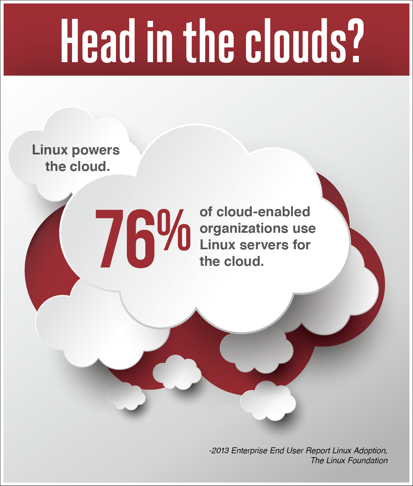

Traducción texto en imagen. **¿La cabeza en las nubes?** Linux impulsa la nube. 76% de las organizaciones habilitadas en la nube utilizan servidores Linux para la nube. *2013 Reporte Linux de Adopción de Usuarios Finales Empresariales. La Fundación Linux*

## 8.2 Las Barras Verticales en la Línea de Comandos

Capítulos anteriores describen la manera de usar los comandos individuales para realizar las acciones en el sistema operativo, incluyendo cómo crear/mover/eliminar los archivos y moverse en todo el sistema. Por lo general, cuando un comando ofrece salida o genera un error, la salida se muestra en la pantalla; sin embargo, esto no tiene que ser el caso.

El carácter *barra vertical* | (o «pipe» en inglés) puede utilizarse para enviar la salida de un comando a otro. En lugar de que se imprima en la pantalla, la salida de un comando se convierte en una entrada para el siguiente comando. Esto puede ser una herramienta poderosa, especialmente en la búsqueda de datos específicos; la implementación de la *barra vertical* (o «piping» en inglés) se utiliza a menudo para refinar los resultados de un comando inicial.

Los comandos `head` (o «cabeza» en español) y `tail` (o «cola» en español) se utilizarán en muchos ejemplos a continuación para ilustrar el uso de las barras verticales. Estos comandos se pueden utilizar para mostrar solamente algunas de las primeras o las últimas líneas de un archivo (o, cuando se utiliza con una barra vertical, la salida de un comando anterior).

Por defecto, los comandos `head` y `tail` mostrarán diez líneas. Por ejemplo, el siguiente comando muestra las diez primeras líneas del archivo */etc/sysctl.conf*:

```bash
sysadmin@localhost:~$ head /etc/sysctl.conf                            
#                                                                     
# /etc/sysctl.conf - Configuration file for setting system variables  
# See /etc/sysctl.d/ for additional system variables                   
# See sysctl.conf (5) for information.                                 
#                                                                     

#kernel.domainname = example.com                                                
                                                               
# Uncomment the following to stop low-level messages on console
#kernel.printk = 3 4 1 3                                        
sysadmin@localhost:~$
```

En el ejemplo siguiente, se mostrarán las últimas diez líneas del archivo:

```bash
sysadmin@localhost:~$ tail /etc/sysctl.conf                            
# Do not send ICMP redirects (we are not a router)                    
#net.ipv4.conf.all.send_redirects = 0                                  
#                                                                      
# Do not accept IP source route packets (we are not a router)         
#net.ipv4.conf.all.accept_source_route = 0                             
#net.ipv6.conf.all.accept_source_route = 0                             
#                                                                      
# Log Martian Packets                                                  
#net.ipv4.conf.all.log_martians = 1                                    
#                                                                      
sysadmin@localhost:~$
```

El carácter de la barra vertical permite a los usuarios utilizar estos comandos no sólo en los archivos, sino también en la salida de otros comandos. Esto puede ser útil al listar un directorio grande, por ejemplo el directorio */etc*:

```bash
ca-certificates         insserv              nanorc          services   
ca-certificates.conf    insserv.conf         network         sgml      
calendar                insserv.conf.d       networks        shadow    
cron.d                  iproute2             nologin         shadow-   
cron.daily              issue                nsswitch.conf   shells    
cron.hourly             issue.net            opt             skel     
cron.monthly            kernel               os-release      ssh       
cron.weekly             ld.so.cache          pam.conf        ssl      
crontab                 ld.so.conf           pam.d           sudoers   
dbus-1                  ld.so.conf.d         passwd          sudoers.d 
debconf.conf            ldap                 passwd-         sysctl.conf
debian_version          legal                perl            sysctl.d  
default                 locale.alias         pinforc         systemd   
deluser.conf            localtime            ppp             terminfo  
depmod.d                logcheck             profile         timezone  
dpkg                    login.defs           profile.d       ucf.conf  
environment             logrotate.conf       protocols       udev      
fstab                   logrotate.d          python2.7       ufw       
fstab.d                 lsb-base             rc.local        update-motd.d
gai.conf                lsb-base-logging.sh  rc0.d           updatedb.conf 
groff                   lsb-release          rc1.d           vim       
group                   magic                rc2.d           wgetrc    
group-                  magic.mime           rc3.d           xml      
sysadmin@localhost:~$
```

Si te fijas en la salida del comando anterior, notarás que ese primer nombre del archivo es *ca-certificates*. Pero hay otros archivos listados "arriba" que sólo pueden verse si el usuario utiliza la barra de desplazamiento. ¿Qué pasa si sólo quieres listas algunos de los primeros archivos del directorio */etc*?

En lugar de mostrar la salida del comando anterior, poner la barra vertical junto al comando `head` muestra sólo las primeras diez líneas:

```bash
sysadmin@localhost:~$ ls /etc | head                                   
adduser.conf                                                           
adjtime                                                               
alternatives                                                         
apparmor.d                                                             
apt                                                                    
bash.bashrc                                                           
bash_completion.d                                                     
bind                                                                  
bindresvport.blacklist                                                 
blkid.conf                                                             
sysadmin@localhost:~$
```

La salida del comando `ls` se pasa al comando `head` por el shell en vez de ser impreso a la pantalla. El comando head toma esta salida (del `ls`) como "datos de entrada" y luego se imprime la salida del `head` a la pantalla.

Múltiples barras verticales pueden utilizarse consecutivamente para unir varios comandos. Si se unen tres comandos con la barra vertical, la salida del primer comando se pasa al segundo comando. La salida del segundo comando se pasa al tercer comando. La salida del tercer comando se imprime en la pantalla.

Es importante elegir cuidadosamente el orden en que los comandos están unidos con la barra vertical, ya que el tercer comando sólo verá como entrada, la salida del segundo comando. Los siguientes ejemplos ilustran esta situación usando el comando `nl`. En el primer ejemplo, el comando de `nl` se utiliza para numerar las líneas de la salida de un comando anterior:

```bash
sysadmin@localhost:~$ ls -l /etc/ppp | nl                                   1  total 44
     2  -rw------- 1 root root   78 Aug 22  2010 chap-secrets         
     3  -rwxr-xr-x 1 root root  386 Apr 27  2012 ip-down
     4  -rwxr-xr-x 1 root root 3262 Apr 27  2012 ip-down.ipv6to4      
     5  -rwxr-xr-x 1 root root  430 Apr 27  2012 ip-up  
     6  -rwxr-xr-x 1 root root 6517 Apr 27  2012 ip-up.ipv6to4
     7  -rwxr-xr-x 1 root root 1687 Apr 27  2012 ipv6-down
     8  -rwxr-xr-x 1 root root 3196 Apr 27  2012 ipv6-up
     9  -rw-r--r-- 1 root root    5 Aug 22  2010 options
    10  -rw------- 1 root root   77 Aug 22  2010 pap-secrets
    11  drwxr-xr-x 2 root root 4096 Jun 22  2012 peers                 
sysadmin@localhost:~$
```

En el ejemplo siguiente, observa que el comando ls es ejecutado primero y su salida se envía al comando `nl`, enumerando todas las líneas de la salida del comando `ls`. A continuación, se ejecuta el comando `tail`, mostrando las últimas cinco líneas de la salida del comando `nl`:

```bash
sysadmin@localhost:~$ ls -l /etc/ppp | nl | tail -5                   
     7  -rwxr-xr-x 1 root root 1687 Apr 27  2012 ipv6-down
     8  -rwxr-xr-x 1 root root 3196 Apr 27  2012 ipv6-up
     9  -rw-r--r-- 1 root root    5 Aug 22  2010 options
    10  -rw------- 1 root root   77 Aug 22  2010 pap-secrets
    11  drwxr-xr-x 2 root root 4096 Jun 22  2012 peers                
sysadmin@localhost:~$
```

Compara la salida anterior con el siguiente ejemplo:

```bash
sysadmin@localhost:~$ ls -l /etc/ppp | tail -5 | nl                   
    1  -rwxr-xr-x 1 root root 1687 Apr 27  2012 ipv6-down
    2  -rwxr-xr-x 1 root root 3196 Apr 27  2012 ipv6-up
    3  -rw-r--r-- 1 root root    5 Aug 22  2010 options
    4  -rw------- 1 root root   77 Aug 22  2010 pap-secrets
    5  drwxr-xr-x 2 root root 4096 Jun 22  2012 peers                 
sysadmin@localhost:~$
```

Observa los diferentes números de línea. ¿Por qué sucede esto?

En el segundo ejemplo, la salida del comando `ls` se envía primero al comando `tail` que "capta" sólo las últimas cinco líneas de la salida. El comando `tail` envía esas cinco líneas para al comando `nl`, que los enumera del 1 al 5.

Las barras verticales pueden ser poderosas, pero es importante considerar cómo se unen los comandos con ellas para asegurar que se muestre la salida deseada.

## 8.3 Redirección de E/S

La Redirección de Entrada/Salida (E/S) permite que la información pase de la línea de comandos a las diferentes *secuencias*. Antes de hablar sobre la redirección, es importante entender las secuencias estándar.

## 8.3.1 STDIN

La entrada estándar STDIN es la información normalmente introducida por el usuario mediante el teclado. Cuando un comando envía un prompt al shell esperando datos, el shell proporciona al usuario la capacidad de introducir los comandos, que a su vez, se envían al comando como STDIN.

## 8.3.2 STDOUT

Salida estándar o STDOUT es la salida normal de los comandos. Cuando un comando funciona correctamente (sin errores), la salida que produce se llama STDOUT. De forma predeterminada, STDOUT se muestra en la ventana de la terminal (pantalla) donde se ejecuta el comando.

## 8.3.3 STDERR

Error estándar o STDERR son mensajes de error generados por los comandos. De forma predeterminada, STDERR se muestra en la ventana de la terminal (pantalla) donde se ejecuta el comando.

La redirección de E/S permite al usuario redirigir STDIN para que los datos provengan de un archivo y la salida de STDOUT/STDERR vaya a un archivo. La redirección se logra mediante el uso de los caracteres de la flecha: < y >.

## 8.3.4 Redirigir STDOUT

STDOUT se puede dirigir a los archivos. Para empezar, observa la salida del siguiente comando que se mostrará en la pantalla:

```bash
sysadmin@localhost:~$ echo "Line 1"
Line 1
sysadmin@localhost:~$
```

Utilizando el carácter > , la salida puede ser redirigida a un archivo:

```bash
sysadmin@localhost:~$ echo "Line 1" > example.txt
sysadmin@localhost:~$ ls
Desktop    Downloads  Pictures  Templates  example.txt  test           
Documents  Music      Public    Videos     sample.txt
sysadmin@localhost:~$ cat example.txt 
Line 1 
sysadmin@localhost:~$
```

Este comando no muestra ninguna salida, porque la STDOUT fue enviada al archivo *example.txt* en lugar de la pantalla. Puedes ver el nuevo archivo con la salida del comando `ls`. El archivo recién creado contiene la salida del comando `echo` cuando se ve el contenido del archivo con el comando `cat`.

Es importante tener en cuenta que la flecha sola sobrescribe cualquier contenido de un archivo existente:

```bash
sysadmin@localhost:~$ cat example.txt
Line 1
sysadmin@localhost:~$ echo "New line 1" > example.txt
sysadmin@localhost:~$ cat example.txt
New line 1
sysadmin@localhost:~$
```

El contenido original del archivo ha desaparecido y fue reemplazado por la salida del comando `echo` nuevo.

También es posible preservar el contenido de un archivo existente anexando al mismo. Utiliza la «doble flecha» >> para anexar a un archivo en vez de sobreescribirlo:

```bash
sysadmin@localhost:~$ cat example.txt
New line 1
sysadmin@localhost:~$ echo "Another line" >> example.txt
sysadmin@localhost:~$ cat example.txt
New line 1
Another line
sysadmin@localhost:~$
```

En lugar de ser sobrescrito, la salida del comando del comando `echo` reciente se anexa a la parte inferior del archivo.

## 8.3.5 Redirigir la STDERR

Puedes redirigir el STDERR de una manera similar a la STDOUT. STDOUT es también conocida como secuencia o canal («stream» o «channel» en inglés) #1. Al STDERR se asigna la secuencia #2.

Al utilizar las flechas para redirigir, se asumirá la secuencia #1 mientras no venga especificada otra secuencia. Por lo tanto, la secuencia #2 debe especificarse al redirigir el STDERR.

Para demostrar la redirección del STDERR, primero observa el siguiente comando que producirá un error porque el directorio especificado no existe:

```bash
sysadmin@localhost:~$ ls /fake                                 
ls: cannot access /fake: No such file or directory              
sysadmin@localhost:~$
```

Ten en cuenta que no hay nada en el ejemplo anterior lo que implica que la salida es STDERR. La salida es claramente un mensaje de error, pero ¿cómo podrías saber que se envía al STDERR? Una manera fácil de determinar esto es redirigir al STDOUT:

```bash
sysadmin@localhost:~$ ls /fake > output.txt                    
ls: cannot access /fake: No such file or directory              
sysadmin@localhost:~$
```

En el ejemplo anterior, el STDOUT fue redirigido al archivo *output.txt*. Por lo tanto, la salida que se muestra no puede ser STDOUT porque habría quedado en el archivo *output.txt*. Ya que todos los resultados del comando van a STDOUT o STDERR, la salida mostrada debe ser STDERR.

El STDERR de un comando puede enviarse a un archivo:

```bash
sysadmin@localhost:~$ ls /fake 2> error.txt                     
sysadmin@localhost:~$ cat error.txt                            
ls: cannot access /fake: No such file or directory              
sysadmin@localhost:~$
```
En el comando de arriba, 2> indica que todos los mensajes de error deben enviarse al archivo error.txt.

## 8.3.6 Redireccionando Múltiples Secuencias

Es posible dirigir la salida STDOUT y STDERR de un comando a la vez. El siguiente comando produce ambas salidas STDOUT y STDERR porque existe uno de los directorios especificados y el otro no:

```bash
sysadmin@localhost:~$ ls /fake /etc/ppp
ls: cannot access /fake: No such file or directory
/etc/ppp:
chap-secrets   ip-down   ip-down.ipv6to4    ip-up        ip-up.ipv6to4
ipv6-down      ipv6-up   options            pap-secrets  peers
```
Si sólo se envía la salida STDOUT a un archivo, la STDERR todavía se imprimirá a la pantalla:

```bash
sysadmin@localhost:~$ ls /fake /etc/ppp > example.txt           
ls: cannot access /fake: No such file or directory              
sysadmin@localhost:~$ cat example.txt                           
/etc/ppp:                                              
chap-secrets         
ip-down
ip-down.ipv6to4      
ip-up  
ip-up.ipv6to4
ipv6-down
ipv6-up
options
pap-secrets
peers                                                                     
sysadmin@localhost:~$
```

Si sólo se envía la salida STDERR a un archivo, la STDOUT todavía se imprimirá a la pantalla:

```bash
sysadmin@localhost:~$ ls /fake /etc/ppp 2> error.txt            
/etc/ppp:                                                       
hap-secrets    ip-down   ip-down.ipv6to4    ip-up        ip-up.ipv6to4
ipv6-down      ipv6-up   options            pap-secrets  peers 
sysadmin@localhost:~$ cat error.txt                             
ls: cannot access /fake: No such file or directory              
sysadmin@localhost:~$
```

Las salidas STDOUT y STDERR pueden enviarse a un archivo mediante el uso de &> un conjunto de caracteres que significan «ambos 1> y 2>»:

```bash
sysadmin@localhost:~$ ls /fake /etc/ppp &> all.txt
sysadmin@localhost:~$ cat all.txt
ls: cannot access /fake: No such file or directory
/etc/ppp:
chap-secrets         
ip-down
ip-down.ipv6to4      
ip-up  
ip-up.ipv6to4
ipv6-down
ipv6-up
options
pap-secrets
peers                                                            
sysadmin@localhost:~$
```

Ten en cuenta que cuando se utiliza &>, la salida aparece en el archivo con todos los mensajes STDERR en la parte superior y todos los mensaje STDOUT debajo de todos los mensajes de STDERR:

```bash
sysadmin@localhost:~$ ls /fake /etc/ppp /junk /etc/sound &> all.txt       
sysadmin@localhost:~$ cat all.txt                               
ls: cannot access /fake: No such file or directory              
ls: cannot access /junk: No such file or directory              
/etc/ppp:                                                       
chap-secrets         
ip-down
ip-down.ipv6to4      
ip-up  
ip-up.ipv6to4
ipv6-down
ipv6-up
options
pap-secrets
peers                 

/etc/sound:
events                                                                    
sysadmin@localhost:~$
```

Si no quieres que las salidas STDERR y STDOUT vayan al mismo archivo, puede redirigirlas a diferentes archivos utilizando > and 2>. Por ejemplo:

```bash
sysadmin@localhost:~$ rm error.txt example.txt                  
sysadmin@localhost:~$ ls                                        
Desktop    Downloads  Pictures  Templates  all.txt              
Documents  Music      Public    Videos               
sysadmin@localhost:~$ ls /fake /etc/ppp > example.txt 2> error.txt        
sysadmin@localhost:~$ ls                                        
Desktop    Downloads  Pictures  Templates  all.txt    example.txt
Documents  Music      Public    Videos     error.txt  
sysadmin@localhost:~$ cat error.txt                             
ls: cannot access /fake: No such file or directory              
sysadmin@localhost:~$ cat example.txt                           
/etc/ppp:                                                       
chap-secrets         
ip-down
ip-down.ipv6to4      
ip-up  
ip-up.ipv6to4
ipv6-down
ipv6-up
options
pap-secrets
peers                 
sysadmin@localhost:~$
```

No importa el orden en el vienen las secuencias especificadas.

## 8.3.7 Redirigir la entrada STDIN

El concepto de redireccionar la STDIN es difícil, ya que es más difícil de entender el por qué querrías redirigir la STDIN. Con las salidas STDOUT y STDERR, la respuesta del por qué es bastante fácil: porque a veces quieres almacenar el resultado en un archivo para su uso futuro.

La mayoría de los usuarios de Linux terminan redirigiendo rutinariamente la STDOUT, en ocasiones la STDERR y la STDIN... bien, muy raramente. Hay muy pocos comandos que requieren de que redirijas la STDIN porque en el caso de la mayoría de los comandos, si quieres pasar los datos desde un archivo a un comando, simplemente puedes especificar el nombre del archivo como un argumento del comando. Después, el comando buscará en el archivo.

En el caso de algunos comandos, si no se especifica un nombre de archivo como argumento, volverán a usar la salida STDIN para obtener los datos. Por ejemplo, considera el siguiente comando `cat:

```bast
sysadmin@localhost:~$ cat                                       
hello                                                           
hello                                                           
how are you?                                                    
how are you?                                                    
goodbye                                                         
goodbye
sysadmin@localhost:~$
```

En el ejemplo anterior, el comando `cat` no recibió el nombre de archivo como argumento. Por lo tanto, pidió los datos a mostrarlos en la pantalla desde la entrada STDIN. El usuario introduce *hello* y luego el comando `cat` muestra *hello* en la pantalla. Tal vez esto es útil para las personas solitarias, pero no es realmente un buen uso del comando `cat.

Sin embargo, tal vez si la salida del comando `cat` se redirige a un archivo, entonces este método podría utilizarse para agregar datos a un archivo existente o colocar texto en un archivo nuevo:

```bash
sysadmin@localhost:~$ cat > new.txt                             
Hello                                                           
How are you?                                                    
Goodbye                                                         
sysadmin@localhost:~$ cat new.txt                               
Hello                                                           
How are you?                                                    
Goodbye
sysadmin@localhost:~$
```

Mientras que en el ejemplo anterior se muestra otra de las ventajas de redireccionar la STDOUT, no aborda el por qué o cómo puedes dirigir la STDIN. Para entender esto, consideremos primero un nuevo comando llamado `tr`. Este comando tomará un conjunto de caracteres y los plasmará en otro conjunto de caracteres.

Por ejemplo, supongamos que quieres poner una línea de comandos en mayúsculas. Puede utilizar el comando `tr` de la siguiente manera:

```bash
sysadmin@localhost:~$ tr 'a-z' 'A-Z'                         
watch how this works                                            
WATCH HOW THIS WORKS                                            
sysadmin@localhost:~$
```

El comando `tr` tomó la entrada STDIN desde el teclado (*watch how this works*) (a ver cómo funciona esto) y convierte todas las letras en minúsculas antes de enviar la salida STDOUT a la pantalla (*WATCH HOW THIS WORKS*).

Parecería que el comando `tr` sirviera más para realizar la traducción en un archivo, no la entrada del teclado. Sin embargo, el comando `tr` no admite argumentos del nombre de archivo:

```bash
sysadmin@localhost:~$ more example.txt                                
/etc/ppp:
chap-secrets
ip-down
ip-down.ipv6to4
ip-up
ip-up.ipv6to4
ipv6-down
ipv6-up
options
pap-secrets
peers                                          
sysadmin@localhost:~$ tr 'a-z' 'A-Z' example.txt
tr: extra operand `example.txt'
Try `tr --help' for more information
sysadmin@localhost:~$
```

Sin embargo, puedes decirle al shell que obtenga la STDIN de un archivo en vez de desde el teclado mediante el uso del carácter <:

```bash
sysadmin@localhost:~$ tr 'a-z' 'A-Z' < example.txt 
/ETC/PPP:                   
CHAP-SECRETS                                             
IP-DOWN                                                               
IP-DOWN.IPV6TO4                                                      
IP-UP                                                                 
IP-UP.IPV6TO4                                                         
IPV6-DOWN                                                             
IPV6-UP                                                               
OPTIONS                                                               
PAP-SECRETS                                                     
sysadmin@localhost:~$
```

Esto es bastante raro porque la mayoría de los comandos aceptan a los nombres de archivo como argumentos. Sin embargo, para los que no, este método podría utilizarse para que el shell lea desde el archivo en lugar de confiar en el comando que tienen esta capacidad.

Una última nota: En la mayoría de los casos probablemente quieras tomar la salida resultante y colocarla en otro archivo:

```bash
sysadmin@localhost:~$ tr 'a-z' 'A-Z' < example.txt > newexample.txt 
sysadmin@localhost:~$ more newexample.txt
/ETC/PPP:           
CHAP-SECRETS                                             
IP-DOWN                                                               
IP-DOWN.IPV6TO4                                                      
IP-UP                                                                 
IP-UP.IPV6TO4                                                         
IPV6-DOWN                                                             
IPV6-UP                                                               
OPTIONS                                                               
PAP-SECRETS                                                          
sysadmin@localhost:~$
```

## 8.4 Buscar Archivos Utilizando el Comando Find

Uno de los retos al que se enfrentan los usuarios trabajando con el sistema de archivos, es tratar de recordar la ubicación donde se almacenan los archivos. Hay miles de archivos y cientos de directorios en un típico sistema de archivos Linux, así que recordar donde se encuentran estos archivos, puede plantear desafíos.

Ten en cuenta que la mayoría de los archivos con los que trabajas, son los que tú creas. Como resultado, a menudo buscarás en tu propio directorio local para encontrar los archivos. Sin embargo, a veces puede que necesites buscar en otros lugares en el sistema de archivos para encontrar archivos creados por otros usuarios.

El comando `find` es una herramienta muy poderosa que puedes utilizar para buscar archivos en el sistema de archivos. Este comando puede buscar archivos por nombre, incluso usando los caracteres comodín cuando no estás seguro del nombre exacto del archivo. Además, puedes buscar los archivos en función de los metadatos de archivos, tales como tipo de archivo, tamaño de archivo y propiedad de archivo.

La sintaxis del comando `find es:

`find [directorio de inicio] [opción de búsqueda] [criterio de búsqueda] [opción de resultado]`

O en Inglés:

`find [starting directory] [search option] [search criteria] [result option]`

Descripción de todos estos componentes:

| Component | Description |
|---|---|
| [directorio de inicio] | Aquí el usuario especifica dónde comenzar la búsqueda. El comando `find` buscará en este directorio y todos sus subdirectorios. Si no hay directorio de partida, el directorio actual se utiliza para el punto de partida |  
| [opción de búsqueda] | Aquí el usuario especifica una opción para determinar qué tipo de metadatos hay que buscar; hay opciones para el nombre de archivo, tamaño de archivo y muchos otros atributos de archivo. | 
| [criterio de búsqueda] | Es un argumento que complementa la opción de búsqueda. Por ejemplo, si el usuario utiliza la opción para buscar un nombre de archivo, el criterio de búsqueda sería el nombre del archivo. |
| [opción de resultado] | Esta opción se utiliza para especificar qué acción se debe tomar al encontrar el archivo. Si no se proporciona ninguna opción, se imprimirá el nombre del archivo a STDOUT. |

## 8.4.1 Buscar por Nombre de Archivo

Para buscar un archivo por nombre, utiliza la opción `-name` (o «nombre» en español) del comando `find (o «buscar» en español):

```bash
sysadmin@localhost:~$ find /etc -name hosts                           
find: `/etc/dhcp': Permission denied
find: `/etc/cups/ssl': Permission denied  
find: `/etc/pki/CA/private': Permission denied  
find: `/etc/pki/rsyslog': Permission denied
find: `/etc/audisp': Permission denied 
find: `/etc/named': Permission denied
find: `/etc/lvm/cache': Permission denied 
find: `/etc/lvm/backup': Permission denied
find: `/etc/lvm/archive': Permission denied                           
/etc/hosts
find: `/etc/ntp/crypto': Permission denied
find: `/etc/polkit-l/localauthority': Permission denied   
find: `/etc/sudoers.d': Permission denied  
find: `/etc/sssd': Permission denied 
/etc/avahi/hosts
find: `/etc/selinux/targeted/modules/active': Permission denied  
find: `/etc/audit': Permission denied                                
sysadmin@localhost:~$
```

Observa que se encontraron dos archivos: */etc/hosts* y */etc/avahi/hosts*. El resto de la salida eran los mensajes STDERR porque el usuario que ejecutó el comando no tiene permiso para acceder a ciertos subdirectorios.

Recuerda que puedes redirigir el STDERR a un archivo por lo que no necesitarás ver estos mensajes de error en la pantalla:

```bash
sysadmin@localhost:~$ find /etc -name hosts 2> errors.txt             
/etc/hosts 
/etc/avahi.hosts                                                      
sysadmin@localhost:~$
```

Mientras que la salida es más fácil de leer, realmente no hay ningún propósito para almacenar los mensajes de error en el archivo *error.txt*. Los desarrolladores de Linux se dieron cuenta de que sería bueno tener un archivo de «basura» (o «junk» en inglés) para enviar los datos innecesarios; se descarta cualquier archivo que envíes al archivo */dev/null*:

```bash
sysadmin@localhost:~$ find /etc -name hosts 2> /dev/null              
/etc/hosts
/etc/avahi/hosts                                                      
sysadmin@localhost:~$
```

## 8.4.2 Mostrando los Detalles del Archivo

Puede ser útil obtener información sobre el archivo al utilizar el comando `find`, porque solo el nombre del archivo en sí mismo podría no proporcionar información suficiente para que puedas encontrar el archivo correcto.

Por ejemplo, puede haber siete archivos llamados hosts; si supieras que el archivo host que necesitas se había modificado recientemente, entonces sería útil ver la hora de modificación del archivo.

Para ver estos detalles del archivo, utiliza la opción `-ls para el comando `find`:

```bash
sysadmin@localhost:~$ find /etc -name hosts -ls 2> /dev/null
    41   4 -rw-r--r--   1 root     root      158 Jan 12 2010 /etc/hosts
  6549   4 -rw-r--r--   1 root     root      1130 Jul 19 2011 /etc/avahi/hosts 
sysadmin@localhost:~$
```

*Nota*: Las dos primeras columnas de la salida anterior son el *número inodo* del archivo y el número de bloques que el archivo utiliza para el almacenamiento. Ambos están más allá del alcance del tema en cuestión. El resto de las columnas son la salida típica del comando `ls -l: tipo de archivo, permisos, cuenta de enlaces físico, usuario propietario, grupo propietario, tamaño del archivo, hora de modificación del archivo y el nombre de archivo.

## 8.4.3 Buscar los Archivos por Tamaño

Una de las muchas opciones útiles de la búsqueda es la opción que le permite buscar archivos por tamaño. La opción `-size` (o «tamaño» en español) te permite buscar los archivos que son mayores o menores que un tamaño especificado, así como buscar un tamaño de archivo exacto.

Cuando se especifica un tamaño de archivo, puedes proporcionar el tamaño en bytes (c), kilobytes (k), megabytes (M) o gigabytes (G). Por ejemplo, la siguiente será una búsqueda de archivos en la estructura de directorios */etc* con el tamaño exacto de 10 bytes:

```bash
sysadmin@localhost:~$ find /etc -size 10c -ls 2>/dev/null    
   432    4 -rw-r--r--   1 root     root           10 Jan 28  2015 /etc/adjtime
 8814    0 drwxr-xr-x   1 root     root           10 Jan 29  2015 /etc/ppp/ip-d
own.d                                                           
8816    0 drwxr-xr-x   1 root     root           10 Jan 29  2015 /etc/ppp/ip-u
p.d                                                            
 8921    0 lrwxrwxrwx   1 root     root           10 Jan 29  2015 /etc/ssl/cert
s/349f2832.0 -> EC-ACC.pem                                    
  9234    0 lrwxrwxrwx   1 root     root           10 Jan 29  2015 /etc/ssl/cert
s/aeb67534.0 -> EC-ACC.pem                                     
 73468    4 -rw-r--r--   1 root     root           10 Nov 16 20:42 /etc/hostname
sysadmin@localhost:~$
```

Si quieres buscar los archivos que son más grandes que un tamaño especificado, puedes usar el carácter + antes que el tamaño. Por ejemplo, el siguiente ejemplo buscará todos los archivos en la estructura de directorio */usr* que su tamaño sea mayor a 100 megabytes:

```bash
sysadmin@localhost:~$ find /usr -size +100M -ls 2> /dev/null
574683 104652 -rw-r--r--   1 root      root      107158256 Aug  7 11:06 /usr/share/icons/oxygen/icon-theme.cache                    
sysadmin@localhost:~$
```

Si quieres buscar los archivos que son más pequeños que un tamaño especificado, puedes usar el carácter - antes que el tamaño.

## 8.4.4 Opciones de Búsqueda Útiles Adicionales

Hay muchas opciones de búsqueda. La siguiente tabla muestra algunas:

| Opción | Significado |
| -maxdepth | Permite al usuario especificar la profundidad en la estructura de los directorios a buscar. Por ejemplo, `-maxdepth 1` significaría sólo buscar en el directorio especificado y en sus subdirectorios inmediatos. |
| -group | Devuelve los archivos que son propiedad de un grupo especificado. Por ejemplo, `-group payroll` devolvería los archivos que son propiedad del grupo payroll (o «nómina» en español). |
| -iname | Devuelve los archivos especificados que coinciden con el nombre de archivo, pero a diferencia del `-name`, `-iname` no es sensible a las mayúsculas y minúsculas. Por ejemplo, `-iname hosts` coincidiría con los archivos llamados *hosts*, *Hosts*, *HOSTS*, etc. |
| -mmin | Devuelve los archivos que fueron modificados según el tiempo de modificación en minutos. Por ejemplo, `-mmin 10` coincidirá con los archivos que fueron modificados hace 10 minutos. |
| -type | Devuelve los archivos que coinciden con el tipo de archivo. Por ejemplo, `-type f` devuelve los archivos que son archivos regulares. |
| -user | Devuelve los archivos que son propiedad de un usuario especificado. Por ejemplo, `-user bob` devuelve los archivos que son propiedad del usuario bob. |

## 8.4.5 Usar Múltiples Opciones

Si utilizas múltiples opciones, éstas actúan como un operador lógico "y", lo que significa que para que se dé una coincidencia, todos los criterios deben coincidir, no sólo uno. Por ejemplo, el siguiente comando muestra todos los archivos en la estructura de directorio */etc* con el tamaño de 10 bytes y que son archivos simples:

```bash
sysadmin@localhost:~$ find /etc -size 10c -type f -ls 2>/dev/null       
432    4 -rw-r--r--   1 root     root           10 Jan 28  2015 /etc/adjtime
73468    4 -rw-r--r--   1 root     root           10 Nov 16 20:42 /etc/hostname
sysadmin@localhost:~$
```

## 8.5 Visualización de los Archivos Utilizando el Comando less

Mientras que visualizar pequeños archivos con el comando `cat` no plantea ningún problema, no es una opción ideal para los archivos grandes. El comando `cat` no proporciona ninguna manera para pausar y reiniciar la pantalla fácilmente, por lo que el contenido del archivo entero es arrojado a la pantalla.

Para archivos más grandes, querrás usar el comando *pager* que permite ver el contenido. Los comandos pager mostrarán una página de datos a la vez, permiténdote moverte hacia adelante y hacia atrás en el archivo utilizando las teclas de movimiento.

Hay dos comandos pager comúnmente utilizados:

- El comando `less`: Este comando proporciona una capacidad de paginación muy avanzada. Normalmente es el pager predeterminado utilizado por comandos como el comando `man`.
- El comando `more`: Este comando ha existido desde los primeros días de UNIX. Aunque tenga menos funciones que el comando `less`, tiene una ventaja importante: El comando `less` no viene siempre incluido en todas las distribuciones de Linux (y en algunas distribuciones, no viene instalado por defecto). El comando `more` siempre está disponible.

Cuando utilizas los comandos `more` o `less`, te permiten «moverte» en un documento utilizando los *comandos de tecla*. Ya que los desarrolladores del comando `less` basaron el comando en la funcionalidad del comando `more`, todos los comandos de tecla disponibles en el comando `more` también trabajan en el comando `less`.

En este manual nos centraremos más en el comando más avanzado (`less`). Sin embargo, resulta útil que te acuerdes del comando `more` para cuando el comando `less` no esté disponible. Recuerda que la mayoría de los comandos de tecla proporcionados trabajan para ambos comandos.

## 8.5.1 La Pantalla de Ayuda con el Comando less

Al ver un archivo con el comando `less`, puedes utilizar la tecla **h** para mostrar una pantalla de ayuda. La pantalla de ayuda te permite ver que otros comandos están disponibles. En el ejemplo siguiente, se ejecuta el comando `less /usr/share/dict/words`. Cuando se visualiza el documento, se presiona la tecla **h**, y se muestra la pantalla de ayuda:

```bash
                    SUMMARY OF LESS COMMANDS
      Commands marked with * may be preceded by a number, N.
      Notes in parentheses indicate the behavior if N is given.
      
  h  H                 Display this help.
  q  :q  Q  :Q  ZZ     Exit.
 ------------------------------------------------------------------------ 
                           MOVING                                    
  e  ^E  j  ^N  CR  *  Forward  one line   (or N lines).
  y  ^Y  k  ^K  ^P  *  Backward one line   (or N lines).
  f  ^F  ^V  SPACE  *  Forward  one window (or N lines).
  b  ^B  ESC-v      *  Backward one window (or N lines).
  z                 *  Forward  one window (and set window to N).
  w                 *  Backward one window (and set window to N)
  ESC-SPACE         *  Forward  one window, but don't stop at end-of-file.
  d  ^D             *  Forward  one half-window (and set half-window to N).
  u  ^U             *  Backward one half-window (and set half-window to N).
  ESC-)  RightArrow *  Left  one half screen width (or N positions).
  ESC-(  LeftArrow  *  Right one half screen width (or N positions).
HELP -- Press RETURN for more, or q when done
```

## 8.5.2 Los Comandos de Movimiento para less

Hay muchos comandos de movimiento para el comando `less`, cada uno con múltiples teclas o combinaciones de teclas. Si bien esto puede parecer intimidante, recuerda que no necesitas memorizar todos estos comandos de movimiento; siempre puedes utilizar la tecla **h** para obtener la ayuda.

El primer grupo de comandos de movimiento en los que probablemente te quieras enfocar son los que más comúnmente se utilizan. Para hacerlo aún más fácil de aprender, se resumirán las teclas que son idénticas para `more` y `less`. De esta manera, aprenderás cómo moverte en los comandos `more` y `less` al mismo tiempo:

| Movimiento | Tecla |
| Ventana hacia adelante | **Barra espaciadora** |
| Ventana hacia atrás | **b** |
| Línea hacia adelante | **Entrar** |
| Salir | **q** |
| Ayuda | **h** |

Cuando se utiliza el comando `less` para moverse entre las páginas, la forma más fácil de avanzar una página hacia adelante es presionando la **barra espaciadora**.

## 8.5.3 Comandos de Búsqueda less

Hay dos formas de buscar con el comando `less`: puedes buscar hacia adelante o hacia atrás desde tu posición actual usando patrones llamados las expresiones regulares. Más detalles en relación con las expresiones regulares se proporcionarán más adelante en este capítulo.

Para iniciar una búsqueda hacia adelante desde tu posición actual, utiliza la tecla /. A continuación, escribe el texto o el patrón y presiona la tecla **Entrar**.

Si se encuentra una coincidencia, el cursor se moverá en el documento hasta encontrar una coincidencia. Por ejemplo, en el siguiente gráfico la expresión «frog» (o «rana» en español) se buscó en el archivo */usr/share/dict/words*:

```bash
bullfrog
bullfrog's
bullfrogs
bullheaded
bullhorn
bullhorn's
bullhorns
bullied
bullies
bulling
bullion
bullion's
bullish
bullock
bullock's
bullocks
bullpen
bullpen's
bullpens
bullring
bullring's
bullrings
bulls
```
Observa que «frog» no tiene que ser una palabra por sí misma. Observa también, que mientras el comando `less` te llevó a la primera coincidencia desde tu posición actual, todas las coincidencias se resaltaron.

Si no se encuentra ninguna coincidencia hacia adelante desde tu posición actual, la última línea de la pantalla reportará «*Pattern not found*» (o «Patrón no encontrado» en español):

`Pattern not found (press RETURN)`

Para iniciar una búsqueda hacia atrás desde tu posición actual, pulsa la tecla **?**, después introduce el texto o el patrón y presiona la tecla **Entrar**. El cursor se moverá hacia atrás hasta encontrar la primera coincidencia o te informará que no se puede encontrar el patrón.

Si la búsqueda encuentra más de una coincidencia, entonces con la tecla **n** te puedes mover a la siguiente coincidencia y la tecla **N** te permitirá ir a la coincidencia anterior.

## 8.6 Revisando los Comandos head y tail

Recordemos que los comandos `head` y `tail` se utilizan para filtrar los archivos y mostrar un número limitado de líneas. Si quieres ver un número de líneas seleccionadas desde la parte superior del archivo, utiliza el comando `head` y si quieres ver un número de líneas seleccionadas en la parte inferior de un archivo, utiliza el comando `tail`.

Por defecto, ambos comandos muestran diez líneas del archivo. La siguiente tabla proporciona algunos ejemplos:

| Comando de Ejemplo | Explicación del texto visualizado |
|---|---|
| head /etc/passwd | Las primeras diez líneas del archivo /etc/passwd |
| head -3 /etc/group | Las primeras tres líneas del archivo/etc/group |
| head -n 3 /etc/group | Las primeras tres líneas del archivo /etc/group |
| help pipe head | Las primeras diez líneas de la salida del comando help redirigidas por la barra vertical |
| tail /etc/group | Las últimas diez líneas del archivo /etc/group |
| tail -5 /etc/passwd | Las últimas cinco líneas del archivo /etc/passwd |
| tail -n 5 /etc/passwd | Las últimas cinco líneas del archivo /etc/passwd |
| help pipe tail | Las últimas diez líneas de la salida del comando help redirigidas por la barra vertical |

Como puedes observar en los ejemplos anteriores, ambos comandos darán salida al texto de un archivo regular o de la salida de cualquier comando enviado mediante la barra vertical. Ambos utilizan la opción `-n` para indicar cuántas líneas debe contener la salida.

## 8.6.1 El Valor Negativo de la Opción -n

Tradicionalmente en UNIX, se especifica el número de líneas a mostrar como una opción con cualquiera de los comandos, así pues `-3` significa mostrar tres líneas. Para el comando `tail`, la opción `-3` o `-n -3` siempre significará mostrar tres líneas. Sin embargo, la versión GNU del comando `head` reconoce `-n -3` como mostrar todo menos las tres últimas líneas, y sin embargo el comando `head` siempre reconoce la opción `-3` como muestra las tres primeras líneas.

## 8.6.2 El Valor Positivo del Comando tail

La versión GNU del comando `tail` permite una variación de cómo especificar el número de líneas que se deben imprimir. Si utilizas la opción `-n` con un número precedido por el signo más, entonces el comando `tail` reconoce esto en el sentido de mostrar el contenido a partir de la línea especificada y continuar hasta el final.

Por ejemplo, el siguiente ejemplo muestra la línea #22 hasta el final de la salida del comando `nl`:

```bash
sysadmin@localhost:~$ nl /etc/passwd | tail -n +22
    22  sshd:x:103:65534::/var/run/sshd:/usr/sbin/nologin
    23  operator:x:1000:37::/root:/bin/sh
    24  sysadmin:x:1001:1001:System Administrator,,,,:/home/sysadmin:/bin/bash  
sysadmin@localhost:~$
```

## 8.6.3 Seguimiento de los Cambios en un Archivo

Puedes ver los cambios en vivo en los archivos mediante la opción `-f` del comando `tail`. Esto es útil cuando quieres seguir cambios en un archivo mientras están sucediendo.

Un buen ejemplo de esto sería cuando quieres ver los archivos de registro como el administrador de sistemas. Los archivos de registro pueden utilizarse para solucionar los problemas y a menudo los administradores los verán en una ventana independiente de manera «interactiva» utilizando el comando `tail` mientras van ejecutando los comandos con los cuáles están intentando solucionar los problemas.

Por ejemplo, si vas a iniciar una sesión como el usuario root, puedes solucionar los problemas con el servidor de correo electrónico mediante la visualización de los cambios en tiempo real de su archivo de registro utilizando el comando siguiente: `tail -f /var/log/mail.log`

## 8.7 Ordenar Archivos o Entradas

Puede utilizarse el comando `sort` para reorganizar las líneas de archivos o entradas en orden alfabético o numérico basado en el contenido de uno o más campos. Los campos están determinados por un separador de campos contenido en cada línea, que por defecto son espacios en blanco (espacios y tabuladores).

En el ejemplo siguiente se crea un pequeño archivo, usando el comando `head` tomando las 5 primeras líneas del archivo */etc/passwd* y enviando la salida a un archivo llamado *mypasswd*.

```bash
sysadmin@localhost:~$ head -5 /etc/passwd > mypasswd
sysadmin@localhost:~$
```
```bash
sysadmin@localhost:~$ cat mypasswd
root:x:0:0:root:/root:/bin/bash
daemon:x:1:1:daemon:/usr/sbin:/bin/sh
bin:x:2:2:bin:/bin:/bin/sh
sys:x:3:3:sys:/dev:/bin/sh
sync:x:4:65534:sync:/bin:/bin/sync
sysadmin@localhost:~$
```

Ahora vamos a ordenar (sort) el archivo mypasswd:

```bash
sysadmin@localhost:~$ sort mypasswd
bin:x:2:2:bin:/bin:/bin/sh
daemon:x:1:1:daemon:/usr/sbin:/bin/sh
root:x:0:0:root:/root:/bin/bash
sync:x:4:65534:sync:/bin:/bin/sync
sys:x:3:3:sys:/dev:/bin/sh
sysadmin@localhost:~$
```

## 8.7.1 Opciones de Campo y Ordenamiento

En el caso de que el archivo o entrada pueda separarse por otro delimitador como una coma o dos puntos, la opción `-t` permitirá especificar otro separador de campo. Para especificar los campos para `sort` (o en español «ordenar»), utiliza la opción `-k` con un argumento para indicar el número de campo (comenzando con 1 para el primer campo).

Las otras opciones comúnmente usadas para el comando `sort` son `-n` para realizar un `sort` numérico y `-r` para realizar a un `sort` inverso.

En el siguiente ejemplo, se utiliza la opción `-t` para separar los campos por un carácter de dos puntos y realiza un `sort` numérico utilizando el tercer campo de cada línea:

```bash
sysadmin@localhost:~$ sort -t: -n -k3 mypasswd
root:x:0:0:root:/root:/bin/bash
daemon:x:1:1:daemon:/usr/sbin:/bin/sh
bin:x:2:2:bin:/bin:/bin/sh
sys:x:3:3:sys:/dev:/bin/sh
sync:x:4:65534:sync:/bin:/bin/sync
sysadmin@localhost:~$
```

Ten en cuenta que la opción `-r` se podía haber utilizado para invertir el `sort`, causando que los números más altos en el tercer campo aparecieran en la parte superior de la salida:

```bash
sysadmin@localhost:~$ sort -t: -n -r -k3 mypasswd
sync:x:4:65534:sync:/bin:/bin/sync
sys:x:3:3:sys:/dev:/bin/sh
bin:x:2:2:bin:/bin:/bin/sh
daemon:x:1:1:daemon:/usr/sbin:/bin/sh
root:x:0:0:root:/root:/bin/bash
sysadmin@localhost:~$
```

Por último, puede que quieras ordenarlo de una forma más compleja, como un `sort` por un campo primario y luego por un campo secundario. Por ejemplo, considera los siguientes datos:

```bash
bob:smith:23
nick:jones:56
sue:smith:67
```

Puede que quieras ordenar primero por el apellido (campo #2), luego el nombre (campo #1) y luego por edad (campo #3). Esto se puede hacer con el siguiente comando:

`sysadmin@localhost:~$ sort -t: -k2 -k1 -k3n filename``

## 8.8 Visualización de las Estadísticas de Archivo con el Comando wc

El comando `wc` permite que se impriman hasta tres estadísticas por cada archivo, así como el total de estas estadísticas, siempre que se proporcione más de un nombre de archivo. De forma predeterminada, el comando `wc` proporciona el número de líneas, palabras y bytes (1 byte = 1 carácter en un archivo de texto):

```bash
sysadmin@localhost:~$ wc /etc/passwd /etc/passwd-
  35   56 1710 /etc/passwd
  34   55 1665 /etc/passwd-
  69  111 3375 total
sysadmin@localhost:~$
```

El ejemplo anterior muestra la salida de ejecutar: `wc /etc/passwd /etc/passwd-`. La salida tiene cuatro columnas: el número de líneas en el archivo, el número de palabras en el archivo, el número de bytes en el archivo y el nombre de archivo o *total*.

Si quieres ver estadísticas específicas, puede utilizar `-l` para mostrar sólo el número de líneas, `-w` para mostrar sólo el número de palabras y `-c` para mostrar sólo el número de bytes.

El comando `wc` puede ser útil para contar el número de líneas devueltas por algún otro comando utilizando la barra vertical. Por ejemplo, si desea saber el número total de los archivos en el directorio */etc*, puedes ejecutar `ls /etc | wc -l`:

```bash
sysadmin@localhost:~$ ls /etc/ | wc -l
136
sysadmin@localhost:~$
```

## 8.9 Utilizar el Comando cut para Filtrar el Contenido del Archivo

El comando `cut`(o «cortar» en español) puede extraer columnas de texto de un archivo o entrada estándar. El uso primario del comando `cut` es para trabajar con los archivos delimitados de las bases de datos. Estos archivos son muy comunes en los sistemas Linux.

De forma predeterminada, considera que su entrada debe ser separada por el carácter **Tab**, pero la opción `-d` puede especificar delimitadores alternativos como los dos puntos o la coma.

Utilizando la opción `-f` puedes especificar qué campos quieres que se muestren, ya sea como un rango separado por guiones o una lista separada por comas.

En el ejemplo siguiente se visualiza el primero, quinto, sexto y séptimo campo del archivo de la base de datos de *mypasswd*:

```bash
sysadmin@localhost:~$ cut -d: -f1,5-7 mypasswd
root:root:/root:/bin/bash
daemon:daemon:/usr/sbin:/bin/sh
bin:bin:/bin:/bin/sh
sys:sys:/dev:/bin/sh
sync:sync:/bin:/bin/sync
sysadmin@localhost:~$
```
Con el comando `cut` puedes también extraer las columnas de un texto basado en la posición de los caracteres con la opción `-c`. Esto puede ser útil para extraer los campos de archivos de base de datos con un ancho fijo. El siguiente ejemplo muestra sólo el tipo de archivo (carácter #1), los permisos (caracteres #2-10) y el nombre de archivo (caracteres #50+) de la salida del comando `ls -l`:

```bash
sysadmin@localhost:~$ ls -l | cut -c1-11,50-
total 12
drwxr-xr-x Desktop
drwxr-xr-x Documents
drwxr-xr-x Downloads
drwxr-xr-x Music
drwxr-xr-x Pictures
drwxr-xr-x Public
drwxr-xr-x Templates
drwxr-xr-x Videos
-rw-rw-r-- errors.txt
-rw-rw-r-- mypasswd
-rw-rw-r-- new.txt
sysadmin@localhost:~$
```

## 8.10 Utilizar el Comando grep para Filtrar el Contenido del Archivo

Puedes utilizar el comando `grep` para filtrar las líneas en un archivo o en la salida de otro comando basado en la coincidencia de un patrón. El patrón puede ser tan simple como el texto exacto que quieres que coincida o puede ser mucho más avanzado mediante el uso de las expresiones regulares (de las que hablaremos más adelante en este capítulo).

Por ejemplo, puedes querer encontrar todos los usuarios que pueden ingresar al sistema con el shell BASH, por lo que se podría utilizar el comando `grep` para filtrar las líneas del archivo */etc/passwd* para las líneas que contengan los caracteres bash:

```bash
sysadmin@localhost:~$ grep bash /etc/passwd
root:x:0:0:root:/root:/bin/bash
sysadmin:x:1001:1001:System Administrator,,,,:/home/sysadmin:/bin/bash
sysadmin@localhost:~$
```

Para que sea más fácil ver exactamente lo que coincide, utiliza la opción de `--color`. Esta opción resaltará los elementos coincidentes en rojo:

```bash
sysadmin@localhost:~$ grep --color bash /etc/passwd
root:x:0:0:root:/root:/bin/bash
sysadmin:x:1001:1001:System Administrator,,,,:/home/sysadmin:/bin/bash
sysadmin@localhost:~$
```

En algunos casos no te interesan las líneas específicas que coinciden con el patrón, sino más bien cuántas líneas coinciden con el patrón. Con la opción `-c` puedes obtener un conteo del número de líneas que coinciden:

```bash
sysadmin@localhost:~$ grep -c bash /etc/passwd
2
sysadmin@localhost:~$
```

Cuando estás viendo la salida del comando `grep`, puede ser difícil determinar el número original de las líneas. Esta información puede ser útil cuando regreses al archivo (tal vez para editar el archivo), ya que puedes utilizar esta información para encontrar rápidamente una de las líneas coincidentes.

La opción `-n` del comando `grep` muestra los números de la línea originales:

```bash
sysadmin@localhost:~$ grep -n bash /etc/passwd
1:root:x:0:0:root:/root:/bin/bash
24:sysadmin:x:1001:1001:System Administrator,,,,:/home/sysadmin:/bin/bas
sysadmin@localhost:~$
```

Algunas opciones adicionales del `grep` que pueden resultar útiles:

| Ejemplos | Salida |
|---|---|
| `grep -v nologin /etc/passwd` | Todas las líneas que no contengan *nologin* en el archivo */etc/passwd* |
| `grep -l linux /etc/*` | Lista de los archivos en el directorio */etc* que contengan *linux* |
| `grep -i linux /etc/*` | Listado de las líneas de los archivos en el directorio */etc* que contengan cualquier tipo de letra (mayúscula o minúscula) del patrón de caracteres *linux* |
| `grep -w linux /etc/*` | Listado de las líneas de los archivos en el directorio */etc* que contengan el patrón de la palabra *linux* |

## 8.11 Las Expresiones Regulares Básicas

Una *Expresión Regular* es una colección de caracteres «normales» y «especiales» que se utilizan para que coincida con un patrón simple o complejo. Los caracteres normales son caracteres alfanuméricos que coinciden con ellos mismos. Por ejemplo, la letra a coincide con una a.

Algunos caracteres tienen significados especiales cuando se utilizan dentro de los patrones por comandos como el comando `grep`. Existen las *Expresiones Regulares Básicas* (disponible para una amplia variedad de comandos de Linux) y las *Expresiones Regulares Extendidas* (disponibles para los comandos más avanzados de Linux). Las Expresiones Regulares Básicas son las siguientes:

| Expresión Regular | Coincidencias |
|---|---|
| . | Cualquier carácter individual |
| [ ] | Una lista o rango de caracteres que coinciden con un carácter, a menos que el primer carácter sea el símbolo de intercalación ^, lo que entonces significa cualquier carácter que no esté en la lista |
| * | El carácter previo que se repite cero o más veces |
| ^ | El texto siguiente debe aparecer al principio de la línea |
| $ | El texto anterior debe aparecer al final de la línea |

El comando `grep` es sólo uno de los muchos comandos que admiten expresiones regulares. Algunos otros comandos son los comandos `more` y `less`. Mientras que a algunas de las expresiones regulares se les ponen innecesariamente con comillas simples, es una buena práctica utilizar comillas simples con tus expresiones regulares para evitar que el shell trate a interpretar su significado especial.

## 8.11.1 Expresiones Regulares Básicas - el Carácter .

En el ejemplo siguiente, un simple archivo primero se crea usando la redirección. Después el comando `grep` se utiliza para mostrar una coincidencia de patrón simple:

```bash
sysadmin@localhost:~$ echo 'abcddd' > example.txt
sysadmin@localhost:~$ cat example.txt
abcddd
sysadmin@localhost:~$ grep --color 'a..' example.txt
abcddd
sysadmin@localhost:~$
```
En el ejemplo anterior, se puede ver que el patrón a.. coincidió con abc. El primer carácter . coincidió con b y el segundo coincidió con c.

En el siguiente ejemplo, el patrón a..c no coincide con nada, así que el comando `grep` no produce ninguna salida. Para que la coincidencia tenga éxito, hay que poner dos caracteres entre a y c en el example.txt:

```bash
sysadmin@localhost:~$ grep --color 'a..c' example.txt
sysadmin@localhost:~$
```

## 8.11.2 Expresiones Regulares Básicas - el Carácter [ ]

Si usas el carácter ., entonces cualquier carácter posible podría coincidir. En algunos casos quieres especificar exactamente los caracteres que quieres que coincidan. Por ejemplo, tal vez quieres que coincida un sólo carácter alfa minúscula o un carácter de número. Para ello, puedes utilizar los caracteres de expresiones regulares [ ] y especificar los caracteres válidos dentro de los caracteres [ ].

Por ejemplo, el siguiente comando coincide con dos caracteres, el primero es ya sea una a o una b mientras que el segundo es una a, b, c o d:

```bash
sysadmin@localhost:~$ grep --color '[ab][a-d]' example.txt
abcddd
sysadmin@localhost:~$
```

Ten en cuenta que puedes enumerar cada carácter posible [abcd] o proporcionar un rango [a-d] siempre que esté en el orden correcto. Por ejemplo, [d-a] no funcionaría ya que no es un intervalo válido:

```bash
sysadmin@localhost:~$ grep --color '[d-a]' example.txt
grep: Invalid range end
sysadmin@localhost:~$
```
El rango se especifica mediante un estándar denominado la tabla ASCII. Esta tabla es una colección de todos los caracteres imprimibles en un orden específico. Puedes ver la tabla ASCII con el comando `man ascii`. Un pequeño ejemplo:

```bash
      041  33  21  !                                 141   97  61  a
      042  34  22  “                                 142   98  62  b
      043  35  23  #                                 143   99  63  c
      044  36  24  $                                 144   100 64  d
      045  37  25  %                                 145   101 65  e
      046  38  26  &                                 146   102 66  f
```

Puesto que la a tiene un valor numérico más pequeño (141) que la d (144), el rango a-d incluye todos los caracteres de la a a la d.

¿Qué pasa si quieres un carácter que puede ser cualquier cosa menos una x, y o z? No querrías proporcionar un conjunto de [ ] con todos los caracteres excepto x, y o z.

Para indicar que quieres que coincida un carácter que no es uno de lo listados, inicia tu conjunto de [ ] con el símbolo ^. El siguiente ejemplo muestra la coincidencia de un patrón que incluye un carácter que no es un a, b o c seguida de un d:

```bash
sysadmin@localhost:~$ grep --color '[^abc]d' example.txt
abcddd
sysadmin@localhost:~$
```

8.11.3 Expresiones Regulares Básicas - el Carácter *
El carácter * se puede utilizar para coincidir con «cero o más de los caracteres previos». El siguiente ejemplo coincidirá con cero o más caracteres d:

```bash
sysadmin@localhost:~$ grep --color 'd*' example.txt
abcddd
sysadmin@localhost:~$
```

## 8.11.4 Expresiones Regulares Básicas - los Caracteres ^ y $

Cuando quieres que coincida un patrón, tal coincidencia puede ocurrir en cualquier lugar de la línea. Puede que quieras especificar que la coincidencia se presentara al principio de la línea o al final de la línea. Para que coincida con el principio de la línea, comienza el patrón con el símbolo ^.

En el ejemplo siguiente se agrega otra línea al archivo example.txt para mostrar el uso del símbolo ^:

```bash
sysadmin@localhost:~$ echo "xyzabc" >> example.txt
sysadmin@localhost:~$ cat example.txt
abcddd
xyzabc
sysadmin@localhost:~$ grep --color "a" example.txt
abcddd
xyzabc
sysadmin@localhost:~$ grep --color "^a" example.txt
abcddd
sysadmin@localhost:~$
```
Ten en cuenta que en la primera salida del ``grep``, ambas líneas coinciden debido a que ambas contienen la letra a. En la segunda salida ``grep``, solo coincide con la línea que comienza con la letra a.

Para especificar que coincida al final de la línea, termina el patrón con el carácter $. Por ejemplo, para encontrar sólo las líneas que terminan con la letra c:

```bash
sysadmin@localhost:~$ grep "c$" example.txt
xyzabc
sysadmin@localhost:~$
```

## 8.11.5 Expresiones Regulares Básicas - el Carácter \

En algunos casos querrás que la búsqueda coincida con un carácter que resulta ser un carácter especial de la expresión regular. Observa el siguiente ejemplo:

```bash
sysadmin@localhost:~$ echo "abcd*" >> example.txt
sysadmin@localhost:~$ cat example.txt
abcddd
xyzabc
abcd*
sysadmin@localhost:~$ grep --color "cd*" example.txt
abcddd
xyzabc
abcd*
sysadmin@localhost:~$
```

En la salida del comando grep anterior, ves que cada línea corresponde porque estás buscando el carácter c seguido de cero o más caracteres d. Si quieres buscar un carácter *, coloca el carácter \ antes del carácter *:

```bash
sysadmin@localhost:~$ grep --color "cd\*" example.txt
abcd*
sysadmin@localhost:~$
```

## 8.12 Expresiones Regulares Extendidas

El uso de las Expresiones Regulares Extendidas requiere a menudo una opción especial proporcionada al comando para que éste las reconozca. Históricamente, existe un comando llamado `egrep`, que es similar al `grep`, pero es capaz de entender su uso. Ahora, el comando `egrep` es obsoleto a favor del uso del `grep` con la opción `-E`.

Las siguientes expresiones regulares se consideran «extendidas»:

| RE | Significado |
|---|---|
| ? | Coincide con el carácter anterior cero o una vez más, así que es un carácter opcional | 
| + | Coincide con el carácter anterior repetido una o más veces |
|	pipe | Alternación o como un operador lógico |

Algunos ejemplos de expresiones regulares extendidas:

| Comando | Significado | Coincidencias |
|---|---|---|
| grep -E 'colou?r' 2.txt | Haz coincidir colo seguido por cero o un carácter u | color colour |
| grep -E 'd+' 2.txt | Coincide con uno o más d caracteres | d dd ddd dddd |
| grep -E 'gray pipe grey' 2.txt | Coincide con gray o grey | gray grey |

## 8.13 El Command xargs

El comando `xargs` se utiliza para construir y ejecutar líneas de comandos de una entrada estándar. Este comando es muy útil cuando se necesita ejecutar un comando con una lista de argumentos muy larga, que en algunos casos puede resultar en un error si la lista de argumentos es demasiado larga.

El comando `xargs` tiene una opción `-0`, que desactiva la cadena de fin de archivo, permitiendo el uso de los argumentos que contengan espacios, comillas o barras diagonales inversas.

El comando `xargs` es útil para permitir que los comandos se ejecuten de manera más eficiente. Su objetivo es construir la línea de comandos para que un comando se ejecute las menos veces posibles con tantos argumentos como sea posible, en lugar de ejecutar el comando muchas veces con un argumento cada vez.

El comando `xargs` funciona separando la lista de los argumentos en sublistas y ejecutando el comando con cada sublista. El número de los argumentos en cada sublista no excederá el número máximo de los argumentos para el comando ejecutado, y por lo tanto, evita el error de «*Argument list too long*» (o «Lista de argumentos demasiado larga» en español).

En el ejemplo siguiente se muestra un escenario donde el comando `xargs` permite que muchos archivos sean eliminados, y donde el uso de un carácter comodín normal (glob) falló:

```bash
sysadmin@localhost:~/many$ rm *
bash: /bin/rm: Argument list too long
sysadmin@localhost:~/many$ ls | xargs rm
sysadmin@localhost:~/many$
```

# Práctica 08

## 8.1 Introducción

Este es Lab 8: Barras verticales, Redirección y REGEX Mediante la realización de esta práctica de laboratorio, los estudiantes aprenderán cómo redirigir los flujos de texto, utilizar expresiones regulares, y los comandos para filtrar los archivos de texto.

En este laboratorio llevarás a cabo las siguientes tareas:

1. Aprender cómo redirigir y canalizar la entradas, salidas y errores stándar con las barras verticales.
2. Utilizar las expresiones regulares para filtrar la salida de comandos o el contenido del archivo.
3. Visualizar archivos de gran tamaño o salida de comandos con programas paginación y visualizar partes seleccionadas.

## 8.2 Las Barras Verticales y le Redirección

Normalmente, cuando ejecutas un comando, se muestra la salida en la ventana de la terminal. Esta salida (también llamada un canal) se llama salida estándar, simbolizada por el término *stdout*. El número descriptor del archivo para este canal es 1.

El error estándar (*stderr*) se produce cuando se produce un error durante la ejecución de un comando; tiene un descriptor de archivo de 2. Los mensajes de error también se envían a la ventana de la terminal de forma predeterminada.

En esta práctica, vas a utilizar los caracteres que redirigen la salida de la salida estándar (*stdout*) y el error estándar (*stderr*) a un archivo u otro comando en lugar de la pantalla de la terminal.

La entrada estándar, *stdin*, por lo general la proporcionas tú a un comando escribiendo en el teclado; número descriptor de archivo es 0. Sin embargo, mediante la redirección de la entrada estándar, los archivos pueden también ser utilizados como *stdin*.

## 8.2.1 Paso 1

Utiliza el símbolo de redirección *>* para redirigir la salida desde la salida normal de *stdout* (terminal) a un archivo. Escribe lo siguiente:

```bash
echo "Hello World"
echo "Hello World" > mymessage
cat mymessage
```

El resultado debe ser similar al siguiente:

```bash
sysadmin@localhost:~$ echo "Hello World"
Hello World
sysadmin@localhost:~$ echo "Hello World" > mymessage
sysadmin@localhost:~$ cat mymessage
Hello World
sysadmin@localhost:~$
```
El primer comando repite el mensaje (*stdout*) a la terminal.

El segundo comando redirecciona la salida; en lugar de enviarla a la terminal, la salida se envía a un archivo llamado *mymessage*.

El último comando muestra el contenido del archivo *mymessage*.

## 8.2.2 Paso 2

Cuando utilizas el símbolo *>*  para redirigir la *stdout*, los contenidos del archivo se destruyen primero. Escribe los siguientes comandos para ver una demostración:

```bash
cat mymessage
echo Greetings > mymessage
cat mymessage
```

El resultado debe ser similar al siguiente:

```bash
sysadmin@localhost:~$ cat mymessage
Hello World
sysadmin@localhost:~$ echo Greetings > mymessage
sysadmin@localhost:~$ cat mymessage
Greetings
sysadmin@localhost:~$
```

Observa que el uso de un símbolo de redirección sobrescribe un archivo existente. Esto se llama «sobrescribir accidentalmente» (clobbering) un archivo.

## 8.2.3 Paso 3

Puedes evitar sobrescribir accidentalmente un archivo mediante el uso de *>>* en lugar de *>*. Mediante el uso de *>>* anexas a un archivo. Ejecuta los siguientes comandos para ver una demostración:

```bash
cat mymessage
echo "How are you?" >> mymessage
cat mymessage
```

El resultado debe ser similar al siguiente:

```bash
sysadmin@localhost:~$ cat mymessage
Greetings
sysadmin@localhost:~$ echo "How are you?" >> mymessage
sysadmin@localhost:~$ cat mymessage
Greetings
How are you?
sysadmin@localhost:~$
```

Recuerda que mediante el uso de *>>* todos los datos existentes se conservan y los nuevos datos se añaden al final del archivo.

## 8.2.4 Paso 4

El comando `find` comando es un buen comando para demostrar cómo el *stderr* funciona. Este comando busca en el sistema de archivos los archivos basándose en los criterios tales como el nombre de archivo. Ejecuta el siguiente comando y observa los resultados:

`find /etc -name hosts`

El resultado debe ser similar al siguiente:

```bash
sysadmin@localhost:~$ find /etc -name hosts
find: `/etc/ssl/private': Permission denied
/etc/hosts
sysadmin@localhost:~$
```

Observa el mensaje de error que indica que no tienes permiso para acceder a ciertos archivos/directorios. Esto se debe a que como un usuario normal no tiene derecho a "mirar dentro" de algunos directorios. Estos tipos de mensajes de error se envían al *stderr*, no a la *stdout*.

Trataremos el comando `find` con mayor detalle más adelante. El comando solo se utiliza ahora para demostrar la diferencia entre la *stdout* y el *stderr*.

## 8.2.5 Paso 5

Para redirigir el *stderr* (mensajes de error) a un archivo, emite el siguiente comando:

```bash
find /etc -name hosts 2> err.txt
cat err.txt
```

El resultado debe ser similar al siguiente:

```bash
sysadmin@localhost:~$ find /etc -name hosts 2> err.txt
/etc/hosts
sysadmin@localhost:~$ cat err.txt
find: `/etc/ssl/private': Permission denied
sysadmin@localhost:~$
```

Recuerda que el descriptor de archivo para el *stderr* es el número *2*, por lo que se utiliza junto con el símbolo *>*  para redirigir la salida *sdterr* a un archivo llamado *err.txt*. Ten en cuenta que *1>* es lo mismo que *>*.

Nota: El ejemplo anterior demuestra la importancia de conocer la redirección. Si queires "ignorar" los errores que muestra el comando `find`, puedes redirigir los mensajes a un archivo y verlos más tarde, haciendo más fácil centrarse en el resto de la salida del comando.

## 8.2.6 Paso 6

También puedes redirigir *stdout* y *stderr* en dos archivos separados.

```bash
find /etc -name hosts > std.out 2> std.err
cat std.err
cat std.out
```

El resultado debe ser similar al siguiente:

```bash
sysadmin@localhost:~$ find /etc -name hosts > std.out 2> std.err
sysadmin@localhost:~$ cat std.err
find: `/etc/ssl/private': Permission denied
sysadmin@localhost:~$ cat std.out
/etc/hosts
sysadmin@localhost:~$
```

Observa que se permite poner un espacio después del símbolo de redirección >, pero no es obligatorio.

## 8.2.7 Paso 7

Para redirigir tanto la salida estándar (*stdout*) como el error estándar (*stderr*) a un archivo, primero redirige la *stdout* a un archivo y luego redirige el *stderr* a ese mismo archivo mediante el uso de la notación *2>&1*.

```bash
find /etc -name hosts >find.out 2>&1
cat find.out
```
El resultado debe ser similar al siguiente:

```bash
sysadmin@localhost:~$ find /etc -name hosts > find.out 2>&1
sysadmin@localhost:~$ cat find.out
find: `/etc/ssl/private': Permission denied
/etc/hosts
sysadmin@localhost:~$
```

La parte del comando *2>&1* significa enviar el *stderr* (canal 2) a la misma ubicación a la que va la *stdout* (canal 1).

## 8.2.8 Paso 8

La entrada estándar (*stdin*) también puede ser redirigida. Normalmente la *stdin* proviene del teclado, pero a veces quieres que provenga de un archivo. Por ejemplo, el comando `tr` traduce los caracteres, pero sólo acepta los datos de la *stdin*, nunca de un nombre de archivo proporcionado como argumento. Esto es muy útil cuando quieres hacer algo así como poner en mayúscula los datos que se introducen desde el teclado (Nota: Presiona **Control+D** para señalar al comando `tr` que detenga el procesamiento de la entrada estándar):

```bash
tr a-z A-Z
this is interesting
how do I stop this?
^D
```

El resultado debe ser similar al siguiente:

```bash
sysadmin@localhost:~$ tr a-z A-Z
this is interesting
THIS IS INTERESTING
how do I stop this?
HOW DO I STOP THIS?
sysadmin@localhost:~$
```

**Nota**: ^D simboliza **Control+D**

## 8.2.9 Paso 9

El comando `tr` acepta la entrada del teclado (*stdin*), traduce los caracteres y luego envía la salida a *stdout*. Para crear un archivo de todos los caracteres en minúscula, ejecuta lo siguiente:

```bash
tr A-Z a-z > myfile
Wow, I SEE NOW
This WORKS!
```

El resultado debe ser similar al siguiente:

```bash
sysadmin@localhost:~$ tr A-Z a-z > myfile
Wow, I SEE NOW
This WORKS!
sysadmin@localhost:~$
```

Presiona la tecla *Entrar* para asegurarte de que el cursor está en la línea bajo el texto «This works!» (o «¡Esto funciona!» en español), y a continuación, utiliza *Control + D* para detener la entrada. Para verificar que has creado el archivo, ejecuta el siguiente comando:

`cat myfile``

El resultado debe ser similar al siguiente:

```bash
sysadmin@localhost:~$ cat myfile
wow, i see now
this works!
sysadmin@localhost:~$
```

## 8.2.10 Paso 10

Ejecuta los siguientes comandos para utilizar el comando `tr` mediante la redirección de la *stdin* desde un archivo:

```bash
cat myfile
tr a-z A-Z < myfile
```

El resultado debe ser similar al siguiente:

```bash
sysadmin@localhost:~$ cat myfile
wow, i see now
this works!
sysadmin@localhost:~$ tr a-z A-Z < myfile
WOW, I SEE NOW
THIS WORKS!
sysadmin@localhost:~$
```

## 8.2.11 Paso 11

Otra forma popular de redirección es tomar la salida de un comando y enviarlo a otro comando como entrada. Por ejemplo, la salida de algunos comandos puede ser masiva, lo que resulta en el desplazamiento de la salida en la pantalla demasiado rápido para leer. Ejecuta el siguiente comando para tomar la salida del comando `ls` y enviarlo al comando `more` que muestra una página de datos a la vez:

`ls -l /etc | more`

El resultado debe ser similar al siguiente:

```bash
sysadmin@localhost:~$ ls -l /etc | more
total 372
-rw-r--r-- 1 root root    2981 Jan 28  2015 adduser.conf
-rw-r--r-- 1 root root      10 Jan 28  2015 adjtime
drwxr-xr-x 1 root root     900 Jan 29  2015 alternatives
drwxr-xr-x 1 root root     114 Jan 29  2015 apparmor.d
drwxr-xr-x 1 root root     168 Oct  1  2014 apt
-rw-r--r-- 1 root root    2076 Apr  3  2012 bash.bashrc
drwxr-xr-x 1 root root      72 Jan 28  2015 bash_completion.d
drwxr-sr-x 1 root bind     342 Jan 29  2015 bind
-rw-r--r-- 1 root root     356 Apr 19  2012 bindresvport.blacklist
-rw-r--r-- 1 root root     321 Mar 30  2012 blkid.conf
lrwxrwxrwx 1 root root      15 Jun 18  2014 blkid.tab -> /dev/.blkid.tab      
drwxr-xr-x 1 root root      16 Jan 29  2015 ca-certificates
-rw-r--r-- 1 root root    7464 Jan 29  2015 ca-certificates.conf
drwxr-xr-x 1 root root      14 Jan 29  2015 calendar
drwxr-xr-x 1 root root      24 Jan 29  2015 cron.d
drwxr-xr-x 1 root root     134 Jan 29  2015 cron.daily
drwxr-xr-x 1 root root      24 Jan 29  2015 cron.hourly
drwxr-xr-x 1 root root      24 Jan 29  2015 cron.monthly
-rw-r--r-- 1 root root    2969 Mar 15  2012 debconf.conf
--More--
```

Tendrás que presionar la **Barra Espaciadora** para continuar o también puedes presionar **Control + C** para salirte de este listado.

El comando `cut` es útil para extraer los campos de los archivos que están delimitados por un carácter, como el de dos puntos (:) en */etc/passwd*, o que tienen un ancho fijo. Lo vamos a utilizar en los próximos ejemplos, ya que normalmente proporciona una gran cantidad de salida que se puede utilizar para demostrar el uso del carácter *|*.

## 8.2.12 Paso 12

En el siguiente ejemplo, se utiliza un comando llamado cut para extraer todos los nombres de usuario de una base de datos denominada /etc/passwd (un archivo que contiene información sobre la cuenta de usuario). Primero, intenta ejecutar el comando cut por sí mismo:

`cut -d: -f1 /etc/passwd`

Una parte de la salida del comando se muestra en el siguiente gráfico.

```bash
sysadmin@localhost:~$ cut -d: -f1 /etc/passwd
root
daemon
bin
sys
sync
games
man
lp
mail
news
uucp
proxy
www-data
backup
list
irc
gnats
nobody
libuuid
syslog
bind
sshd
operator
```

## 8.2.13 Paso 13

La salida en el ejemplo anterior estaba desordenada y desplazada fuera de la pantalla. En el siguiente paso vas a tomar la salida del comando `cut` y los vas a enviar al comando `sort` para ordenar la salida:

`cut -d: -f1 /etc/passwd | sort`

Una parte de la salida del comando se muestra en el siguiente gráfico.

```bash
sysadmin@localhost:~$ cut -d: -f1 /etc/passwd | sort
backup
bin
bind
daemon
games
gnats
irc
libuuid
list
lp
mail
man
news
nobody
operator
proxy
root
sshd
sync
sys
```

## 8.2.14 Paso 14

Ahora la salida está ordenada, pero todavía se desplaza fuera de la pantalla. Envía la salida del comando `sort` al comando `more` para resolver este problema:

`cut -d: -f1 /etc/passwd | sort | more`

```bash
sysadmin@localhost:~$ cut -d: -f1 /etc/passwd | sort | more
backup
bin
bind
daemon
games
gnats
irc
libuuid
list
lp
mail
man
news
nobody
operator
proxy
root
sshd
sync
sys
sysadmin
syslog
uucp
--More--
```

## 8.3 Utilizar el comando find para Encontrar Archivos

En esta tarea vas a utilizar el comando `find` para buscar archivos.

El comando `find` es un comando muy flexible con una serie de opciones que permiten a los usuarios localizar archivos basándose en una amplia gama de criterios tales como nombre de archivo, tamaño, fecha, tipo y permiso. La estructura básica del comando es:

`find <directorio para iniciar la búsqueda> -criteria <argumento para los criterios>``

El comando iniciará la búsqueda en el directorio especificado y busca de forma recursiva en todos los subdirectorios.

## 8.3.1 Paso 1

Busca los archivos comenzando por tu directorio home que contienen el nombre `bash`.

`find ~ -name "*bash*"``

El resultado debe ser similar al siguiente:

```bash
sysadmin@localhost:~$ find ~ -name "*bash*"
/home/sysadmin/.bash_logout
/home/sysadmin/.bashrc
sysadmin@localhost:~$
```

Recuerda que `~` se utiliza para representar el directorio home.

## 8.3.2 Paso 2

Encuentra los archivos que fueron modificados (o creados) hace menos de 5 minutos en el directorio especificado mediante el uso de los comandos siguientes:

```bash
find ~/Music -mmin -5
touch ~/Music/mysong
find ~/Music -mmin -5
```

El resultado debe ser similar al siguiente:

```bash
sysadmin@localhost:~$ find ~/Music -mmin -5
sysadmin@localhost:~$ touch ~/Music/mysong
sysadmin@localhost:~$ find ~/Music -mmin -5
/home/sysadmin/Music
/home/sysadmin/Music/mysong
sysadmin@localhost:~$
```

El primer comando `find` no encuentra los archivos que fueron modificados dentro del tiempo especificado. A continuación, crea un archivo mediante el uso del comando `touch` y ejecuta el comando `find` de nuevo, lo que resultará en que el comando `find` descubrirá el archivo nuevo.

El directorio *Music* se visualizó con el segundo comando `find` porque el directorio se modificó, el resultado de un archivo que fue añadido al directorio.

## 8.3.3 Paso 3

Ejecuta el siguiente comando para buscar los archivos en el directorio */usr*  con tamaño mayor a 2 MB:

`find /usr -size +2M``

El resultado debe ser similar al siguiente:

```bash
sysadmin@localhost:~$ find /usr -size +2M
/usr/bin/python2.7
/usr/lib/perl/5.14.2/auto/Encode/JP/JP.so
/usr/lib/perl/5.14.2/auto/Encode/KR/KR.so
/usr/share/GeoIP/GeoIPv6.dat
/usr/share/file/magic.mgc
sysadmin@localhost:~$
```

## 8.3.4 Paso 4

Encuentra los archivos de tipo "directorio" en la ubicación especificada.

`find /usr/share/bug -type d``

El resultado debe ser similar al siguiente:

```bash
sysadmin@localhost:~$ find /usr/share/bug -type d
/usr/share/bug
/usr/share/bug/apt
/usr/share/bug/gnupg
/usr/share/bug/initramfs-tools
/usr/share/bug/procps
/usr/share/bug/cron
/usr/share/bug/file
/usr/share/bug/libmagic1
/usr/share/bug/logrotate
/usr/share/bug/man-db
/usr/share/bug/vim-tiny
sysadmin@localhost:~$
```

## 8.3.5 Paso 5

Para verificar que la salida muestra los directorios, usa la opción `-ls`. El comando `find` utiliza la opción `-print` por defecto que muestra sólo los nombres de archivo. La opción `-ls` proporciona detalles de los archivos:

`find /usr/share/bug -type d -ls`

El resultado debe ser similar al siguiente:

```bash
sysadmin@localhost:~$ find /usr/share/bug -type d -ls
2280    0 drwxr-xr-x   1 root     root          138 Jan 29  2015 /usr/share/bug
  2281    0 drwxr-xr-x   1 root     root           12 Jan 28  2015 /usr/share/bu
g/apt
2283    0 drwxr-xr-x   1 root     root           14 Jan 28  2015 /usr/share/bug/gnupg
2285    0 drwxr-xr-x   1 root     root           12 Jan 28  2015 /usr/share/bug/initramfs-tools
2287    0 drwxr-xr-x   1 root     root           14 Jan 28  2015 /usr/share/bug/procps
10784    0 drwxr-xr-x   1 root     root           26 Jan 29  2015 /usr/share/bug/cron
10787    0 drwxr-xr-x   1 root     root           28 Jan 29  2015 /usr/share/bug/file
10790    0 drwxr-xr-x   1 root     root           28 Jan 29  2015 /usr/share/bug/libmagic1
10793    0 drwxr-xr-x   1 root     root           12 Jan 29  2015 /usr/share/bug/logrotate
10795    0 drwxr-xr-x   1 root     root           14 Jan 29  2015 /usr/share/bu
g/man-db
10797    0 drwxr-xr-x   1 root     root           26 Jan 29  2015 /usr/share/bug/vim-tiny
sysadmin@localhost:~$
```

Recuerda que el carácter *d* antes de los permisos *rwxr-x-r-x* indica que el archivo es un directorio.

## 8.4 Visualización de Archivos de Texto Grandes

A pesar de que los archivos de texto grandes se pueden ver con el comando `cat`, es incómodo desplazarse atrás hacia la parte superior del archivo. Además, archivos de gran tamaño no se pueden mostrar de esta manera, porque la ventana de la terminal sólo almacena un número determinado de las líneas de la salida en la memoria.

El uso de los comando `more` o `less` permite al usuario ver los datos una "página" o una línea a la vez. Estos comandos de "paginación" también permiten otras formas de navegación y búsqueda que se demostrará en esta sección.

Nota: en los ejemplos se utilizan ambos comandos, el `more` y el `less`. La mayoría de las veces, los comandos funcionan de la misma manera, sin embargo, el comando `less` es más avanzado y tiene más opciones. Sin embargo, es importante conocer el comando `more`, porque algunas distribuciones de Linux no tienen el comando `less`, pero todas las distribuciones de Linux tienen el comando `more`.

Si no quieres ver el archivo completo o toda la salida como un comando, entonces hay muchos comandos que son capaces de filtrar el contenido del archivo o de la salida. En esta sección, aprenderás a utilizar los comandos `head` y `tail` para poder extraer información de la parte superior o inferior de la salida del contenido de un comando o archivo.

## 8.4.1 Paso 1

El */etc/passwd* es probablemente demasiado grande para ser visualizado en la pantalla sin tener que desplazarse en la misma. Para ver una demostración utiliza el comando `cat` para mostrar todo el contenido del archivo */etc/passwd*:

`cat /etc/passwd`

El resultado debe ser similar al siguiente:

```bash
daemon:x:1:1:daemon:/usr/sbin:/bin/sh
bin:x:2:2:bin:/bin:/bin/sh
sys:x:3:3:sys:/dev:/bin/sh
sync:x:4:65534:sync:/bin:/bin/sync
games:x:5:60:games:/usr/games:/bin/sh
man:x:6:12:man:/var/cache/man:/bin/sh
lp:x:7:7:lp:/var/spool/lpd:/bin/sh
mail:x:8:8:mail:/var/mail:/bin/sh
news:x:9:9:news:/var/spool/news:/bin/sh
uucp:x:10:10:uucp:/var/spool/uucp:/bin/sh
proxy:x:13:13:proxy:/bin:/bin/sh
www-data:x:33:33:www-data:/var/www:/bin/sh
backup:x:34:34:backup:/var/backups:/bin/sh
list:x:38:38:Mailing List Manager:/var/list:/bin/sh
irc:x:39:39:ircd:/var/run/ircd:/bin/sh
gnats:x:41:41:Gnats Bug-Reporting System (admin):/var/lib/gnats:/bin/sh       
nobody:x:65534:65534:nobody:/nonexistent:/bin/sh
libuuid:x:100:101::/var/lib/libuuid:/bin/sh
syslog:x:101:103::/home/syslog:/bin/false
bind:x:102:105::/var/cache/bind:/bin/false
sshd:x:103:65534::/var/run/sshd:/usr/sbin/nologin
operator:x:1000:37::/root:/bin/sh
sysadmin:x:1001:1001:System Administrator,,,,:/home/sysadmin:/bin/bash        
sysadmin@localhost:~$
```

## 8.4.2 Paso 2

Utiliza el comando `more` para mostrar todo el contenido del archivo */etc/passwd*:

`more  /etc/passwd`

El resultado debe ser similar al siguiente:

```bash
root:x:0:0:root:/root:/bin/bash
daemon:x:1:1:daemon:/usr/sbin:/bin/sh
bin:x:2:2:bin:/bin:/bin/sh
sys:x:3:3:sys:/dev:/bin/sh
sync:x:4:65534:sync:/bin:/bin/sync
games:x:5:60:games:/usr/games:/bin/sh
man:x:6:12:man:/var/cache/man:/bin/sh
lp:x:7:7:lp:/var/spool/lpd:/bin/sh
mail:x:8:8:mail:/var/mail:/bin/sh
news:x:9:9:news:/var/spool/news:/bin/sh
uucp:x:10:10:uucp:/var/spool/uucp:/bin/sh
proxy:x:13:13:proxy:/bin:/bin/sh
www-data:x:33:33:www-data:/var/www:/bin/sh
backup:x:34:34:backup:/var/backups:/bin/sh
list:x:38:38:Mailing List Manager:/var/list:/bin/sh
irc:x:39:39:ircd:/var/run/ircd:/bin/sh
gnats:x:41:41:Gnats Bug-Reporting System (admin):/var/lib/gnats:/bin/sh
nobody:x:65534:65534:nobody:/nonexistent:/bin/sh
libuuid:x:100:101::/var/lib/libuuid:/bin/sh
syslog:x:101:103::/home/syslog:/bin/false
bind:x:102:105::/var/cache/bind:/bin/false
sshd:x:103:65534::/var/run/sshd:/usr/sbin/nologin
operator:x:1000:37::/root:/bin/sh
--More--(92%)
```

Nota: *--More--(92%)* indica que se estás «en» el comando `more` y a 92% a través de los datos actuales.

## 8.4.3 Paso 3

Mientras que te encuentras en el comando `more`, puedes ver la pantalla de ayuda presionando la tecla **h**:

`h`

El resultado debe ser similar al siguiente:

```bash
Most commands optionally preceded by integer argument k.  Defaults in brackets
Star (*) indicates argument becomes new default.
------------------------------------------------------------------------------
<space>                 Display next k lines of text [current screen size]    
z                       Display next k lines of text [current screen size]*   
<return>                Display next k lines of text [1]*
d or ctrl-D             Scroll k lines [current scroll size, initially 11]*   
q or Q or <interrupt>   Exit from more
s                       Skip forward k lines of text [1]
f                       Skip forward k screenfuls of text [1]
b or ctrl-B             Skip backwards k screenfuls of text [1]
'                       Go to place where previous search started
=                       Display current line number
/<regular expression>   Search for kth occurrence of regular expression [1]   
n                       Search for kth occurrence of last r.e [1]
!<cmd> or :!<cmd>       Execute <cmd> in a subshell
v                       Start up /usr/bin/vi at current line
ctrl-L                  Redraw screen
:n                      Go to kth next file [1]
:p                      Go to kth previous file [1]
:f                      Display current file name and line number         
.                       Repeat previous command
------------------------------------------------------------------------------
--More--(92%)
```

## 8.4.4 Paso 4

Presiona la **Barra Espaciadora** para ver el resto del documento:

`<SPACE>`

En el siguiente ejemplo aprenderás cómo buscar un documento utilizando los comandos `more` o `less`.

La búsqueda de un patrón dentro del comando `more` o comando `less` se realiza introduciendo la barra diagonal, /, seguida por el patrón que se busca. Si se encuentra una coincidencia, la pantalla debe desplazarse hasta la primera coincidencia. Para moverte a la siguiente coincidencia presionando la tecla **n**. Con el comando `less` te puedes mover también hacia atrás las coincidencias anteriores presionando la tecla **N** (la letra n mayúscula).

## 8.4.5 Paso 5

Utiliza el comando `less` para mostrar todo el contenido del archivo */etc/passwd*: A continuación, busca la palabra *bin*, utiliza **n** para moverte adelante, y **N** para moverte hacia atrás. Por último, sal del paginador `less` introduciendo la letra **q**:

```bash
less /etc/passwd
/bin
nnnNNNq
```

**Importante**: A diferencia del comando `more` que sale automáticamente cuando se llega al final de un archivo, debes presionar una tecla de cierre, como la **q**, para salir del programa `less`.

## 8.4.6 Paso 6

Puedes utilizar el comando `head` para visualizar la parte superior de un archivo. Por defecto, el comando `head` mostrará las primeras diez líneas del archivo:

`head /etc/passwd``

El resultado debe ser similar al siguiente:

```bash
sysadmin@localhost:~$ head /etc/passwd
root:x:0:0:root:/root:/bin/bash
daemon:x:1:1:daemon:/usr/sbin:/bin/sh
bin:x:2:2:bin:/bin:/bin/sh
sys:x:3:3:sys:/dev:/bin/sh
sync:x:4:65534:sync:/bin:/bin/sync
games:x:5:60:games:/usr/games:/bin/sh
man:x:6:12:man:/var/cache/man:/bin/sh
lp:x:7:7:lp:/var/spool/lpd:/bin/sh
mail:x:8:8:mail:/var/mail:/bin/sh
news:x:9:9:news:/var/spool/news:/bin/sh
sysadmin@localhost:~$
```

## 8.4.8 Paso 8

Utiliza el comando `head` para mostrar las dos primeras líneas del archivo */etc/passwd*:

`head -2 /etc/passwd``

El resultado debe ser similar al siguiente:

```bash
sysadmin@localhost:~$ head -2 /etc/passwd
root:x:0:0:root:/root:/bin/bash
daemon:x:1:1:daemon:/usr/sbin:/bin/sh
sysadmin@localhost:~$
```

## 8.4.9 Paso 9

Ejecuta la línea de comandos para canalizar la salida del comando `ls` al comando `tail` mostrando los últimos cinco nombres de archivos del directorio */etc*:

`ls /etc | tail -5``
 
El resultado debe ser similar al siguiente:

```bash
sysadmin@localhost:~$  ls /etc | tail -5
update-motd.d
updatedb.conf
vim
wgetrc
xml
sysadmin@localhost:~$
```

Como pudiste ver, tanto el comando `head` como el comando `tail` dan salida a diez líneas de forma predeterminada. También puedes usar la opción `-#` (o puede utilizar la opción `-n #`, dónde *#* es un cierto número de líneas en la salida). Ambos comandos se pueden utilizar para leer la entrada estándar de la canalización que recibe la salida desde un comando.

También pudiste ver en que se diferencian los comandos `head` y `tail`: el comando `head` comienza a contar sus líneas para dar salida desde la parte superior de los datos, mientras que el comando `tail` cuenta el número de líneas para dar la salida desde la parte inferior de los datos. Hay algunas diferencias adicionales entre estos dos comandos como verás en las próximas tareas.

## 8.4.10 Paso 10

Otra forma de especificar el número de líneas en la salida con el comando `head` es utilizar la opción `-n -#`, dónde *#* es el número de líneas contadas a partir de la parte inferior de la salida que quieres excluir. Observa el símbolo menos *-* delante del símbolo *#*. Por ejemplo, si el */etc/passwd* contiene 24 líneas y el siguiente comando mostrará las líneas 1-4, excluyendo las últimas veinte líneas:

`head -n -20 /etc/passwd`

```bash
sysadmin@localhost:~$ head -n -20 /etc/passwd
root:x:0:0:root:/root:/bin/bash
daemon:x:1:1:daemon:/usr/sbin:/bin/sh
bin:x:2:2:bin:/bin:/bin/sh
sys:x:3:3:sys:/dev:/bin/sh
sysadmin@localhost:~$
```

## 8.5 Búsqueda de Texto Usando las Expresiones Regulares

En esta tarea vas a utilizar la familia de comandos `grep` con las expresiones regulares para buscar una cadena específica de caracteres en una secuencia de datos (por ejemplo, un archivo de texto).

El comando `grep` utiliza las *expresiones regulares básicas*, caracteres especiales tales como los comodines que coinciden con los patrones en los datos. El comando `grep` devuelve toda la línea que contiene el patrón que coincida.

La opción `-E` del comando `grep` se puede utilizar para realizar búsquedas con las *expresiones regulares extendidas*, unas expresiones regulares más potentes. Otra forma de utilizar las expresiones regulares extendidas es utilizar el comando `egrep`.

El comando `fgrep` se utiliza para hacer que la búsqueda coincida con los caracteres literales, ignorando el significado especial de los caracteres de expresiones regulares.

## 8.5.1 Paso 1

El uso del `grep` en su forma más simple es la búsqueda de una determinada cadena de caracteres, tales como *sshd* en el archivo */etc/passwd*. El comando `grep` imprimirá toda la línea que contiene la coincidencia:

```bash
cd /etc
grep sshd passwd
```

El resultado debe ser similar al siguiente:

```bash
sysadmin@localhost:~$ cd /etc
sysadmin@localhost:/etc$ grep sshd passwd
sshd:x:103:65534::/var/run/sshd:/usr/sbin/nologin
sysadmin@localhost:/etc$
```

## 8.5.2 Paso 2

Las expresiones regulares son «codiciosos» en el sentido de que van a coincidir con cada instancia del patrón especificado:

`grep root passwd``

El resultado debe ser similar al siguiente:

```bash
sysadmin@localhost:/etc$ grep root passwd
root:x:0:0:root:/root:/bin/bash
operator:x:1000:37::/root:/bin/sh
sysadmin@localhost:/etc$
```

Ten en cuenta los aspectos destacados en rojo indicando exactamente lo que coincidió. También puedes ver que todas las apariciones de root fueron agrupadas en cada línea.

## 8.5.3 Paso 3

Para limitar la salida puedes utilizar las expresiones regulares para especificar un patrón más preciso. Por ejemplo, el símbolo de intercalación (*^ *) se puede utilizar para coincidir con un patrón al principio de una línea; por lo que cuando se ejecuta la siguiente línea de comandos, sólo las líneas que comienzan con *root* deben coincidir y se deben mostrar:

`grep '^root' passwd``

El resultado debe ser similar al siguiente:

```bash
sysadmin@localhost:/etc$ grep '^root' passwd
root:x:0:0:root:/root:/bin/bash
sysadmin@localhost:/etc$
```

Ten en cuenta que hay dos instancias adicionales de la palabra *root* pero sólo la que aparece al comienzo de la línea coincidirá (se muestra en rojo).

**Procedimiento recomendado**: Usa comillas simples (no comillas dobles) en torno a las expresiones regulares para evitar que el programa de shell trate de interpretarlas.

## 8.5.4 Paso 4

Encuentra la coincidencia con el patrón *sync* en cualquier parte de una línea:

`grep 'sync' passwd``

El resultado debe ser similar al siguiente:

```bash
sysadmin@localhost:/etc$ grep 'sync' passwd
sync:x:4:65534:sync:/bin:/bin/sync
sysadmin@localhost:/etc$
```

## 8.5.5 Paso 5

Utiliza el símbolo *$* para que coincida con el patrón sync al final de una línea:

*grep 'sync$' passwd*

El resultado debe ser similar al siguiente:

```bash
sysadmin@localhost:/etc$ grep 'sync$' passwd
sync:x:4:65534:sync:/bin:/bin/sync
sysadmin@localhost:/etc$
```

El primer comando coincide con todos los casos; el segundo sólo coincide con la instancia al final de la línea.

## 8.5.6 Paso 6

Utiliza el carácter de punto *.* para que coincida con cualquier carácter individual. Por ejemplo, ejecuta el siguiente comando para que coincida con cualquier carácter seguido de una *'y'*:

`grep '.y' passwd``

El resultado debe ser similar al siguiente:

```bash
sysadmin@localhost:/etc$ grep '.y' passwd
sys:x:3:3:sys:/dev:/bin/sh
sync:x:4:65534:sync:/bin:/bin/sync
proxy:x:13:13:proxy:/bin:/bin/sh
gnats:x:41:41:Gnats Bug-Reporting System (admin):/var/lib/gnats:/bin/sh       
nobody:x:65534:65534:nobody:/nonexistent:/bin/sh
syslog:x:101:103::/home/syslog:/bin/false
sysadmin:x:1001:1001:System Administrator,,,,:/home/sysadmin:/bin/bash        
sysadmin@localhost:/etc$
```

## 8.5.7 Paso 7

La barra vertical *|* u «operador de la alternancia», actúa como un operador "or". Por ejemplo, ejecuta lo siguiente para intentar encontrar coincidencia con sshd, root u operator:

`grep 'sshd|root|operator' passwd``

El resultado debe ser similar al siguiente:

```bash
sysadmin@localhost:/etc$ grep 'sshd|root|operator' passwd
sysadmin@localhost:/etc$
```
Observa que el comando `grep` no reconoce la barra vertical como un operador de alternancia de forma predeterminada. El comando `grep` en realidad incluye la barra vertical como un carácter normal en el patrón que debe coincidir. El uso de `grep -E` o `egrep` te permitirá utilizar las expresiones regulares extendidas incluyendo la alternancia.

## 8.5.8 Paso 8

Utiliza la opción '-E' para permitir que el 'grep' opere en el modo extendido con el fin de reconocer al operador de alternancia:

`grep -E 'sshd|root|operator' passwd`

El resultado debe ser similar al siguiente:

```bash
sysadmin@localhost:/etc$ grep -E 'sshd|root|operator' passwd
root:x:0:0:root:/root:/bin/bash
sshd:x:103:65534::/var/run/sshd:/usr/sbin/nologin
operator:x:1000:37::/root:/bin/sh
sysadmin@localhost:/etc$
```

## 8.5.9 Paso 9

Utiliza otra expresión regular extendida, esta vez con `egrep` con alternancia en un grupo para que coincida con un patrón. Las cadenas *nob* y *non* coincidirán:

`egrep 'no(b|n)' passwd``

El resultado debe ser similar al siguiente:

```bash
sysadmin@localhost:/etc$ egrep 'no(b|n)' passwd
nobody:x:65534:65534:nobody:/nonexistent:/bin/sh
sysadmin@localhost:/etc$
```

Nota: Los paréntesis, *( )*, se utilizan para limitar el «alcance» del carácter *|* . Sin ellos, como *nob|n*, el patrón hubiera significado «coincide con *nob* o bien con *n*»

## 8.5.10 Paso 10

Los corchetes `[ ]` también se pueden utilizar para que la búsqueda coincida con un solo carácter, sin embargo a diferencia del punto `.`, los corchetes `[ ]` se utilizan para especificar exactamente qué carácter debe coincidir. Por ejemplo, si quieres que coincida con un carácter numérico, puedes especificar `[0-9]`. Ejecuta el siguiente comando para una demostración:

`head passwd | grep '[0-9]'`
El resultado debe ser similar al siguiente:

```bash
sysadmin@localhost:/etc$ head passwd | grep '[0-9]'
root:x:0:0:root:/root:/bin/bash
daemon:x:1:1:daemon:/usr/sbin:/bin/sh
bin:x:2:2:bin:/bin:/bin/sh
sys:x:3:3:sys:/dev:/bin/sh
sync:x:4:65534:sync:/bin:/bin/sync
games:x:5:60:games:/usr/games:/bin/sh
man:x:6:12:man:/var/cache/man:/bin/sh
lp:x:7:7:lp:/var/spool/lpd:/bin/sh
mail:x:8:8:mail:/var/mail:/bin/sh
news:x:9:9:news:/var/spool/news:/bin/sh
sysadmin@localhost:/etc$
```

Nota: El comando `head` se utiliza para limitar la salida del comando `grep`.

## 8.5.11 Paso 11

Supón que quieres buscar un patrón que contiene una secuencia de tres dígitos. Puedes usar `{ }`  con un número para expresar que quieres repetir un patrón un número específico de veces; por ejemplo: `{3}` El uso del calificador numérico requiere un modo extendido de `grep`:

`grep -E '[0-9]{3}' passwd`

El resultado debe ser similar al siguiente:

```bash
sysadmin@localhost:/etc$ grep -E '[0-9]{3}' passwd
sync:x:4:65534:sync:/bin:/bin/sync
nobody:x:65534:65534:nobody:/nonexistent:/bin/sh
libuuid:x:100:101::/var/lib/libuuid:/bin/sh
syslog:x:101:103::/home/syslog:/bin/false
bind:x:102:105::/var/cache/bind:/bin/false
sshd:x:103:65534::/var/run/sshd:/usr/sbin/nologin
operator:x:1000:37::/root:/bin/sh
sysadmin:x:1001:1001:System Administrator,,,,:/home/sysadmin:/bin/bash        
sysadmin@localhost:/etc$
```

## 9.1 Introducción

En este capítulo, vamos a hablar sobre cómo las herramientas que has aprendido hasta ahora pueden transformarse en scripts reutilizables.


Traducción Imagen: **Linux, la frontera final**. Linux es usado en el espacio por la NASA. El Fénix Mars Rover e incluso en la estación espacial internacional

## 9.2 Scripts Shell en Pocas Palabras

Un script *shell* es un archivo de comandos ejecutables que ha sido almacenado en un archivo de texto. Cuando el archivo se ejecuta, se ejecuta cada comando. Los scripts shell tienen acceso a todos los comandos del shell, incluyendo la lógica. Un script (o «secuencia de comandos» en español), por lo tanto, puede detectar la presencia de un archivo o buscar una salida particular y cambiar su comportamiento en consecuencia. Se pueden crear scripts para automatizar partes repetitivas de tu trabajo, que ahorran tu tiempo y aseguran consistencia cada vez que utilices el script. Por ejemplo, si ejecutas los mismos cinco comandos todos los días, puedes convertirlos en un script shell que reduce tu trabajo a un comando.

Un script puede ser tan simple como un único comando:

`echo “Hello, World!”`

El script, *test.sh*, consta de una sola línea que imprime la cadena *Hello*, *World!* (o «¡Hola, Mundo!» en español) en la consola.

Ejectutar un script puede hacerse, ya sea pasándolo como un argumento a tu shell o ejecuándolo directamente:

```bash
sysadmin@localhost:~$ sh test.sh
Hello, World!
sysadmin@localhost:~$ ./test.sh
-bash: ./test.sh: Permission denied
sysadmin@localhost:~$ chmod +x ./test.sh
sysadmin@localhost:~$ ./test.sh
Hello, World!
```

En el ejemplo anterior, en primer lugar, el script se ejecuta como un argumento del shell. A continuación, se ejecuta el script directamente desde el shell. Es raro tener el directorio actual en la ruta de búsqueda binaria *$PATH*, por lo que el nombre viene con el prefijo *./* para indicar que se debe ejecutar en el directorio actual.

El error *Permission denied*(o «Permiso denegado» en español) significa que el script no ha sido marcado como ejecutable. Un comando `chmod` rápido después y el script funciona. El comando `chmod` se utiliza para cambiar los permisos de un archivo, que se explica en detalle en un capítulo posterior.

Hay varios shells con su propia sintaxis de lenguaje. Por lo tanto, los scripts más complicados indicarán un shell determinado, especificando la ruta absoluta al intérprete como la primera línea, con el prefijo *#!*, tal como lo muestra el siguiente ejemplo:

```bash
#!/bin/sh
echo “Hello, World!”
```

o

```bash
#!/bin/bash
echo “Hello, World!”
```

Los dos caracteres *#!* se llaman tradicionalmente el hash y el bang respectivamente, que conduce a la forma abreviada «shebang» cuando se utilizan al principio de un script.

Por cierto, el shebang (o crunchbang) se utiliza para los scripts shell tradicionales y otros lenguajes basados en texto como Perl, Ruby y Python. Cualquier archivo de texto marcado como ejecutable se ejecutará bajo el intérprete especificado en la primera línea mientras se ejecuta el script directamente. Si el script se invoca directamente como argumento a un intérprete, como *sh script* o *bash script*, se utilizará el shell proporcionado, independientemente de lo que está en la línea del shebang.

Ayuda sentirse cómodo utilizando un editor de texto antes de escribir los scripts shell, ya que se necesitarás crear los archivos de texto simple. Las herramientas de oficina tradicionales como LibreOffice, que dan salida a archivos que contienen la información de formato y otra información, no son adecuadas para esta tarea.

## 9.3 Editar los Scripts Shell

UNIX tiene muchos editores de texto y las ventajas del uno sobre el otro se debaten muy a menudo. Dos de ellos vienen mencionados específicamente en el programa del curso de los aspectos esenciales de LPI: El editor de GNU `nano` es un editor muy sencillo y bien adaptado para editar pequeños archivos de texto. El Visual Editor , `vi`, o su versión más reciente, VI mejorado (`vim`), es un editor muy potente pero tiene un arduo proceso de aprendizaje. Nosotros nos centraremos en el `nano`.

Introduce `nano test.sh` y verás una pantalla similar a esta:

```bash
GNU nano 2.2.6              File: test.sh                         modified

#!/bin/sh

echo "Hello, World!"
echo -n "the time is "
date
                                    
                                                                    
^G Get Help  ^O WriteOut  ^R Read File ^Y Prev Page ^K Cut Text  ^C Cur Po 
^X Exit      ^J Justify   ^W Where Is  ^V Next Page ^U UnCut Text^T To Spell
```

El editor `nano` tiene algunas características que debes conocer. Simplemente escribes con tu teclado, utiliza las flechas para moverte y el botón *suprimir/retroceso* para borrar texto. A lo largo de la parte inferior de la pantalla puedes ver algunos comandos disponibles, que son sensible al contexto y cambian dependiendo de lo que estás haciendo. Si te encuentras directamente en la máquina Linux, o sea no te conectas a través de la red, puedes utilizar el ratón para mover el cursor y resaltar el texto.

Para familiarizarte con el editor, comienza a escribir un script shell sencillo dentro del editor `nano`:

```bash
GNU nano 2.2.6              File: test.sh                         modified

#!/bin/sh

echo "Hello, World!"
echo -n "the time is "
date


^G Get Help  ^O WriteOut  ^R Read File ^Y Prev Page ^K Cut Text  ^C Cur Po 
^X Exit      ^J Justify   ^W Where Is  ^V Next Page ^U UnCut Text^T To Spell
```

Ten en cuenta que la opción de la parte inferior izquierda es *^X Exit* que significa «presiona **control** y **X** para salir». Presione **Ctrl** con **X** y la parte inferior cambiará:

```bash
Save modified buffer (ANSWERING "No" WILL DESTROY CHANGES) ?                 
 Y Yes                                                                       
 N No           ^C Cancel
```

En este punto, puedes salir del programa sin guardar los cambios pulsando la tecla **N** o guardar primero pulsando **Y** para guardar. El valor predeterminado es guardar el archivo con el nombre de archivo actual. Puedes presionar la tecla **Entrar** para guardar y salir.

Después de guardar regresarás al shell prompt. Regresa al editor. Esta vez pulsa **Ctrl** y **O** para guardar tu trabajo sin salir del editor. Los prompts son iguales en gran parte, salvo que estás de nuevo en el editor.

Esta vez utiliza las teclas de la flecha para mover el cursor a la línea que contiene el texto «*The time is*» (o «La hora es» en español). Presiona **Control** y **K** dos veces para cortar las dos últimas líneas al búfer de copia. Mueve el cursor a la línea restante y presiona **Control** y **U** una vez para pegar el búfer de copia a la posición actual. Esto hace que el script muestre la hora actual antes de saludarte y te ahorra tener que volver a escribir las líneas.

Otros comandos útiles que puedas necesitar son:

| Comando | Descripción |
|---|---|
| Ctrl + W | buscar en el documento |
| Ctrl + W, luego Control + R | buscar y reemplazar |
| Ctrl + G | mostrar todos los comandos posibles |
| Ctrl + Y/V | página hacia arriba / abajo |
| Ctrl + C | mostrar la posición actual en el archivo y el tamaño del archivo |

## 9.4 El Scripting Básico

Anteriormente en este capítulo tuviste tu primera experiencia de scripting y recibiste una introducción a un script muy básico que ejecuta un comando simple. El script comenzó con la línea shebang, que le dice al Linux que tiene que utilizar el /bin/bash (lo que es Bash) para ejecutar un script.

Aparte de ejecutar comandos, hay 3 temas que debes conocer:

- Las variables, que contienen información temporal en el script
- Las condicionales, que te dejan hacer varias cosas basadas en las pruebas que vas introduciendo
- Los Loops, que te permiten hacer lo mismo una y otra vez

## 9.4.1 Las Variables

Las variables son una parte esencial de cualquier lenguaje de programación. A continuación se muestra un uso muy simple de las variables:

```bash
#!/bin/bash

ANIMAL="penguin"
echo "My favorite animal is a $ANIMAL"
```

Después de la línea shebang está una directiva para asignar un texto a una variable. El nombre de la variable es *ANIMAL* y el signo de igual asigna la cadena *penguin* (o «pingüino» en español). Piensa en una variable como una caja en la que puedes almacenar cosas. Después de ejecutar esta línea, la caja llamada *ANIMAL* contiene la palabra *penguin*.

Es importante que no haya ningún espacio entre el nombre de la variable, el signo de igual y el elemento que se asignará a la variable. Si le pones espacio, obtendrás un error como «*command not found*». No es necesario poner la variable en mayúsculas pero es una convención útil para separar las variables de los comandos que se ejecutarán.

A continuación, el script despliega una cadena en la consola. La cadena contiene el nombre de la variable precedido por un signo de dólar. Cuando el intérprete ve el signo de dólar reconoce que va a sustituir el contenido de la variable, lo que se llama interpolación. La salida del script es *My favorite animal is a penguin* (o «My animal favorito es un pingüino» en español.)

Así que recuerda esto: Para asignar una variable, usa el nombre de la variable. Para acceder al contenido de la variable, pon el prefijo del signo de dólar. ¡A continuación, vamos a mostrar una variable a la que se asigna el contenido de otra variable!

```bash
#!/bin/bash

ANIMAL=penguin
SOMETHING=$ANIMAL
echo "My favorite animal is a $SOMETHING"
```

*ANIMAL* contiene la cadena *penguin* (como no hay espacios, se muestra la sintaxis alternativa sin usar las comillas). A *SOMETHING* se le asigna el contenido de ANIMAL (porque a la variable *ANIMAL* le procede el signo de dólar).

Si quieres, puedes asignar una cadena interpolada a una variable. Esto es bastante común en las grandes secuencias de comandos, ya que puedes construir un comando más grande y ejecutarlo!

Otra forma de asignar una variable es utilizar la salida de otro comando como el contenido de la variable incluyendo el comando entre los comillas invertidas:

```bash
#!/bin/bash
CURRENT_DIRECTORY=`pwd`
echo "You are in $CURRENT_DIRECTORY"
```

Este patrón a menudo se utiliza para procesar texto. Puedes tomar el texto de una variable o un archivo de entrada y pasarlo por otro comando como `sed` o `awk` para extraer ciertas partes y guardar el resultado en una variable.

Es posible obtener entradas del usuario de su script y asignarlo a una variable mediante el comando `read` (o «leer» en español):

```bash
#!/bin/bash

echo -n "What is your name? "
read NAME
echo "Hello $NAME!"
```

El comando `read` puede aceptar una cadena directo desde el teclado o como parte de la redirección de comandos tal como aprendiste en el capítulo anterior.

Hay algunas variables especiales además de las establecidas. Puedes pasar argumentos a tu script:

```bash
#!/bin/bash
echo "Hello $1"
```

El signo de dólar seguido de un número *N* corresponde al argumento *Nth* pasado al script. Si invocas al ejemplo anterior con `./test.sh` el resultado será *Hola Linux*. La variable *$0* contiene el nombre del script.

Después de que un programa se ejecuta, ya sea un binario o un script, devuelve el exit code (o «código de salida» en español) que es un número entero entre 0 y 255. Puedes probarlo con la variable *$?* para ver si el comando anterior se ha completado con éxito.

```bash
sysadmin@localhost:~$ grep -q root /etc/passwd
sysadmin@localhost:~$ echo $?
0
sysadmin@localhost:~$ grep -q slartibartfast /etc/passwd
sysadmin@localhost:~$ echo $?
1
```

Se utilizó el comando `grep` para buscar una cadena dentro de un archivo con el indicador `-q`, que significa «silencioso» (o «quiet» en inglés). El `grep`, mientras se ejecuta en modo silencioso, devuelve *0*, si la cadena se encontró y *1* en el caso contrario. Esta información puede utilizarse en un condicional para realizar una acción basada en la salida de otro comando.

Además puedes establecer el código de salida de tu propio script con el comando exit:

```bash
#!/bin/bash
# Something bad happened!
exit 1
```

El ejemplo anterior muestra un comentario *#*. Todo lo que viene después de la etiqueta hash se ignora, se puede utilizar para ayudar al programador a dejar notas. El comando `exit 1` devuelve el código de salida *1* al invocador. Esto funciona incluso en el shell. Si ejecutas este script desde la línea de comandos y luego introduces `echo $?`, verás que devolverá *1*.

Por convención, un código de salida de *0* significa «todo está bien». Cualquier código de salida mayor que *0* significa que ocurrió algún tipo de error, que es específico para el programa. Viste que `grep` utiliza 1 lo que significa que la cadena no se encontró.

## 9.4.2 Condicionales

Ahora que puedes ver y definir las variables, es hora de hacer que tus propios scripts tengan diferentes funciones basadas en pruebas, llamado branching (o «ramificación» español). La instrucción *if* (o «si» en español) es el operador básico para implementar un branching.

La instrucción *if* se ve así:

```bash
if somecommand; then
  # do this if somecommand has an exit code of 0
fi
```

El siguiente ejemplo ejecutará «somecommand» (en realidad, todo hasta el punto y coma) y si el código de salida es *0*, entonces se ejecutará el contenido hasta el cierre *fi*. Usando lo que sabes acerca del `grep`, ahora puedes escribir un script que hace cosas diferentes, basadas en la presencia de una cadena en el archivo de contraseñas:

```bash
#!/bin/bash

if grep -q root /etc/passwd; then
  echo root is in the password file
else
  echo root is missing from the password file
fi
```

De los ejemplos anteriores podrías recordar que el código de salida del `grep` es *0* si se encuentra la cadena. El ejemplo anterior utiliza esto en una línea para imprimir un mensaje si *root* está en el archivo *passwd*, u otro mensaje si no es así. La diferencia aquí es que en lugar de un fi para cerrar, el bloque *if*, hay un *else*. Esto te permite realizar una acción si la condición es verdadera, y otra si la condición es falsa. El bloque *else* siempre debe cerrarse con la palabra clave *fi*.

Otras tareas comunes son buscar la presencia de un archivo o directorio y comparar cadenas y números. Podrías iniciar un archivo de registro si no existe, o comparar el número de líneas en un archivo con la última vez que se ejecutó. El comando *if* es claramente de ayuda aquí, pero ¿qué comando debes usar para hacer la comparación?

El comando `test` te da un acceso fácil los operadores de prueba de comparación y archivos. Por ejemplo:

| Comando | Descripción |
|---|---|
| `test –f /dev/ttyS0` | 0 si el archivo existe |
| `test ! –f /dev/ttyS0` | 0 si el archivo no existe |
| `test –d /tmp` | 0 si el directorio existe |
| test –x `which ls` | sustituir la ubicación de ls y luego (probar) test, si el usuario puede ejecutar |
| `test 1 –eq 1`	| 0 si tiene éxito la comparación numérica |
| `test ! 1 –eq 1` |	NO – 0 si la comparación falla |
| `test 1 –ne 1` | Más fácil, ejecutar test (probar) si hay desigualdad numérica |
| `test “a” = “a”` | 0 si tiene éxito la comparación de cadenas |
| `test “a” != “a”`	| 0 si las cadenas son diferentes |
| `test 1 –eq 1 –o 2 –eq 2`	| `-o` es OR: cualquiera de las opciones pueden ser igual |
| `test 1 –eq 1 –a 2 –eq 2	| `-a` es AND: ambas comparaciones deben ser iguales |

Es importante tener en cuenta que el `test` ve las comparaciones de números enteros y cadenas de manera distinta. *01* y *1* son iguales por comparación numérica, pero no para comparación de cadenas o strings. Siempre debes tener cuidado y recordar qué tipo de entrada esperas.

Hay muchas más pruebas, como `–gt` para mayor que, formas de comprobar si un archivo es más reciente que los otros y muchos más. Para más información consulta la página `test man`.

La salida de `test` es bastante largo para un comando que se usa con tanta frecuencia, por lo que tiene un alias llamado *[* (corchete cuadrado izquierdo). Si incluyes tus condiciones en corchetes, es lo mismo que si ejecutaras el `test`. Por lo tanto, estas instrucciones son idénticas.

```bash
if test –f /tmp/foo; then
if [ -f /tmp/foo]; then
```

Mientras que la última forma es de uso más frecuente, es importante entender que el corchete es un comando en sí que funciona de manera semejante al `test` excepto que requiere el corchete cuadrado de cierre.

La instrucción *if* tiene una forma final que te permite hacer varias comparaciones al mismo tiempo usando *elif* (abreviatura de *elseif*).

```bash
#!/bin/bash

if [ "$1" = "hello" ]; then
  echo "hello yourself"
elif [ "$1" = "goodbye" ]; then
  echo "nice to have met you"
  echo "I hope to see you again"
else
  echo "I didn't understand that"
fi
```

El código anterior compara el primer argumento pasado al script. Si es *hello*, se ejecuta el primer bloque. Si no es así, el script de comandos comprueba si es *goodbye* e invoca con el comando `echo` con un diferente mensaje entonces. De lo contrario, se envía un tercer mensaje. Ten en cuenta que la variable *$1* viene entre comillas y se utiliza el operador de comparación de cadenas en lugar de la versión numérica (`-eq`).

Las pruebas *if/elif/else* pueden ser bastante detalladas y complicadas. La instrucción case proporciona una forma distinta de hacer las pruebas múltiples más fáciles.

```bash
#!/bin/bash

case "$1" in
hello|hi)
  echo "hello yourself"
  ;;
goodbye)
  echo "nice to have met you"
  echo "I hope to see you again"
  ;;
*)
  echo "I didn't understand that"
esac
```

La instrucción *case* comienza con la descripción de la expresión que se analiza: *case EXPRESSION in*. La expresión aquí es $1 entre comillas.

A continuación, cada conjunto de pruebas se ejecutan como una coincidencia de patrón terminada por un paréntesis de cierre. El ejemplo anterior primero busca *hello* o *hi*; múltiples opciones son separadas por la barra vertical *|* que es un operador OR en muchos lenguajes de programación. Después de esto, se ejecutan los comandos si el patrón devuelve verdadero y se terminan con dos signos de punto y coma. El patrón se repite.

El patrón * es igual a *else*, ya que coincide con cualquier cosa. El comportamiento de la instrucción case es similar a la instrucción *if/elif/else* en que el proceso se detiene tras la primera coincidencia. Si ninguna de las otras opciones coincide, el patrón * asegurá que coincida con la última.

Con una sólida comprensión de las condicionales puedes hacer que tus scripts tomen acción sólo si es necesario.

## 9.4.3 Los Loops

Los loops (o «ciclos o bucles» en español) permiten que un código se ejecute repetidas veces. Pueden ser útiles en numerosas situaciones, como cuando quieres ejecutar los mismos comandos sobre cada archivo en un directorio, o repetir alguna acción 100 veces. Hay dos loops principales en los scripts del shell: el loop *for* y el loop *while*.

Los loops *for* se utilizan cuando tienes una colección finita que quieres repetir, como una lista de archivos o una lista de nombres de servidor:

```bash
#!/bin/bash

SERVERS="servera serverb serverc"
for S in $SERVERS; do
  echo "Doing something to $S"
done
```

Primero, el script establece una variable que contiene una lista de nombres de servidor separada por espacios. La instrucción for entonces cicla (realiza «loops») sobre la lista de los servidores, cada vez que establece la variable *S* con el nombre del servidor actual. La elección de la S es arbitraria, pero ten en cuenta que la *S* no tiene un signo de dólar, pero en el *$SERVERS* sí lo tiene, lo que muestra que se *$SERVERS* se extenderá a la lista de servidores. La lista no tiene que ser una variable. Este ejemplo muestra dos formas más para pasar una lista.

´´´bash
#!/bin/bash

for NAME in Sean Jon Isaac David; do
  echo "Hello $NAME"
done

for S in *; do
  echo "Doing something to $S"
done
```

El primer loop es funcionalmente el mismo que en el ejemplo anterior, excepto que la lista se pasa directamente al loop *for* en lugar de usar una variable. Usar una variable ayuda a que el script sea más claro, ya que una persona fácilmente puede realizar cambios en la variable en lugar de ver el loop.

El segundo loop utiliza comodín * que es un *file glob*. El shell expande eso a todos los archivos en el directorio actual.

El otro tipo de loop, un loop *while*, opera en una lista de tamaño desconocido. Su trabajo es seguir ejecutándose y en cada iteración realizar un `test` para ver si se tiene que ejecutar otra vez. Lo puedes ver como «mientras que una condición es verdadera, haz cosas».

```bash
#!/bin/bash

i=0
while [ $i -lt 10 ]; do
  echo $i
  i=$(( $i + 1))
done
echo "Done counting"
```

El ejemplo anterior muestra un loop *while* que cuenta de 0 a 9. Un contador de variables, *i*, arranca en *0*. Luego, un loop *while* se ejecuta con un `test` siendo «is `$i` less than 10?» (o «¿es `$i` menor que 10?») ¡Ten en cuenta que el loop *while* utiliza la misma notación que la instrucción *if*.

Dentro del loop *while* el valor actual de *i* es mostrado en pantalla, y luego se le añade *1* a través del comando *$((aritmética))* y se asigna de regreso al *i*. Una vez que *i* llega a 10, la instrucción *while* regresa falso y el proceso continuará después del loop.

# 9 Practica

## 9.1 Introducción

Este es Lab 9: Los comandos de script Linux Essentials. Mediante la realización de esta práctica de laboratorio, los estudiantes aprenderán cómo utilizar el editor vi para crear los scripts básicos del shell utilizando los comandos, variables e instrucciones de control esenciales del shell.

En este laboratorio llevarás a cabo las siguientes tareas:

- Utilizar el editor vi para crear y editar los archivos de texto.
- Crear los scripts del shell simples.
- Crear los scripts del shell con ejecución condicional.
- Utilizar los loops en el script para la repetición.

## 9.2 La Edición de Texto Básica

La mayoría de las distribuciones de Linux tienen más de un editor de texto. Estos pueden incluir editores simples de sólo texto, tales como `nano`, o editores gráficos, tales como `gedit`.

En esta tarea, explorarás algunas de las características básicas de edición de texto en el editor `vi`. Todas las distribuciones tienen alguna versión de `vi`. El editor `vi` es un potente editor de texto con una pequeña curva de aprendizaje, pero capaz de realizar una amplia variedad de tareas de edición de texto.

El editor `vi` tiene dos modos: inserción y comando. En el modo de inserción se agrega el texto a un documento. En el modo de comandos, pueden realizarse las operaciones tales como la navegación, la búsqueda, guardar y salir del editor.

## 9.2.1 Paso 1

Para crear un nuevo archivo ejecuta el siguiente comando:

`vi myfile``

Escribe una *i* para entrar al modo de «inserción» del `vi`(más sobre esto más adelante). A continuación, introduce el siguiente texto:

```test
Welcome to the vi editor.
It is a very powerful text editor.
Especially for those who master it.
```

A continuación, presiona la tecla **Esc** para salir del modo de inserción. Introduce *:wq* para escribir el archivo en el disco y salir.

**Nota**: Cada uno de los comandos anteriores los verás en mayor detalle más adelante en este laboratorio. El propósito del paso anterior era crear un archivo para trabajar durante este laboratorio.

## 9.2.2 Paso 2

Invoca el editor `vi` para modificar el archivo creado. Cuando invocas el `vi`, te colocas en el modo comando por defecto:

`vi myfile``

El resultado debe ser similar al siguiente:

```bash
Welcome to the vi editor.                                                     
It is a very powerful text editor.                                            
Especially for those who master it.                                           
~
~
~
~
~
~
~
~
~
~
~
~
~
~
~
~
~
~
~
~
"myfile" 3 lines, 97 characters
```

Observa que en la parte inferior izquierda se muestran el nombre del archivo, el número de líneas y el número de caracteres en el archivo.

## 9.2.3 Paso 3

Presiona cada una de las siguientes teclas dos veces y observa cómo se mueve el cursor. Recuerda que estás en el modo de comando:

| Teclas	| Función |
| j | Mueve el cursor una línea hacia abajo (igual que la flecha hacia abajo) |
| k	| Mueve el cursor una línea hacia arriba (igual que la flecha hacia arriba) |
| l	| Mueve el cursor un carácter a la derecha (igual que la flecha derecha) |
| h	| Mueve el cursor un carácter a la izquierda (igual que la flecha izquierda) |
| w	| Mueve el cursor al principio de la siguiente palabra |
| e | Mueve el cursor al final de la palabra |
| b	| Mueve el cursor al principio de la palabra anterior |

**Advertencia**: Si introduces cualquier otra clave que no sean las de arriba, puedes terminar en el modo de inserción. No te asustes! Presiona la tecla *Esc*, luego `:q!` + la tecla *Entrar*. Con esto debes salir del `vi` sin guardar los cambios. ¡A continuación, ejecuta `vi myfile` y regresas al editor `vi`!

## 9.2.4 Paso 4

Más navegación con el cursor de `vi`: Presiona las siguientes teclas y observa cómo se mueve el cursor:

| Teclas | Función |
|---|---|
| $ | Mueve el cursor al final de la línea actual (igual que la tecla **Fin**) |
| 0 (zero) | Mueve el cursor al inicio de la línea actual (igual que la tecla **Inicio** )
| 3G | Salta a la tercera línea (nG salta a la enésima línea) |
| 1G | Salta a la primera línea |
| **Shift+G** | Salta a la última línea |
